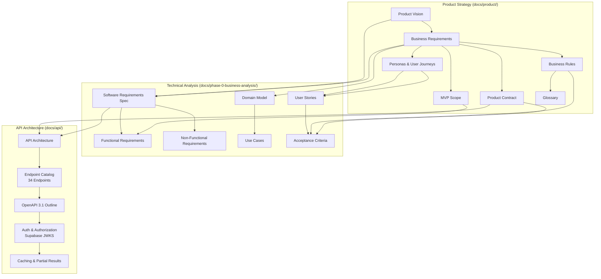
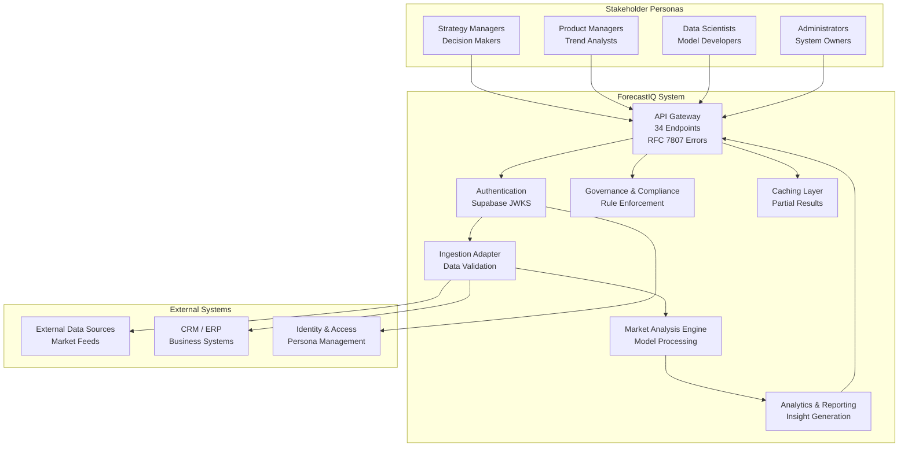
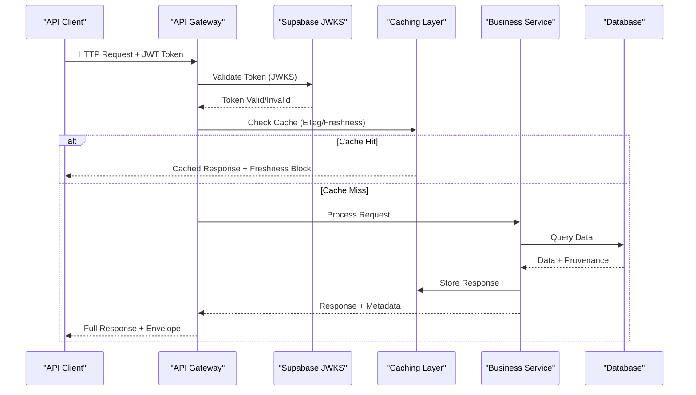
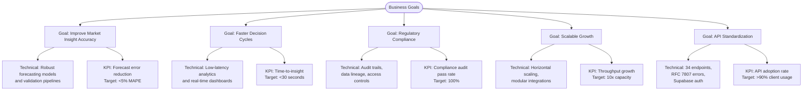
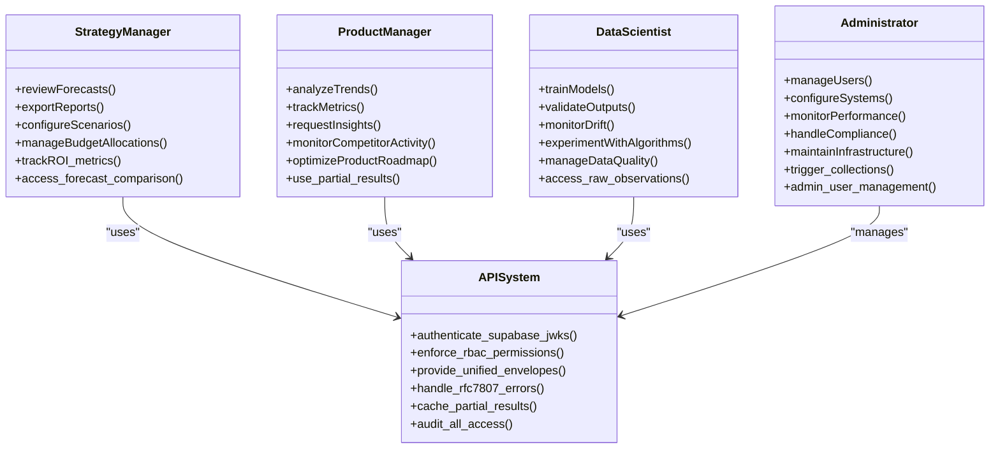
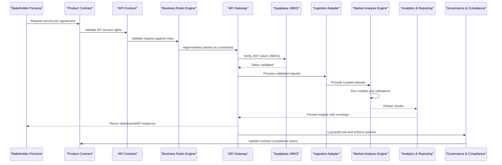
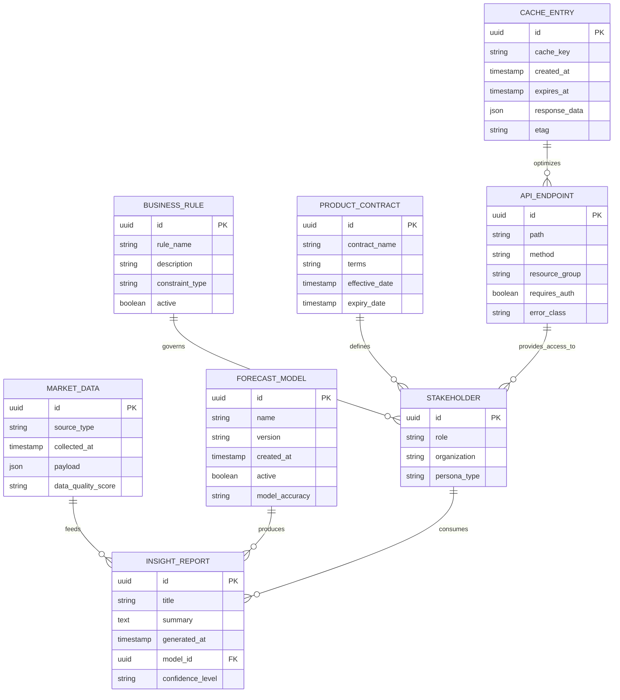
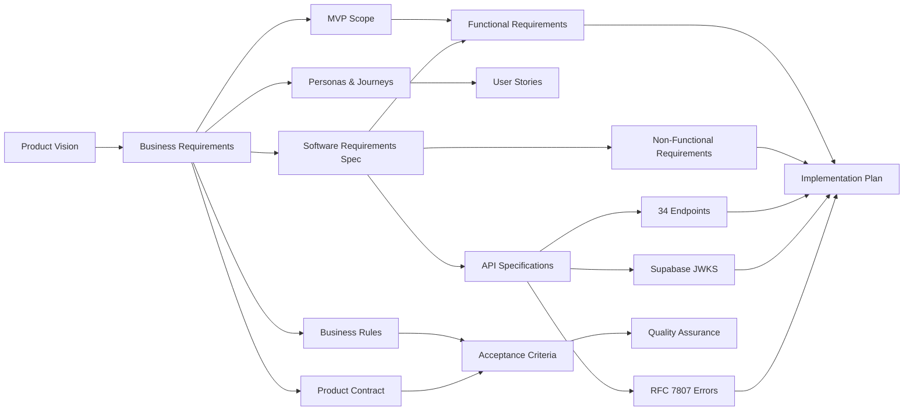

# Business Requirements & Analysis

<cite>
**Referenced Files in This Document**
- [01-product-vision.md](file://docs/product/01-product-vision.md)
- [02-business-requirements.md](file://docs/product/02-business-requirements.md)
- [03-mvp-scope.md](file://docs/product/03-mvp-scope.md)
- [04-personas-and-user-journeys.md](file://docs/product/04-personas-and-user-journeys.md)
- [05-business-rules.md](file://docs/product/05-business-rules.md)
- [06-product-contract.md](file://docs/product/06-product-contract.md)
- [07-glossary.md](file://docs/product/07-glossary.md)
- [01-product-vision.md](file://docs/phase-0-business-analysis/01-product-vision.md)
- [02-business-requirements.md](file://docs/phase-0-business-analysis/02-business-requirements.md)
- [03-software-requirements-spec.md](file://docs/phase-0-business-analysis/03-software-requirements-spec.md)
- [04-functional-requirements.md](file://docs/phase-0-business-analysis/04-functional-requirements.md)
- [05-non-functional-requirements.md](file://docs/phase-0-business-analysis/05-non-functional-requirements.md)
- [06-domain-model.md](file://docs/phase-0-business-analysis/06-domain-model.md)
- [07-use-case-diagram.md](file://docs/phase-0-business-analysis/07-use-case-diagram.md)
- [08-user-stories.md](file://docs/phase-0-business-analysis/08-user-stories.md)
- [09-acceptance-criteria.md](file://docs/phase-0-business-analysis/09-acceptance-criteria.md)
- [10-phase-summary.md](file://docs/phase-0-business-analysis/10-phase-summary.md)
- [04-api-architecture.md](file://docs/api/04-api-architecture.md)
- [05-endpoint-catalog.md](file://docs/api/05-endpoint-catalog.md)
- [06-openapi-outline.yaml](file://docs/api/06-openapi-outline.yaml)
- [07-authentication-and-authorization.md](file://docs/api/07-authentication-and-authorization.md)
- [08-caching-and-partial-results.md](file://docs/api/08-caching-and-partial-results.md)
</cite>

## Update Summary
**Changes Made**
- Added comprehensive API architecture section covering endpoint catalogs with 34 endpoints across 8 resource groups
- Integrated OpenAPI 3.1 structural outlines for standardized API documentation
- Enhanced authentication and authorization specifications with Supabase JWKS verification
- Updated software requirements specification to include unified response envelopes with freshness blocks and provenance tiers
- Added RFC 7807 error handling standards with 11-class taxonomy for consistent error management
- Documented three new specified endpoints: /forecast-comparison, /admin/collections/trigger, and admin user management
- Integrated comprehensive caching and partial result contracts into business requirements
- Enhanced API contract management within product contract framework

## Table of Contents
1. [Introduction](#introduction)
2. [Project Structure](#project-structure)
3. [Core Components](#core-components)
4. [Architecture Overview](#architecture-overview)
5. [API Architecture and Contracts](#api-architecture-and-contracts)
6. [Detailed Component Analysis](#detailed-component-analysis)
7. [Dependency Analysis](#dependency-analysis)
8. [Performance Considerations](#performance-considerations)
9. [Troubleshooting Guide](#troubleshooting-guide)
10. [Conclusion](#conclusion)
11. [Appendices](#appendices)

## Introduction
This document consolidates the comprehensive business requirements and software specifications for ForecastIQ, focusing on market analysis needs, stakeholder requirements, and business objectives. The documentation is now organized into two primary streams: strategic product documentation (docs/product/) covering product vision, business requirements, MVP scope, personas, business rules, product contract, and glossary; and Phase 0 business analysis artifacts (docs/phase-0-business-analysis/) providing detailed technical specifications, functional requirements, domain models, and acceptance criteria. **Updated** The addition of comprehensive API architecture documentation (docs/api/) establishes clear technical contracts and integration points that bridge business requirements with technical implementation through standardized API specifications.

## Project Structure
The project's business analysis is now organized into a comprehensive structured set of documents across three main directories:

### Product Documentation Stream (docs/product/)
- **Product Vision**: Strategic context and long-term product direction
- **Business Requirements**: Core business needs and stakeholder expectations
- **MVP Scope**: Minimum Viable Product definition and feature boundaries
- **Personas and User Journeys**: Detailed stakeholder profiles and interaction patterns
- **Business Rules**: Operational constraints and decision logic
- **Product Contract**: Agreements and commitments between stakeholders
- **Glossary**: Standardized terminology and definitions

### Phase 0 Business Analysis Stream (docs/phase-0-business-analysis/)
- **Software Requirements Specification**: Technical constraints, system boundaries, integrations
- **Functional Requirements**: Detailed system behaviors and capabilities
- **Non-Functional Requirements**: Performance, security, scalability requirements
- **Domain Model**: Entity relationships and data structures
- **Use Cases**: System interactions and workflows
- **User Stories**: Implementation-focused requirements
- **Acceptance Criteria**: Quality gates and validation standards
- **Phase Summary**: Progress tracking and next steps

### API Architecture Stream (docs/api/)
- **API Architecture**: High-level API design principles and structural organization
- **Endpoint Catalog**: Complete catalog of 34 endpoints across 8 resource groups
- **OpenAPI Outline**: OpenAPI 3.1 structural outlines for standardized documentation
- **Authentication and Authorization**: Supabase JWKS verification and access control specifications
- **Caching and Partial Results**: Comprehensive caching strategies and partial result contracts

**Section sources**
- [01-product-vision.md](file://docs/product/01-product-vision.md)
- [02-business-requirements.md](file://docs/product/02-business-requirements.md)
- [03-mvp-scope.md](file://docs/product/03-mvp-scope.md)
- [04-personas-and-user-journeys.md](file://docs/product/04-personas-and-user-journeys.md)
- [05-business-rules.md](file://docs/product/05-business-rules.md)
- [06-product-contract.md](file://docs/product/06-product-contract.md)
- [07-glossary.md](file://docs/product/07-glossary.md)
- [01-product-vision.md](file://docs/phase-0-business-analysis/01-product-vision.md)
- [02-business-requirements.md](file://docs/phase-0-business-analysis/02-business-requirements.md)
- [03-software-requirements-spec.md](file://docs/phase-0-business-analysis/03-software-requirements-spec.md)
- [04-functional-requirements.md](file://docs/phase-0-business-analysis/04-functional-requirements.md)
- [05-non-functional-requirements.md](file://docs/phase-0-business-analysis/05-non-functional-requirements.md)
- [06-domain-model.md](file://docs/phase-0-business-analysis/06-domain-model.md)
- [07-use-case-diagram.md](file://docs/phase-0-business-analysis/07-use-case-diagram.md)
- [08-user-stories.md](file://docs/phase-0-business-analysis/08-user-stories.md)
- [09-acceptance-criteria.md](file://docs/phase-0-business-analysis/09-acceptance-criteria.md)
- [10-phase-summary.md](file://docs/phase-0-business-analysis/10-phase-summary.md)
- [04-api-architecture.md](file://docs/api/04-api-architecture.md)
- [05-endpoint-catalog.md](file://docs/api/05-endpoint-catalog.md)
- [06-openapi-outline.yaml](file://docs/api/06-openapi-outline.yaml)
- [07-authentication-and-authorization.md](file://docs/api/07-authentication-and-authorization.md)
- [08-caching-and-partial-results.md](file://docs/api/08-caching-and-partial-results.md)

## Core Components
ForecastIQ's core components align with market analysis workflows and stakeholder needs, now enhanced with comprehensive API architecture and standardized contracts:

### Market Analysis Engine
Processes inputs, applies forecasting models, and generates actionable insights with built-in validation and audit trails.

### Data Ingestion Layer
Integrates external datasets and internal systems with comprehensive error handling and data quality checks.

### Analytics and Reporting
Transforms outputs into actionable insights through customizable dashboards and automated reporting.

### Stakeholder Interfaces
Provides role-based dashboards and APIs tailored to different user personas and their specific needs.

### Governance and Compliance Controls
Ensures auditability, privacy safeguards, and policy enforcement through comprehensive business rules.

### Product Contract Management
Defines clear agreements between stakeholders regarding deliverables, timelines, and quality standards.

### API Gateway and Contract Enforcement
**New** Provides standardized API access through 34 endpoints across 8 resource groups with unified response envelopes, comprehensive authentication via Supabase JWKS, and RFC 7807 error handling standards.

These components are defined and refined across product strategy, technical analysis, and API architecture documents, ensuring complete traceability from business goals to technical implementation through standardized contracts.

**Section sources**
- [02-business-requirements.md](file://docs/product/02-business-requirements.md)
- [03-mvp-scope.md](file://docs/product/03-mvp-scope.md)
- [04-personas-and-user-journeys.md](file://docs/product/04-personas-and-user-journeys.md)
- [05-business-rules.md](file://docs/product/05-business-rules.md)
- [06-product-contract.md](file://docs/product/06-product-contract.md)
- [02-business-requirements.md](file://docs/phase-0-business-analysis/02-business-requirements.md)
- [03-software-requirements-spec.md](file://docs/phase-0-business-analysis/03-software-requirements-spec.md)
- [04-functional-requirements.md](file://docs/phase-0-business-analysis/04-functional-requirements.md)
- [05-non-functional-requirements.md](file://docs/phase-0-business-analysis/05-non-functional-requirements.md)
- [04-api-architecture.md](file://docs/api/04-api-architecture.md)
- [05-endpoint-catalog.md](file://docs/api/05-endpoint-catalog.md)

## Architecture Overview
At a high level, ForecastIQ connects diverse stakeholder personas to market data through an analytics pipeline that produces forecasts and insights. The architecture emphasizes modularity, integration flexibility, compliance-aware processing, clear product contract adherence, and comprehensive API standardization.

**Diagram sources**
- [04-personas-and-user-journeys.md](file://docs/product/04-personas-and-user-journeys.md)
- [06-product-contract.md](file://docs/product/06-product-contract.md)
- [05-business-rules.md](file://docs/product/05-business-rules.md)
- [04-api-architecture.md](file://docs/api/04-api-architecture.md)
- [07-authentication-and-authorization.md](file://docs/api/07-authentication-and-authorization.md)
- [08-caching-and-partial-results.md](file://docs/api/08-caching-and-partial-results.md)

## API Architecture and Contracts

### Comprehensive API Design Principles
The API architecture follows RESTful principles with standardized contracts, ensuring consistency across all 34 endpoints organized into 8 resource groups. Each endpoint adheres to unified response envelopes containing freshness blocks and provenance tiers, providing clients with essential metadata about data currency and source reliability.

### Endpoint Organization and Resource Groups
The API is structured around 8 primary resource groups:
- **Forecast Management**: Core forecasting operations and model management
- **Collection Administration**: Data collection lifecycle and trigger management
- **Comparison Services**: Forecast comparison and analysis endpoints
- **User Management**: Administrative user operations and permissions
- **Observation Data**: Raw observation data ingestion and retrieval
- **Evaluation Metrics**: Performance metrics and evaluation results
- **Methodology Registry**: Forecasting methodology definitions and versions
- **System Administration**: System health, configuration, and monitoring

### Authentication and Authorization Framework
**Updated** Authentication utilizes Supabase JWKS (JSON Web Key Set) verification for secure token validation. The authorization model implements role-based access control (RBAC) with granular permissions aligned to persona responsibilities and business rule constraints.

### Response Envelope Standardization
All API responses follow a unified envelope structure containing:
- **Data Payload**: Primary response data
- **Freshness Block**: Timestamps and validity periods for cached data
- **Provenance Tiers**: Source attribution and data lineage information
- **Metadata**: Request correlation IDs, processing timestamps, and performance metrics

### Error Handling Standards
**Updated** Implements RFC 7807 Problem Details specification with an 11-class error taxonomy covering:
- Client errors (4xx): Validation failures, authentication issues, permission denials
- Server errors (5xx): Internal processing failures, service unavailability
- Business logic errors: Domain-specific constraint violations and workflow exceptions

### Caching and Partial Result Contracts
**New** Comprehensive caching strategy supports both full and partial result delivery:
- **Cache-Control Headers**: Standard HTTP caching directives with custom extensions
- **ETag Support**: Conditional requests for efficient data synchronization
- **Partial Responses**: Selective field retrieval for bandwidth optimization
- **Stale-While-Revalidate**: Background refresh mechanisms for improved UX

**Diagram sources**
- [04-api-architecture.md](file://docs/api/04-api-architecture.md)
- [05-endpoint-catalog.md](file://docs/api/05-endpoint-catalog.md)
- [06-openapi-outline.yaml](file://docs/api/06-openapi-outline.yaml)
- [07-authentication-and-authorization.md](file://docs/api/07-authentication-and-authorization.md)
- [08-caching-and-partial-results.md](file://docs/api/08-caching-and-partial-results.md)

**Section sources**
- [04-api-architecture.md](file://docs/api/04-api-architecture.md)
- [05-endpoint-catalog.md](file://docs/api/05-endpoint-catalog.md)
- [06-openapi-outline.yaml](file://docs/api/06-openapi-outline.yaml)
- [07-authentication-and-authorization.md](file://docs/api/07-authentication-and-authorization.md)
- [08-caching-and-partial-results.md](file://docs/api/08-caching-and-partial-results.md)

## Detailed Component Analysis

### Business Goals and Technical Implementation Mapping
This section maps business objectives to technical capabilities, clarifying how each goal drives specific system behaviors and constraints, now enhanced with MVP scoping, persona-specific requirements, and comprehensive API contracts.

**Section sources**
- [01-product-vision.md](file://docs/product/01-product-vision.md)
- [02-business-requirements.md](file://docs/product/02-business-requirements.md)
- [03-mvp-scope.md](file://docs/product/03-mvp-scope.md)
- [01-product-vision.md](file://docs/phase-0-business-analysis/01-product-vision.md)
- [02-business-requirements.md](file://docs/phase-0-business-analysis/02-business-requirements.md)
- [03-software-requirements-spec.md](file://docs/phase-0-business-analysis/03-software-requirements-spec.md)
- [05-non-functional-requirements.md](file://docs/phase-0-business-analysis/05-non-functional-requirements.md)
- [04-api-architecture.md](file://docs/api/04-api-architecture.md)

### Enhanced Stakeholder Requirements and Persona Analysis
The comprehensive persona documentation provides detailed stakeholder profiles, their specific needs, and interaction patterns with the system, now enhanced with API-specific access patterns and authentication requirements.

**Diagram sources**
- [04-personas-and-user-journeys.md](file://docs/product/04-personas-and-user-journeys.md)
- [05-business-rules.md](file://docs/product/05-business-rules.md)
- [07-authentication-and-authorization.md](file://docs/api/07-authentication-and-authorization.md)

**Section sources**
- [04-personas-and-user-journeys.md](file://docs/product/04-personas-and-user-journeys.md)
- [05-business-rules.md](file://docs/product/05-business-rules.md)
- [06-product-contract.md](file://docs/product/06-product-contract.md)
- [07-use-case-diagram.md](file://docs/phase-0-business-analysis/07-use-case-diagram.md)
- [08-user-stories.md](file://docs/phase-0-business-analysis/08-user-stories.md)
- [09-acceptance-criteria.md](file://docs/phase-0-business-analysis/09-acceptance-criteria.md)
- [07-authentication-and-authorization.md](file://docs/api/07-authentication-and-authorization.md)

### Comprehensive Business Rules and Contract Management
The business rules documentation defines operational constraints and decision logic, while the product contract establishes clear agreements between stakeholders, now enhanced with API contract specifications and service level agreements.

**Diagram sources**
- [05-business-rules.md](file://docs/product/05-business-rules.md)
- [06-product-contract.md](file://docs/product/06-product-contract.md)
- [04-functional-requirements.md](file://docs/phase-0-business-analysis/04-functional-requirements.md)
- [05-non-functional-requirements.md](file://docs/phase-0-business-analysis/05-non-functional-requirements.md)
- [07-authentication-and-authorization.md](file://docs/api/07-authentication-and-authorization.md)

**Section sources**
- [05-business-rules.md](file://docs/product/05-business-rules.md)
- [06-product-contract.md](file://docs/product/06-product-contract.md)
- [04-functional-requirements.md](file://docs/phase-0-business-analysis/04-functional-requirements.md)
- [05-non-functional-requirements.md](file://docs/phase-0-business-analysis/05-non-functional-requirements.md)
- [07-authentication-and-authorization.md](file://docs/api/07-authentication-and-authorization.md)

### Enhanced Domain Model and Glossary Integration
The domain model outlines key entities and relationships central to market analysis and forecasting, now integrated with comprehensive glossary definitions for consistent terminology and enhanced with API-specific entities.

**Diagram sources**
- [06-domain-model.md](file://docs/phase-0-business-analysis/06-domain-model.md)
- [07-glossary.md](file://docs/product/07-glossary.md)
- [05-business-rules.md](file://docs/product/05-business-rules.md)
- [06-product-contract.md](file://docs/product/06-product-contract.md)
- [05-endpoint-catalog.md](file://docs/api/05-endpoint-catalog.md)
- [08-caching-and-partial-results.md](file://docs/api/08-caching-and-partial-results.md)

**Section sources**
- [06-domain-model.md](file://docs/phase-0-business-analysis/06-domain-model.md)
- [07-glossary.md](file://docs/product/07-glossary.md)
- [05-business-rules.md](file://docs/product/05-business-rules.md)
- [06-product-contract.md](file://docs/product/06-product-contract.md)
- [05-endpoint-catalog.md](file://docs/api/05-endpoint-catalog.md)
- [08-caching-and-partial-results.md](file://docs/api/08-caching-and-partial-results.md)

## Dependency Analysis
Requirements dependencies illustrate how business goals cascade into functional and non-functional specifications, guiding development priorities and integration planning, now enhanced with MVP scoping, persona-driven requirements, and comprehensive API contract dependencies.

**Diagram sources**
- [01-product-vision.md](file://docs/product/01-product-vision.md)
- [02-business-requirements.md](file://docs/product/02-business-requirements.md)
- [03-mvp-scope.md](file://docs/product/03-mvp-scope.md)
- [04-personas-and-user-journeys.md](file://docs/product/04-personas-and-user-journeys.md)
- [05-business-rules.md](file://docs/product/05-business-rules.md)
- [06-product-contract.md](file://docs/product/06-product-contract.md)
- [01-product-vision.md](file://docs/phase-0-business-analysis/01-product-vision.md)
- [02-business-requirements.md](file://docs/phase-0-business-analysis/02-business-requirements.md)
- [03-software-requirements-spec.md](file://docs/phase-0-business-analysis/03-software-requirements-spec.md)
- [04-functional-requirements.md](file://docs/phase-0-business-analysis/04-functional-requirements.md)
- [05-non-functional-requirements.md](file://docs/phase-0-business-analysis/05-non-functional-requirements.md)
- [04-api-architecture.md](file://docs/api/04-api-architecture.md)
- [05-endpoint-catalog.md](file://docs/api/05-endpoint-catalog.md)
- [07-authentication-and-authorization.md](file://docs/api/07-authentication-and-authorization.md)

**Section sources**
- [01-product-vision.md](file://docs/product/01-product-vision.md)
- [02-business-requirements.md](file://docs/product/02-business-requirements.md)
- [03-mvp-scope.md](file://docs/product/03-mvp-scope.md)
- [04-personas-and-user-journeys.md](file://docs/product/04-personas-and-user-journeys.md)
- [05-business-rules.md](file://docs/product/05-business-rules.md)
- [06-product-contract.md](file://docs/product/06-product-contract.md)
- [01-product-vision.md](file://docs/phase-0-business-analysis/01-product-vision.md)
- [02-business-requirements.md](file://docs/phase-0-business-analysis/02-business-requirements.md)
- [03-software-requirements-spec.md](file://docs/phase-0-business-analysis/03-software-requirements-spec.md)
- [04-functional-requirements.md](file://docs/phase-0-business-analysis/04-functional-requirements.md)
- [05-non-functional-requirements.md](file://docs/phase-0-business-analysis/05-non-functional-requirements.md)
- [04-api-architecture.md](file://docs/api/04-api-architecture.md)
- [05-endpoint-catalog.md](file://docs/api/05-endpoint-catalog.md)
- [07-authentication-and-authorization.md](file://docs/api/07-authentication-and-authorization.md)

## Performance Considerations
From a business perspective, performance targets must support timely decisions and scalable growth, now enhanced with persona-specific SLAs, contract-defined metrics, and comprehensive API performance requirements:

### Persona-Specific Performance Targets
- **Strategy Managers**: Real-time dashboard updates (<5 seconds), monthly report generation (<1 minute)
- **Product Managers**: Trend analysis completion (<30 seconds), competitive intelligence delivery (<2 minutes)
- **Data Scientists**: Model training job submission (<10 seconds), result retrieval (<1 minute)
- **Administrators**: System health monitoring (<1 second), user management operations (<5 seconds)

### API Performance Requirements
**Updated** Comprehensive API performance targets supporting the 34-endpoint architecture:
- **Response Times**: Average <200ms for cached responses, <1s for computed results
- **Throughput**: Support 1000+ concurrent API requests per endpoint
- **Availability**: 99.95% uptime for critical API endpoints
- **Error Rates**: <0.1% server errors, <1% client validation errors

### Contract-Defined Service Levels
- **Availability**: 99.9% uptime for critical business hours
- **Response Times**: API response times within agreed SLAs
- **Data Freshness**: Market data updates within specified timeframes
- **Report Delivery**: Automated reports delivered by contractual deadlines

### Scalability Requirements
- **Horizontal Scaling**: Support for growing user base and data volumes
- **Modular Integrations**: Easy addition of new data sources and analytical models
- **Capacity Planning**: Infrastructure aligned with revenue projections and growth targets
- **API Rate Limiting**: Intelligent throttling to protect system stability

**Section sources**
- [04-personas-and-user-journeys.md](file://docs/product/04-personas-and-user-journeys.md)
- [06-product-contract.md](file://docs/product/06-product-contract.md)
- [05-non-functional-requirements.md](file://docs/phase-0-business-analysis/05-non-functional-requirements.md)
- [04-api-architecture.md](file://docs/api/04-api-architecture.md)
- [08-caching-and-partial-results.md](file://docs/api/08-caching-and-partial-results.md)

## Troubleshooting Guide
Operational issues often relate to data quality, integration failures, and compliance checks, now enhanced with persona-specific troubleshooting procedures, contract compliance monitoring, and comprehensive API debugging capabilities:

### Persona-Specific Issue Resolution
- **Strategy Managers**: Report discrepancies, forecast accuracy issues, budget allocation problems
- **Product Managers**: Trend analysis errors, competitor data gaps, metric calculation issues
- **Data Scientists**: Model training failures, data quality problems, algorithm performance issues
- **Administrators**: System configuration errors, user access problems, compliance violations

### API-Specific Troubleshooting
**New** Comprehensive API debugging and issue resolution:
- **Authentication Issues**: JWT token validation failures, Supabase JWKS connectivity problems
- **Authorization Errors**: Permission denied scenarios, RBAC misconfigurations
- **Rate Limiting**: API quota exceeded, throttling configuration issues
- **Caching Problems**: Stale data delivery, cache invalidation failures, ETag conflicts
- **Error Classification**: RFC 7807 error code interpretation and resolution procedures

### Contract Compliance Monitoring
- **Service Level Agreement Tracking**: Monitor adherence to contractual performance metrics
- **Audit Trail Analysis**: Investigate compliance-related incidents and policy violations
- **Business Rule Enforcement**: Identify and resolve rule conflicts or exceptions
- **Data Quality Issues**: Address data integrity problems affecting contractual obligations

### Escalation Procedures
- **Level 1**: Automated alerts and self-service resolution tools
- **Level 2**: Technical support team intervention
- **Level 3**: Executive escalation for contract breaches or major outages

**Section sources**
- [04-personas-and-user-journeys.md](file://docs/product/04-personas-and-user-journeys.md)
- [05-business-rules.md](file://docs/product/05-business-rules.md)
- [06-product-contract.md](file://docs/product/06-product-contract.md)
- [05-non-functional-requirements.md](file://docs/phase-0-business-analysis/05-non-functional-requirements.md)
- [09-acceptance-criteria.md](file://docs/phase-0-business-analysis/09-acceptance-criteria.md)
- [07-authentication-and-authorization.md](file://docs/api/07-authentication-and-authorization.md)
- [08-caching-and-partial-results.md](file://docs/api/08-caching-and-partial-results.md)

## Conclusion
ForecastIQ's comprehensive business requirements and software specifications establish a clear path from market analysis needs to technical implementation through a triple-stream approach. The product documentation stream (docs/product/) provides strategic direction, stakeholder alignment, and contractual agreements; the Phase 0 analysis stream (docs/phase-0-business-analysis/) delivers detailed technical specifications and implementation guidance; and the API architecture stream (docs/api/) establishes standardized contracts and integration points. This structure ensures complete traceability from business goals to technical features, with enhanced persona definitions, comprehensive business rules, clear product contracts, and robust API specifications supporting successful delivery. Prioritization, feasibility, and risk assessments guide phased delivery, while success metrics and compliance considerations ensure accountability and sustainability.

## Appendices

### Enhanced Requirements Prioritization Matrix
Prioritize features based on business impact, technical complexity, risk exposure, and persona value to optimize delivery sequencing, now including API-specific considerations.

| Requirement Category | Business Impact | Technical Complexity | Risk Exposure | Persona Value | Priority |
|----------------------|-----------------|----------------------|---------------|---------------|----------|
| Market Analysis Engine | High | Medium | Medium | All Personas | High |
| Data Ingestion Layer | High | High | High | All Personas | High |
| Analytics & Reporting | Medium | Medium | Low | Strategy/Product Managers | Medium |
| Governance & Compliance | High | Medium | High | Administrators | High |
| Persona-Specific Dashboards | Medium | Low | Low | Individual Personas | Medium |
| Business Rule Engine | High | Medium | High | All Personas | High |
| Contract Management | High | Medium | High | Administrators | High |
| API Gateway & Endpoints | High | High | Medium | All Personas | High |
| Authentication System | High | Medium | High | All Personas | High |
| Caching Infrastructure | Medium | Medium | Low | All Personas | Medium |

### Enhanced Feasibility Analysis
Evaluate technical feasibility, resource availability, timeline constraints, and persona adoption potential to confirm viability of planned capabilities, now including API architecture considerations.

- **Technical feasibility**: Confirm model maturity, data availability, integration readiness, infrastructure capacity, and API scalability
- **Resource feasibility**: Assess team skills, tooling, infrastructure capacity, persona training requirements, and API development resources
- **Timeline feasibility**: Align milestones with market windows, stakeholder expectations, contractual obligations, and API release cycles
- **Adoption feasibility**: Evaluate persona readiness, change management needs, training requirements, and API developer onboarding

### Enhanced Risk Assessment
Identify and mitigate risks across data, technology, compliance, operations, and stakeholder dimensions, now including API-specific risks.

- **Data risk**: Source reliability, quality, licensing, and persona-specific data needs
- **Technology risk**: Model accuracy, latency, scalability limits, integration complexity, and API performance bottlenecks
- **Compliance risk**: Regulatory changes, audit requirements, contractual obligations, and API security vulnerabilities
- **Operational risk**: Incident response, monitoring, recovery procedures, persona support, and API debugging challenges
- **Stakeholder risk**: Persona adoption challenges, expectation management, communication gaps, and API developer experience
- **API risk**: Endpoint compatibility, versioning conflicts, authentication failures, and caching inconsistencies

### Enhanced Success Metrics and Business Value Propositions
Define measurable outcomes tied to business goals, persona satisfaction, and contractual obligations, now including comprehensive API performance metrics:

#### Business-Level Metrics
- Forecast accuracy improvement percentage (Target: >15% improvement)
- Reduction in time-to-insight for strategic decisions (Target: >50% reduction)
- Increase in stakeholder satisfaction scores (Target: >4.5/5.0 rating)
- Compliance audit pass rates (Target: 100% compliance)
- Cost savings from optimized strategies (Target: >10% cost reduction)

#### API Performance Metrics
**New** Comprehensive API success indicators:
- API adoption rate (>90% client usage across endpoints)
- Average response time (<200ms for cached, <1s for computed)
- Error rate (<0.1% server errors, <1% client validation errors)
- Cache hit ratio (>80% for frequently accessed data)
- Authentication success rate (>99.9% valid token processing)

#### Persona-Specific Metrics
- **Strategy Managers**: Decision-making speed, ROI improvement, budget optimization
- **Product Managers**: Trend identification accuracy, competitive advantage gained
- **Data Scientists**: Model performance, research productivity, innovation output
- **Administrators**: System efficiency, compliance adherence, user satisfaction

#### Contractual Metrics
- Service level agreement adherence (>99.9% uptime)
- Response time compliance (<defined thresholds)
- Data freshness guarantees (within specified timeframes)
- Report delivery timeliness (100% on-time delivery)
- API availability (99.95% uptime for critical endpoints)

### Enhanced Regulatory Compliance and Data Privacy
Ensure adherence to relevant regulations and privacy standards, with persona-specific access controls and contract-defined compliance measures, now including comprehensive API security requirements:

- **Data minimization and purpose limitation**: Collect only necessary data for defined business purposes
- **Consent management and retention policies**: Manage user consent and data lifecycle per regulatory requirements
- **Secure storage and transmission**: Implement encryption and secure protocols for all data handling
- **Auditability and transparency**: Maintain comprehensive logs and explainable AI processes
- **Persona-specific access controls**: Role-based permissions aligned with job responsibilities
- **Contractual compliance**: Meet all regulatory obligations defined in product contracts
- **API Security**: JWT token validation, rate limiting, input sanitization, and comprehensive audit logging
- **Data Lineage**: Track data provenance through API calls and maintain chain of custody

### Enhanced Scalability Requirements from a Business Perspective
Plan for growth in users, data volume, feature breadth, and market expansion, now including API scalability considerations:

- **Horizontal scaling**: Support for growing user base across all personas
- **Modular integration patterns**: Easy addition of new data sources and analytical models
- **Configurable thresholds and policies**: Adapt to different markets and regulatory environments
- **Capacity planning**: Infrastructure aligned with revenue projections and growth targets
- **Multi-tenant architecture**: Support for enterprise customers with isolated environments
- **Global expansion**: Multi-language, multi-currency, and regional compliance support
- **API scalability**: Load balancing, connection pooling, and distributed caching for 34+ endpoints
- **Rate limiting**: Intelligent throttling to prevent abuse while maintaining service quality

### Enhanced Product Contract Framework
Establish clear agreements between stakeholders regarding deliverables, timelines, quality standards, and ongoing obligations, now including comprehensive API contract specifications:

- **Scope Definition**: Clear boundaries of MVP and future enhancements
- **Quality Standards**: Performance metrics, accuracy thresholds, and reliability requirements
- **Delivery Timelines**: Milestone schedules, release cycles, and rollback procedures
- **Support Obligations**: Maintenance, updates, and customer support commitments
- **Change Management**: Processes for scope changes, priority adjustments, and conflict resolution
- **Exit Clauses**: Termination conditions, data migration, and knowledge transfer procedures
- **API Contracts**: Endpoint specifications, versioning policies, deprecation schedules, and backward compatibility guarantees
- **Service Level Agreements**: Uptime commitments, response time guarantees, and error rate thresholds

### New API Contract Specifications
**New** Comprehensive API contract framework establishing clear technical agreements:

#### Endpoint Specifications
- **34 Endpoints**: Organized across 8 resource groups with consistent naming conventions
- **Request/Response Contracts**: Strict schema validation and type safety guarantees
- **Versioning Strategy**: Semantic versioning with backward compatibility maintenance
- **Documentation Standards**: OpenAPI 3.1 specifications with interactive examples

#### Authentication and Authorization
- **Supabase JWKS**: JSON Web Key Set verification for secure token validation
- **Role-Based Access Control**: Granular permissions aligned with persona responsibilities
- **Token Lifecycle Management**: Refresh tokens, expiration handling, and revocation support
- **Audit Logging**: Comprehensive authentication event tracking and compliance reporting

#### Error Handling Standards
- **RFC 7807 Compliance**: Standardized problem details format for all error responses
- **11-Class Taxonomy**: Organized error classification for systematic troubleshooting
- **Client Guidance**: Actionable error messages with resolution recommendations
- **Monitoring Integration**: Error rate tracking and alerting for proactive issue detection

#### Caching and Performance
- **Cache-Control Headers**: Standard HTTP caching with custom extensions for business logic
- **ETag Support**: Conditional requests for efficient data synchronization
- **Partial Responses**: Selective field retrieval for bandwidth optimization
- **Stale-While-Revalidate**: Background refresh mechanisms for improved user experience

**Section sources**
- [03-mvp-scope.md](file://docs/product/03-mvp-scope.md)
- [04-personas-and-user-journeys.md](file://docs/product/04-personas-and-user-journeys.md)
- [05-business-rules.md](file://docs/product/05-business-rules.md)
- [06-product-contract.md](file://docs/product/06-product-contract.md)
- [07-glossary.md](file://docs/product/07-glossary.md)
- [05-non-functional-requirements.md](file://docs/phase-0-business-analysis/05-non-functional-requirements.md)
- [09-acceptance-criteria.md](file://docs/phase-0-business-analysis/09-acceptance-criteria.md)
- [04-api-architecture.md](file://docs/api/04-api-architecture.md)
- [05-endpoint-catalog.md](file://docs/api/05-endpoint-catalog.md)
- [06-openapi-outline.yaml](file://docs/api/06-openapi-outline.yaml)
- [07-authentication-and-authorization.md](file://docs/api/07-authentication-and-authorization.md)
- [08-caching-and-partial-results.md](file://docs/api/08-caching-and-partial-results.md)