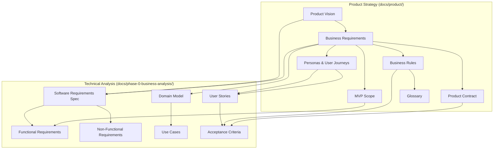
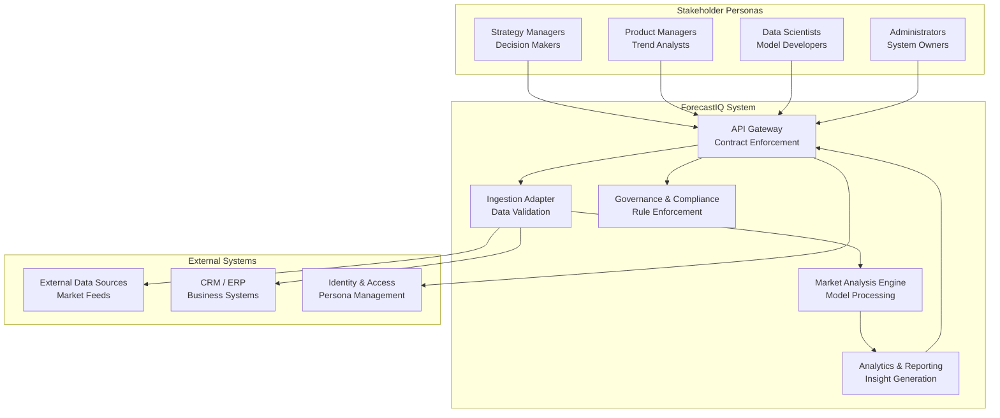
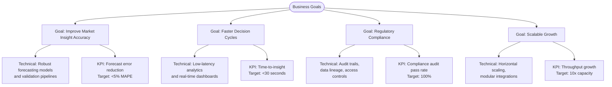
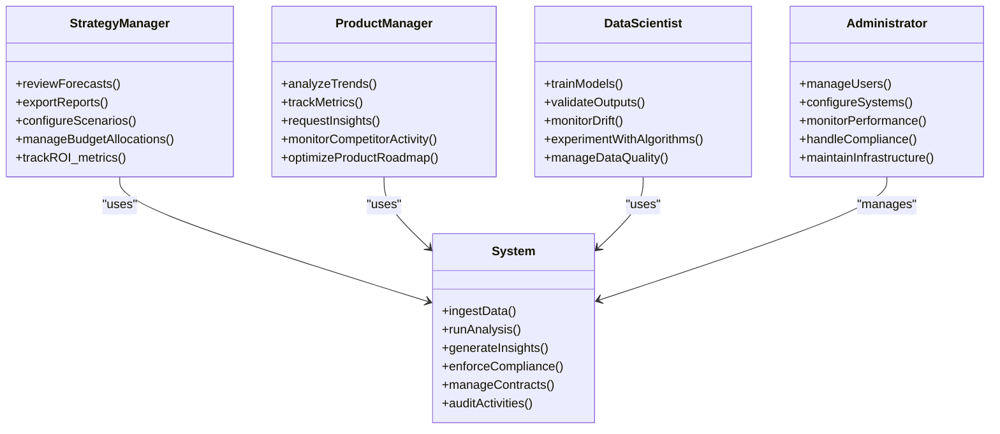
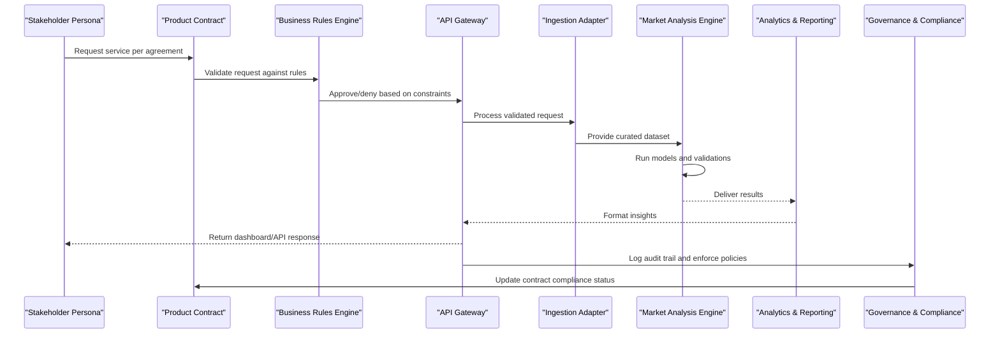
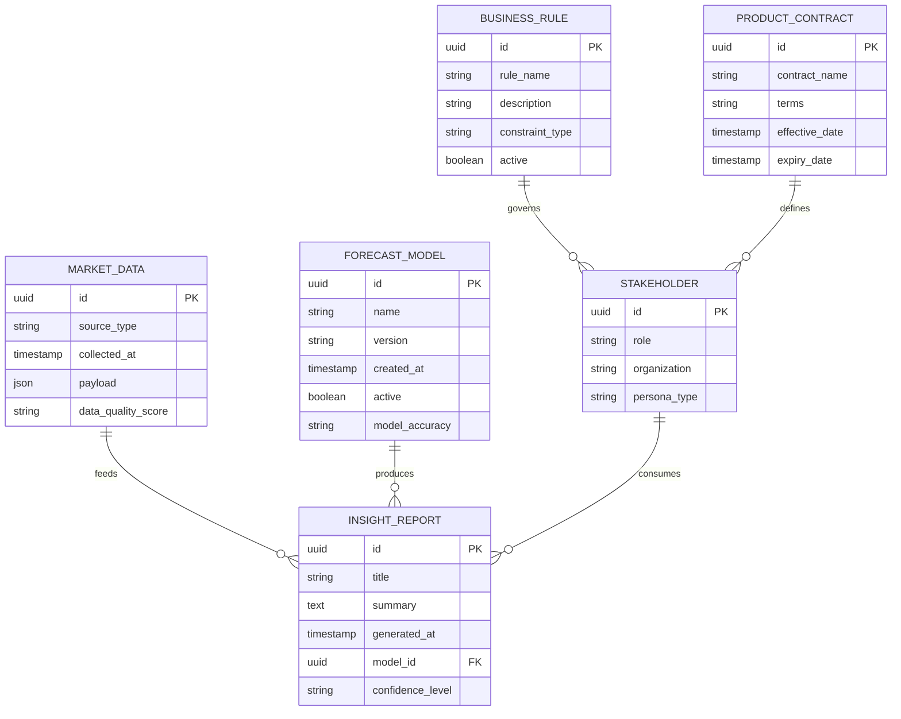
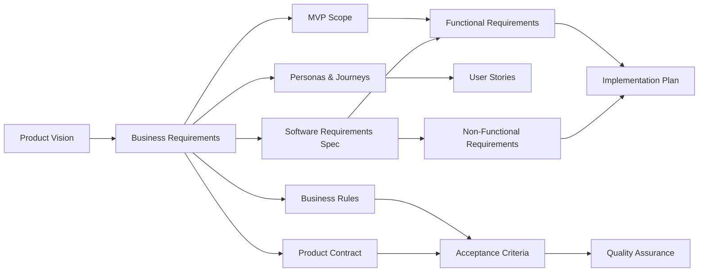

# Business Requirements & Analysis

<cite>
**Referenced Files in This Document**
- [01-product-vision.md](file://docs/product/01-product-vision.md)
- [02-business-requirements.md](file://docs/product/02-business-requirements.md)
- [03-mvp-scope.md](file://docs/product/03-mvp-scope.md)
- [04-personas-and-user-journeys.md](file://docs/product/04-personas-and-user-journeys.md)
- [05-business-rules.md](file://docs/product/05-business-rules.md)
- [06-product-contract.md](file://docs/product/06-product-contract.md)
- [07-glossary.md](file://docs/product/07-glossary.md)
- [01-product-vision.md](file://docs/phase-0-business-analysis/01-product-vision.md)
- [02-business-requirements.md](file://docs/phase-0-business-analysis/02-business-requirements.md)
- [03-software-requirements-spec.md](file://docs/phase-0-business-analysis/03-software-requirements-spec.md)
- [04-functional-requirements.md](file://docs/phase-0-business-analysis/04-functional-requirements.md)
- [05-non-functional-requirements.md](file://docs/phase-0-business-analysis/05-non-functional-requirements.md)
- [06-domain-model.md](file://docs/phase-0-business-analysis/06-domain-model.md)
- [07-use-case-diagram.md](file://docs/phase-0-business-analysis/07-use-case-diagram.md)
- [08-user-stories.md](file://docs/phase-0-business-analysis/08-user-stories.md)
- [09-acceptance-criteria.md](file://docs/phase-0-business-analysis/09-acceptance-criteria.md)
- [10-phase-summary.md](file://docs/phase-0-business-analysis/10-phase-summary.md)
</cite>

## Update Summary
**Changes Made**
- Updated project structure to reflect comprehensive business requirements documentation under docs/product/ directory
- Added references to new product-focused documentation including MVP scope, personas, business rules, product contract, and glossary
- Enhanced stakeholder analysis with detailed persona definitions and user journeys
- Expanded business rules documentation for clearer requirement enforcement
- Integrated product contract specifications for better stakeholder alignment
- Added comprehensive glossary for consistent terminology across business and technical teams

## Table of Contents
1. [Introduction](#introduction)
2. [Project Structure](#project-structure)
3. [Core Components](#core-components)
4. [Architecture Overview](#architecture-overview)
5. [Detailed Component Analysis](#detailed-component-analysis)
6. [Dependency Analysis](#dependency-analysis)
7. [Performance Considerations](#performance-considerations)
8. [Troubleshooting Guide](#troubleshooting-guide)
9. [Conclusion](#conclusion)
10. [Appendices](#appendices)

## Introduction
This document consolidates the comprehensive business requirements and software specifications for ForecastIQ, focusing on market analysis needs, stakeholder requirements, and business objectives. The documentation is now organized into two primary streams: strategic product documentation (docs/product/) covering product vision, business requirements, MVP scope, personas, business rules, product contract, and glossary; and Phase 0 business analysis artifacts (docs/phase-0-business-analysis/) providing detailed technical specifications, functional requirements, domain models, and acceptance criteria. This dual-approach ensures clear separation between strategic product direction and tactical implementation details while maintaining traceability from business goals to technical features.

## Project Structure
The project's business analysis is now organized into a comprehensive structured set of documents across two main directories:

### Product Documentation Stream (docs/product/)
- **Product Vision**: Strategic context and long-term product direction
- **Business Requirements**: Core business needs and stakeholder expectations
- **MVP Scope**: Minimum Viable Product definition and feature boundaries
- **Personas and User Journeys**: Detailed stakeholder profiles and interaction patterns
- **Business Rules**: Operational constraints and decision logic
- **Product Contract**: Agreements and commitments between stakeholders
- **Glossary**: Standardized terminology and definitions

### Phase 0 Business Analysis Stream (docs/phase-0-business-analysis/)
- **Software Requirements Specification**: Technical constraints, system boundaries, integrations
- **Functional Requirements**: Detailed system behaviors and capabilities
- **Non-Functional Requirements**: Performance, security, scalability requirements
- **Domain Model**: Entity relationships and data structures
- **Use Cases**: System interactions and workflows
- **User Stories**: Implementation-focused requirements
- **Acceptance Criteria**: Quality gates and validation standards
- **Phase Summary**: Progress tracking and next steps

**Section sources**
- [01-product-vision.md](file://docs/product/01-product-vision.md)
- [02-business-requirements.md](file://docs/product/02-business-requirements.md)
- [03-mvp-scope.md](file://docs/product/03-mvp-scope.md)
- [04-personas-and-user-journeys.md](file://docs/product/04-personas-and-user-journeys.md)
- [05-business-rules.md](file://docs/product/05-business-rules.md)
- [06-product-contract.md](file://docs/product/06-product-contract.md)
- [07-glossary.md](file://docs/product/07-glossary.md)
- [01-product-vision.md](file://docs/phase-0-business-analysis/01-product-vision.md)
- [02-business-requirements.md](file://docs/phase-0-business-analysis/02-business-requirements.md)
- [03-software-requirements-spec.md](file://docs/phase-0-business-analysis/03-software-requirements-spec.md)
- [04-functional-requirements.md](file://docs/phase-0-business-analysis/04-functional-requirements.md)
- [05-non-functional-requirements.md](file://docs/phase-0-business-analysis/05-non-functional-requirements.md)
- [06-domain-model.md](file://docs/phase-0-business-analysis/06-domain-model.md)
- [07-use-case-diagram.md](file://docs/phase-0-business-analysis/07-use-case-diagram.md)
- [08-user-stories.md](file://docs/phase-0-business-analysis/08-user-stories.md)
- [09-acceptance-criteria.md](file://docs/phase-0-business-analysis/09-acceptance-criteria.md)
- [10-phase-summary.md](file://docs/phase-0-business-analysis/10-phase-summary.md)

## Core Components
ForecastIQ's core components align with market analysis workflows and stakeholder needs, now enhanced with detailed persona definitions and business rule enforcement:

### Market Analysis Engine
Processes inputs, applies forecasting models, and generates actionable insights with built-in validation and audit trails.

### Data Ingestion Layer
Integrates external datasets and internal systems with comprehensive error handling and data quality checks.

### Analytics and Reporting
Transforms outputs into actionable insights through customizable dashboards and automated reporting.

### Stakeholder Interfaces
Provides role-based dashboards and APIs tailored to different user personas and their specific needs.

### Governance and Compliance Controls
Ensures auditability, privacy safeguards, and policy enforcement through comprehensive business rules.

### Product Contract Management
Defines clear agreements between stakeholders regarding deliverables, timelines, and quality standards.

These components are defined and refined across both product strategy and technical analysis documents, ensuring complete traceability from business goals to technical implementation.

**Section sources**
- [02-business-requirements.md](file://docs/product/02-business-requirements.md)
- [03-mvp-scope.md](file://docs/product/03-mvp-scope.md)
- [04-personas-and-user-journeys.md](file://docs/product/04-personas-and-user-journeys.md)
- [05-business-rules.md](file://docs/product/05-business-rules.md)
- [06-product-contract.md](file://docs/product/06-product-contract.md)
- [02-business-requirements.md](file://docs/phase-0-business-analysis/02-business-requirements.md)
- [03-software-requirements-spec.md](file://docs/phase-0-business-analysis/03-software-requirements-spec.md)
- [04-functional-requirements.md](file://docs/phase-0-business-analysis/04-functional-requirements.md)
- [05-non-functional-requirements.md](file://docs/phase-0-business-analysis/05-non-functional-requirements.md)

## Architecture Overview
At a high level, ForecastIQ connects diverse stakeholder personas to market data through an analytics pipeline that produces forecasts and insights. The architecture emphasizes modularity, integration flexibility, compliance-aware processing, and clear product contract adherence.

**Diagram sources**
- [04-personas-and-user-journeys.md](file://docs/product/04-personas-and-user-journeys.md)
- [06-product-contract.md](file://docs/product/06-product-contract.md)
- [05-business-rules.md](file://docs/product/05-business-rules.md)

## Detailed Component Analysis

### Business Goals and Technical Implementation Mapping
This section maps business objectives to technical capabilities, clarifying how each goal drives specific system behaviors and constraints, now enhanced with MVP scoping and persona-specific requirements.

**Section sources**
- [01-product-vision.md](file://docs/product/01-product-vision.md)
- [02-business-requirements.md](file://docs/product/02-business-requirements.md)
- [03-mvp-scope.md](file://docs/product/03-mvp-scope.md)
- [01-product-vision.md](file://docs/phase-0-business-analysis/01-product-vision.md)
- [02-business-requirements.md](file://docs/phase-0-business-analysis/02-business-requirements.md)
- [03-software-requirements-spec.md](file://docs/phase-0-business-analysis/03-software-requirements-spec.md)
- [05-non-functional-requirements.md](file://docs/phase-0-business-analysis/05-non-functional-requirements.md)

### Enhanced Stakeholder Requirements and Persona Analysis
The comprehensive persona documentation provides detailed stakeholder profiles, their specific needs, and interaction patterns with the system.

**Diagram sources**
- [04-personas-and-user-journeys.md](file://docs/product/04-personas-and-user-journeys.md)
- [05-business-rules.md](file://docs/product/05-business-rules.md)

**Section sources**
- [04-personas-and-user-journeys.md](file://docs/product/04-personas-and-user-journeys.md)
- [05-business-rules.md](file://docs/product/05-business-rules.md)
- [06-product-contract.md](file://docs/product/06-product-contract.md)
- [07-use-case-diagram.md](file://docs/phase-0-business-analysis/07-use-case-diagram.md)
- [08-user-stories.md](file://docs/phase-0-business-analysis/08-user-stories.md)
- [09-acceptance-criteria.md](file://docs/phase-0-business-analysis/09-acceptance-criteria.md)

### Comprehensive Business Rules and Contract Management
The business rules documentation defines operational constraints and decision logic, while the product contract establishes clear agreements between stakeholders.

**Diagram sources**
- [05-business-rules.md](file://docs/product/05-business-rules.md)
- [06-product-contract.md](file://docs/product/06-product-contract.md)
- [04-functional-requirements.md](file://docs/phase-0-business-analysis/04-functional-requirements.md)
- [05-non-functional-requirements.md](file://docs/phase-0-business-analysis/05-non-functional-requirements.md)

**Section sources**
- [05-business-rules.md](file://docs/product/05-business-rules.md)
- [06-product-contract.md](file://docs/product/06-product-contract.md)
- [04-functional-requirements.md](file://docs/phase-0-business-analysis/04-functional-requirements.md)
- [05-non-functional-requirements.md](file://docs/phase-0-business-analysis/05-non-functional-requirements.md)

### Enhanced Domain Model and Glossary Integration
The domain model outlines key entities and relationships central to market analysis and forecasting, now integrated with comprehensive glossary definitions for consistent terminology.

**Diagram sources**
- [06-domain-model.md](file://docs/phase-0-business-analysis/06-domain-model.md)
- [07-glossary.md](file://docs/product/07-glossary.md)
- [05-business-rules.md](file://docs/product/05-business-rules.md)
- [06-product-contract.md](file://docs/product/06-product-contract.md)

**Section sources**
- [06-domain-model.md](file://docs/phase-0-business-analysis/06-domain-model.md)
- [07-glossary.md](file://docs/product/07-glossary.md)
- [05-business-rules.md](file://docs/product/05-business-rules.md)
- [06-product-contract.md](file://docs/product/06-product-contract.md)

## Dependency Analysis
Requirements dependencies illustrate how business goals cascade into functional and non-functional specifications, guiding development priorities and integration planning, now enhanced with MVP scoping and persona-driven requirements.

**Diagram sources**
- [01-product-vision.md](file://docs/product/01-product-vision.md)
- [02-business-requirements.md](file://docs/product/02-business-requirements.md)
- [03-mvp-scope.md](file://docs/product/03-mvp-scope.md)
- [04-personas-and-user-journeys.md](file://docs/product/04-personas-and-user-journeys.md)
- [05-business-rules.md](file://docs/product/05-business-rules.md)
- [06-product-contract.md](file://docs/product/06-product-contract.md)
- [01-product-vision.md](file://docs/phase-0-business-analysis/01-product-vision.md)
- [02-business-requirements.md](file://docs/phase-0-business-analysis/02-business-requirements.md)
- [03-software-requirements-spec.md](file://docs/phase-0-business-analysis/03-software-requirements-spec.md)
- [04-functional-requirements.md](file://docs/phase-0-business-analysis/04-functional-requirements.md)
- [05-non-functional-requirements.md](file://docs/phase-0-business-analysis/05-non-functional-requirements.md)

**Section sources**
- [01-product-vision.md](file://docs/product/01-product-vision.md)
- [02-business-requirements.md](file://docs/product/02-business-requirements.md)
- [03-mvp-scope.md](file://docs/product/03-mvp-scope.md)
- [04-personas-and-user-journeys.md](file://docs/product/04-personas-and-user-journeys.md)
- [05-business-rules.md](file://docs/product/05-business-rules.md)
- [06-product-contract.md](file://docs/product/06-product-contract.md)
- [01-product-vision.md](file://docs/phase-0-business-analysis/01-product-vision.md)
- [02-business-requirements.md](file://docs/phase-0-business-analysis/02-business-requirements.md)
- [03-software-requirements-spec.md](file://docs/phase-0-business-analysis/03-software-requirements-spec.md)
- [04-functional-requirements.md](file://docs/phase-0-business-analysis/04-functional-requirements.md)
- [05-non-functional-requirements.md](file://docs/phase-0-business-analysis/05-non-functional-requirements.md)

## Performance Considerations
From a business perspective, performance targets must support timely decisions and scalable growth, now enhanced with persona-specific SLAs and contract-defined metrics:

### Persona-Specific Performance Targets
- **Strategy Managers**: Real-time dashboard updates (<5 seconds), monthly report generation (<1 minute)
- **Product Managers**: Trend analysis completion (<30 seconds), competitive intelligence delivery (<2 minutes)
- **Data Scientists**: Model training job submission (<10 seconds), result retrieval (<1 minute)
- **Administrators**: System health monitoring (<1 second), user management operations (<5 seconds)

### Contract-Defined Service Levels
- **Availability**: 99.9% uptime for critical business hours
- **Response Times**: API response times within agreed SLAs
- **Data Freshness**: Market data updates within specified timeframes
- **Report Delivery**: Automated reports delivered by contractual deadlines

### Scalability Requirements
- **Horizontal Scaling**: Support for growing user base and data volumes
- **Modular Integrations**: Easy addition of new data sources and analytical models
- **Capacity Planning**: Infrastructure aligned with revenue projections and growth targets

**Section sources**
- [04-personas-and-user-journeys.md](file://docs/product/04-personas-and-user-journeys.md)
- [06-product-contract.md](file://docs/product/06-product-contract.md)
- [05-non-functional-requirements.md](file://docs/phase-0-business-analysis/05-non-functional-requirements.md)

## Troubleshooting Guide
Operational issues often relate to data quality, integration failures, and compliance checks, now enhanced with persona-specific troubleshooting procedures and contract compliance monitoring:

### Persona-Specific Issue Resolution
- **Strategy Managers**: Report discrepancies, forecast accuracy issues, budget allocation problems
- **Product Managers**: Trend analysis errors, competitor data gaps, metric calculation issues
- **Data Scientists**: Model training failures, data quality problems, algorithm performance issues
- **Administrators**: System configuration errors, user access problems, compliance violations

### Contract Compliance Monitoring
- **Service Level Agreement Tracking**: Monitor adherence to contractual performance metrics
- **Audit Trail Analysis**: Investigate compliance-related incidents and policy violations
- **Business Rule Enforcement**: Identify and resolve rule conflicts or exceptions
- **Data Quality Issues**: Address data integrity problems affecting contractual obligations

### Escalation Procedures
- **Level 1**: Automated alerts and self-service resolution tools
- **Level 2**: Technical support team intervention
- **Level 3**: Executive escalation for contract breaches or major outages

**Section sources**
- [04-personas-and-user-journeys.md](file://docs/product/04-personas-and-user-journeys.md)
- [05-business-rules.md](file://docs/product/05-business-rules.md)
- [06-product-contract.md](file://docs/product/06-product-contract.md)
- [05-non-functional-requirements.md](file://docs/phase-0-business-analysis/05-non-functional-requirements.md)
- [09-acceptance-criteria.md](file://docs/phase-0-business-analysis/09-acceptance-criteria.md)

## Conclusion
ForecastIQ's comprehensive business requirements and software specifications establish a clear path from market analysis needs to technical implementation through a dual-stream approach. The product documentation stream (docs/product/) provides strategic direction, stakeholder alignment, and contractual agreements, while the Phase 0 analysis stream (docs/phase-0-business-analysis/) delivers detailed technical specifications and implementation guidance. This structure ensures complete traceability from business goals to technical features, with enhanced persona definitions, comprehensive business rules, and clear product contracts supporting successful delivery. Prioritization, feasibility, and risk assessments guide phased delivery, while success metrics and compliance considerations ensure accountability and sustainability.

## Appendices

### Enhanced Requirements Prioritization Matrix
Prioritize features based on business impact, technical complexity, risk exposure, and persona value to optimize delivery sequencing.

| Requirement Category | Business Impact | Technical Complexity | Risk Exposure | Persona Value | Priority |
|----------------------|-----------------|----------------------|---------------|---------------|----------|
| Market Analysis Engine | High | Medium | Medium | All Personas | High |
| Data Ingestion Layer | High | High | High | All Personas | High |
| Analytics & Reporting | Medium | Medium | Low | Strategy/Product Managers | Medium |
| Governance & Compliance | High | Medium | High | Administrators | High |
| Persona-Specific Dashboards | Medium | Low | Low | Individual Personas | Medium |
| Business Rule Engine | High | Medium | High | All Personas | High |
| Contract Management | High | Medium | High | Administrators | High |

### Enhanced Feasibility Analysis
Evaluate technical feasibility, resource availability, timeline constraints, and persona adoption potential to confirm viability of planned capabilities.

- **Technical feasibility**: Confirm model maturity, data availability, integration readiness, and infrastructure capacity
- **Resource feasibility**: Assess team skills, tooling, infrastructure capacity, and persona training requirements
- **Timeline feasibility**: Align milestones with market windows, stakeholder expectations, and contractual obligations
- **Adoption feasibility**: Evaluate persona readiness, change management needs, and training requirements

### Enhanced Risk Assessment
Identify and mitigate risks across data, technology, compliance, operations, and stakeholder dimensions.

- **Data risk**: Source reliability, quality, licensing, and persona-specific data needs
- **Technology risk**: Model accuracy, latency, scalability limits, and integration complexity
- **Compliance risk**: Regulatory changes, audit requirements, and contractual obligations
- **Operational risk**: Incident response, monitoring, recovery procedures, and persona support
- **Stakeholder risk**: Persona adoption challenges, expectation management, and communication gaps

### Enhanced Success Metrics and Business Value Propositions
Define measurable outcomes tied to business goals, persona satisfaction, and contractual obligations:

#### Business-Level Metrics
- Forecast accuracy improvement percentage (Target: >15% improvement)
- Reduction in time-to-insight for strategic decisions (Target: >50% reduction)
- Increase in stakeholder satisfaction scores (Target: >4.5/5.0 rating)
- Compliance audit pass rates (Target: 100% compliance)
- Cost savings from optimized strategies (Target: >10% cost reduction)

#### Persona-Specific Metrics
- **Strategy Managers**: Decision-making speed, ROI improvement, budget optimization
- **Product Managers**: Trend identification accuracy, competitive advantage gained
- **Data Scientists**: Model performance, research productivity, innovation output
- **Administrators**: System efficiency, compliance adherence, user satisfaction

#### Contractual Metrics
- Service level agreement adherence (>99.9% uptime)
- Response time compliance (<defined thresholds)
- Data freshness guarantees (within specified timeframes)
- Report delivery timeliness (100% on-time delivery)

### Enhanced Regulatory Compliance and Data Privacy
Ensure adherence to relevant regulations and privacy standards, with persona-specific access controls and contract-defined compliance measures:

- **Data minimization and purpose limitation**: Collect only necessary data for defined business purposes
- **Consent management and retention policies**: Manage user consent and data lifecycle per regulatory requirements
- **Secure storage and transmission**: Implement encryption and secure protocols for all data handling
- **Auditability and transparency**: Maintain comprehensive logs and explainable AI processes
- **Persona-specific access controls**: Role-based permissions aligned with job responsibilities
- **Contractual compliance**: Meet all regulatory obligations defined in product contracts

### Enhanced Scalability Requirements from a Business Perspective
Plan for growth in users, data volume, feature breadth, and market expansion:

- **Horizontal scaling**: Support for growing user base across all personas
- **Modular integration patterns**: Easy addition of new data sources and analytical models
- **Configurable thresholds and policies**: Adapt to different markets and regulatory environments
- **Capacity planning**: Infrastructure aligned with revenue projections and growth targets
- **Multi-tenant architecture**: Support for enterprise customers with isolated environments
- **Global expansion**: Multi-language, multi-currency, and regional compliance support

### Enhanced Product Contract Framework
Establish clear agreements between stakeholders regarding deliverables, timelines, quality standards, and ongoing obligations:

- **Scope Definition**: Clear boundaries of MVP and future enhancements
- **Quality Standards**: Performance metrics, accuracy thresholds, and reliability requirements
- **Delivery Timelines**: Milestone schedules, release cycles, and rollback procedures
- **Support Obligations**: Maintenance, updates, and customer support commitments
- **Change Management**: Processes for scope changes, priority adjustments, and conflict resolution
- **Exit Clauses**: Termination conditions, data migration, and knowledge transfer procedures

**Section sources**
- [03-mvp-scope.md](file://docs/product/03-mvp-scope.md)
- [04-personas-and-user-journeys.md](file://docs/product/04-personas-and-user-journeys.md)
- [05-business-rules.md](file://docs/product/05-business-rules.md)
- [06-product-contract.md](file://docs/product/06-product-contract.md)
- [07-glossary.md](file://docs/product/07-glossary.md)
- [05-non-functional-requirements.md](file://docs/phase-0-business-analysis/05-non-functional-requirements.md)
- [09-acceptance-criteria.md](file://docs/phase-0-business-analysis/09-acceptance-criteria.md)