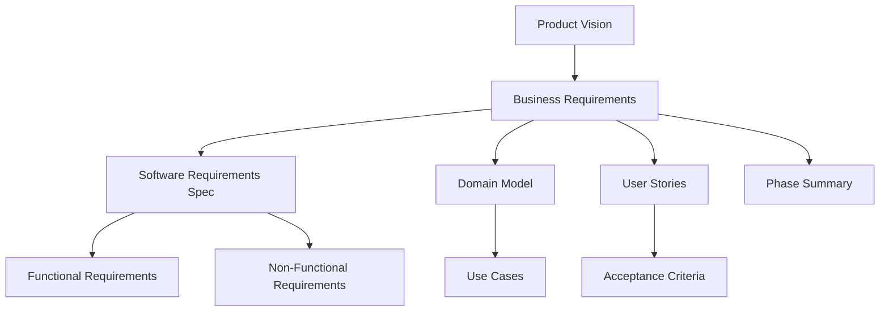
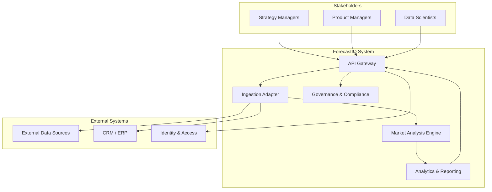
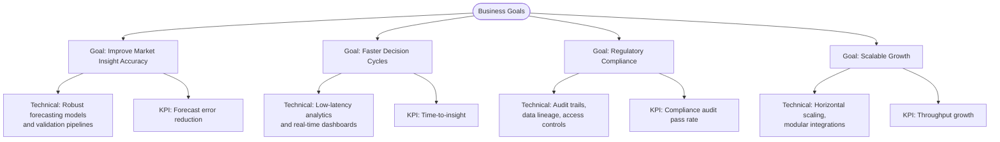
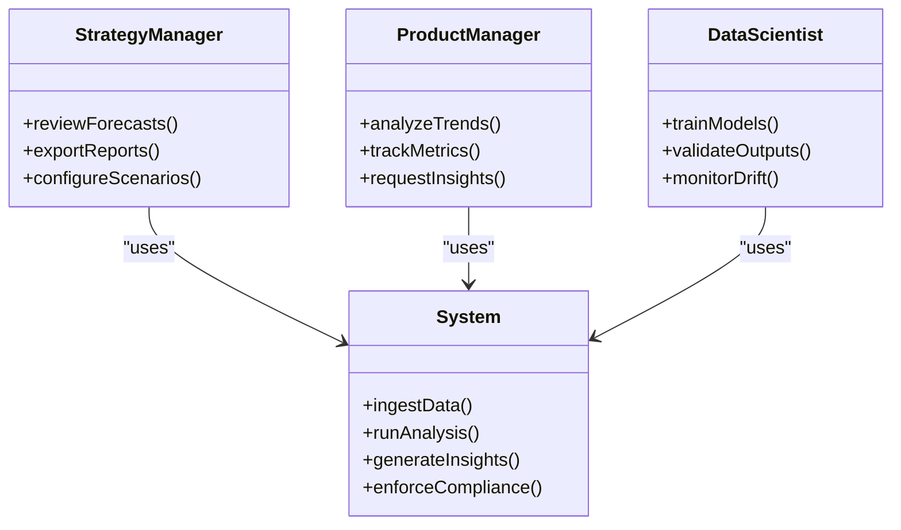
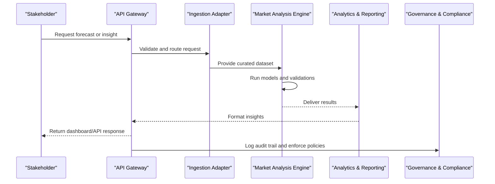
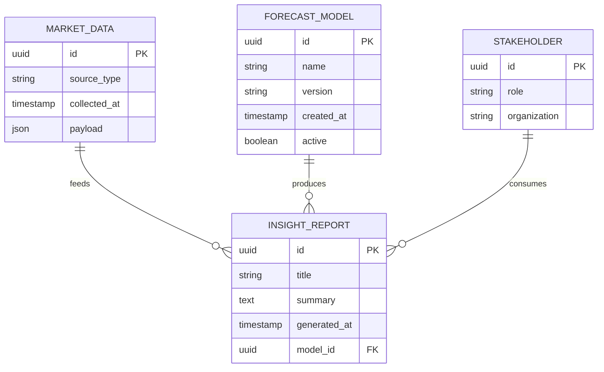
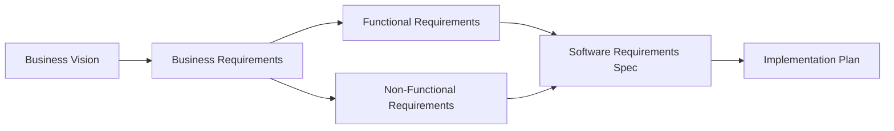

# Business Requirements & Analysis

<cite>
**Referenced Files in This Document**
- [01-product-vision.md](file://docs/phase-0-business-analysis/01-product-vision.md)
- [02-business-requirements.md](file://docs/phase-0-business-analysis/02-business-requirements.md)
- [03-software-requirements-spec.md](file://docs/phase-0-business-analysis/03-software-requirements-spec.md)
- [04-functional-requirements.md](file://docs/phase-0-business-analysis/04-functional-requirements.md)
- [05-non-functional-requirements.md](file://docs/phase-0-business-analysis/05-non-functional-requirements.md)
- [06-domain-model.md](file://docs/phase-0-business-analysis/06-domain-model.md)
- [07-use-case-diagram.md](file://docs/phase-0-business-analysis/07-use-case-diagram.md)
- [08-user-stories.md](file://docs/phase-0-business-analysis/08-user-stories.md)
- [09-acceptance-criteria.md](file://docs/phase-0-business-analysis/09-acceptance-criteria.md)
- [10-phase-summary.md](file://docs/phase-0-business-analysis/10-phase-summary.md)
</cite>

## Table of Contents
1. [Introduction](#introduction)
2. [Project Structure](#project-structure)
3. [Core Components](#core-components)
4. [Architecture Overview](#architecture-overview)
5. [Detailed Component Analysis](#detailed-component-analysis)
6. [Dependency Analysis](#dependency-analysis)
7. [Performance Considerations](#performance-considerations)
8. [Troubleshooting Guide](#troubleshooting-guide)
9. [Conclusion](#conclusion)
10. [Appendices](#appendices)

## Introduction
This document consolidates the business requirements and software specifications for ForecastIQ, focusing on market analysis needs, stakeholder requirements, and business objectives. It also maps these goals to technical implementation constraints, system boundaries, integration points, prioritization, feasibility, risk assessment, success metrics, value propositions, regulatory compliance, data privacy, and scalability from a business perspective. The content synthesizes insights from the Phase 0 business analysis artifacts to provide a clear bridge between business intent and engineering execution.

## Project Structure
The project’s business analysis is organized into a structured set of documents that progressively refine scope, requirements, and design alignment:
- Product vision and strategic context
- Business requirements and stakeholder needs
- Software requirements specification (technical constraints, boundaries, integrations)
- Functional and non-functional requirements
- Domain model and use cases
- User stories and acceptance criteria
- Phase summary and next steps

[No sources needed since this diagram shows conceptual workflow, not actual code structure]

**Section sources**
- [01-product-vision.md](file://docs/phase-0-business-analysis/01-product-vision.md)
- [02-business-requirements.md](file://docs/phase-0-business-analysis/02-business-requirements.md)
- [03-software-requirements-spec.md](file://docs/phase-0-business-analysis/03-software-requirements-spec.md)
- [04-functional-requirements.md](file://docs/phase-0-business-analysis/04-functional-requirements.md)
- [05-non-functional-requirements.md](file://docs/phase-0-business-analysis/05-non-functional-requirements.md)
- [06-domain-model.md](file://docs/phase-0-business-analysis/06-domain-model.md)
- [07-use-case-diagram.md](file://docs/phase-0-business-analysis/07-use-case-diagram.md)
- [08-user-stories.md](file://docs/phase-0-business-analysis/08-user-stories.md)
- [09-acceptance-criteria.md](file://docs/phase-0-business-analysis/09-acceptance-criteria.md)
- [10-phase-summary.md](file://docs/phase-0-business-analysis/10-phase-summary.md)

## Core Components
ForecastIQ’s core components align with market analysis workflows and stakeholder needs:
- Market analysis engine: processes inputs, applies models, and generates forecasts
- Data ingestion layer: integrates external datasets and internal systems
- Analytics and reporting: transforms outputs into actionable insights
- Stakeholder interfaces: dashboards and APIs for decision-makers
- Governance and compliance controls: auditability, privacy safeguards, and policy enforcement

These components are defined and refined across the business and software requirements documents, ensuring traceability from business goals to technical features.

**Section sources**
- [02-business-requirements.md](file://docs/phase-0-business-analysis/02-business-requirements.md)
- [03-software-requirements-spec.md](file://docs/phase-0-business-analysis/03-software-requirements-spec.md)
- [04-functional-requirements.md](file://docs/phase-0-business-analysis/04-functional-requirements.md)
- [05-non-functional-requirements.md](file://docs/phase-0-business-analysis/05-non-functional-requirements.md)

## Architecture Overview
At a high level, ForecastIQ connects stakeholders to market data through an analytics pipeline that produces forecasts and insights. The architecture emphasizes modularity, integration flexibility, and compliance-aware processing.

[No sources needed since this diagram shows conceptual workflow, not actual code structure]

## Detailed Component Analysis

### Business Goals and Technical Implementation Mapping
This section maps business objectives to technical capabilities, clarifying how each goal drives specific system behaviors and constraints.

[No sources needed since this diagram shows conceptual workflow, not actual code structure]

**Section sources**
- [01-product-vision.md](file://docs/phase-0-business-analysis/01-product-vision.md)
- [02-business-requirements.md](file://docs/phase-0-business-analysis/02-business-requirements.md)
- [03-software-requirements-spec.md](file://docs/phase-0-business-analysis/03-software-requirements-spec.md)
- [05-non-functional-requirements.md](file://docs/phase-0-business-analysis/05-non-functional-requirements.md)

### Stakeholder Requirements and Use Cases
Stakeholder roles and their primary interactions define the functional surface area and user journeys.

**Diagram sources**
- [07-use-case-diagram.md](file://docs/phase-0-business-analysis/07-use-case-diagram.md)
- [08-user-stories.md](file://docs/phase-0-business-analysis/08-user-stories.md)

**Section sources**
- [07-use-case-diagram.md](file://docs/phase-0-business-analysis/07-use-case-diagram.md)
- [08-user-stories.md](file://docs/phase-0-business-analysis/08-user-stories.md)
- [09-acceptance-criteria.md](file://docs/phase-0-business-analysis/09-acceptance-criteria.md)

### Data Flow and Processing Logic
The data flow captures ingestion, transformation, analysis, and delivery of insights while embedding governance checkpoints.

**Diagram sources**
- [04-functional-requirements.md](file://docs/phase-0-business-analysis/04-functional-requirements.md)
- [05-non-functional-requirements.md](file://docs/phase-0-business-analysis/05-non-functional-requirements.md)

**Section sources**
- [04-functional-requirements.md](file://docs/phase-0-business-analysis/04-functional-requirements.md)
- [05-non-functional-requirements.md](file://docs/phase-0-business-analysis/05-non-functional-requirements.md)

### Domain Model and Entities
The domain model outlines key entities and relationships central to market analysis and forecasting.

**Diagram sources**
- [06-domain-model.md](file://docs/phase-0-business-analysis/06-domain-model.md)

**Section sources**
- [06-domain-model.md](file://docs/phase-0-business-analysis/06-domain-model.md)

## Dependency Analysis
Requirements dependencies illustrate how business goals cascade into functional and non-functional specifications, guiding development priorities and integration planning.

**Diagram sources**
- [01-product-vision.md](file://docs/phase-0-business-analysis/01-product-vision.md)
- [02-business-requirements.md](file://docs/phase-0-business-analysis/02-business-requirements.md)
- [03-software-requirements-spec.md](file://docs/phase-0-business-analysis/03-software-requirements-spec.md)
- [04-functional-requirements.md](file://docs/phase-0-business-analysis/04-functional-requirements.md)
- [05-non-functional-requirements.md](file://docs/phase-0-business-analysis/05-non-functional-requirements.md)

**Section sources**
- [01-product-vision.md](file://docs/phase-0-business-analysis/01-product-vision.md)
- [02-business-requirements.md](file://docs/phase-0-business-analysis/02-business-requirements.md)
- [03-software-requirements-spec.md](file://docs/phase-0-business-analysis/03-software-requirements-spec.md)
- [04-functional-requirements.md](file://docs/phase-0-business-analysis/04-functional-requirements.md)
- [05-non-functional-requirements.md](file://docs/phase-0-business-analysis/05-non-functional-requirements.md)

## Performance Considerations
From a business perspective, performance targets must support timely decisions and scalable growth:
- Latency targets for insight delivery to enable rapid strategy adjustments
- Throughput capacity to handle growing data volumes and concurrent users
- Reliability and availability to ensure consistent access during critical periods
- Cost-efficiency to maintain profitability at scale

These considerations are informed by non-functional requirements and should be validated against operational budgets and service-level expectations.

**Section sources**
- [05-non-functional-requirements.md](file://docs/phase-0-business-analysis/05-non-functional-requirements.md)

## Troubleshooting Guide
Operational issues often relate to data quality, integration failures, and compliance checks:
- Data ingestion errors: validate source connectivity, schema changes, and transformation rules
- Model drift and accuracy degradation: monitor performance metrics and retraining triggers
- Access control and audit failures: verify identity provider configuration and policy enforcement
- Reporting anomalies: inspect lineage logs and reconciliation processes

Addressing these areas ensures sustained reliability and trust in ForecastIQ outputs.

**Section sources**
- [05-non-functional-requirements.md](file://docs/phase-0-business-analysis/05-non-functional-requirements.md)
- [09-acceptance-criteria.md](file://docs/phase-0-business-analysis/09-acceptance-criteria.md)

## Conclusion
ForecastIQ’s business requirements and software specifications establish a clear path from market analysis needs to technical implementation. By aligning stakeholder goals with functional and non-functional requirements, defining system boundaries and integrations, and embedding governance and scalability, the project positions itself to deliver measurable business value. Prioritization, feasibility, and risk assessments guide phased delivery, while success metrics and compliance considerations ensure accountability and sustainability.

[No sources needed since this section summarizes without analyzing specific files]

## Appendices

### Requirements Prioritization Matrix
Prioritize features based on business impact, technical complexity, and risk exposure to optimize delivery sequencing.

| Requirement Category | Business Impact | Technical Complexity | Risk Exposure | Priority |
|----------------------|-----------------|----------------------|---------------|----------|
| Market Analysis Engine | High | Medium | Medium | High |
| Data Ingestion Layer | High | High | High | High |
| Analytics & Reporting | Medium | Medium | Low | Medium |
| Governance & Compliance | High | Medium | High | High |
| Stakeholder Interfaces | Medium | Low | Low | Medium |

[No sources needed since this table provides general guidance]

### Feasibility Analysis
Evaluate technical feasibility, resource availability, and timeline constraints to confirm viability of planned capabilities.

- Technical feasibility: Confirm model maturity, data availability, and integration readiness
- Resource feasibility: Assess team skills, tooling, and infrastructure capacity
- Timeline feasibility: Align milestones with market windows and stakeholder expectations

[No sources needed since this section provides general guidance]

### Risk Assessment
Identify and mitigate risks across data, technology, compliance, and operations.

- Data risk: Source reliability, quality, and licensing
- Technology risk: Model accuracy, latency, and scalability limits
- Compliance risk: Regulatory changes and audit requirements
- Operational risk: Incident response, monitoring, and recovery procedures

[No sources needed since this section provides general guidance]

### Success Metrics and Business Value Propositions
Define measurable outcomes tied to business goals:
- Forecast accuracy improvement percentage
- Reduction in time-to-insight for strategic decisions
- Increase in stakeholder satisfaction scores
- Compliance audit pass rates
- Cost savings from optimized strategies

These metrics should be tracked continuously and reported to stakeholders to demonstrate value realization.

[No sources needed since this section provides general guidance]

### Regulatory Compliance and Data Privacy
Ensure adherence to relevant regulations and privacy standards:
- Data minimization and purpose limitation
- Consent management and retention policies
- Secure storage and transmission
- Auditability and transparency of processing activities

Integrate compliance checks throughout the pipeline and maintain documentation for audits.

**Section sources**
- [05-non-functional-requirements.md](file://docs/phase-0-business-analysis/05-non-functional-requirements.md)

### Scalability Requirements from a Business Perspective
Plan for growth in users, data volume, and feature breadth:
- Horizontal scaling of analysis services
- Modular integration patterns for new data sources
- Configurable thresholds and policies for different markets
- Capacity planning aligned with revenue projections

**Section sources**
- [05-non-functional-requirements.md](file://docs/phase-0-business-analysis/05-non-functional-requirements.md)