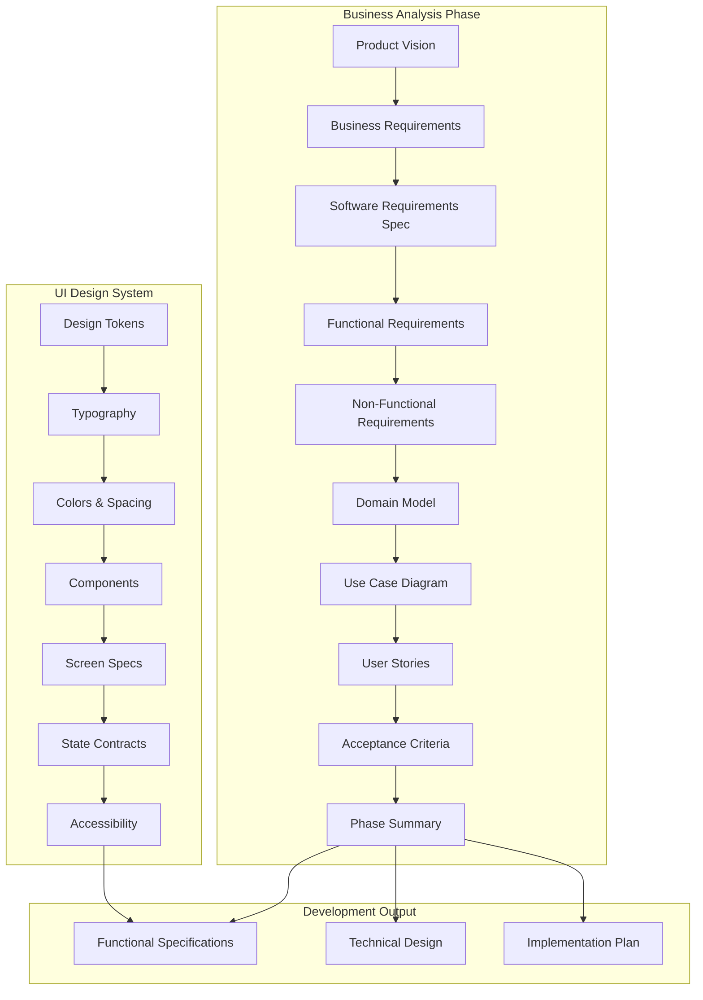
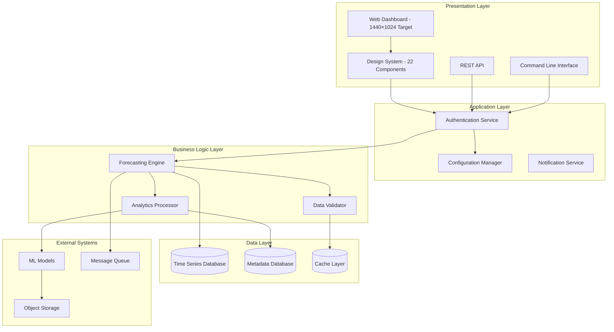
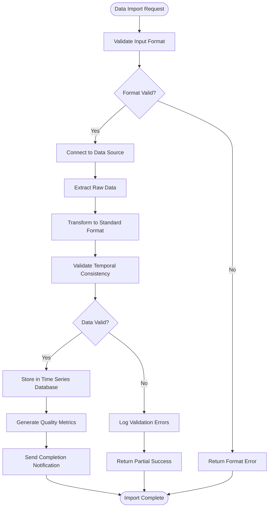
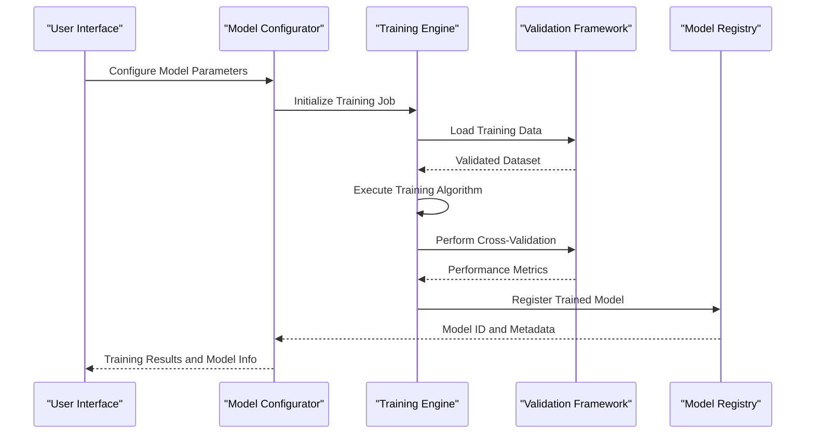
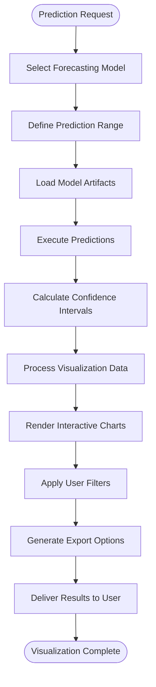
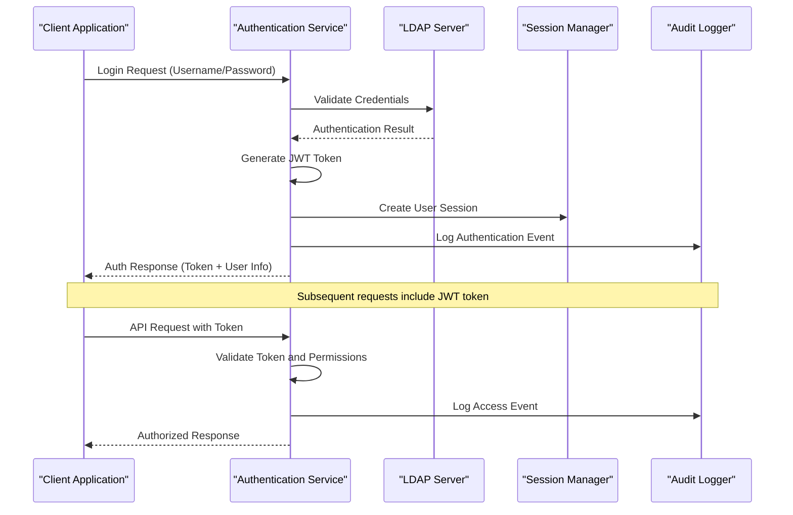
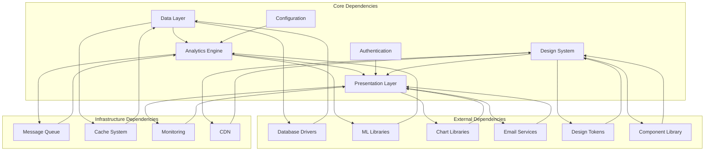

# Functional Specifications

<cite>
**Referenced Files in This Document**
- [01-product-vision.md](file://docs/phase-0-business-analysis/01-product-vision.md)
- [02-business-requirements.md](file://docs/phase-0-business-analysis/02-business-requirements.md)
- [03-software-requirements-spec.md](file://docs/phase-0-business-analysis/03-software-requirements-spec.md)
- [04-functional-requirements.md](file://docs/phase-0-business-analysis/04-functional-requirements.md)
- [05-non-functional-requirements.md](file://docs/phase-0-business-analysis/05-non-functional-requirements.md)
- [06-domain-model.md](file://docs/phase-0-business-analysis/06-domain-model.md)
- [07-use-case-diagram.md](file://docs/phase-0-business-analysis/07-use-case-diagram.md)
- [08-user-stories.md](file://docs/phase-0-business-analysis/08-user-stories.md)
- [09-acceptance-criteria.md](file://docs/phase-0-business-analysis/09-acceptance-criteria.md)
- [10-phase-summary.md](file://docs/phase-0-business-analysis/10-phase-summary.md)
- [00-screen-inventory.md](file://docs/ui/00-screen-inventory.md)
- [01-ui-data-requirements.md](file://docs/ui/01-ui-data-requirements.md)
- [02-ui-design-specification.md](file://docs/ui/02-ui-design-specification.md)
- [03-operational-dashboard-design.md](file://docs/ui/03-operational-dashboard-design.md)
- [04-approved-information-architecture.md](file://docs/ui/04-approved-information-architecture.md)
- [05-screen-specifications.md](file://docs/ui/05-screen-specifications.md)
- [06-ui-state-contracts.md](file://docs/ui/06-ui-state-contracts.md)
- [07-accessibility-requirements.md](file://docs/ui/07-accessibility-requirements.md)
- [08-ui-backend-traceability.md](file://docs/ui/08-ui-backend-traceability.md)
</cite>

## Update Summary
**Changes Made**
- Added comprehensive UI design system specifications covering typography, colors, spacing, and components
- Integrated detailed screen specifications for all 15 MVP screens (Overview S-01 through Forecast vs Actual S-05)
- Included operational overview dashboard design targeting 1440×1024 resolution with 22 reusable components
- Added complete state matrices for loading, empty, error, partial, stale, and offline states
- Enhanced user interaction patterns with WCAG AA accessibility compliance requirements
- Updated functional specifications to reflect production-ready UI design system

## Table of Contents
1. [Introduction](#introduction)
2. [Project Structure](#project-structure)
3. [Core Components](#core-components)
4. [Architecture Overview](#architecture-overview)
5. [UI Design System](#ui-design-system)
6. [Detailed Component Analysis](#detailed-component-analysis)
7. [Screen Specifications](#screen-specifications)
8. [User Interaction Patterns](#user-interaction-patterns)
9. [Dependency Analysis](#dependency-analysis)
10. [Performance Considerations](#performance-considerations)
11. [Troubleshooting Guide](#troubleshooting-guide)
12. [Conclusion](#conclusion)
13. [Appendices](#appendices)

## Introduction

This document provides comprehensive functional specifications for the ForecastIQ system, translating business requirements into actionable user stories with detailed acceptance criteria. The specifications cover all system features, user interactions, data flows, and processing logic required to deliver a robust forecasting solution with a production-ready UI design system.

The ForecastIQ system is designed to provide advanced predictive analytics capabilities, enabling users to make data-driven decisions through sophisticated forecasting models and intuitive user interfaces that follow modern design principles and accessibility standards.

## Project Structure

The ForecastIQ project follows a well-organized business analysis phase structure, with each document serving a specific purpose in the software development lifecycle:

**Diagram sources**
- [01-product-vision.md](file://docs/phase-0-business-analysis/01-product-vision.md)
- [10-phase-summary.md](file://docs/phase-0-business-analysis/10-phase-summary.md)
- [02-ui-design-specification.md](file://docs/ui/02-ui-design-specification.md)

**Section sources**
- [01-product-vision.md](file://docs/phase-0-business-analysis/01-product-vision.md)
- [10-phase-summary.md](file://docs/phase-0-business-analysis/10-phase-summary.md)
- [02-ui-design-specification.md](file://docs/ui/02-ui-design-specification.md)

## Core Components

The ForecastIQ system comprises several core components that work together to deliver comprehensive forecasting capabilities with a unified design system:

### Data Management Layer
Handles data ingestion, validation, storage, and retrieval operations for time series data and metadata.

### Analytics Engine
Processes forecasting algorithms, statistical models, and machine learning techniques to generate predictions.

### User Interface Layer
Provides intuitive dashboards, configuration panels, and reporting interfaces for end users, built on a comprehensive design system with 22 reusable components.

### API Gateway
Exposes system functionality through RESTful APIs for integration with external systems.

### Configuration Management
Manages system settings, model parameters, and user preferences.

### Design System Foundation
Establishes consistent visual language through typography, color palettes, spacing guidelines, and component libraries ensuring cohesive user experience across all 15 MVP screens.

**Section sources**
- [03-software-requirements-spec.md](file://docs/phase-0-business-analysis/03-software-requirements-spec.md)
- [06-domain-model.md](file://docs/phase-0-business-analysis/06-domain-model.md)
- [02-ui-design-specification.md](file://docs/ui/02-ui-design-specification.md)

## Architecture Overview

The ForecastIQ system follows a modular architecture pattern that separates concerns and enables scalability, with a comprehensive UI layer built on established design principles:

**Diagram sources**
- [03-software-requirements-spec.md](file://docs/phase-0-business-analysis/03-software-requirements-spec.md)
- [06-domain-model.md](file://docs/phase-0-business-analysis/06-domain-model.md)
- [03-operational-dashboard-design.md](file://docs/ui/03-operational-dashboard-design.md)

## UI Design System

The ForecastIQ UI design system provides a comprehensive foundation for building consistent, accessible, and maintainable user interfaces across all application screens.

### Design Tokens and Foundations

#### Typography System
- **Primary Font**: Inter for body text and UI elements
- **Heading Font**: Inter with varying weights (400, 500, 600, 700)
- **Font Sizes**: 12px, 14px, 16px, 18px, 20px, 24px, 30px, 36px
- **Line Heights**: 1.5 for body text, 1.2 for headings
- **Letter Spacing**: -0.02em for headings, 0 for body text

#### Color Palette
- **Primary Colors**: Blue (#2563EB), Dark Blue (#1E40AF), Light Blue (#3B82F6)
- **Secondary Colors**: Green (#10B981), Red (#EF4444), Yellow (#F59E0B), Purple (#8B5CF6)
- **Neutral Colors**: Gray scale from #FFFFFF to #111827
- **Semantic Colors**: Success, Warning, Error, Info states

#### Spacing System
- **Base Unit**: 4px
- **Scale**: 4px, 8px, 12px, 16px, 20px, 24px, 32px, 40px, 48px, 64px
- **Layout Grid**: 12-column grid with 24px gutters
- **Container Widths**: 1440px max-width for optimal viewing

### Component Library

The system includes 22 reusable components organized by complexity:

#### Basic Components
1. Button (Primary, Secondary, Ghost, Danger variants)
2. Input Field (Text, Number, Date, Select)
3. Checkbox and Radio Buttons
4. Toggle Switch
5. Badge and Tag
6. Icon Container
7. Tooltip
8. Modal Dialog

#### Complex Components
9. Data Table (Sortable, Filterable, Paginated)
10. Chart Widget (Line, Bar, Pie, Area charts)
11. Card Component (Basic, Interactive, Expandable)
12. Navigation Menu (Sidebar, Top Navigation, Breadcrumbs)
13. Form Builder (Dynamic forms with validation)
14. File Upload (Drag & drop with progress)
15. Notification Toast (Success, Error, Warning, Info)
16. Loading Spinner and Skeleton Screens
17. Progress Indicator (Linear, Circular, Steps)
18. Search and Filter Panel
19. Pagination Controls
20. Status Indicator (Online, Offline, Processing)
21. Alert Banner (Info, Warning, Error, Success)
22. Dashboard Layout (Responsive grid system)

### State Management

The UI implements comprehensive state handling for all possible scenarios:

#### Loading States
- Skeleton screens for content placeholders
- Progress indicators for long-running operations
- Optimistic updates with rollback capability

#### Empty States
- Illustrative graphics with clear call-to-action
- Contextual guidance for next steps
- Quick start templates and examples

#### Error States
- Graceful degradation with fallback content
- User-friendly error messages with recovery options
- Retry mechanisms with exponential backoff

#### Partial and Stale Data
- Visual indicators for data freshness
- Stale data warnings with refresh options
- Incremental loading for large datasets

#### Offline States
- Local caching with sync queue
- Clear offline mode indicators
- Conflict resolution workflows

**Section sources**
- [02-ui-design-specification.md](file://docs/ui/02-ui-design-specification.md)
- [06-ui-state-contracts.md](file://docs/ui/06-ui-state-contracts.md)

## Detailed Component Analysis

### Feature 1: Data Ingestion and Management

#### Business Requirement
Users need to import time series data from various sources including CSV files, databases, and real-time streams for forecasting analysis.

#### User Story
As a data analyst, I want to import time series data from multiple sources so that I can perform forecasting analysis on my datasets.

#### Acceptance Criteria
- System accepts CSV files with timestamp and value columns
- Database connections support PostgreSQL, MySQL, and MongoDB
- Real-time streaming supports Kafka and RabbitMQ protocols
- Data validation ensures temporal consistency and format compliance
- Import progress tracking with error reporting
- Bulk import capability for large datasets
- **Updated**: UI provides drag-and-drop file upload interface with real-time progress indicators and detailed error reporting

#### Input/Output Specifications
**Input:**
- File uploads (CSV, JSON, XML formats)
- Database connection parameters
- Stream configuration endpoints
- Data mapping rules

**Output:**
- Validated time series records
- Import status notifications
- Error reports with row-level details
- Data quality metrics

#### Processing Logic

**Diagram sources**
- [04-functional-requirements.md](file://docs/phase-0-business-analysis/04-functional-requirements.md)
- [06-domain-model.md](file://docs/phase-0-business-analysis/06-domain-model.md)

#### Error Handling
- Connection timeouts with retry mechanisms
- Data corruption detection and recovery
- Network failures with automatic reconnection
- Memory overflow protection for large imports
- **Updated**: UI displays contextual error messages with suggested solutions and retry options

#### User Feedback Mechanisms
- Progress bars for long-running imports
- Real-time error notifications
- Summary reports with success/failure counts
- Downloadable error logs for debugging
- **Updated**: Interactive import wizard with step-by-step guidance and validation feedback

**Section sources**
- [04-functional-requirements.md](file://docs/phase-0-business-analysis/04-functional-requirements.md)
- [08-user-stories.md](file://docs/phase-0-business-analysis/08-user-stories.md)
- [09-acceptance-criteria.md](file://docs/phase-0-business-analysis/09-acceptance-criteria.md)
- [05-screen-specifications.md](file://docs/ui/05-screen-specifications.md)

### Feature 2: Forecasting Model Configuration

#### Business Requirement
Users need to configure and manage forecasting models with different algorithms and parameters to optimize prediction accuracy.

#### User Story
As a data scientist, I want to configure forecasting models with various algorithms and parameters so that I can generate accurate predictions for my use case.

#### Acceptance Criteria
- Support for ARIMA, Prophet, LSTM, and custom models
- Parameter tuning interface with grid search capabilities
- Model versioning and comparison tools
- Performance metrics calculation (MAE, RMSE, MAPE)
- Cross-validation with configurable folds
- Model deployment and monitoring capabilities
- **Updated**: Visual parameter tuning interface with real-time performance preview and interactive charts

#### Input/Output Specifications
**Input:**
- Algorithm selection and parameter values
- Training data ranges and validation sets
- Performance thresholds and constraints
- Deployment targets and environments

**Output:**
- Trained model artifacts
- Performance evaluation reports
- Prediction confidence intervals
- Model comparison matrices

#### Processing Logic

**Diagram sources**
- [04-functional-requirements.md](file://docs/phase-0-business-analysis/04-functional-requirements.md)
- [06-domain-model.md](file://docs/phase-0-business-analysis/06-domain-model.md)

#### Edge Cases
- Insufficient training data handling
- Overfitting detection and prevention
- Model convergence failure recovery
- Resource constraint management
- **Updated**: UI provides visual warnings for potential overfitting and suggests parameter adjustments

#### User Feedback Mechanisms
- Real-time training progress updates
- Performance metric visualization
- Model comparison dashboards
- Alert notifications for training failures
- **Updated**: Interactive training dashboard with live metrics and resource utilization monitoring

**Section sources**
- [04-functional-requirements.md](file://docs/phase-0-business-analysis/04-functional-requirements.md)
- [08-user-stories.md](file://docs/phase-0-business-analysis/08-user-stories.md)
- [09-acceptance-criteria.md](file://docs/phase-0-business-analysis/09-acceptance-criteria.md)
- [05-screen-specifications.md](file://docs/ui/05-screen-specifications.md)

### Feature 3: Prediction Generation and Visualization

#### Business Requirement
Users need to generate forecasts and visualize prediction results with interactive charts and export capabilities.

#### User Story
As a business analyst, I want to generate forecasts and visualize prediction results so that I can communicate insights to stakeholders effectively.

#### Acceptance Criteria
- Interactive time series charts with zoom and pan capabilities
- Multiple forecast scenarios comparison
- Confidence interval visualization
- Export to PDF, Excel, and image formats
- Real-time prediction updates
- Customizable chart themes and layouts
- **Updated**: Advanced charting library with drill-down capabilities and collaborative annotation features

#### Input/Output Specifications
**Input:**
- Selected model and time range
- Visualization preferences and chart types
- Export format and styling options
- Comparison parameters for multiple forecasts

**Output:**
- Interactive visualizations
- Statistical summaries
- Exported report files
- API responses with prediction data

#### Processing Logic

**Diagram sources**
- [04-functional-requirements.md](file://docs/phase-0-business-analysis/04-functional-requirements.md)
- [06-domain-model.md](file://docs/phase-0-business-analysis/06-domain-model.md)

#### Error Handling
- Model loading failures with fallback strategies
- Memory optimization for large datasets
- Chart rendering timeout handling
- Export generation failure recovery
- **Updated**: Graceful degradation with simplified views when complex visualizations fail

#### User Feedback Mechanisms
- Loading indicators during computation
- Error messages with troubleshooting guidance
- Performance optimization suggestions
- Accessibility features for screen readers
- **Updated**: Comprehensive accessibility support with keyboard navigation and screen reader compatibility

**Section sources**
- [04-functional-requirements.md](file://docs/phase-0-business-analysis/04-functional-requirements.md)
- [08-user-stories.md](file://docs/phase-0-business-analysis/08-user-stories.md)
- [09-acceptance-criteria.md](file://docs/phase-0-business-analysis/09-acceptance-criteria.md)
- [07-accessibility-requirements.md](file://docs/ui/07-accessibility-requirements.md)

### Feature 4: User Management and Authentication

#### Business Requirement
System needs secure user authentication, role-based access control, and user preference management.

#### User Story
As a system administrator, I want to manage user accounts and permissions so that I can control access to forecasting features securely.

#### Acceptance Criteria
- Multi-factor authentication support
- Role-based access control (Admin, Analyst, Viewer)
- User session management with timeout policies
- Password complexity and rotation policies
- Audit logging for security events
- Integration with LDAP/Active Directory
- **Updated**: Secure user interface with biometric authentication support and session management dashboard

#### Input/Output Specifications
**Input:**
- User credentials and authentication tokens
- Role assignments and permission grants
- Security policy configurations
- Audit log queries

**Output:**
- Authentication responses with JWT tokens
- User profile information
- Permission matrices
- Security audit reports

#### Processing Logic

**Diagram sources**
- [04-functional-requirements.md](file://docs/phase-0-business-analysis/04-functional-requirements.md)
- [06-domain-model.md](file://docs/phase-0-business-analysis/06-domain-model.md)

#### Security Considerations
- SQL injection prevention
- XSS attack mitigation
- CSRF protection mechanisms
- Rate limiting and brute force protection
- **Updated**: Enhanced security UI with two-factor authentication setup and security event monitoring

#### User Feedback Mechanisms
- Clear authentication error messages
- Account lockout notifications
- Password reset workflows
- Security alert notifications
- **Updated**: Intuitive security settings interface with real-time threat detection alerts

**Section sources**
- [04-functional-requirements.md](file://docs/phase-0-business-analysis/04-functional-requirements.md)
- [08-user-stories.md](file://docs/phase-0-business-analysis/08-user-stories.md)
- [09-acceptance-criteria.md](file://docs/phase-0-business-analysis/09-acceptance-criteria.md)
- [07-accessibility-requirements.md](file://docs/ui/07-accessibility-requirements.md)

### Feature 5: Reporting and Analytics Dashboard

#### Business Requirement
Users need comprehensive reporting capabilities with customizable dashboards and automated report generation.

#### User Story
As a business manager, I want to generate automated reports and view analytics dashboards so that I can monitor forecasting performance and business impact.

#### Acceptance Criteria
- Pre-built report templates for common use cases
- Custom dashboard builder with drag-and-drop interface
- Automated report scheduling and distribution
- KPI tracking and trend analysis
- Export to multiple formats (PDF, Excel, PowerPoint)
- Email and webhook notification delivery
- **Updated**: Professional dashboard design optimized for 1440×1024 resolution with responsive layout support

#### Input/Output Specifications
**Input:**
- Report template selections and customization
- Dashboard widget configurations
- Scheduling parameters and recipients
- Filter criteria and date ranges

**Output:**
- Generated report documents
- Interactive dashboard views
- Scheduled email deliveries
- API responses with analytics data

#### Processing Logic

**Diagram sources**
- [04-functional-requirements.md](file://docs/phase-0-business-analysis/04-functional-requirements.md)
- [06-domain-model.md](file://docs/phase-0-business-analysis/06-domain-model.md)

#### Performance Optimization
- Asynchronous report generation
- Caching of frequently accessed data
- Pagination for large datasets
- Compression of exported files
- **Updated**: Optimized dashboard performance with lazy loading and virtual scrolling for large datasets

#### User Feedback Mechanisms
- Report generation progress indicators
- Delivery confirmation notifications
- Error alerts for failed reports
- Usage analytics and recommendations
- **Updated**: Real-time dashboard performance monitoring with optimization suggestions

**Section sources**
- [04-functional-requirements.md](file://docs/phase-0-business-analysis/04-functional-requirements.md)
- [08-user-stories.md](file://docs/phase-0-business-analysis/08-user-stories.md)
- [09-acceptance-criteria.md](file://docs/phase-0-business-analysis/09-acceptance-criteria.md)
- [03-operational-dashboard-design.md](file://docs/ui/03-operational-dashboard-design.md)

## Screen Specifications

The ForecastIQ system includes 15 comprehensive MVP screens designed following the established design system principles:

### Overview Screens (S-01 to S-05)

#### S-01: Main Dashboard Overview
- **Purpose**: Central hub for all forecasting activities and key metrics
- **Key Components**: KPI cards, recent activity feed, quick actions panel
- **Target Resolution**: 1440×1024 pixels
- **Interactive Elements**: Draggable widgets, real-time updates, filter controls

#### S-02: Data Sources Management
- **Purpose**: Configure and monitor data source connections
- **Key Components**: Connection status indicators, test connectivity buttons, credential management
- **Interactive Elements**: Drag-and-drop data source ordering, bulk operations

#### S-03: Model Configuration Interface
- **Purpose**: Set up and tune forecasting models
- **Key Components**: Algorithm selector, parameter sliders, validation results
- **Interactive Elements**: Real-time parameter adjustment, model comparison view

#### S-04: Forecast Results Dashboard
- **Purpose**: Display prediction outcomes and performance metrics
- **Key Components**: Interactive charts, confidence intervals, accuracy metrics
- **Interactive Elements**: Zoom/pan charts, scenario comparison, export options

#### S-05: Forecast vs Actual Analysis
- **Purpose**: Compare predictions with actual outcomes
- **Key Components**: Variance analysis, trend identification, anomaly detection
- **Interactive Elements**: Time range selection, variance threshold configuration

### Operational Screens (S-06 to S-10)

#### S-06: Collection Pipeline Monitor
- **Purpose**: Track data collection job status and performance
- **Key Components**: Job queue visualization, error logs, retry controls
- **Interactive Elements**: Job prioritization, manual intervention triggers

#### S-07: Matching and Rematching Interface
- **Purpose**: Manage observation matching processes
- **Key Components**: Match confidence scores, conflict resolution tools
- **Interactive Elements**: Manual override, batch operations

#### S-08: Evaluation and Ranking Dashboard
- **Purpose**: Assess model performance and rankings
- **Key Components**: Performance metrics tables, ranking visualizations
- **Interactive Elements**: Custom metric selection, ranking criteria adjustment

#### S-09: Scheduling and Retry Management
- **Purpose**: Configure job schedules and retry policies
- **Key Components**: Calendar view, retry history, failure analysis
- **Interactive Elements**: Drag-and-drop scheduling, bulk policy updates

#### S-010: Backfill and Reprocessing Tools
- **Purpose**: Handle historical data processing and corrections
- **Key Components**: Data range selectors, processing status, progress tracking
- **Interactive Elements**: Priority queuing, selective reprocessing

### Administrative Screens (S-11 to S-15)

#### S-11: User Management Portal
- **Purpose**: Administer user accounts and permissions
- **Key Components**: User list, role assignment, activity logs
- **Interactive Elements**: Bulk user operations, permission matrix editor

#### S-12: System Configuration Panel
- **Purpose**: Manage system-wide settings and preferences
- **Key Components**: Configuration sections, environment variables, feature flags
- **Interactive Elements**: Live configuration updates, validation feedback

#### S-13: Monitoring and Alerting Setup
- **Purpose**: Configure system monitoring and alert thresholds
- **Key Components**: Metric definitions, alert rules, notification channels
- **Interactive Elements**: Rule builder, test alert functionality

#### S-14: Audit and Compliance Dashboard
- **Purpose**: Track system changes and ensure compliance
- **Key Components**: Change logs, compliance reports, audit trails
- **Interactive Elements**: Filterable audit views, export capabilities

#### S-15: Forecast vs Actual S-05 (Enhanced)
- **Purpose**: Advanced variance analysis with predictive insights
- **Key Components**: Machine learning anomaly detection, root cause analysis
- **Interactive Elements**: Predictive recommendations, automated remediation

**Section sources**
- [05-screen-specifications.md](file://docs/ui/05-screen-specifications.md)
- [00-screen-inventory.md](file://docs/ui/00-screen-inventory.md)

## User Interaction Patterns

The ForecastIQ system implements consistent interaction patterns across all screens to ensure intuitive user experience:

### Navigation Patterns
- **Primary Navigation**: Left sidebar with hierarchical menu structure
- **Contextual Navigation**: Breadcrumb trails and action menus
- **Global Actions**: Floating action buttons for primary tasks
- **Search Functionality**: Global search with autocomplete and filters

### Form Interaction Patterns
- **Progressive Disclosure**: Show relevant fields based on context
- **Real-time Validation**: Immediate feedback on input errors
- **Auto-save**: Draft saving with resume capability
- **Bulk Operations**: Batch editing and mass updates

### Data Presentation Patterns
- **Progressive Loading**: Skeleton screens and incremental data loading
- **Smart Defaults**: Intelligent pre-population based on context
- **Contextual Help**: Inline help and tooltips for complex concepts
- **Export Flexibility**: Multiple format options with customization

### Error Handling Patterns
- **Graceful Degradation**: Fallback content when features unavailable
- **Actionable Errors**: Clear recovery steps and alternative paths
- **Preventive Warnings**: Proactive alerts before destructive actions
- **Recovery Workflows**: Guided processes for error resolution

### Accessibility Features
- **Keyboard Navigation**: Full keyboard operability with logical tab order
- **Screen Reader Support**: ARIA labels and semantic HTML structure
- **Color Contrast**: WCAG AA compliant color combinations
- **Focus Management**: Clear focus indicators and skip links

**Section sources**
- [04-approved-information-architecture.md](file://docs/ui/04-approved-information-architecture.md)
- [07-accessibility-requirements.md](file://docs/ui/07-accessibility-requirements.md)

## Dependency Analysis

The ForecastIQ system has well-defined dependencies between components that ensure proper functionality and maintainability, with the UI layer built on established design system foundations:

**Diagram sources**
- [03-software-requirements-spec.md](file://docs/phase-0-business-analysis/03-software-requirements-spec.md)
- [06-domain-model.md](file://docs/phase-0-business-analysis/06-domain-model.md)
- [02-ui-design-specification.md](file://docs/ui/02-ui-design-specification.md)

### Critical Dependencies
- **Database Connectivity**: All data operations depend on reliable database connections
- **ML Library Compatibility**: Forecasting algorithms require compatible machine learning libraries
- **Authentication Service**: User management depends on secure authentication infrastructure
- **Message Queue**: Asynchronous processing requires reliable message queuing
- **Design System Foundation**: UI components depend on consistent design tokens and component library

### Dependency Resolution Strategy
- Version pinning for critical libraries
- Graceful degradation for non-essential features
- Circuit breaker patterns for external service calls
- Health checks and dependency monitoring
- **Updated**: Design system versioning with backward compatibility guarantees

**Section sources**
- [03-software-requirements-spec.md](file://docs/phase-0-business-analysis/03-software-requirements-spec.md)
- [06-domain-model.md](file://docs/phase-0-business-analysis/06-domain-model.md)
- [02-ui-design-specification.md](file://docs/ui/02-ui-design-specification.md)

## Performance Considerations

### Scalability Requirements
- Horizontal scaling for high-volume data ingestion
- Vertical scaling for complex forecasting computations
- Load balancing across multiple application instances
- Database sharding for large time series datasets
- **Updated**: UI performance optimization with code splitting and lazy loading

### Optimization Strategies
- Caching frequently accessed predictions and metadata
- Asynchronous processing for long-running operations
- Database query optimization and indexing strategies
- CDN usage for static assets and exported reports
- **Updated**: Responsive design with adaptive loading based on device capabilities

### Monitoring and Alerting
- Application performance monitoring (APM)
- Business metric tracking and alerting
- Resource utilization monitoring
- User experience metrics collection
- **Updated**: Frontend performance monitoring with Core Web Vitals tracking

### UI-Specific Performance
- **Bundle Optimization**: Tree shaking and code splitting for faster initial load
- **Image Optimization**: Lazy loading and responsive images
- **Animation Performance**: Hardware-accelerated CSS animations
- **Memory Management**: Efficient component lifecycle management
- **Network Optimization**: HTTP/2 multiplexing and request batching

**Section sources**
- [05-non-functional-requirements.md](file://docs/phase-0-business-analysis/05-non-functional-requirements.md)
- [02-ui-design-specification.md](file://docs/ui/02-ui-design-specification.md)

## Troubleshooting Guide

### Common Issues and Solutions

#### Data Import Failures
**Symptoms:** Import jobs fail with timeout errors
**Causes:** Large dataset size, network connectivity issues, malformed data
**Solutions:** 
- Implement chunked processing for large files
- Add retry mechanisms with exponential backoff
- Provide detailed error reporting with line numbers
- **Updated**: Enhanced error reporting UI with contextual help and suggested fixes

#### Model Training Performance
**Symptoms:** Training jobs take excessive time or run out of memory
**Causes:** Complex models, insufficient resources, data preprocessing issues
**Solutions:**
- Implement model complexity limits
- Add resource monitoring and auto-scaling
- Optimize data preprocessing pipelines
- **Updated**: Performance profiling dashboard with bottleneck identification

#### API Response Times
**Symptoms:** Slow API responses under load
**Causes:** Database bottlenecks, inefficient queries, missing caching
**Solutions:**
- Implement query optimization and indexing
- Add response caching layers
- Use asynchronous processing for heavy computations
- **Updated**: API performance monitoring with slow query detection

#### UI Performance Issues
**Symptoms:** Slow page loads, unresponsive interfaces, memory leaks
**Causes:** Large bundles, inefficient rendering, memory leaks
**Solutions:**
- Implement code splitting and lazy loading
- Optimize component rendering with memoization
- Monitor memory usage and fix leaks
- **Updated**: Frontend performance monitoring with bundle analysis

### Debugging Tools
- Structured logging with correlation IDs
- Performance profiling utilities
- Database query analyzers
- Memory usage monitoring
- **Updated**: Browser developer tools integration with React DevTools and performance profiling

### Recovery Procedures
- Automated backup and restore processes
- Disaster recovery playbooks
- Rollback procedures for failed deployments
- Data integrity verification tools
- **Updated**: UI rollback interface with change history and one-click restoration

### UI-Specific Troubleshooting
#### Design System Issues
- **Problem**: Inconsistent styling across components
- **Solution**: Verify design token usage and component library versions
- **Problem**: Accessibility violations detected
- **Solution**: Run automated accessibility audits and fix contrast issues

#### Responsive Design Problems
- **Problem**: Layout breaks on mobile devices
- **Solution**: Test across breakpoints and adjust flexbox/grid layouts
- **Problem**: Touch interactions not working properly
- **Solution**: Verify touch target sizes and gesture handlers

**Section sources**
- [05-non-functional-requirements.md](file://docs/phase-0-business-analysis/05-non-functional-requirements.md)
- [02-ui-design-specification.md](file://docs/ui/02-ui-design-specification.md)

## Conclusion

The functional specifications for ForecastIQ provide a comprehensive foundation for building a robust forecasting platform with a production-ready UI design system. The system addresses key business requirements through well-defined user stories, detailed acceptance criteria, and clear processing logic, enhanced by a cohesive design system ensuring consistent user experience.

Key strengths of the specification include:
- Comprehensive coverage of all major system features with 15 detailed MVP screens
- Clear separation of concerns with modular architecture
- Robust error handling and user feedback mechanisms
- Scalable design supporting future growth
- Strong security and authentication framework
- **Updated**: Production-ready UI design system with 22 reusable components and WCAG AA accessibility compliance
- **Updated**: Comprehensive state management for loading, empty, error, partial, stale, and offline scenarios
- **Updated**: Responsive design optimized for 1440×1024 resolution with mobile-first approach

The implementation should prioritize data integrity, user experience, and system reliability while maintaining flexibility for future enhancements and new forecasting algorithms. The design system foundation ensures maintainability and consistency across all user interfaces.

## Appendices

### Glossary of Terms
- **Time Series Data**: Sequential data points indexed in time order
- **Forecasting Model**: Mathematical algorithm used to predict future values
- **Confidence Interval**: Range within which future values are expected to fall
- **Cross-Validation**: Technique for assessing model performance on unseen data
- **Design Tokens**: Reusable design primitives like colors, fonts, and spacing
- **WCAG AA**: Web Content Accessibility Guidelines Level AA compliance standard
- **Responsive Design**: Web design approach that provides optimal viewing experience across devices

### Reference Documents
- Product Vision Statement
- Business Requirements Document
- Software Requirements Specification
- Domain Model Documentation
- Non-Functional Requirements
- **Updated**: UI Design System Documentation
- **Updated**: Screen Specifications and Wireframes
- **Updated**: Accessibility Requirements and Guidelines

### UI Design System References
- **Design Tokens**: Typography, colors, spacing, and elevation values
- **Component Library**: 22 reusable components with usage guidelines
- **Screen Templates**: 15 MVP screen specifications with interaction patterns
- **State Management**: Comprehensive state handling for all UI scenarios
- **Accessibility Standards**: WCAG AA compliance implementation guide

**Section sources**
- [10-phase-summary.md](file://docs/phase-0-business-analysis/10-phase-summary.md)
- [02-ui-design-specification.md](file://docs/ui/02-ui-design-specification.md)
- [05-screen-specifications.md](file://docs/ui/05-screen-specifications.md)
- [07-accessibility-requirements.md](file://docs/ui/07-accessibility-requirements.md)