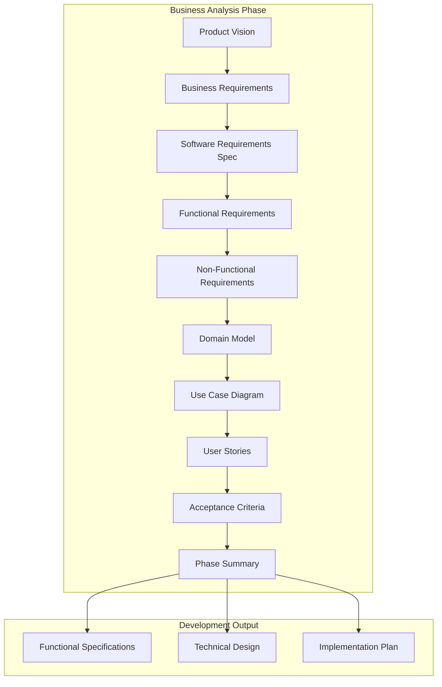
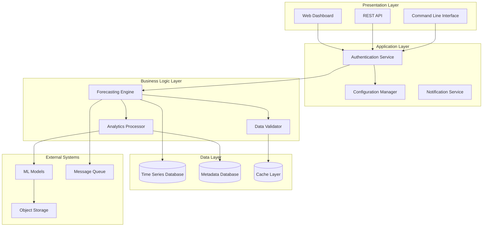
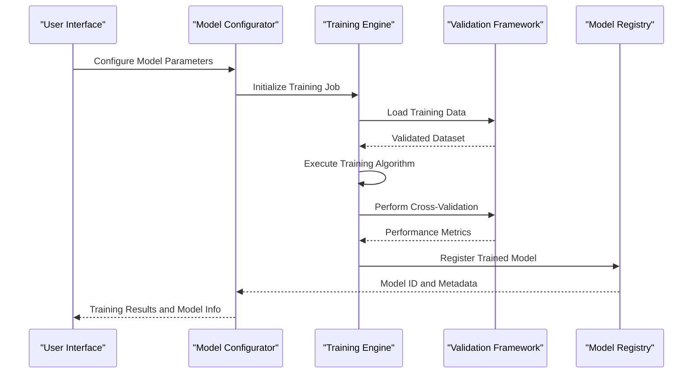
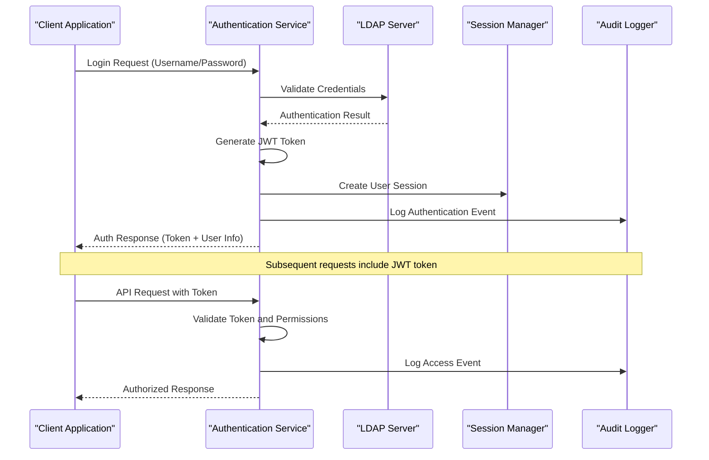
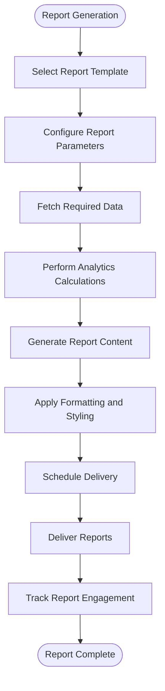
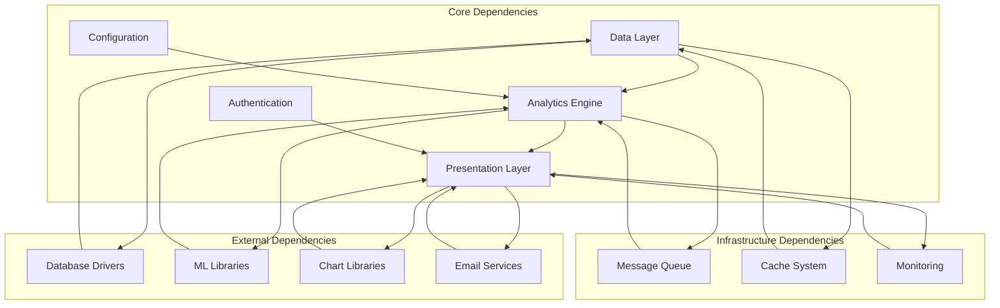

# Functional Specifications

<cite>
**Referenced Files in This Document**
- [01-product-vision.md](file://docs/phase-0-business-analysis/01-product-vision.md)
- [02-business-requirements.md](file://docs/phase-0-business-analysis/02-business-requirements.md)
- [03-software-requirements-spec.md](file://docs/phase-0-business-analysis/03-software-requirements-spec.md)
- [04-functional-requirements.md](file://docs/phase-0-business-analysis/04-functional-requirements.md)
- [05-non-functional-requirements.md](file://docs/phase-0-business-analysis/05-non-functional-requirements.md)
- [06-domain-model.md](file://docs/phase-0-business-analysis/06-domain-model.md)
- [07-use-case-diagram.md](file://docs/phase-0-business-analysis/07-use-case-diagram.md)
- [08-user-stories.md](file://docs/phase-0-business-analysis/08-user-stories.md)
- [09-acceptance-criteria.md](file://docs/phase-0-business-analysis/09-acceptance-criteria.md)
- [10-phase-summary.md](file://docs/phase-0-business-analysis/10-phase-summary.md)
</cite>

## Table of Contents
1. [Introduction](#introduction)
2. [Project Structure](#project-structure)
3. [Core Components](#core-components)
4. [Architecture Overview](#architecture-overview)
5. [Detailed Component Analysis](#detailed-component-analysis)
6. [Dependency Analysis](#dependency-analysis)
7. [Performance Considerations](#performance-considerations)
8. [Troubleshooting Guide](#troubleshooting-guide)
9. [Conclusion](#conclusion)
10. [Appendices](#appendices)

## Introduction

This document provides comprehensive functional specifications for the ForecastIQ system, translating business requirements into actionable user stories with detailed acceptance criteria. The specifications cover all system features, user interactions, data flows, and processing logic required to deliver a robust forecasting solution.

The ForecastIQ system is designed to provide advanced predictive analytics capabilities, enabling users to make data-driven decisions through sophisticated forecasting models and intuitive user interfaces.

## Project Structure

The ForecastIQ project follows a well-organized business analysis phase structure, with each document serving a specific purpose in the software development lifecycle:

**Diagram sources**
- [01-product-vision.md](file://docs/phase-0-business-analysis/01-product-vision.md)
- [10-phase-summary.md](file://docs/phase-0-business-analysis/10-phase-summary.md)

**Section sources**
- [01-product-vision.md](file://docs/phase-0-business-analysis/01-product-vision.md)
- [10-phase-summary.md](file://docs/phase-0-business-analysis/10-phase-summary.md)

## Core Components

The ForecastIQ system comprises several core components that work together to deliver comprehensive forecasting capabilities:

### Data Management Layer
Handles data ingestion, validation, storage, and retrieval operations for time series data and metadata.

### Analytics Engine
Processes forecasting algorithms, statistical models, and machine learning techniques to generate predictions.

### User Interface Layer
Provides intuitive dashboards, configuration panels, and reporting interfaces for end users.

### API Gateway
Exposes system functionality through RESTful APIs for integration with external systems.

### Configuration Management
Manages system settings, model parameters, and user preferences.

**Section sources**
- [03-software-requirements-spec.md](file://docs/phase-0-business-analysis/03-software-requirements-spec.md)
- [06-domain-model.md](file://docs/phase-0-business-analysis/06-domain-model.md)

## Architecture Overview

The ForecastIQ system follows a modular architecture pattern that separates concerns and enables scalability:

**Diagram sources**
- [03-software-requirements-spec.md](file://docs/phase-0-business-analysis/03-software-requirements-spec.md)
- [06-domain-model.md](file://docs/phase-0-business-analysis/06-domain-model.md)

## Detailed Component Analysis

### Feature 1: Data Ingestion and Management

#### Business Requirement
Users need to import time series data from various sources including CSV files, databases, and real-time streams for forecasting analysis.

#### User Story
As a data analyst, I want to import time series data from multiple sources so that I can perform forecasting analysis on my datasets.

#### Acceptance Criteria
- System accepts CSV files with timestamp and value columns
- Database connections support PostgreSQL, MySQL, and MongoDB
- Real-time streaming supports Kafka and RabbitMQ protocols
- Data validation ensures temporal consistency and format compliance
- Import progress tracking with error reporting
- Bulk import capability for large datasets

#### Input/Output Specifications
**Input:**
- File uploads (CSV, JSON, XML formats)
- Database connection parameters
- Stream configuration endpoints
- Data mapping rules

**Output:**
- Validated time series records
- Import status notifications
- Error reports with row-level details
- Data quality metrics

#### Processing Logic

**Diagram sources**
- [04-functional-requirements.md](file://docs/phase-0-business-analysis/04-functional-requirements.md)
- [06-domain-model.md](file://docs/phase-0-business-analysis/06-domain-model.md)

#### Error Handling
- Connection timeouts with retry mechanisms
- Data corruption detection and recovery
- Network failures with automatic reconnection
- Memory overflow protection for large imports

#### User Feedback Mechanisms
- Progress bars for long-running imports
- Real-time error notifications
- Summary reports with success/failure counts
- Downloadable error logs for debugging

**Section sources**
- [04-functional-requirements.md](file://docs/phase-0-business-analysis/04-functional-requirements.md)
- [08-user-stories.md](file://docs/phase-0-business-analysis/08-user-stories.md)
- [09-acceptance-criteria.md](file://docs/phase-0-business-analysis/09-acceptance-criteria.md)

### Feature 2: Forecasting Model Configuration

#### Business Requirement
Users need to configure and manage forecasting models with different algorithms and parameters to optimize prediction accuracy.

#### User Story
As a data scientist, I want to configure forecasting models with various algorithms and parameters so that I can generate accurate predictions for my use case.

#### Acceptance Criteria
- Support for ARIMA, Prophet, LSTM, and custom models
- Parameter tuning interface with grid search capabilities
- Model versioning and comparison tools
- Performance metrics calculation (MAE, RMSE, MAPE)
- Cross-validation with configurable folds
- Model deployment and monitoring capabilities

#### Input/Output Specifications
**Input:**
- Algorithm selection and parameter values
- Training data ranges and validation sets
- Performance thresholds and constraints
- Deployment targets and environments

**Output:**
- Trained model artifacts
- Performance evaluation reports
- Prediction confidence intervals
- Model comparison matrices

#### Processing Logic

**Diagram sources**
- [04-functional-requirements.md](file://docs/phase-0-business-analysis/04-functional-requirements.md)
- [06-domain-model.md](file://docs/phase-0-business-analysis/06-domain-model.md)

#### Edge Cases
- Insufficient training data handling
- Overfitting detection and prevention
- Model convergence failure recovery
- Resource constraint management

#### User Feedback Mechanisms
- Real-time training progress updates
- Performance metric visualization
- Model comparison dashboards
- Alert notifications for training failures

**Section sources**
- [04-functional-requirements.md](file://docs/phase-0-business-analysis/04-functional-requirements.md)
- [08-user-stories.md](file://docs/phase-0-business-analysis/08-user-stories.md)
- [09-acceptance-criteria.md](file://docs/phase-0-business-analysis/09-acceptance-criteria.md)

### Feature 3: Prediction Generation and Visualization

#### Business Requirement
Users need to generate forecasts and visualize prediction results with interactive charts and export capabilities.

#### User Story
As a business analyst, I want to generate forecasts and visualize prediction results so that I can communicate insights to stakeholders effectively.

#### Acceptance Criteria
- Interactive time series charts with zoom and pan capabilities
- Multiple forecast scenarios comparison
- Confidence interval visualization
- Export to PDF, Excel, and image formats
- Real-time prediction updates
- Customizable chart themes and layouts

#### Input/Output Specifications
**Input:**
- Selected model and time range
- Visualization preferences and chart types
- Export format and styling options
- Comparison parameters for multiple forecasts

**Output:**
- Interactive visualizations
- Statistical summaries
- Exported report files
- API responses with prediction data

#### Processing Logic

**Diagram sources**
- [04-functional-requirements.md](file://docs/phase-0-business-analysis/04-functional-requirements.md)
- [06-domain-model.md](file://docs/phase-0-business-analysis/06-domain-model.md)

#### Error Handling
- Model loading failures with fallback strategies
- Memory optimization for large datasets
- Chart rendering timeout handling
- Export generation failure recovery

#### User Feedback Mechanisms
- Loading indicators during computation
- Error messages with troubleshooting guidance
- Performance optimization suggestions
- Accessibility features for screen readers

**Section sources**
- [04-functional-requirements.md](file://docs/phase-0-business-analysis/04-functional-requirements.md)
- [08-user-stories.md](file://docs/phase-0-business-analysis/08-user-stories.md)
- [09-acceptance-criteria.md](file://docs/phase-0-business-analysis/09-acceptance-criteria.md)

### Feature 4: User Management and Authentication

#### Business Requirement
System needs secure user authentication, role-based access control, and user preference management.

#### User Story
As a system administrator, I want to manage user accounts and permissions so that I can control access to forecasting features securely.

#### Acceptance Criteria
- Multi-factor authentication support
- Role-based access control (Admin, Analyst, Viewer)
- User session management with timeout policies
- Password complexity and rotation policies
- Audit logging for security events
- Integration with LDAP/Active Directory

#### Input/Output Specifications
**Input:**
- User credentials and authentication tokens
- Role assignments and permission grants
- Security policy configurations
- Audit log queries

**Output:**
- Authentication responses with JWT tokens
- User profile information
- Permission matrices
- Security audit reports

#### Processing Logic

**Diagram sources**
- [04-functional-requirements.md](file://docs/phase-0-business-analysis/04-functional-requirements.md)
- [06-domain-model.md](file://docs/phase-0-business-analysis/06-domain-model.md)

#### Security Considerations
- SQL injection prevention
- XSS attack mitigation
- CSRF protection mechanisms
- Rate limiting and brute force protection

#### User Feedback Mechanisms
- Clear authentication error messages
- Account lockout notifications
- Password reset workflows
- Security alert notifications

**Section sources**
- [04-functional-requirements.md](file://docs/phase-0-business-analysis/04-functional-requirements.md)
- [08-user-stories.md](file://docs/phase-0-business-analysis/08-user-stories.md)
- [09-acceptance-criteria.md](file://docs/phase-0-business-analysis/09-acceptance-criteria.md)

### Feature 5: Reporting and Analytics Dashboard

#### Business Requirement
Users need comprehensive reporting capabilities with customizable dashboards and automated report generation.

#### User Story
As a business manager, I want to generate automated reports and view analytics dashboards so that I can monitor forecasting performance and business impact.

#### Acceptance Criteria
- Pre-built report templates for common use cases
- Custom dashboard builder with drag-and-drop interface
- Automated report scheduling and distribution
- KPI tracking and trend analysis
- Export to multiple formats (PDF, Excel, PowerPoint)
- Email and webhook notification delivery

#### Input/Output Specifications
**Input:**
- Report template selections and customization
- Dashboard widget configurations
- Scheduling parameters and recipients
- Filter criteria and date ranges

**Output:**
- Generated report documents
- Interactive dashboard views
- Scheduled email deliveries
- API responses with analytics data

#### Processing Logic

**Diagram sources**
- [04-functional-requirements.md](file://docs/phase-0-business-analysis/04-functional-requirements.md)
- [06-domain-model.md](file://docs/phase-0-business-analysis/06-domain-model.md)

#### Performance Optimization
- Asynchronous report generation
- Caching of frequently accessed data
- Pagination for large datasets
- Compression of exported files

#### User Feedback Mechanisms
- Report generation progress indicators
- Delivery confirmation notifications
- Error alerts for failed reports
- Usage analytics and recommendations

**Section sources**
- [04-functional-requirements.md](file://docs/phase-0-business-analysis/04-functional-requirements.md)
- [08-user-stories.md](file://docs/phase-0-business-analysis/08-user-stories.md)
- [09-acceptance-criteria.md](file://docs/phase-0-business-analysis/09-acceptance-criteria.md)

## Dependency Analysis

The ForecastIQ system has well-defined dependencies between components that ensure proper functionality and maintainability:

**Diagram sources**
- [03-software-requirements-spec.md](file://docs/phase-0-business-analysis/03-software-requirements-spec.md)
- [06-domain-model.md](file://docs/phase-0-business-analysis/06-domain-model.md)

### Critical Dependencies
- **Database Connectivity**: All data operations depend on reliable database connections
- **ML Library Compatibility**: Forecasting algorithms require compatible machine learning libraries
- **Authentication Service**: User management depends on secure authentication infrastructure
- **Message Queue**: Asynchronous processing requires reliable message queuing

### Dependency Resolution Strategy
- Version pinning for critical libraries
- Graceful degradation for non-essential features
- Circuit breaker patterns for external service calls
- Health checks and dependency monitoring

**Section sources**
- [03-software-requirements-spec.md](file://docs/phase-0-business-analysis/03-software-requirements-spec.md)
- [06-domain-model.md](file://docs/phase-0-business-analysis/06-domain-model.md)

## Performance Considerations

### Scalability Requirements
- Horizontal scaling for high-volume data ingestion
- Vertical scaling for complex forecasting computations
- Load balancing across multiple application instances
- Database sharding for large time series datasets

### Optimization Strategies
- Caching frequently accessed predictions and metadata
- Asynchronous processing for long-running operations
- Database query optimization and indexing strategies
- CDN usage for static assets and exported reports

### Monitoring and Alerting
- Application performance monitoring (APM)
- Business metric tracking and alerting
- Resource utilization monitoring
- User experience metrics collection

**Section sources**
- [05-non-functional-requirements.md](file://docs/phase-0-business-analysis/05-non-functional-requirements.md)

## Troubleshooting Guide

### Common Issues and Solutions

#### Data Import Failures
**Symptoms:** Import jobs fail with timeout errors
**Causes:** Large dataset size, network connectivity issues, malformed data
**Solutions:** 
- Implement chunked processing for large files
- Add retry mechanisms with exponential backoff
- Provide detailed error reporting with line numbers

#### Model Training Performance
**Symptoms:** Training jobs take excessive time or run out of memory
**Causes:** Complex models, insufficient resources, data preprocessing issues
**Solutions:**
- Implement model complexity limits
- Add resource monitoring and auto-scaling
- Optimize data preprocessing pipelines

#### API Response Times
**Symptoms:** Slow API responses under load
**Causes:** Database bottlenecks, inefficient queries, missing caching
**Solutions:**
- Implement query optimization and indexing
- Add response caching layers
- Use asynchronous processing for heavy computations

### Debugging Tools
- Structured logging with correlation IDs
- Performance profiling utilities
- Database query analyzers
- Memory usage monitoring

### Recovery Procedures
- Automated backup and restore processes
- Disaster recovery playbooks
- Rollback procedures for failed deployments
- Data integrity verification tools

**Section sources**
- [05-non-functional-requirements.md](file://docs/phase-0-business-analysis/05-non-functional-requirements.md)

## Conclusion

The functional specifications for ForecastIQ provide a comprehensive foundation for building a robust forecasting platform. The system addresses key business requirements through well-defined user stories, detailed acceptance criteria, and clear processing logic.

Key strengths of the specification include:
- Comprehensive coverage of all major system features
- Clear separation of concerns with modular architecture
- Robust error handling and user feedback mechanisms
- Scalable design supporting future growth
- Strong security and authentication framework

The implementation should prioritize data integrity, user experience, and system reliability while maintaining flexibility for future enhancements and new forecasting algorithms.

## Appendices

### Glossary of Terms
- **Time Series Data**: Sequential data points indexed in time order
- **Forecasting Model**: Mathematical algorithm used to predict future values
- **Confidence Interval**: Range within which future values are expected to fall
- **Cross-Validation**: Technique for assessing model performance on unseen data

### Reference Documents
- Product Vision Statement
- Business Requirements Document
- Software Requirements Specification
- Domain Model Documentation
- Non-Functional Requirements

**Section sources**
- [10-phase-summary.md](file://docs/phase-0-business-analysis/10-phase-summary.md)