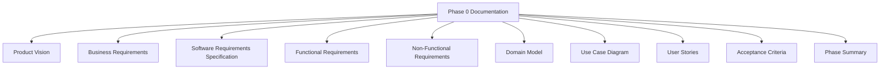
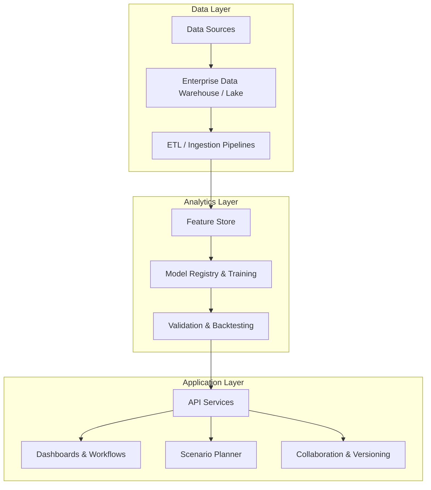
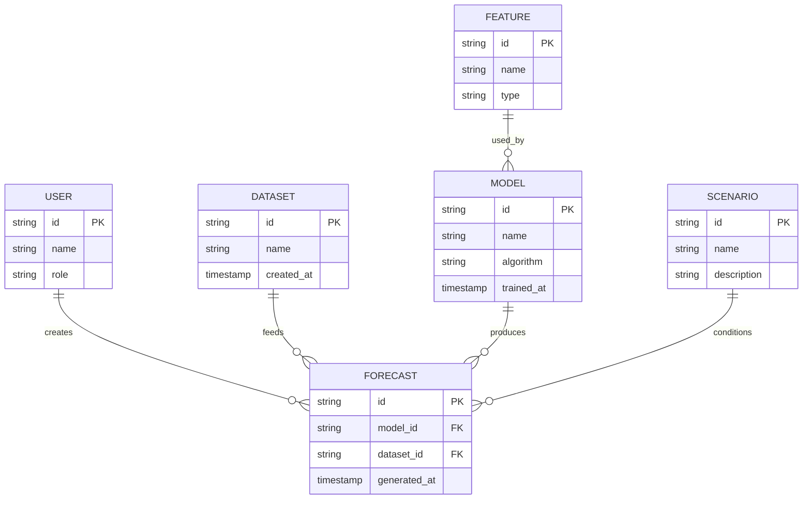
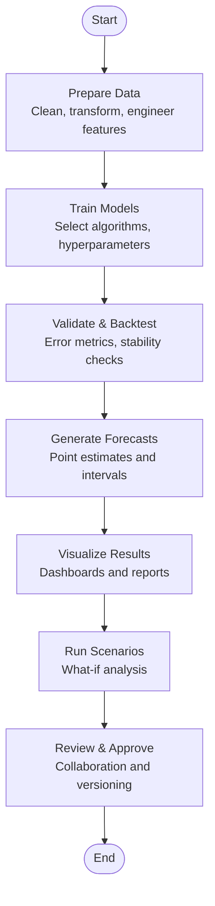
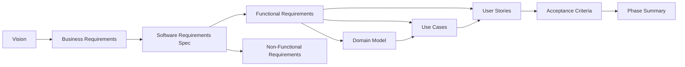

# Project Overview

<cite>
**Referenced Files in This Document**
- [01-product-vision.md](file://docs/phase-0-business-analysis/01-product-vision.md)
- [02-business-requirements.md](file://docs/phase-0-business-analysis/02-business-requirements.md)
- [03-software-requirements-spec.md](file://docs/phase-0-business-analysis/03-software-requirements-spec.md)
- [04-functional-requirements.md](file://docs/phase-0-business-analysis/04-functional-requirements.md)
- [05-non-functional-requirements.md](file://docs/phase-0-business-analysis/05-non-functional-requirements.md)
- [06-domain-model.md](file://docs/phase-0-business-analysis/06-domain-model.md)
- [07-use-case-diagram.md](file://docs/phase-0-business-analysis/07-use-case-diagram.md)
- [08-user-stories.md](file://docs/phase-0-business-analysis/08-user-stories.md)
- [09-acceptance-criteria.md](file://docs/phase-0-business-analysis/09-acceptance-criteria.md)
- [10-phase-summary.md](file://docs/phase-0-business-analysis/10-phase-summary.md)
</cite>

## Table of Contents
1. [Introduction](#introduction)
2. [Project Structure](#project-structure)
3. [Core Components](#core-components)
4. [Architecture Overview](#architecture-overview)
5. [Detailed Component Analysis](#detailed-component-analysis)
6. [Dependency Analysis](#dependency-analysis)
7. [Performance Considerations](#performance-considerations)
8. [Troubleshooting Guide](#troubleshooting-guide)
9. [Conclusion](#conclusion)
10. [Appendices](#appendices)

## Introduction
ForecastIQ is a business forecasting and predictive analytics platform designed to help organizations anticipate demand, optimize resource allocation, and make data-driven decisions with confidence. The platform unifies historical data, advanced modeling, and interactive visualization into a single environment that supports both routine planning and strategic scenario exploration.

Strategic vision:
- Democratize forecasting by making it accessible to business analysts while retaining the depth required by data scientists.
- Provide decision-makers with clear, actionable insights through intuitive dashboards and scenario tools.
- Enable collaborative planning across teams with shared models, annotations, and versioned outputs.

Core value proposition:
- Faster time-to-insight from raw data to forecast and recommendation.
- Improved forecast accuracy via robust modeling options and continuous feedback loops.
- Reduced risk through scenario planning and sensitivity analysis.
- Enhanced collaboration with shared workspaces and auditability.

Target audience:
- Business analysts who need self-service forecasting and reporting without deep coding expertise.
- Data scientists who require reproducible pipelines, model management, and experimentation support.
- Decision-makers who consume forecasts and scenarios to guide strategy and operations.

Business analysis phase introduction:
This documentation originates from the Phase 0 business analysis effort, which established the product vision, stakeholder requirements, functional scope, non-functional constraints, domain concepts, use cases, user stories, acceptance criteria, and a phase summary. These artifacts collectively form the foundation for subsequent design, development, testing, and delivery phases.

Practical examples of how ForecastIQ addresses common forecasting challenges:
- Demand volatility: Use predictive analytics to capture seasonality and external drivers, then validate with backtesting and error metrics.
- Capacity planning: Run “what-if” scenarios (e.g., promotions, supply disruptions) to evaluate capacity needs and mitigate bottlenecks.
- Inventory optimization: Combine forecasts with cost parameters to recommend reorder points and safety stock levels.
- Cross-functional alignment: Share scenario results and assumptions across sales, operations, and finance to align on plans.

[No sources needed since this section provides general guidance]

## Project Structure
The project’s foundational documentation is organized under the Phase 0 business analysis directory. Each document focuses on a specific aspect of the product definition and requirements, ensuring traceability from vision to implementation.

**Diagram sources**
- [01-product-vision.md](file://docs/phase-0-business-analysis/01-product-vision.md)
- [02-business-requirements.md](file://docs/phase-0-business-analysis/02-business-requirements.md)
- [03-software-requirements-spec.md](file://docs/phase-0-business-analysis/03-software-requirements-spec.md)
- [04-functional-requirements.md](file://docs/phase-0-business-analysis/04-functional-requirements.md)
- [05-non-functional-requirements.md](file://docs/phase-0-business-analysis/05-non-functional-requirements.md)
- [06-domain-model.md](file://docs/phase-0-business-analysis/06-domain-model.md)
- [07-use-case-diagram.md](file://docs/phase-0-business-analysis/07-use-case-diagram.md)
- [08-user-stories.md](file://docs/phase-0-business-analysis/08-user-stories.md)
- [09-acceptance-criteria.md](file://docs/phase-0-business-analysis/09-acceptance-criteria.md)
- [10-phase-summary.md](file://docs/phase-0-business-analysis/10-phase-summary.md)

**Section sources**
- [01-product-vision.md](file://docs/phase-0-business-analysis/01-product-vision.md)
- [02-business-requirements.md](file://docs/phase-0-business-analysis/02-business-requirements.md)
- [03-software-requirements-spec.md](file://docs/phase-0-business-analysis/03-software-requirements-spec.md)
- [04-functional-requirements.md](file://docs/phase-0-business-analysis/04-functional-requirements.md)
- [05-non-functional-requirements.md](file://docs/phase-0-business-analysis/05-non-functional-requirements.md)
- [06-domain-model.md](file://docs/phase-0-business-analysis/06-domain-model.md)
- [07-use-case-diagram.md](file://docs/phase-0-business-analysis/07-use-case-diagram.md)
- [08-user-stories.md](file://docs/phase-0-business-analysis/08-user-stories.md)
- [09-acceptance-criteria.md](file://docs/phase-0-business-analysis/09-acceptance-criteria.md)
- [10-phase-summary.md](file://docs/phase-0-business-analysis/10-phase-summary.md)

## Core Components
ForecastIQ centers around four primary capabilities that together deliver end-to-end forecasting and planning:

- Predictive analytics: Statistical and machine learning models to generate point forecasts and prediction intervals, with feature engineering and validation workflows.
- Business intelligence dashboards: Interactive visualizations for monitoring performance, exploring drivers, and communicating insights to stakeholders.
- Scenario planning: What-if analysis to simulate changes in inputs (e.g., pricing, promotions, lead times) and assess downstream impacts.
- Collaborative tools: Shared workspaces, comments, approvals, and versioning to coordinate cross-functional planning.

These components are defined and scoped in the Phase 0 documents, linking high-level goals to concrete functional and non-functional requirements.

**Section sources**
- [04-functional-requirements.md](file://docs/phase-0-business-analysis/04-functional-requirements.md)
- [05-non-functional-requirements.md](file://docs/phase-0-business-analysis/05-non-functional-requirements.md)
- [08-user-stories.md](file://docs/phase-0-business-analysis/08-user-stories.md)

## Architecture Overview
At a high level, ForecastIQ integrates data ingestion, modeling, visualization, and collaboration layers. The architecture emphasizes modularity, scalability, and usability, enabling both self-service and advanced analytical workflows.

[No sources needed since this diagram shows conceptual workflow, not actual code structure]

## Detailed Component Analysis

### Product Vision and Strategic Positioning
- Purpose: Deliver a unified forecasting and predictive analytics platform tailored for business planning.
- Differentiators: Self-service accessibility, rigorous model governance, scenario-driven planning, and built-in collaboration.
- Success metrics: Forecast accuracy improvements, reduced planning cycle time, increased adoption across roles.

**Section sources**
- [01-product-vision.md](file://docs/phase-0-business-analysis/01-product-vision.md)

### Business Requirements and Stakeholders
- Key stakeholders: Business analysts, data scientists, planners, finance, operations, and executives.
- Business problems addressed: Volatile demand, misaligned plans, slow insight generation, siloed decision-making.
- Outcomes expected: Actionable forecasts, transparent assumptions, faster consensus, measurable impact.

**Section sources**
- [02-business-requirements.md](file://docs/phase-0-business-analysis/02-business-requirements.md)

### Software Requirements Specification
- Scope: End-to-end forecasting lifecycle from data preparation to insight consumption.
- Constraints: Security, compliance, performance targets, integration with existing systems.
- Quality attributes: Reliability, usability, extensibility, maintainability.

**Section sources**
- [03-software-requirements-spec.md](file://docs/phase-0-business-analysis/03-software-requirements-spec.md)
- [05-non-functional-requirements.md](file://docs/phase-0-business-analysis/05-non-functional-requirements.md)

### Functional Requirements and Features
- Predictive analytics: Model selection, training, evaluation, deployment, and monitoring.
- Dashboards: KPIs, trend analysis, driver attribution, drill-downs.
- Scenario planning: Input manipulation, impact assessment, comparison views.
- Collaboration: Comments, approvals, change logs, role-based access.

**Section sources**
- [04-functional-requirements.md](file://docs/phase-0-business-analysis/04-functional-requirements.md)
- [08-user-stories.md](file://docs/phase-0-business-analysis/08-user-stories.md)

### Domain Model and Use Cases
- Core entities: Forecasts, scenarios, features, models, datasets, users, permissions, and audit trails.
- Relationships: Models trained on features; forecasts generated per scenario; users collaborate on artifacts.
- Primary use cases: Create forecast, run scenario, review dashboard, approve plan, monitor drift.

**Diagram sources**
- [06-domain-model.md](file://docs/phase-0-business-analysis/06-domain-model.md)
- [07-use-case-diagram.md](file://docs/phase-0-business-analysis/07-use-case-diagram.md)

**Section sources**
- [06-domain-model.md](file://docs/phase-0-business-analysis/06-domain-model.md)
- [07-use-case-diagram.md](file://docs/phase-0-business-analysis/07-use-case-diagram.md)

### User Stories and Acceptance Criteria
- Representative stories: As a business analyst, I want to build a forecast without writing code; as a data scientist, I want to register and version models; as a planner, I want to compare scenarios side-by-side.
- Acceptance criteria: Define measurable conditions for completion, including accuracy thresholds, performance SLAs, and usability benchmarks.

**Section sources**
- [08-user-stories.md](file://docs/phase-0-business-analysis/08-user-stories.md)
- [09-acceptance-criteria.md](file://docs/phase-0-business-analysis/09-acceptance-criteria.md)

### Process Flow: From Data to Insight
A typical forecasting workflow involves preparing data, training and validating models, generating forecasts, and presenting results through dashboards and scenario tools.

**Diagram sources**
- [04-functional-requirements.md](file://docs/phase-0-business-analysis/04-functional-requirements.md)
- [08-user-stories.md](file://docs/phase-0-business-analysis/08-user-stories.md)

**Section sources**
- [04-functional-requirements.md](file://docs/phase-0-business-analysis/04-functional-requirements.md)
- [08-user-stories.md](file://docs/phase-0-business-analysis/08-user-stories.md)

## Dependency Analysis
The Phase 0 documents exhibit strong traceability:
- Product vision informs business requirements.
- Business requirements drive software and functional specifications.
- Non-functional requirements constrain design and implementation.
- Domain model and use cases ground functional requirements in real-world processes.
- User stories and acceptance criteria operationalize requirements into testable outcomes.
- Phase summary consolidates learnings and sets direction for subsequent phases.

**Diagram sources**
- [01-product-vision.md](file://docs/phase-0-business-analysis/01-product-vision.md)
- [02-business-requirements.md](file://docs/phase-0-business-analysis/02-business-requirements.md)
- [03-software-requirements-spec.md](file://docs/phase-0-business-analysis/03-software-requirements-spec.md)
- [04-functional-requirements.md](file://docs/phase-0-business-analysis/04-functional-requirements.md)
- [05-non-functional-requirements.md](file://docs/phase-0-business-analysis/05-non-functional-requirements.md)
- [06-domain-model.md](file://docs/phase-0-business-analysis/06-domain-model.md)
- [07-use-case-diagram.md](file://docs/phase-0-business-analysis/07-use-case-diagram.md)
- [08-user-stories.md](file://docs/phase-0-business-analysis/08-user-stories.md)
- [09-acceptance-criteria.md](file://docs/phase-0-business-analysis/09-acceptance-criteria.md)
- [10-phase-summary.md](file://docs/phase-0-business-analysis/10-phase-summary.md)

**Section sources**
- [01-product-vision.md](file://docs/phase-0-business-analysis/01-product-vision.md)
- [02-business-requirements.md](file://docs/phase-0-business-analysis/02-business-requirements.md)
- [03-software-requirements-spec.md](file://docs/phase-0-business-analysis/03-software-requirements-spec.md)
- [04-functional-requirements.md](file://docs/phase-0-business-analysis/04-functional-requirements.md)
- [05-non-functional-requirements.md](file://docs/phase-0-business-analysis/05-non-functional-requirements.md)
- [06-domain-model.md](file://docs/phase-0-business-analysis/06-domain-model.md)
- [07-use-case-diagram.md](file://docs/phase-0-business-analysis/07-use-case-diagram.md)
- [08-user-stories.md](file://docs/phase-0-business-analysis/08-user-stories.md)
- [09-acceptance-criteria.md](file://docs/phase-0-business-analysis/09-acceptance-criteria.md)
- [10-phase-summary.md](file://docs/phase-0-business-analysis/10-phase-summary.md)

## Performance Considerations
- Forecast latency: Optimize data pipelines and model serving to meet planning cadence.
- Dashboard responsiveness: Cache aggregations and paginate large result sets.
- Scalability: Horizontal scaling for concurrent scenario runs and multi-tenant usage.
- Monitoring: Track model drift, data quality, and system health to sustain accuracy and reliability.

[No sources needed since this section provides general guidance]

## Troubleshooting Guide
Common issues and resolutions:
- Data quality problems: Implement validation rules, lineage tracking, and alerting on anomalies.
- Model degradation: Schedule retraining, track performance metrics, and roll back to stable versions.
- Slow queries: Index key dimensions, precompute frequent aggregates, and review query patterns.
- Access and permissions: Enforce least privilege, audit access, and resolve conflicts promptly.

[No sources needed since this section provides general guidance]

## Conclusion
ForecastIQ aims to be the central hub for forecasting and predictive analytics across the organization. By combining robust modeling, intuitive dashboards, scenario planning, and collaboration, it empowers analysts, scientists, and decision-makers to act on timely, accurate insights. The Phase 0 business analysis artifacts provide a solid foundation for design and development, ensuring that every feature ties back to clear business value and measurable outcomes.

[No sources needed since this section summarizes without analyzing specific files]

## Appendices
- Glossary: Definitions of key terms such as forecast horizon, prediction interval, scenario, and model drift.
- References: Links to related standards, methodologies, and internal playbooks referenced during Phase 0.

[No sources needed since this section provides general guidance]