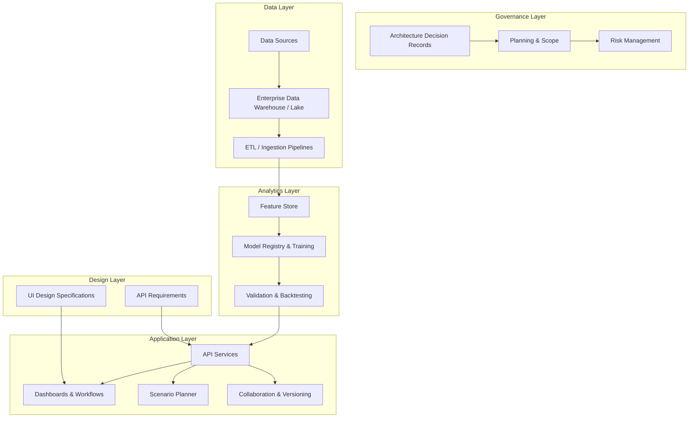
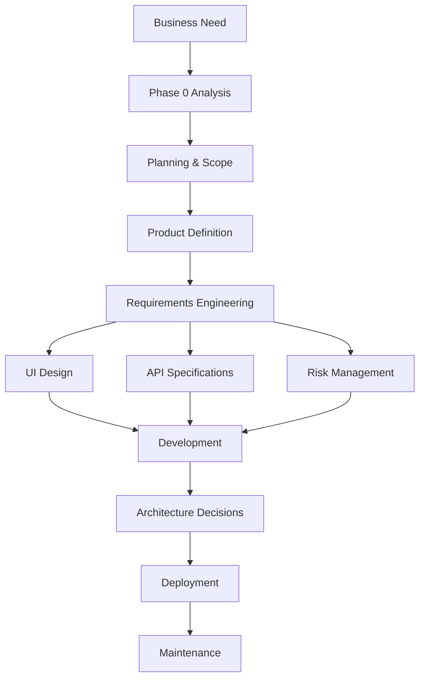
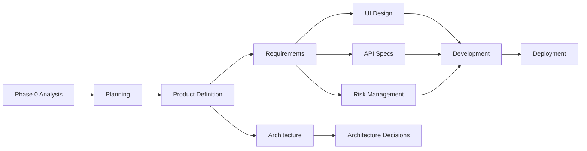

# Project Overview

<cite>
**Referenced Files in This Document**
- [01-product-vision.md](file://docs/phase-0-business-analysis/01-product-vision.md)
- [02-business-requirements.md](file://docs/phase-0-business-analysis/02-business-requirements.md)
- [03-software-requirements-spec.md](file://docs/phase-0-business-analysis/03-software-requirements-spec.md)
- [04-functional-requirements.md](file://docs/phase-0-business-analysis/04-functional-requirements.md)
- [05-non-functional-requirements.md](file://docs/phase-0-business-analysis/05-non-functional-requirements.md)
- [06-domain-model.md](file://docs/phase-0-business-analysis/06-domain-model.md)
- [07-use-case-diagram.md](file://docs/phase-0-business-analysis/07-use-case-diagram.md)
- [08-user-stories.md](file://docs/phase-0-business-analysis/08-user-stories.md)
- [09-acceptance-criteria.md](file://docs/phase-0-business-analysis/09-acceptance-criteria.md)
- [10-phase-summary.md](file://docs/phase-0-business-analysis/10-phase-summary.md)
- [01-scope-levels.md](file://docs/planning/01-scope-levels.md)
- [02-revised-mvp-estimate.md](file://docs/planning/02-revised-mvp-estimate.md)
- [01-product-vision.md](file://docs/product/01-product-vision.md)
- [02-business-requirements.md](file://docs/product/02-business-requirements.md)
- [03-mvp-scope.md](file://docs/product/03-mvp-scope.md)
- [04-personas-and-user-journeys.md](file://docs/product/04-personas-and-user-journeys.md)
- [05-business-rules.md](file://docs/product/05-business-rules.md)
- [06-product-contract.md](file://docs/product/06-product-contract.md)
- [07-glossary.md](file://docs/product/07-glossary.md)
- [01-functional-requirements.md](file://docs/requirements/01-functional-requirements.md)
- [02-non-functional-requirements.md](file://docs/requirements/02-non-functional-requirements.md)
- [03-user-stories.md](file://docs/requirements/03-user-stories.md)
- [04-acceptance-criteria.md](file://docs/requirements/04-acceptance-criteria.md)
- [00-api-requirements.md](file://docs/api/00-api-requirements.md)
- [00-screen-inventory.md](file://docs/ui/00-screen-inventory.md)
- [01-ui-data-requirements.md](file://docs/ui/01-ui-data-requirements.md)
- [02-ui-design-specification.md](file://docs/ui/02-ui-design-specification.md)
- [01-risk-register.md](file://docs/risk/01-risk-register.md)
- [00-phase-0-architecture-constraints.md](file://docs/architecture/00-phase-0-architecture-constraints.md)
- [ADR-001-modular-monolith-for-mvp.md](file://docs/adr/ADR-001-modular-monolith-for-mvp.md)
- [ADR-002-provider-scope.md](file://docs/adr/ADR-002-provider-scope.md)
- [ADR-003-observation-source-strategy.md](file://docs/adr/ADR-003-observation-source-strategy.md)
- [ADR-004-postgresql-over-timescaledb.md](file://docs/adr/ADR-004-postgresql-over-timescaledb.md)
- [ADR-005-scheduler-approach.md](file://docs/adr/ADR-005-scheduler-approach.md)
- [ADR-006-event-bus-deferral.md](file://docs/adr/ADR-006-event-bus-deferral.md)
- [ADR-007-kubernetes-deferral.md](file://docs/adr/ADR-007-kubernetes-deferral.md)
- [ADR-008-authentication-approach.md](file://docs/adr/ADR-008-authentication-approach.md)
- [ADR-009-ownership-workspace-model.md](file://docs/adr/ADR-009-ownership-workspace-model.md)
- [ADR-010-composite-scoring-methodology.md](file://docs/adr/ADR-010-composite-scoring-methodology.md)
- [ADR-011-raw-payload-retention.md](file://docs/adr/ADR-011-raw-payload-retention.md)
- [ADR-012-forecast-collection-lineage.md](file://docs/adr/ADR-012-forecast-collection-lineage.md)
</cite>

## Update Summary
**Changes Made**
- Updated project structure to reflect comprehensive documentation organization across multiple specialized directories
- Added new sections covering planning, product definition, requirements, UI design, API specifications, risk management, and architecture decisions
- Enhanced business analysis phase introduction to include all newly documented areas
- Expanded core components section to encompass the full scope of planned functionality
- Updated dependency analysis to show relationships between all documentation categories

## Table of Contents
1. [Introduction](#introduction)
2. [Project Structure](#project-structure)
3. [Core Components](#core-components)
4. [Architecture Overview](#architecture-overview)
5. [Comprehensive Documentation Framework](#comprehensive-documentation-framework)
6. [Planning and Scope Management](#planning-and-scope-management)
7. [Product Definition and Strategy](#product-definition-and-strategy)
8. [Requirements Engineering](#requirements-engineering)
9. [User Interface Design](#user-interface-design)
10. [API Specifications](#api-specifications)
11. [Risk Management](#risk-management)
12. [Architecture Decision Records](#architecture-decision-records)
13. [Detailed Component Analysis](#detailed-component-analysis)
14. [Dependency Analysis](#dependency-analysis)
15. [Performance Considerations](#performance-considerations)
16. [Troubleshooting Guide](#troubleshooting-guide)
17. [Conclusion](#conclusion)
18. [Appendices](#appendices)

## Introduction
ForecastIQ is a comprehensive business forecasting and predictive analytics platform designed to help organizations anticipate demand, optimize resource allocation, and make data-driven decisions with confidence. The platform unifies historical data, advanced modeling, and interactive visualization into a single environment that supports both routine planning and strategic scenario exploration.

**Updated** The project now features a comprehensive documentation structure that spans planning, requirements engineering, UI design, API specifications, risk management, and architectural decision-making, ensuring complete traceability from business vision to technical implementation.

Strategic vision:
- Democratize forecasting by making it accessible to business analysts while retaining the depth required by data scientists.
- Provide decision-makers with clear, actionable insights through intuitive dashboards and scenario tools.
- Enable collaborative planning across teams with shared models, annotations, and versioned outputs.
- Establish robust governance through comprehensive documentation and architectural decision records.

Core value proposition:
- Faster time-to-insight from raw data to forecast and recommendation.
- Improved forecast accuracy via robust modeling options and continuous feedback loops.
- Reduced risk through scenario planning and sensitivity analysis.
- Enhanced collaboration with shared workspaces and auditability.
- Comprehensive project governance through structured documentation and decision tracking.

Target audience:
- Business analysts who need self-service forecasting and reporting without deep coding expertise.
- Data scientists who require reproducible pipelines, model management, and experimentation support.
- Decision-makers who consume forecasts and scenarios to guide strategy and operations.
- Project stakeholders requiring visibility into scope, risks, and architectural decisions.

Business analysis phase introduction:
This documentation originates from the Phase 0 business analysis effort, which established the product vision, stakeholder requirements, functional scope, non-functional constraints, domain concepts, use cases, user stories, acceptance criteria, and a phase summary. **The project has since evolved to include comprehensive documentation across planning, product definition, requirements engineering, UI design, API specifications, risk management, and architecture decision records.** These artifacts collectively form the foundation for subsequent design, development, testing, and delivery phases.

Practical examples of how ForecastIQ addresses common forecasting challenges:
- Demand volatility: Use predictive analytics to capture seasonality and external drivers, then validate with backtesting and error metrics.
- Capacity planning: Run "what-if" scenarios (e.g., promotions, supply disruptions) to evaluate capacity needs and mitigate bottlenecks.
- Inventory optimization: Combine forecasts with cost parameters to recommend reorder points and safety stock levels.
- Cross-functional alignment: Share scenario results and assumptions across sales, operations, and finance to align on plans.
- Risk mitigation: Track and manage project risks through comprehensive risk registers and mitigation strategies.

## Project Structure
The project's comprehensive documentation is organized into specialized directories, each focusing on specific aspects of the product lifecycle and development process. This structure ensures complete traceability from business vision to technical implementation while maintaining clear separation of concerns.

```mermaid
graph TB
A["ForecastIQ Documentation"] --> B["Phase 0 Business Analysis"]
A --> C["Planning"]
A --> D["Product Definition"]
A --> E["Requirements"]
A --> F["UI Design"]
A --> G["API Specifications"]
A --> H["Risk Management"]
A --> I["Architecture"]
A --> J["Architecture Decision Records"]
B --> B1["Product Vision"]
B --> B2["Business Requirements"]
B --> B3["Software Requirements Spec"]
B --> B4["Functional Requirements"]
B --> B5["Non-Functional Requirements"]
B --> B6["Domain Model"]
B --> B7["Use Case Diagram"]
B --> B8["User Stories"]
B --> B9["Acceptance Criteria"]
B --> B10["Phase Summary"]
C --> C1["Scope Levels"]
C --> C2["MVP Estimates"]
D --> D1["Product Vision"]
D --> D2["Business Requirements"]
D --> D3["MVP Scope"]
D --> D4["Personas & User Journeys"]
D --> D5["Business Rules"]
D --> D6["Product Contract"]
D --> D7["Glossary"]
E --> E1["Functional Requirements"]
E --> E2["Non-Functional Requirements"]
E --> E3["User Stories"]
E --> E4["Acceptance Criteria"]
F --> F1["Screen Inventory"]
F --> F2["UI Data Requirements"]
F --> F3["UI Design Specification"]
G --> G1["API Requirements"]
H --> H1["Risk Register"]
I --> I1["Architecture Constraints"]
J --> J1["ADR-001 to ADR-012"]
```

**Diagram sources**
- [01-product-vision.md](file://docs/phase-0-business-analysis/01-product-vision.md)
- [01-scope-levels.md](file://docs/planning/01-scope-levels.md)
- [01-product-vision.md](file://docs/product/01-product-vision.md)
- [01-functional-requirements.md](file://docs/requirements/01-functional-requirements.md)
- [00-screen-inventory.md](file://docs/ui/00-screen-inventory.md)
- [00-api-requirements.md](file://docs/api/00-api-requirements.md)
- [01-risk-register.md](file://docs/risk/01-risk-register.md)
- [00-phase-0-architecture-constraints.md](file://docs/architecture/00-phase-0-architecture-constraints.md)
- [ADR-001-modular-monolith-for-mvp.md](file://docs/adr/ADR-001-modular-monolith-for-mvp.md)

**Section sources**
- [01-product-vision.md](file://docs/phase-0-business-analysis/01-product-vision.md)
- [01-scope-levels.md](file://docs/planning/01-scope-levels.md)
- [01-product-vision.md](file://docs/product/01-product-vision.md)
- [01-functional-requirements.md](file://docs/requirements/01-functional-requirements.md)
- [00-screen-inventory.md](file://docs/ui/00-screen-inventory.md)
- [00-api-requirements.md](file://docs/api/00-api-requirements.md)
- [01-risk-register.md](file://docs/risk/01-risk-register.md)
- [00-phase-0-architecture-constraints.md](file://docs/architecture/00-phase-0-architecture-constraints.md)
- [ADR-001-modular-monolith-for-mvp.md](file://docs/adr/ADR-001-modular-monolith-for-mvp.md)

## Core Components
ForecastIQ centers around five primary capability areas that together deliver end-to-end forecasting and planning with comprehensive project governance:

- Predictive analytics: Statistical and machine learning models to generate point forecasts and prediction intervals, with feature engineering and validation workflows.
- Business intelligence dashboards: Interactive visualizations for monitoring performance, exploring drivers, and communicating insights to stakeholders.
- Scenario planning: What-if analysis to simulate changes in inputs (e.g., pricing, promotions, lead times) and assess downstream impacts.
- Collaborative tools: Shared workspaces, comments, approvals, and versioning to coordinate cross-functional planning.
- Project governance: Comprehensive documentation, risk management, and architectural decision tracking to ensure project success and maintainability.

These components are defined and scoped across multiple documentation layers, linking high-level goals to concrete functional and non-functional requirements while maintaining clear traceability throughout the development lifecycle.

**Section sources**
- [04-functional-requirements.md](file://docs/phase-0-business-analysis/04-functional-requirements.md)
- [05-non-functional-requirements.md](file://docs/phase-0-business-analysis/05-non-functional-requirements.md)
- [08-user-stories.md](file://docs/phase-0-business-analysis/08-user-stories.md)
- [01-scope-levels.md](file://docs/planning/01-scope-levels.md)
- [01-risk-register.md](file://docs/risk/01-risk-register.md)

## Architecture Overview
At a high level, ForecastIQ integrates data ingestion, modeling, visualization, and collaboration layers with comprehensive governance and decision tracking. The architecture emphasizes modularity, scalability, usability, and maintainability, enabling both self-service and advanced analytical workflows while supporting informed architectural decisions.

**Diagram sources**
- [ADR-001-modular-monolith-for-mvp.md](file://docs/adr/ADR-001-modular-monolith-for-mvp.md)
- [01-scope-levels.md](file://docs/planning/01-scope-levels.md)
- [01-risk-register.md](file://docs/risk/01-risk-register.md)
- [00-screen-inventory.md](file://docs/ui/00-screen-inventory.md)
- [00-api-requirements.md](file://docs/api/00-api-requirements.md)

## Comprehensive Documentation Framework
The ForecastIQ project employs a comprehensive documentation framework that spans the entire product lifecycle, ensuring complete traceability and governance from initial concept through deployment and maintenance.

### Documentation Categories
The documentation is organized into seven primary categories, each serving distinct purposes in the product development process:

1. **Phase 0 Business Analysis**: Foundational analysis establishing product vision, stakeholder requirements, and initial scope
2. **Planning**: Strategic planning including scope levels and MVP estimates
3. **Product Definition**: Detailed product specifications, personas, and business rules
4. **Requirements Engineering**: Comprehensive functional and non-functional requirements with user stories
5. **UI Design**: User interface specifications and design requirements
6. **API Specifications**: Technical interface definitions and integration requirements
7. **Risk Management**: Comprehensive risk identification and mitigation strategies
8. **Architecture**: Architectural constraints and decision records

**Diagram sources**
- [01-product-vision.md](file://docs/phase-0-business-analysis/01-product-vision.md)
- [01-scope-levels.md](file://docs/planning/01-scope-levels.md)
- [01-product-vision.md](file://docs/product/01-product-vision.md)
- [01-functional-requirements.md](file://docs/requirements/01-functional-requirements.md)
- [00-screen-inventory.md](file://docs/ui/00-screen-inventory.md)
- [00-api-requirements.md](file://docs/api/00-api-requirements.md)
- [01-risk-register.md](file://docs/risk/01-risk-register.md)
- [ADR-001-modular-monolith-for-mvp.md](file://docs/adr/ADR-001-modular-monolith-for-mvp.md)

## Planning and Scope Management
The planning phase establishes clear scope boundaries and provides realistic estimates for project delivery. This includes defining multiple scope levels and revised MVP estimates to ensure achievable project milestones.

Key planning documents include:
- Scope levels definition for phased delivery
- Revised MVP estimates providing realistic timelines and resource requirements
- Strategic planning aligned with business objectives and stakeholder expectations

**Section sources**
- [01-scope-levels.md](file://docs/planning/01-scope-levels.md)
- [02-revised-mvp-estimate.md](file://docs/planning/02-revised-mvp-estimate.md)

## Product Definition and Strategy
The product definition layer provides detailed specifications for the ForecastIQ platform, including comprehensive product vision, business requirements, MVP scope definition, persona development, and business rule establishment.

Core product documents:
- Product vision and strategic positioning
- Detailed business requirements and stakeholder analysis
- MVP scope definition for phased delivery
- Persona development and user journey mapping
- Business rules and operational constraints
- Product contract establishing commitments and expectations
- Comprehensive glossary for consistent terminology

**Section sources**
- [01-product-vision.md](file://docs/product/01-product-vision.md)
- [02-business-requirements.md](file://docs/product/02-business-requirements.md)
- [03-mvp-scope.md](file://docs/product/03-mvp-scope.md)
- [04-personas-and-user-journeys.md](file://docs/product/04-personas-and-user-journeys.md)
- [05-business-rules.md](file://docs/product/05-business-rules.md)
- [06-product-contract.md](file://docs/product/06-product-contract.md)
- [07-glossary.md](file://docs/product/07-glossary.md)

## Requirements Engineering
The requirements engineering phase transforms business needs into detailed technical specifications, ensuring clear understanding and measurable outcomes for all stakeholders.

Comprehensive requirements documentation includes:
- Functional requirements detailing system capabilities and behaviors
- Non-functional requirements specifying quality attributes and constraints
- User stories capturing user perspectives and expected interactions
- Acceptance criteria providing measurable completion conditions

**Section sources**
- [01-functional-requirements.md](file://docs/requirements/01-functional-requirements.md)
- [02-non-functional-requirements.md](file://docs/requirements/02-non-functional-requirements.md)
- [03-user-stories.md](file://docs/requirements/03-user-stories.md)
- [04-acceptance-criteria.md](file://docs/requirements/04-acceptance-criteria.md)

## User Interface Design
The UI design specification defines the user experience architecture, screen layouts, and interaction patterns for the ForecastIQ platform, ensuring intuitive and efficient user interfaces.

Key UI design documents:
- Screen inventory defining all user interface components
- UI data requirements specifying data presentation needs
- Comprehensive UI design specification with layout and interaction guidelines

**Section sources**
- [00-screen-inventory.md](file://docs/ui/00-screen-inventory.md)
- [01-ui-data-requirements.md](file://docs/ui/01-ui-data-requirements.md)
- [02-ui-design-specification.md](file://docs/ui/02-ui-design-specification.md)

## API Specifications
The API requirements document defines the technical interfaces for system integration, ensuring consistent and well-documented APIs for internal and external consumers.

**Section sources**
- [00-api-requirements.md](file://docs/api/00-api-requirements.md)

## Risk Management
Comprehensive risk management ensures proactive identification, assessment, and mitigation of project risks throughout the development lifecycle.

**Section sources**
- [01-risk-register.md](file://docs/risk/01-risk-register.md)

## Architecture Decision Records
Architecture Decision Records (ADRs) provide formal documentation of significant architectural choices, ensuring transparency and maintainability of architectural decisions.

Key architectural decisions include:
- Modular monolith approach for MVP development
- Provider scope and integration strategy
- Observation source methodology
- Database technology selection (PostgreSQL over TimescaleDB)
- Scheduler implementation approach
- Event bus deferral strategy
- Kubernetes deployment deferral
- Authentication mechanism selection
- Ownership and workspace model
- Composite scoring methodology
- Raw payload retention policy
- Forecast collection lineage tracking

**Section sources**
- [ADR-001-modular-monolith-for-mvp.md](file://docs/adr/ADR-001-modular-monolith-for-mvp.md)
- [ADR-002-provider-scope.md](file://docs/adr/ADR-002-provider-scope.md)
- [ADR-003-observation-source-strategy.md](file://docs/adr/ADR-003-observation-source-strategy.md)
- [ADR-004-postgresql-over-timescaledb.md](file://docs/adr/ADR-004-postgresql-over-timescaledb.md)
- [ADR-005-scheduler-approach.md](file://docs/adr/ADR-005-scheduler-approach.md)
- [ADR-006-event-bus-deferral.md](file://docs/adr/ADR-006-event-bus-deferral.md)
- [ADR-007-kubernetes-deferral.md](file://docs/adr/ADR-007-kubernetes-deferral.md)
- [ADR-008-authentication-approach.md](file://docs/adr/ADR-008-authentication-approach.md)
- [ADR-009-ownership-workspace-model.md](file://docs/adr/ADR-009-ownership-workspace-model.md)
- [ADR-010-composite-scoring-methodology.md](file://docs/adr/ADR-010-composite-scoring-methodology.md)
- [ADR-011-raw-payload-retention.md](file://docs/adr/ADR-011-raw-payload-retention.md)
- [ADR-012-forecast-collection-lineage.md](file://docs/adr/ADR-012-forecast-collection-lineage.md)

## Detailed Component Analysis

### Phase 0 Business Analysis Foundation
The Phase 0 business analysis established the foundational understanding of ForecastIQ's purpose, scope, and requirements, providing the basis for all subsequent development activities.

**Updated** The Phase 0 analysis has been enhanced with comprehensive documentation across planning, product definition, requirements, UI design, API specifications, risk management, and architecture decisions, creating a complete project governance framework.

Key Phase 0 deliverables:
- Product vision and strategic positioning
- Business requirements and stakeholder analysis
- Software requirements specification
- Functional and non-functional requirements
- Domain model and use case definitions
- User stories and acceptance criteria
- Phase summary and lessons learned

**Section sources**
- [01-product-vision.md](file://docs/phase-0-business-analysis/01-product-vision.md)
- [02-business-requirements.md](file://docs/phase-0-business-analysis/02-business-requirements.md)
- [03-software-requirements-spec.md](file://docs/phase-0-business-analysis/03-software-requirements-spec.md)
- [04-functional-requirements.md](file://docs/phase-0-business-analysis/04-functional-requirements.md)
- [05-non-functional-requirements.md](file://docs/phase-0-business-analysis/05-non-functional-requirements.md)
- [06-domain-model.md](file://docs/phase-0-business-analysis/06-domain-model.md)
- [07-use-case-diagram.md](file://docs/phase-0-business-analysis/07-use-case-diagram.md)
- [08-user-stories.md](file://docs/phase-0-business-analysis/08-user-stories.md)
- [09-acceptance-criteria.md](file://docs/phase-0-business-analysis/09-acceptance-criteria.md)
- [10-phase-summary.md](file://docs/phase-0-business-analysis/10-phase-summary.md)

### Planning and Scope Management
The planning phase provides strategic direction and realistic estimates for project delivery, ensuring achievable milestones and resource allocation.

**Section sources**
- [01-scope-levels.md](file://docs/planning/01-scope-levels.md)
- [02-revised-mvp-estimate.md](file://docs/planning/02-revised-mvp-estimate.md)

### Product Definition and Strategy
The product definition layer establishes comprehensive specifications for the ForecastIQ platform, including detailed business requirements, user personas, and operational constraints.

**Section sources**
- [01-product-vision.md](file://docs/product/01-product-vision.md)
- [02-business-requirements.md](file://docs/product/02-business-requirements.md)
- [03-mvp-scope.md](file://docs/product/03-mvp-scope.md)
- [04-personas-and-user-journeys.md](file://docs/product/04-personas-and-user-journeys.md)
- [05-business-rules.md](file://docs/product/05-business-rules.md)
- [06-product-contract.md](file://docs/product/06-product-contract.md)
- [07-glossary.md](file://docs/product/07-glossary.md)

### Requirements Engineering
The requirements engineering phase transforms business needs into detailed technical specifications with comprehensive user stories and acceptance criteria.

**Section sources**
- [01-functional-requirements.md](file://docs/requirements/01-functional-requirements.md)
- [02-non-functional-requirements.md](file://docs/requirements/02-non-functional-requirements.md)
- [03-user-stories.md](file://docs/requirements/03-user-stories.md)
- [04-acceptance-criteria.md](file://docs/requirements/04-acceptance-criteria.md)

### User Interface Design
The UI design specification defines comprehensive user experience architecture and interaction patterns for optimal usability.

**Section sources**
- [00-screen-inventory.md](file://docs/ui/00-screen-inventory.md)
- [01-ui-data-requirements.md](file://docs/ui/01-ui-data-requirements.md)
- [02-ui-design-specification.md](file://docs/ui/02-ui-design-specification.md)

### API Specifications
The API requirements document ensures consistent and well-documented technical interfaces for system integration.

**Section sources**
- [00-api-requirements.md](file://docs/api/00-api-requirements.md)

### Risk Management
Comprehensive risk management provides proactive identification and mitigation strategies for project success.

**Section sources**
- [01-risk-register.md](file://docs/risk/01-risk-register.md)

### Architecture Decision Records
Architecture Decision Records provide formal documentation of significant architectural choices and their rationale.

**Section sources**
- [ADR-001-modular-monolith-for-mvp.md](file://docs/adr/ADR-001-modular-monolith-for-mvp.md)
- [ADR-002-provider-scope.md](file://docs/adr/ADR-002-provider-scope.md)
- [ADR-003-observation-source-strategy.md](file://docs/adr/ADR-003-observation-source-strategy.md)
- [ADR-004-postgresql-over-timescaledb.md](file://docs/adr/ADR-004-postgresql-over-timescaledb.md)
- [ADR-005-scheduler-approach.md](file://docs/adr/ADR-005-scheduler-approach.md)
- [ADR-006-event-bus-deferral.md](file://docs/adr/ADR-006-event-bus-deferral.md)
- [ADR-007-kubernetes-deferral.md](file://docs/adr/ADR-007-kubernetes-deferral.md)
- [ADR-008-authentication-approach.md](file://docs/adr/ADR-008-authentication-approach.md)
- [ADR-009-ownership-workspace-model.md](file://docs/adr/ADR-009-ownership-workspace-model.md)
- [ADR-010-composite-scoring-methodology.md](file://docs/adr/ADR-010-composite-scoring-methodology.md)
- [ADR-011-raw-payload-retention.md](file://docs/adr/ADR-011-raw-payload-retention.md)
- [ADR-012-forecast-collection-lineage.md](file://docs/adr/ADR-012-forecast-collection-lineage.md)

## Dependency Analysis
The comprehensive documentation framework exhibits strong traceability across all project phases and components:

**Updated** The documentation structure now encompasses planning, product definition, requirements engineering, UI design, API specifications, risk management, and architecture decisions, creating a complete governance framework.

Key dependencies:
- Phase 0 business analysis informs all subsequent planning and product definition
- Planning documents establish scope boundaries and realistic estimates
- Product definition drives detailed requirements engineering
- Requirements inform UI design and API specifications
- Risk management provides ongoing project governance
- Architecture decisions guide technical implementation
- All components maintain traceability back to business objectives

**Diagram sources**
- [01-product-vision.md](file://docs/phase-0-business-analysis/01-product-vision.md)
- [01-scope-levels.md](file://docs/planning/01-scope-levels.md)
- [01-product-vision.md](file://docs/product/01-product-vision.md)
- [01-functional-requirements.md](file://docs/requirements/01-functional-requirements.md)
- [00-screen-inventory.md](file://docs/ui/00-screen-inventory.md)
- [00-api-requirements.md](file://docs/api/00-api-requirements.md)
- [01-risk-register.md](file://docs/risk/01-risk-register.md)
- [ADR-001-modular-monolith-for-mvp.md](file://docs/adr/ADR-001-modular-monolith-for-mvp.md)

**Section sources**
- [01-product-vision.md](file://docs/phase-0-business-analysis/01-product-vision.md)
- [01-scope-levels.md](file://docs/planning/01-scope-levels.md)
- [01-product-vision.md](file://docs/product/01-product-vision.md)
- [01-functional-requirements.md](file://docs/requirements/01-functional-requirements.md)
- [00-screen-inventory.md](file://docs/ui/00-screen-inventory.md)
- [00-api-requirements.md](file://docs/api/00-api-requirements.md)
- [01-risk-register.md](file://docs/risk/01-risk-register.md)
- [ADR-001-modular-monolith-for-mvp.md](file://docs/adr/ADR-001-modular-monolith-for-mvp.md)

## Performance Considerations
- Forecast latency: Optimize data pipelines and model serving to meet planning cadence.
- Dashboard responsiveness: Cache aggregations and paginate large result sets.
- Scalability: Horizontal scaling for concurrent scenario runs and multi-tenant usage.
- Monitoring: Track model drift, data quality, and system health to sustain accuracy and reliability.
- Documentation performance: Maintain comprehensive yet accessible documentation for quick reference during development.

## Troubleshooting Guide
Common issues and resolutions:
- Data quality problems: Implement validation rules, lineage tracking, and alerting on anomalies.
- Model degradation: Schedule retraining, track performance metrics, and roll back to stable versions.
- Slow queries: Index key dimensions, precompute frequent aggregates, and review query patterns.
- Access and permissions: Enforce least privilege, audit access, and resolve conflicts promptly.
- Documentation inconsistencies: Regular reviews and updates to maintain accuracy across all documentation layers.
- Architecture decision conflicts: Reference ADRs for guidance on established architectural patterns and constraints.

## Conclusion
ForecastIQ aims to be the central hub for forecasting and predictive analytics across the organization. By combining robust modeling, intuitive dashboards, scenario planning, collaboration, and comprehensive project governance, it empowers analysts, scientists, and decision-makers to act on timely, accurate insights. 

**Updated** The comprehensive documentation framework spanning planning, product definition, requirements engineering, UI design, API specifications, risk management, and architecture decisions provides a solid foundation for design and development, ensuring that every feature ties back to clear business value and measurable outcomes while maintaining complete traceability and governance throughout the project lifecycle.

## Appendices
- Glossary: Definitions of key terms such as forecast horizon, prediction interval, scenario, and model drift.
- References: Links to related standards, methodologies, and internal playbooks referenced during Phase 0.
- Documentation Index: Complete index of all documentation files and their relationships.
- Architecture Decision Index: Summary of all architectural decisions and their rationales.
- Risk Register Summary: Overview of identified risks and mitigation strategies.