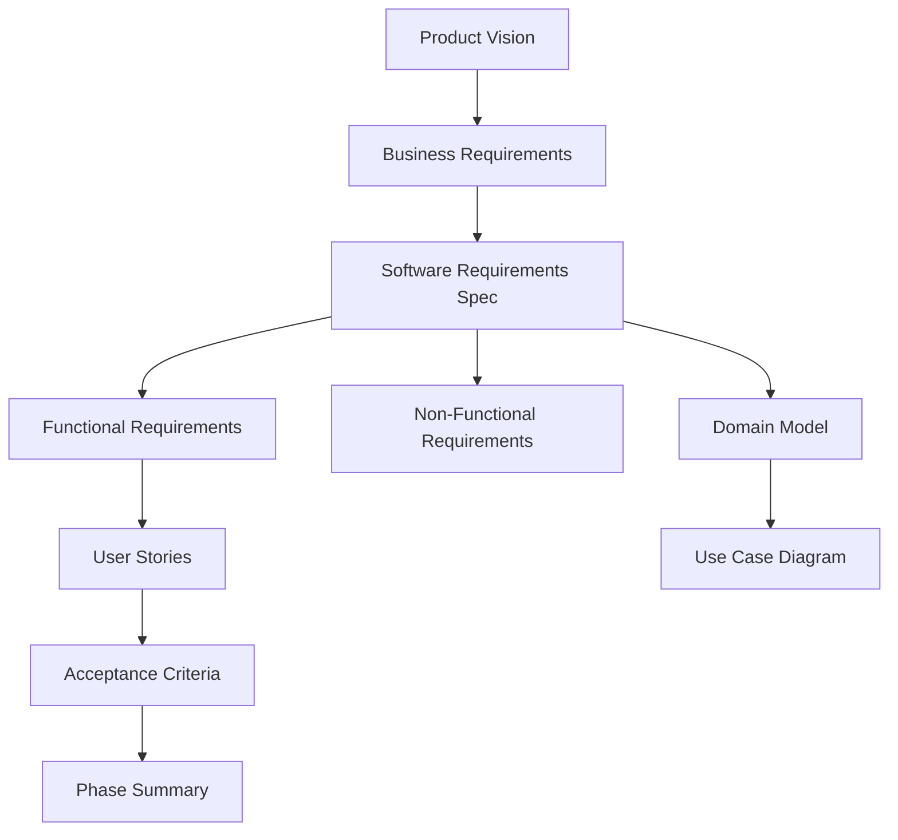
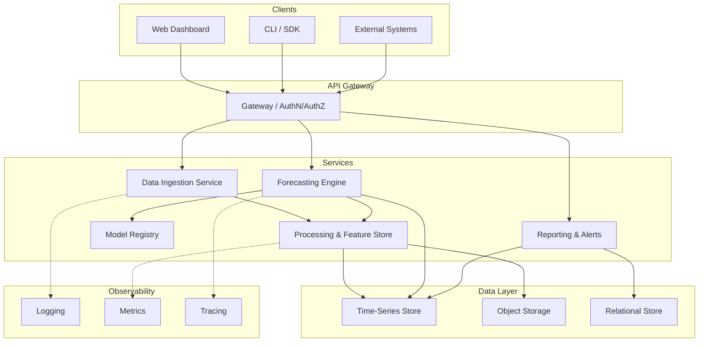
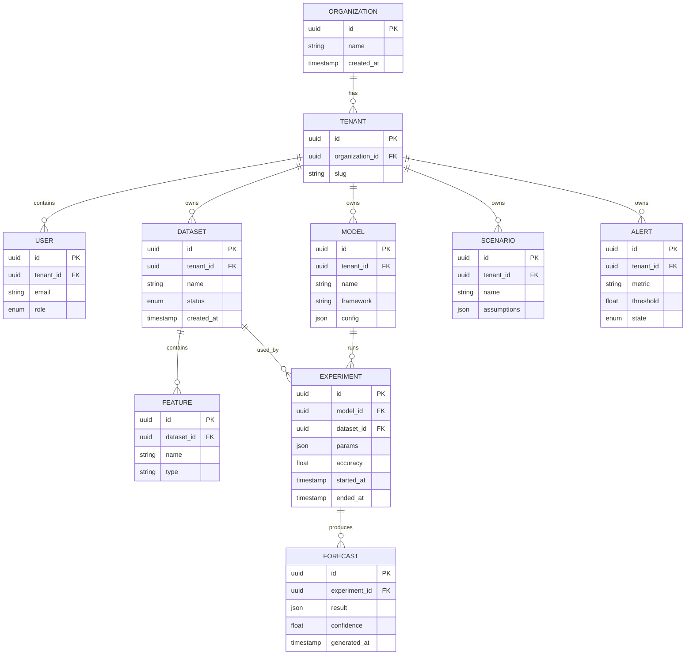
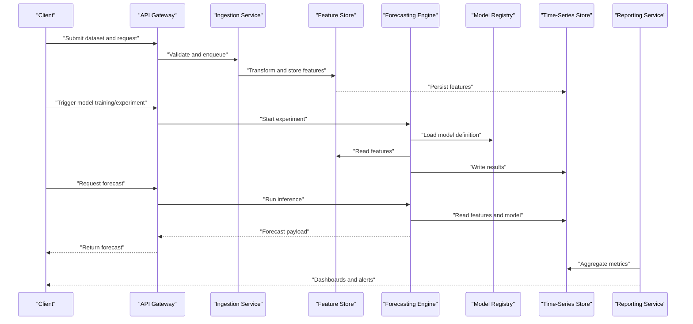
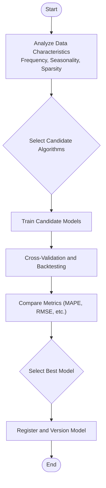
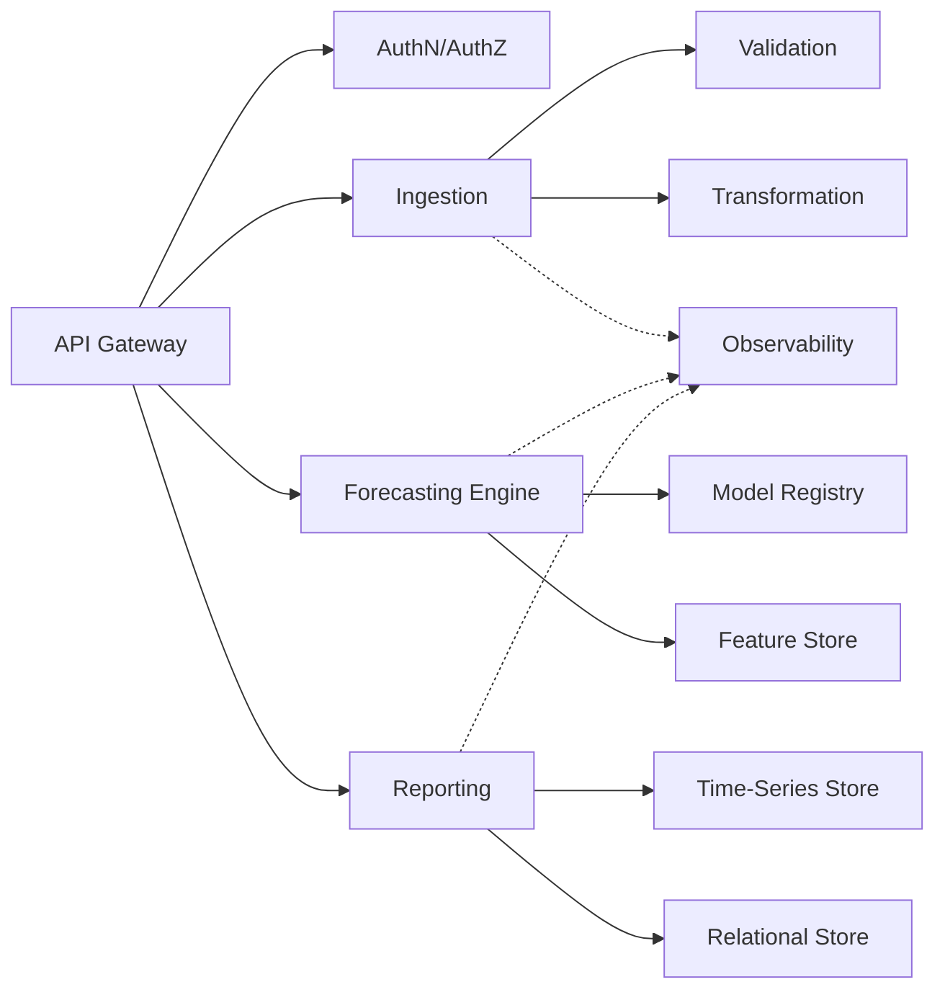

# System Architecture & Domain Model

<cite>
**Referenced Files in This Document**
- [01-product-vision.md](file://docs/phase-0-business-analysis/01-product-vision.md)
- [02-business-requirements.md](file://docs/phase-0-business-analysis/02-business-requirements.md)
- [03-software-requirements-spec.md](file://docs/phase-0-business-analysis/03-software-requirements-spec.md)
- [04-functional-requirements.md](file://docs/phase-0-business-analysis/04-functional-requirements.md)
- [05-non-functional-requirements.md](file://docs/phase-0-business-analysis/05-non-functional-requirements.md)
- [06-domain-model.md](file://docs/phase-0-business-analysis/06-domain-model.md)
- [07-use-case-diagram.md](file://docs/phase-0-business-analysis/07-use-case-diagram.md)
- [08-user-stories.md](file://docs/phase-0-business-analysis/08-user-stories.md)
- [09-acceptance-criteria.md](file://docs/phase-0-business-analysis/09-acceptance-criteria.md)
- [10-phase-summary.md](file://docs/phase-0-business-analysis/10-phase-summary.md)
</cite>

## Table of Contents
1. [Introduction](#introduction)
2. [Project Structure](#project-structure)
3. [Core Components](#core-components)
4. [Architecture Overview](#architecture-overview)
5. [Detailed Component Analysis](#detailed-component-analysis)
6. [Dependency Analysis](#dependency-analysis)
7. [Performance Considerations](#performance-considerations)
8. [Troubleshooting Guide](#troubleshooting-guide)
9. [Conclusion](#conclusion)
10. [Appendices](#appendices)

## Introduction
This document presents the architectural design and domain model for ForecastIQ, a forecasting platform. It synthesizes product vision, business and software requirements, functional scope, non-functional targets, domain entities and relationships, use cases, user stories, acceptance criteria, and phase summary to provide a cohesive blueprint for system design, integration points, data flows, and extensibility strategies.

## Project Structure
The project’s architecture is documented across a set of phase-0 business analysis artifacts that collectively define the system’s purpose, scope, constraints, and behavior. The documentation is organized by concern:
- Product vision and strategic context
- Business and software requirements
- Functional specifications and user stories
- Non-functional requirements (performance, security, scalability, reliability)
- Domain model and use case diagrams
- Acceptance criteria and phase summary



[No sources needed since this diagram shows conceptual workflow, not actual code structure]

**Section sources**
- [01-product-vision.md](file://docs/phase-0-business-analysis/01-product-vision.md)
- [02-business-requirements.md](file://docs/phase-0-business-analysis/02-business-requirements.md)
- [03-software-requirements-spec.md](file://docs/phase-0-business-analysis/03-software-requirements-spec.md)
- [04-functional-requirements.md](file://docs/phase-0-business-analysis/04-functional-requirements.md)
- [05-non-functional-requirements.md](file://docs/phase-0-business-analysis/05-non-functional-requirements.md)
- [06-domain-model.md](file://docs/phase-0-business-analysis/06-domain-model.md)
- [07-use-case-diagram.md](file://docs/phase-0-business-analysis/07-use-case-diagram.md)
- [08-user-stories.md](file://docs/phase-0-business-analysis/08-user-stories.md)
- [09-acceptance-criteria.md](file://docs/phase-0-business-analysis/09-acceptance-criteria.md)
- [10-phase-summary.md](file://docs/phase-0-business-analysis/10-phase-summary.md)

## Core Components
ForecastIQ’s core components are derived from the software requirements specification and functional requirements. They include:
- Forecasting Engine: orchestrates model selection, training, validation, and inference
- Data Ingestion Pipeline: ingests, validates, transforms, and stores time-series and feature data
- Model Management: versioning, registry, lifecycle, and deployment of models
- Scenario Builder: defines assumptions, parameters, and what-if scenarios
- Reporting and Visualization: dashboards, exports, and alerting
- User and Access Management: authentication, authorization, and audit trails
- Integration Services: connectors to external data sources and downstream consumers

These components interact via well-defined APIs and event streams, ensuring loose coupling and clear boundaries.

**Section sources**
- [03-software-requirements-spec.md](file://docs/phase-0-business-analysis/03-software-requirements-spec.md)
- [04-functional-requirements.md](file://docs/phase-0-business-analysis/04-functional-requirements.md)

## Architecture Overview
The system follows a modular, service-oriented architecture with clear separation between ingestion, processing, modeling, and presentation layers. Key architectural decisions:
- Event-driven data pipeline for scalable ingestion and transformation
- API-first design for integrations and client applications
- Pluggable model registry to support multiple algorithms and frameworks
- Centralized observability for logging, metrics, and tracing
- Security-by-design with least privilege and secure secrets management



**Diagram sources**
- [03-software-requirements-spec.md](file://docs/phase-0-business-analysis/03-software-requirements-spec.md)
- [04-functional-requirements.md](file://docs/phase-0-business-analysis/04-functional-requirements.md)
- [05-non-functional-requirements.md](file://docs/phase-0-business-analysis/05-non-functional-requirements.md)

## Detailed Component Analysis

### Domain Model
The domain model centers on forecasting artifacts, data assets, and operational entities. Key entities and relationships:
- Organization and Tenant: multi-tenancy boundary
- User and Role: identity and access control
- Dataset: raw or curated input data with lineage
- Feature: engineered attributes derived from datasets
- Model: algorithm definition, configuration, and metadata
- Experiment: run-level details including inputs, outputs, and metrics
- Forecast: generated predictions with confidence intervals
- Scenario: parameter sets and assumptions driving forecasts
- Alert: thresholds and notifications tied to forecast outcomes



**Diagram sources**
- [06-domain-model.md](file://docs/phase-0-business-analysis/06-domain-model.md)

**Section sources**
- [06-domain-model.md](file://docs/phase-0-business-analysis/06-domain-model.md)

### Use Cases and Workflows
Use cases capture actor interactions and workflows across ingestion, modeling, scenario planning, and reporting. Actors include Analyst, Data Engineer, Model Operator, and Admin.

```mermaid
useCaseDiagram
actor "Analyst" as A
actor "Data Engineer" as DE
actor "Model Operator" as MO
actor "Admin" as AD
package "ForecastIQ" {
usecase "Ingest Dataset" as UC1
usecase "Curate Features" as UC2
usecase "Train Model" as UC3
usecase "Run Experiment" as UC4
usecase "Generate Forecast" as UC5
usecase "Define Scenario" as UC6
usecase "View Report" as UC7
usecase "Configure Alerts" as UC8
usecase "Manage Users" as UC9
usecase "Audit Logs" as UC10
}
A --> UC2
A --> UC5
A --> UC6
A --> UC7
DE --> UC1
DE --> UC2
MO --> UC3
MO --> UC4
MO --> UC8
AD --> UC9
AD --> UC10
```

**Diagram sources**
- [07-use-case-diagram.md](file://docs/phase-0-business-analysis/07-use-case-diagram.md)
- [08-user-stories.md](file://docs/phase-0-business-analysis/08-user-stories.md)

**Section sources**
- [07-use-case-diagram.md](file://docs/phase-0-business-analysis/07-use-case-diagram.md)
- [08-user-stories.md](file://docs/phase-0-business-analysis/08-user-stories.md)

### Data Flow: Forecast Generation
End-to-end flow from data ingestion to forecast delivery:



**Diagram sources**
- [03-software-requirements-spec.md](file://docs/phase-0-business-analysis/03-software-requirements-spec.md)
- [04-functional-requirements.md](file://docs/phase-0-business-analysis/04-functional-requirements.md)

### Algorithm Selection Flow
Decision logic for choosing an appropriate forecasting algorithm based on data characteristics and constraints:



**Diagram sources**
- [04-functional-requirements.md](file://docs/phase-0-business-analysis/04-functional-requirements.md)

**Section sources**
- [03-software-requirements-spec.md](file://docs/phase-0-business-analysis/03-software-requirements-spec.md)
- [04-functional-requirements.md](file://docs/phase-0-business-analysis/04-functional-requirements.md)
- [06-domain-model.md](file://docs/phase-0-business-analysis/06-domain-model.md)
- [07-use-case-diagram.md](file://docs/phase-0-business-analysis/07-use-case-diagram.md)
- [08-user-stories.md](file://docs/phase-0-business-analysis/08-user-stories.md)

## Dependency Analysis
Component dependencies reflect the layered architecture and explicit contracts:
- API Gateway depends on Authentication and Authorization services
- Ingestion depends on Validation and Transformation utilities
- Forecasting Engine depends on Model Registry and Feature Store
- Reporting depends on Time-Series and Relational stores
- Observability spans all services via shared logging, metrics, and tracing



**Diagram sources**
- [03-software-requirements-spec.md](file://docs/phase-0-business-analysis/03-software-requirements-spec.md)
- [05-non-functional-requirements.md](file://docs/phase-0-business-analysis/05-non-functional-requirements.md)

**Section sources**
- [03-software-requirements-spec.md](file://docs/phase-0-business-analysis/03-software-requirements-spec.md)
- [05-non-functional-requirements.md](file://docs/phase-0-business-analysis/05-non-functional-requirements.md)

## Performance Considerations
Non-functional requirements define performance benchmarks, scalability limits, and reliability targets:
- Latency: target response times for forecast generation and dashboard queries
- Throughput: ingestion rates and concurrent experiment capacity
- Scalability: horizontal scaling of services and storage tiers
- Reliability: availability targets, recovery objectives, and backup strategies
- Security: encryption at rest/in transit, RBAC, audit logging
- Observability: structured logs, metrics, distributed traces, and alerting

Guidance:
- Implement backpressure and rate limiting in ingestion pipelines
- Cache frequent reads and precompute common aggregations
- Partition datasets and indexes by tenant and time windows
- Use asynchronous jobs for long-running experiments
- Enforce least privilege and rotate secrets regularly

**Section sources**
- [05-non-functional-requirements.md](file://docs/phase-0-business-analysis/05-non-functional-requirements.md)

## Troubleshooting Guide
Operational guidance for diagnosing issues across the platform:
- Ingestion failures: validate schema, check upstream connectivity, inspect error queues
- Training regressions: review experiment diffs, compare metrics, re-run backtests
- Forecast anomalies: verify feature freshness, monitor drift, retrain if necessary
- Reporting gaps: confirm aggregation jobs, check store health, validate filters
- Access issues: audit roles and permissions, verify token validity and scopes

Recommended diagnostics:
- Centralized logging with correlation IDs
- Metrics for queue depth, job durations, and error rates
- Traces spanning ingestion to reporting
- Health checks and readiness probes for services

**Section sources**
- [05-non-functional-requirements.md](file://docs/phase-0-business-analysis/05-non-functional-requirements.md)
- [09-acceptance-criteria.md](file://docs/phase-0-business-analysis/09-acceptance-criteria.md)

## Conclusion
ForecastIQ’s architecture balances modularity, scalability, and observability while enforcing strong security and reliability. The domain model provides a clear foundation for data and forecasting artifacts, and the use cases align system capabilities with user needs. Extensibility is supported through pluggable models, standardized APIs, and event-driven pipelines, enabling future enhancements such as advanced scenario planning, automated model governance, and richer integrations.

[No sources needed since this section summarizes without analyzing specific files]

## Appendices

### Cross-Cutting Concerns
- Authentication and Authorization: centralized identity, RBAC, and session/token management
- Logging and Auditing: structured logs, immutable audit trails, retention policies
- Monitoring and Alerting: SLOs, dashboards, anomaly detection, escalation paths
- Data Governance: lineage, provenance, quality checks, and compliance controls

**Section sources**
- [05-non-functional-requirements.md](file://docs/phase-0-business-analysis/05-non-functional-requirements.md)
- [09-acceptance-criteria.md](file://docs/phase-0-business-analysis/09-acceptance-criteria.md)

### Extensibility and Plugin Architecture
- Model Plugins: standard interfaces for algorithm registration, evaluation, and serialization
- Connector Plugins: adapters for data sources and sinks with schema mapping
- Workflow Extensions: hooks for preprocessing, postprocessing, and custom validations
- API Extensions: versioned endpoints and webhook subscriptions for third-party integrations

**Section sources**
- [03-software-requirements-spec.md](file://docs/phase-0-business-analysis/03-software-requirements-spec.md)
- [04-functional-requirements.md](file://docs/phase-0-business-analysis/04-functional-requirements.md)

### Future Enhancement Paths
- Advanced scenario simulation and Monte Carlo methods
- Automated model monitoring and drift detection
- Collaborative notebooks and reproducible experiment tracking
- Multi-cloud deployment and edge inference options

**Section sources**
- [10-phase-summary.md](file://docs/phase-0-business-analysis/10-phase-summary.md)