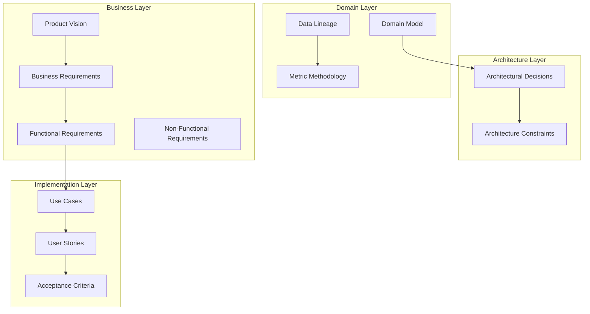
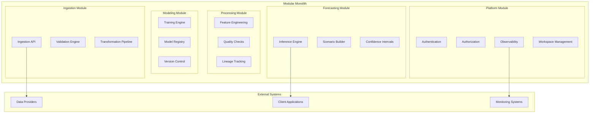
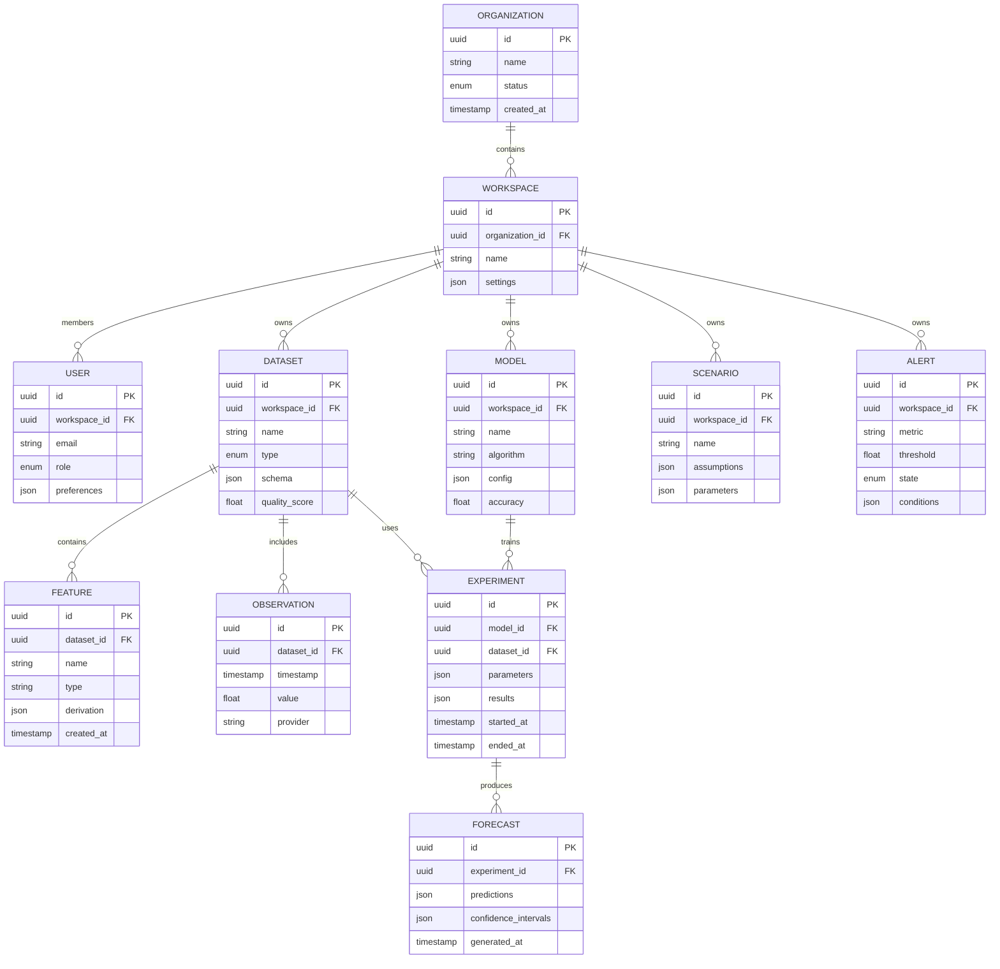
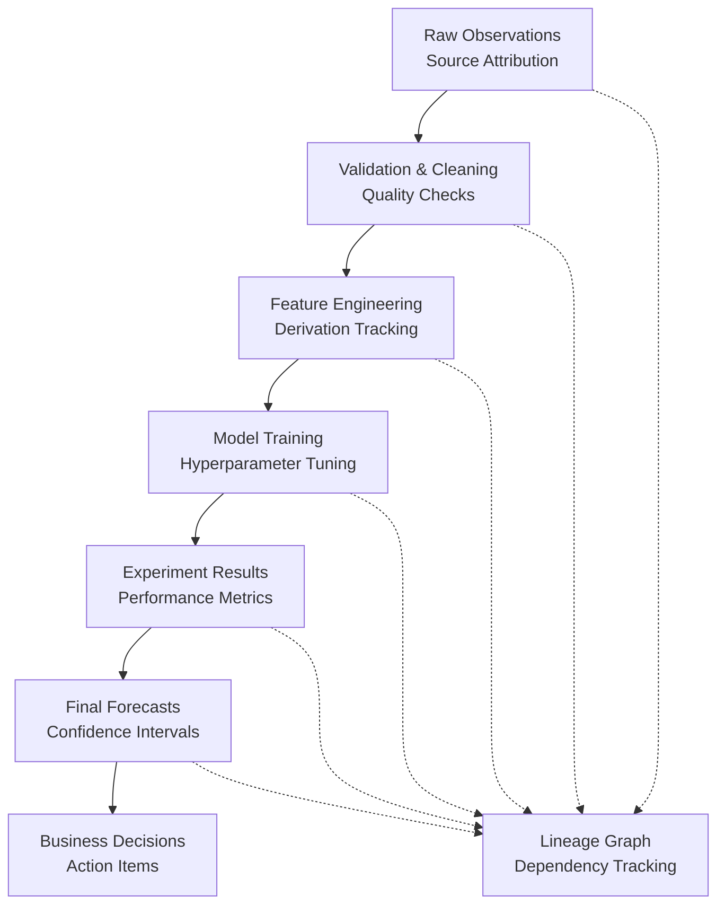
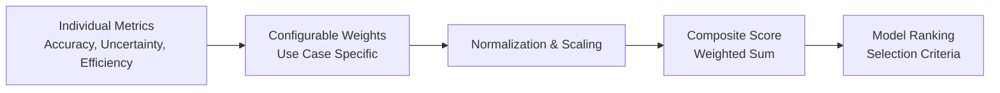
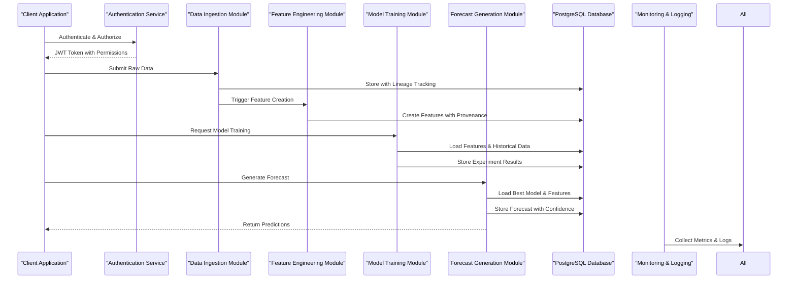
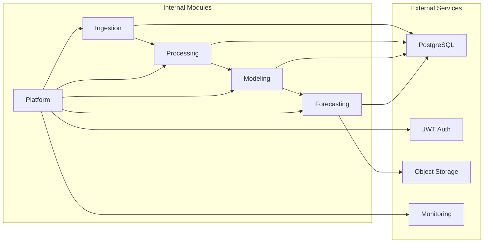

# System Architecture & Domain Model

<cite>
**Referenced Files in This Document**
- [01-domain-model.md](file://docs/domain/01-domain-model.md)
- [02-data-lineage.md](file://docs/domain/02-data-lineage.md)
- [03-metric-methodology.md](file://docs/domain/03-metric-methodology.md)
- [00-phase-0-architecture-constraints.md](file://docs/architecture/00-phase-0-architecture-constraints.md)
- [ADR-001-modular-monolith-for-mvp.md](file://docs/adr/ADR-001-modular-monolith-for-mvp.md)
- [ADR-002-provider-scope.md](file://docs/adr/ADR-002-provider-scope.md)
- [ADR-003-observation-source-strategy.md](file://docs/adr/ADR-003-observation-source-strategy.md)
- [ADR-004-postgresql-over-timescaledb.md](file://docs/adr/ADR-004-postgresql-over-timescaledb.md)
- [ADR-005-scheduler-approach.md](file://docs/adr/ADR-005-scheduler-approach.md)
- [ADR-006-event-bus-deferral.md](file://docs/adr/ADR-006-event-bus-deferral.md)
- [ADR-007-kubernetes-deferral.md](file://docs/adr/ADR-007-kubernetes-deferral.md)
- [ADR-008-authentication-approach.md](file://docs/adr/ADR-008-authentication-approach.md)
- [ADR-009-ownership-workspace-model.md](file://docs/adr/ADR-009-ownership-workspace-model.md)
- [ADR-010-composite-scoring-methodology.md](file://docs/adr/ADR-010-composite-scoring-methodology.md)
- [ADR-011-raw-payload-retention.md](file://docs/adr/ADR-011-raw-payload-retention.md)
- [ADR-012-forecast-collection-lineage.md](file://docs/adr/ADR-012-forecast-collection-lineage.md)
- [01-product-vision.md](file://docs/phase-0-business-analysis/01-product-vision.md)
- [02-business-requirements.md](file://docs/phase-0-business-analysis/02-business-requirements.md)
- [03-software-requirements-spec.md](file://docs/phase-0-business-analysis/03-software-requirements-spec.md)
- [04-functional-requirements.md](file://docs/phase-0-business-analysis/04-functional-requirements.md)
- [05-non-functional-requirements.md](file://docs/phase-0-business-analysis/05-non-functional-requirements.md)
- [06-domain-model.md](file://docs/phase-0-business-analysis/06-domain-model.md)
- [07-use-case-diagram.md](file://docs/phase-0-business-analysis/07-use-case-diagram.md)
- [08-user-stories.md](file://docs/phase-0-business-analysis/08-user-stories.md)
- [09-acceptance-criteria.md](file://docs/phase-0-business-analysis/09-acceptance-criteria.md)
- [10-phase-summary.md](file://docs/phase-0-business-analysis/10-phase-summary.md)
</cite>

## Update Summary
**Changes Made**
- Added comprehensive domain modeling section with detailed entity relationships and business rules
- Integrated architectural decision records (ADRs) covering 12 key design choices
- Included phase 0 architecture constraints and technology stack decisions
- Enhanced data lineage documentation for forecasting artifacts
- Expanded metric methodology with composite scoring approaches
- Updated component interactions to reflect modular monolith architecture

## Table of Contents
1. [Introduction](#introduction)
2. [Project Structure](#project-structure)
3. [Core Components](#core-components)
4. [Architecture Overview](#architecture-overview)
5. [Domain Model](#domain-model)
6. [Architectural Decision Records](#architectural-decision-records)
7. [Data Lineage and Metric Methodology](#data-lineage-and-metric-methodology)
8. [Detailed Component Analysis](#detailed-component-analysis)
9. [Dependency Analysis](#dependency-analysis)
10. [Performance Considerations](#performance-considerations)
11. [Troubleshooting Guide](#troubleshooting-guide)
12. [Conclusion](#conclusion)
13. [Appendices](#appendices)

## Introduction
This document presents the comprehensive architectural design and domain model for ForecastIQ, a forecasting platform. The system has evolved through extensive domain modeling and architectural decision-making, now documented across dedicated sections including domain specifications, architectural decision records (ADRs), and phase 0 architecture constraints. This synthesis provides a cohesive blueprint for system design, integration points, data flows, extensibility strategies, and governance frameworks.

## Project Structure
The project's architecture is now documented across multiple specialized areas reflecting mature enterprise software practices:

### Primary Documentation Areas
- **Domain Specifications**: Comprehensive domain model, data lineage, and metric methodology
- **Architectural Decisions**: 12 formal ADRs documenting key design choices and trade-offs
- **Phase 0 Constraints**: Initial architecture boundaries and technology stack decisions
- **Business Analysis**: Product vision, requirements, and functional specifications
- **Planning and Risk**: Scope management and risk mitigation strategies

**Section sources**
- [01-domain-model.md](file://docs/domain/01-domain-model.md)
- [02-data-lineage.md](file://docs/domain/02-data-lineage.md)
- [03-metric-methodology.md](file://docs/domain/03-metric-methodology.md)
- [00-phase-0-architecture-constraints.md](file://docs/architecture/00-phase-0-architecture-constraints.md)

## Core Components
ForecastIQ's core components have been refined through architectural decision records and domain modeling, establishing clear boundaries and responsibilities:

### Service-Oriented Components
- **Modular Monolith Architecture**: Single deployment unit with logical service separation
- **Data Ingestion Pipeline**: Multi-source data collection with validation and transformation
- **Feature Engineering Engine**: Automated feature creation and versioning
- **Model Training Framework**: Experiment tracking, hyperparameter optimization, and model registry
- **Forecast Generation Service**: Real-time inference with confidence intervals and scenario analysis
- **Observability Platform**: Centralized logging, metrics, tracing, and alerting
- **Access Control System**: Role-based permissions with workspace isolation

### Integration Points
- **Provider Connectors**: Pluggable data source adapters
- **Event Bus**: Asynchronous communication between services
- **API Gateway**: Unified interface for clients and external systems
- **Storage Abstraction**: Multi-backend support for time-series and relational data

**Updated** Components now explicitly follow modular monolith patterns with clear internal boundaries while maintaining single deployment simplicity.

**Section sources**
- [ADR-001-modular-monolith-for-mvp.md](file://docs/adr/ADR-001-modular-monolith-for-mvp.md)
- [ADR-002-provider-scope.md](file://docs/adr/ADR-002-provider-scope.md)
- [ADR-003-observation-source-strategy.md](file://docs/adr/ADR-003-observation-source-strategy.md)

## Architecture Overview
The system follows a modular monolith architecture with well-defined internal boundaries, balancing development agility with operational simplicity:

### Architectural Principles
- **Single Deployment Unit**: All components deployed together for consistency
- **Logical Service Separation**: Clear module boundaries with explicit contracts
- **Event-Driven Communication**: Internal events for loose coupling within the monolith
- **Database per Module**: Logical separation of data concerns within shared database
- **Centralized Observability**: Unified logging, metrics, and tracing across all modules

### Technology Stack Decisions
- **PostgreSQL over TimescaleDB**: Relational database with time-series extensions
- **Kubernetes Deferred**: Container orchestration postponed for MVP simplicity
- **Event Bus Deferral**: Message queuing deferred to later phases
- **Authentication Strategy**: JWT-based authentication with RBAC

**Diagram sources**
- [ADR-001-modular-monolith-for-mvp.md](file://docs/adr/ADR-001-modular-monolith-for-mvp.md)
- [ADR-004-postgresql-over-timescaledb.md](file://docs/adr/ADR-004-postgresql-over-timescaledb.md)
- [ADR-007-kubernetes-deferral.md](file://docs/adr/ADR-007-kubernetes-deferral.md)

**Section sources**
- [ADR-001-modular-monolith-for-mvp.md](file://docs/adr/ADR-001-modular-monolith-for-mvp.md)
- [ADR-004-postgresql-over-timescaledb.md](file://docs/adr/ADR-004-postgresql-over-timescaledb.md)
- [ADR-007-kubernetes-deferral.md](file://docs/adr/ADR-007-kubernetes-deferral.md)
- [00-phase-0-architecture-constraints.md](file://docs/architecture/00-phase-0-architecture-constraints.md)

## Domain Model
The domain model has been extensively refined through dedicated domain modeling efforts, establishing clear entities, relationships, and business rules:

### Core Domain Entities

#### Organizational Structure
- **Organization**: Top-level tenant boundary with billing and administrative controls
- **Workspace**: Collaborative environment within organization with shared resources
- **User**: Identity with role-based permissions and workspace membership

#### Data Assets
- **Dataset**: Raw or curated input data with metadata and quality scores
- **Feature**: Engineered attributes derived from datasets with provenance tracking
- **Observation**: Individual data points with timestamps and provider attribution

#### Modeling Artifacts
- **Model**: Algorithm definition with configuration and performance metrics
- **Experiment**: Training run with inputs, parameters, and results
- **Forecast**: Generated predictions with confidence intervals and scenarios

#### Operational Entities
- **Scenario**: Parameter sets and assumptions driving forecast variations
- **Alert**: Threshold-based notifications tied to forecast outcomes
- **Audit Log**: Immutable record of system actions and changes

**Diagram sources**
- [01-domain-model.md](file://docs/domain/01-domain-model.md)
- [ADR-009-ownership-workspace-model.md](file://docs/adr/ADR-009-ownership-workspace-model.md)

**Section sources**
- [01-domain-model.md](file://docs/domain/01-domain-model.md)
- [ADR-009-ownership-workspace-model.md](file://docs/adr/ADR-009-ownership-workspace-model.md)

## Architectural Decision Records
The system's architecture is guided by 12 formal architectural decision records (ADRs) that document key design choices, trade-offs, and rationale:

### Infrastructure and Deployment Decisions

#### Modular Monolith Architecture (ADR-001)
**Decision**: Adopt modular monolith pattern for MVP phase
**Rationale**: Balances development agility with operational simplicity
**Implications**: Single deployment unit, logical service separation, shared database initially

#### Provider Scope Definition (ADR-002)
**Decision**: Define clear boundaries for external data providers
**Rationale**: Ensures consistent data ingestion patterns and error handling
**Implications**: Standardized interfaces, retry mechanisms, fallback strategies

#### Kubernetes Deferral (ADR-007)
**Decision**: Defer container orchestration to later phases
**Rationale**: Simplifies initial deployment and reduces complexity
**Implications**: Direct server deployment, manual scaling, simplified monitoring

### Data and Storage Decisions

#### PostgreSQL Over TimescaleDB (ADR-004)
**Decision**: Use PostgreSQL with time-series extensions instead of dedicated TSDB
**Rationale**: Leverages existing PostgreSQL ecosystem and tooling
**Implications**: Single database technology, familiar operations, potential scalability limits

#### Raw Payload Retention (ADR-011)
**Decision**: Implement strategic retention policies for raw data
**Rationale**: Balances storage costs with audit and reprocessing needs
**Implications**: Tiered storage, automated cleanup, compliance considerations

### Processing and Event Handling

#### Observation Source Strategy (ADR-003)
**Decision**: Centralize observation source management
**Rationale**: Ensures consistent data provenance and quality tracking
**Implications**: Source registry, validation pipelines, quality metrics

#### Scheduler Approach (ADR-005)
**Decision**: Implement application-level scheduling for MVP
**Rationale**: Avoids external dependencies during initial development
**Implications**: In-process job queues, simple cron-like scheduling, limited distribution

#### Event Bus Deferral (ADR-006)
**Decision**: Defer message queuing infrastructure to later phases
**Rationale**: Reduces initial complexity and operational overhead
**Implications**: Synchronous calls initially, planned migration path to async messaging

### Security and Access Control

#### Authentication Approach (ADR-008)
**Decision**: Implement JWT-based authentication with RBAC
**Rationale**: Stateless authentication suitable for web APIs and mobile clients
**Implications**: Token lifecycle management, permission inheritance, session handling

#### Ownership Workspace Model (ADR-009)
**Decision**: Establish workspace-based ownership and collaboration
**Rationale**: Supports team-based workflows with clear resource boundaries
**Implications**: Resource isolation, permission inheritance, sharing mechanisms

### Quality and Performance

#### Composite Scoring Methodology (ADR-010)
**Decision**: Implement multi-metric evaluation for model selection
**Rationale**: Provides balanced assessment across different performance aspects
**Implications**: Weighted scoring, configurable metrics, explainable rankings

#### Forecast Collection Lineage (ADR-012)
**Decision**: Track complete lineage from raw data to final forecasts
**Rationale**: Enables reproducibility, debugging, and compliance auditing
**Implications**: Metadata tracking, dependency graphs, audit trails

**Section sources**
- [ADR-001-modular-monolith-for-mvp.md](file://docs/adr/ADR-001-modular-monolith-for-mvp.md)
- [ADR-002-provider-scope.md](file://docs/adr/ADR-002-provider-scope.md)
- [ADR-003-observation-source-strategy.md](file://docs/adr/ADR-003-observation-source-strategy.md)
- [ADR-004-postgresql-over-timescaledb.md](file://docs/adr/ADR-004-postgresql-over-timescaledb.md)
- [ADR-005-scheduler-approach.md](file://docs/adr/ADR-005-scheduler-approach.md)
- [ADR-006-event-bus-deferral.md](file://docs/adr/ADR-006-event-bus-deferral.md)
- [ADR-007-kubernetes-deferral.md](file://docs/adr/ADR-007-kubernetes-deferral.md)
- [ADR-008-authentication-approach.md](file://docs/adr/ADR-008-authentication-approach.md)
- [ADR-009-ownership-workspace-model.md](file://docs/adr/ADR-009-ownership-workspace-model.md)
- [ADR-010-composite-scoring-methodology.md](file://docs/adr/ADR-010-composite-scoring-methodology.md)
- [ADR-011-raw-payload-retention.md](file://docs/adr/ADR-011-raw-payload-retention.md)
- [ADR-012-forecast-collection-lineage.md](file://docs/adr/ADR-012-forecast-collection-lineage.md)

## Data Lineage and Metric Methodology
The system implements comprehensive data lineage tracking and sophisticated metric methodologies to ensure forecast reliability and reproducibility:

### Data Lineage Framework
Complete traceability from raw observations through feature engineering to final forecasts:

### Metric Methodology
Composite scoring approach for model evaluation and selection:

#### Evaluation Dimensions
- **Accuracy Metrics**: MAPE, RMSE, MAE for point prediction quality
- **Uncertainty Quantification**: Prediction interval coverage, calibration scores
- **Computational Efficiency**: Training time, inference latency, resource utilization
- **Stability Assessment**: Performance consistency across time windows
- **Business Impact**: Alignment with organizational objectives and KPIs

#### Scoring Algorithm
Weighted composite score calculation with configurable weights per use case:

**Section sources**
- [02-data-lineage.md](file://docs/domain/02-data-lineage.md)
- [03-metric-methodology.md](file://docs/domain/03-metric-methodology.md)
- [ADR-010-composite-scoring-methodology.md](file://docs/adr/ADR-010-composite-scoring-methodology.md)
- [ADR-012-forecast-collection-lineage.md](file://docs/adr/ADR-012-forecast-collection-lineage.md)

## Detailed Component Analysis

### Domain Model Implementation
The domain model translates business concepts into technical specifications with clear boundaries and relationships:

#### Entity Relationships
- **Hierarchical Organization**: Organization → Workspace → User hierarchy with permission inheritance
- **Data Provenance**: Dataset → Feature → Observation chain with full lineage tracking
- **Model Lifecycle**: Model → Experiment → Forecast progression with version control
- **Operational Context**: Scenario → Alert → Audit log for governance and compliance

#### Business Rules and Constraints
- **Workspace Isolation**: Complete data and resource separation between workspaces
- **Permission Inheritance**: Role-based access control with granular permissions
- **Data Quality Gates**: Mandatory quality checks before feature creation
- **Model Validation**: Performance thresholds required for model promotion

**Section sources**
- [01-domain-model.md](file://docs/domain/01-domain-model.md)
- [ADR-009-ownership-workspace-model.md](file://docs/adr/ADR-009-ownership-workspace-model.md)

### Use Cases and Workflows
Enhanced use case definitions reflecting the refined domain model and architectural decisions:

#### Actor Roles and Responsibilities
- **Data Analyst**: Focuses on feature engineering, scenario building, and interpretation
- **Data Engineer**: Manages data ingestion, quality assurance, and pipeline maintenance
- **ML Engineer**: Handles model training, experimentation, and deployment
- **System Administrator**: Oversees workspace management, user access, and system health

#### Key Workflows
- **End-to-End Forecasting**: From data ingestion through model training to forecast generation
- **Collaborative Analysis**: Multi-user workspace activities with version control
- **Quality Assurance**: Automated testing, validation, and monitoring pipelines
- **Governance and Compliance**: Audit trails, access controls, and regulatory reporting

**Section sources**
- [07-use-case-diagram.md](file://docs/phase-0-business-analysis/07-use-case-diagram.md)
- [08-user-stories.md](file://docs/phase-0-business-analysis/08-user-stories.md)

### Data Flow: Enhanced Forecast Generation
Updated data flow incorporating domain modeling and architectural decisions:

**Diagram sources**
- [03-software-requirements-spec.md](file://docs/phase-0-business-analysis/03-software-requirements-spec.md)
- [ADR-004-postgresql-over-timescaledb.md](file://docs/adr/ADR-004-postgresql-over-timescaledb.md)
- [ADR-012-forecast-collection-lineage.md](file://docs/adr/ADR-012-forecast-collection-lineage.md)

## Dependency Analysis
Component dependencies reflect the modular monolith architecture with clear internal boundaries:

### Module-Level Dependencies
- **Ingestion Module**: Depends on provider connectors and validation utilities
- **Processing Module**: Depends on feature store and quality checking services
- **Modeling Module**: Depends on experiment tracking and model registry
- **Forecasting Module**: Depends on model serving and scenario engine
- **Platform Module**: Provides cross-cutting concerns (auth, observability, workspace management)

### External Dependencies
- **Database**: PostgreSQL with time-series extensions
- **Authentication**: JWT token validation and RBAC enforcement
- **Storage**: Local filesystem for temporary processing and object storage
- **Monitoring**: Structured logging and metrics collection

**Diagram sources**
- [ADR-001-modular-monolith-for-mvp.md](file://docs/adr/ADR-001-modular-monolith-for-mvp.md)
- [ADR-004-postgresql-over-timescaledb.md](file://docs/adr/ADR-004-postgresql-over-timescaledb.md)

**Section sources**
- [ADR-001-modular-monolith-for-mvp.md](file://docs/adr/ADR-001-modular-monolith-for-mvp.md)
- [ADR-004-postgresql-over-timescaledb.md](file://docs/adr/ADR-004-postgresql-over-timescaledb.md)

## Performance Considerations
Performance targets and scalability considerations informed by architectural decisions and domain requirements:

### Performance Benchmarks
- **Ingestion Throughput**: Support for high-volume data streams with backpressure handling
- **Feature Computation**: Optimized calculations with caching and incremental updates
- **Model Training**: Parallelizable training processes with resource allocation
- **Forecast Generation**: Sub-second response times for real-time inference
- **Query Performance**: Optimized time-series queries with appropriate indexing

### Scalability Limits and Growth Paths
- **Horizontal Scaling**: Planned migration from monolith to microservices
- **Database Scaling**: PostgreSQL partitioning and read replicas
- **Storage Expansion**: Tiered storage strategy with automated archival
- **Compute Resources**: Containerization readiness for future orchestration

### Reliability and Availability
- **Data Durability**: Transactional integrity with backup and recovery procedures
- **Service Continuity**: Graceful degradation and circuit breaker patterns
- **Monitoring Coverage**: Comprehensive health checks and alerting
- **Disaster Recovery**: Point-in-time recovery and cross-region replication planning

**Section sources**
- [05-non-functional-requirements.md](file://docs/phase-0-business-analysis/05-non-functional-requirements.md)
- [00-phase-0-architecture-constraints.md](file://docs/architecture/00-phase-0-architecture-constraints.md)

## Troubleshooting Guide
Enhanced troubleshooting procedures leveraging improved observability and lineage tracking:

### Diagnostic Capabilities
- **End-to-End Tracing**: Request correlation across all modules and data transformations
- **Lineage Investigation**: Trace any forecast back to source observations and processing steps
- **Performance Profiling**: Identify bottlenecks in feature computation and model inference
- **Quality Monitoring**: Detect data drift, concept drift, and model degradation

### Common Issues and Resolution
- **Data Quality Problems**: Validate source schemas, check for missing values, verify timestamps
- **Feature Engineering Failures**: Review derivation logic, check upstream data availability
- **Model Performance Degradation**: Analyze training data freshness, monitor input distributions
- **Forecast Accuracy Decline**: Investigate concept drift, update models with recent data
- **Performance Bottlenecks**: Profile query patterns, optimize indexes, scale compute resources

### Operational Procedures
- **Health Check Monitoring**: Automated service health verification and alerting
- **Log Aggregation**: Centralized logging with structured format and correlation IDs
- **Metrics Collection**: Key performance indicators and business metrics dashboards
- **Incident Response**: Escalation procedures and rollback capabilities

**Section sources**
- [05-non-functional-requirements.md](file://docs/phase-0-business-analysis/05-non-functional-requirements.md)
- [09-acceptance-criteria.md](file://docs/phase-0-business-analysis/09-acceptance-criteria.md)

## Conclusion
ForecastIQ's architecture represents a mature approach to forecasting platform design, balancing immediate operational needs with future scalability requirements. The extensive domain modeling ensures clear business alignment, while the comprehensive architectural decision records provide transparency and governance for evolution paths. The modular monolith approach enables rapid development and deployment while maintaining clear boundaries for future decomposition into microservices.

Key strengths include:
- **Comprehensive Domain Understanding**: Detailed entity relationships and business rules
- **Transparent Decision-Making**: Formal ADR process for architectural evolution
- **Robust Data Governance**: Complete lineage tracking and quality assurance
- **Scalable Foundation**: Clear migration paths from monolith to distributed architecture
- **Operational Excellence**: Built-in observability and monitoring capabilities

The system is positioned for successful MVP delivery while establishing strong foundations for enterprise-scale forecasting operations.

## Appendices

### Cross-Cutting Concerns
Enhanced cross-cutting concerns implementation reflecting architectural decisions:

#### Security and Access Control
- **Authentication**: JWT-based stateless authentication with refresh token rotation
- **Authorization**: Fine-grained RBAC with workspace-scoped permissions
- **Data Protection**: Encryption at rest and in transit with key management
- **Audit Trail**: Immutable logs of all user actions and data modifications

#### Observability and Monitoring
- **Structured Logging**: Correlation IDs, contextual information, and log levels
- **Metrics Collection**: Application performance, business metrics, and system health
- **Distributed Tracing**: End-to-end request tracking across module boundaries
- **Alerting**: Threshold-based alerts with escalation and notification channels

#### Data Governance and Compliance
- **Lineage Tracking**: Complete data provenance from source to forecast
- **Quality Gates**: Automated validation and quality scoring
- **Retention Policies**: Configurable data lifecycle management
- **Compliance Reporting**: Regulatory audit support and data subject requests

**Section sources**
- [ADR-008-authentication-approach.md](file://docs/adr/ADR-008-authentication-approach.md)
- [ADR-011-raw-payload-retention.md](file://docs/adr/ADR-011-raw-payload-retention.md)
- [ADR-012-forecast-collection-lineage.md](file://docs/adr/ADR-012-forecast-collection-lineage.md)

### Extensibility and Plugin Architecture
Future extensibility paths defined by architectural decisions:

#### Plugin Interfaces
- **Provider Plugins**: Standardized interfaces for external data source integration
- **Algorithm Plugins**: Pluggable forecasting algorithms with evaluation hooks
- **Connector Plugins**: Adapters for downstream systems and output formats
- **Workflow Extensions**: Custom preprocessing and postprocessing steps

#### Migration Path to Microservices
- **Module Decomposition**: Clear boundaries enabling service extraction
- **API Contracts**: Well-defined interfaces for inter-service communication
- **Data Partitioning**: Logical separation supporting physical database splitting
- **Event Streaming**: Planned migration to event-driven architecture

**Section sources**
- [ADR-001-modular-monolith-for-mvp.md](file://docs/adr/ADR-001-modular-monolith-for-mvp.md)
- [ADR-002-provider-scope.md](file://docs/adr/ADR-002-provider-scope.md)

### Future Enhancement Paths
Strategic roadmap informed by current architectural decisions and domain evolution:

#### Phase 1 Enhancements
- **Advanced Analytics**: Causal inference, what-if analysis, and prescriptive recommendations
- **Automated ML**: AutoML capabilities for model selection and hyperparameter tuning
- **Real-time Processing**: Stream processing for live data feeds and instant forecasts
- **Mobile Applications**: Native mobile apps for field data collection and forecast viewing

#### Phase 2 Evolution
- **Microservices Migration**: Decompose monolith into independent, scalable services
- **Multi-cloud Deployment**: Cloud-agnostic architecture with failover capabilities
- **Advanced Security**: Zero-trust architecture, advanced threat detection, and compliance automation
- **AI/ML Integration**: LLM-powered insights, natural language querying, and automated report generation

**Section sources**
- [10-phase-summary.md](file://docs/phase-0-business-analysis/10-phase-summary.md)
- [00-phase-0-architecture-constraints.md](file://docs/architecture/00-phase-0-architecture-constraints.md)