# System Architecture & Domain Model

<cite>
**Referenced Files in This Document**
- [01-domain-model.md](file://docs/domain/01-domain-model.md)
- [02-data-lineage.md](file://docs/domain/02-data-lineage.md)
- [03-metric-methodology.md](file://docs/domain/03-metric-methodology.md)
- [00-phase-0-architecture-constraints.md](file://docs/architecture/00-phase-0-architecture-constraints.md)
- [01-system-context.md](file://docs/architecture/01-system-context.md)
- [02-container-architecture.md](file://docs/architecture/02-container-architecture.md)
- [03-module-architecture.md](file://docs/architecture/03-module-architecture.md)
- [04-domain-architecture.md](file://docs/architecture/04-domain-architecture.md)
- [05-data-flow-architecture.md](file://docs/architecture/05-data-flow-architecture.md)
- [06-deployment-architecture.md](file://docs/architecture/06-deployment-architecture.md)
- [07-security-architecture.md](file://docs/architecture/07-security-architecture.md)
- [08-observability-architecture.md](file://docs/architecture/08-observability-architecture.md)
- [09-reliability-architecture.md](file://docs/architecture/09-reliability-architecture.md)
- [10-scaling-and-evolution.md](file://docs/architecture/10-scaling-and-evolution.md)
- [ADR-001-modular-monolith-for-mvp.md](file://docs/adr/ADR-001-modular-monolith-for-mvp.md)
- [ADR-002-provider-scope.md](file://docs/adr/ADR-002-provider-scope.md)
- [ADR-003-observation-source-strategy.md](file://docs/adr/ADR-003-observation-source-strategy.md)
- [ADR-004-postgresql-over-timescaledb.md](file://docs/adr/ADR-004-postgresql-over-timescaledb.md)
- [ADR-005-scheduler-approach.md](file://docs/adr/ADR-005-scheduler-approach.md)
- [ADR-006-event-bus-deferral.md](file://docs/adr/ADR-006-event-bus-deferral.md)
- [ADR-007-kubernetes-deferral.md](file://docs/adr/ADR-007-kubernetes-deferral.md)
- [ADR-008-authentication-approach.md](file://docs/adr/ADR-008-authentication-approach.md)
- [ADR-009-ownership-workspace-model.md](file://docs/adr/ADR-009-ownership-workspace-model.md)
- [ADR-010-composite-scoring-methodology.md](file://docs/adr/ADR-010-composite-scoring-methodology.md)
- [ADR-011-raw-payload-retention.md](file://docs/adr/ADR-011-raw-payload-retention.md)
- [ADR-012-forecast-collection-lineage.md](file://docs/adr/ADR-012-forecast-collection-lineage.md)
- [ADR-013-deployment-unit-boundaries.md](file://docs/adr/ADR-013-deployment-unit-boundaries.md)
- [ADR-014-matching-and-rematching.md](file://docs/adr/ADR-014-matching-and-rematching.md)
- [ADR-015-evaluation-and-aggregation.md](file://docs/adr/ADR-015-evaluation-and-aggregation.md)
- [ADR-016-ranking-persistence.md](file://docs/adr/ADR-016-ranking-persistence.md)
- [ADR-017-authorization-model.md](file://docs/adr/ADR-017-authorization-model.md)
- [ADR-018-api-composition.md](file://docs/adr/ADR-018-api-composition.md)
- [ADR-019-object-storage-use.md](file://docs/adr/ADR-019-object-storage-use.md)
- [ADR-020-redis-deferral-lru.md](file://docs/adr/ADR-020-redis-deferral-lru.md)
- [ADR-021-internal-event-strategy.md](file://docs/adr/ADR-021-internal-event-strategy.md)
- [ADR-022-identifier-strategy.md](file://docs/adr/ADR-022-identifier-strategy.md)
- [ADR-023-repository-structure.md](file://docs/adr/ADR-023-repository-structure.md)
- [ADR-024-backup-and-dr.md](file://docs/adr/ADR-024-backup-and-dr.md)
- [ADR-025-observation-collection-model.md](file://docs/adr/ADR-025-observation-collection-model.md)
- [ADR-026-hosting-platform.md](file://docs/adr/ADR-026-hosting-platform.md)
- [ADR-027-transaction-architecture.md](file://docs/adr/ADR-027-transaction-architecture.md)
- [ADR-028-caching-and-stale-serving.md](file://docs/adr/ADR-028-caching-and-stale-serving.md)
- [ADR-029-partitioning-and-retention.md](file://docs/adr/ADR-029-partitioning-and-retention.md)
- [ADR-030-methodology-registry.md](file://docs/adr/ADR-030-methodology-registry.md)
- [ADR-031-staging-deferral.md](file://docs/adr/ADR-031-staging-deferral.md)
- [ADR-032-quality-gate-policy.md](file://docs/adr/ADR-032-quality-gate-policy.md)
- [01-product-vision.md](file://docs/phase-0-business-analysis/01-product-vision.md)
- [02-business-requirements.md](file://docs/phase-0-business-analysis/02-business-requirements.md)
- [03-software-requirements-spec.md](file://docs/phase-0-business-analysis/03-software-requirements-spec.md)
- [04-functional-requirements.md](file://docs/phase-0-business-analysis/04-functional-requirements.md)
- [05-non-functional-requirements.md](file://docs/phase-0-business-analysis/05-non-functional-requirements.md)
- [06-domain-model.md](file://docs/phase-0-business-analysis/06-domain-model.md)
- [07-use-case-diagram.md](file://docs/phase-0-business-analysis/07-use-case-diagram.md)
- [08-user-stories.md](file://docs/phase-0-business-analysis/08-user-stories.md)
- [09-acceptance-criteria.md](file://docs/phase-0-business-analysis/09-acceptance-criteria.md)
- [10-phase-summary.md](file://docs/phase-0-business-analysis/10-phase-summary.md)
</cite>

## Update Summary
**Changes Made**
- Expanded architectural decision records from 12 to 32 ADRs covering comprehensive Phase 1 architecture
- Added complete system context, container/module/domain architecture documentation
- Integrated advanced deployment strategies, security framework, and observability design
- Enhanced reliability engineering patterns and scaling considerations
- Added repository structure decisions, backup/DR strategies using Neon PITR
- Implemented transaction architecture patterns, caching strategies, and partitioning policies
- Introduced methodology registry design and quality gate policies
- Updated domain model with enhanced entity relationships and business rules

## Table of Contents
1. [Introduction](#introduction)
2. [Project Structure](#project-structure)
3. [Core Components](#core-components)
4. [Architecture Overview](#architecture-overview)
5. [System Context and Boundaries](#system-context-and-boundaries)
6. [Container and Module Architecture](#container-and-module-architecture)
7. [Domain Model](#domain-model)
8. [Architectural Decision Records](#architectural-decision-records)
9. [Data Flow Patterns](#data-flow-patterns)
10. [Deployment and Infrastructure](#deployment-and-infrastructure)
11. [Security Framework](#security-framework)
12. [Observability and Monitoring](#observability-and-monitoring)
13. [Reliability Engineering](#reliability-engineering)
14. [Scaling and Evolution](#scaling-and-evolution)
15. [Data Lineage and Metric Methodology](#data-lineage-and-metric-methodology)
16. [Transaction and Caching Architecture](#transaction-and-caching-architecture)
17. [Repository Structure and Development](#repository-structure-and-development)
18. [Performance Considerations](#performance-considerations)
19. [Troubleshooting Guide](#troubleshooting-guide)
20. [Conclusion](#conclusion)
21. [Appendices](#appendices)

## Introduction
This document presents the comprehensive architectural design and domain model for ForecastIQ, a forecasting platform that has evolved through extensive Phase 1 architecture development. The system now encompasses 32 formal architectural decision records (ADRs), complete system context definition, container/module/domain architecture specifications, and advanced operational patterns. This synthesis provides a cohesive blueprint for system design, integration points, data flows, extensibility strategies, governance frameworks, and enterprise-scale operations.

The Phase 1 architecture establishes robust foundations for production deployment while maintaining clear migration paths to distributed systems. Key enhancements include comprehensive backup and disaster recovery strategies using Neon Point-in-Time Recovery (PITR), sophisticated transaction architecture patterns, multi-layered caching strategies, and advanced partitioning policies for high-volume time-series data.

## Project Structure
The project's architecture is now documented across multiple specialized areas reflecting mature enterprise software practices with comprehensive Phase 1 implementation guidance:

### Primary Documentation Areas
- **Phase 1 Architecture**: Complete system context, container/module/domain architecture, and deployment strategies
- **Domain Specifications**: Comprehensive domain model, data lineage, and metric methodology with registry design
- **Architectural Decisions**: 32 formal ADRs documenting key design choices, trade-offs, and implementation patterns
- **Operational Excellence**: Security framework, observability design, reliability engineering, and scaling considerations
- **Development Practices**: Repository structure, quality gates, and CI/CD strategies

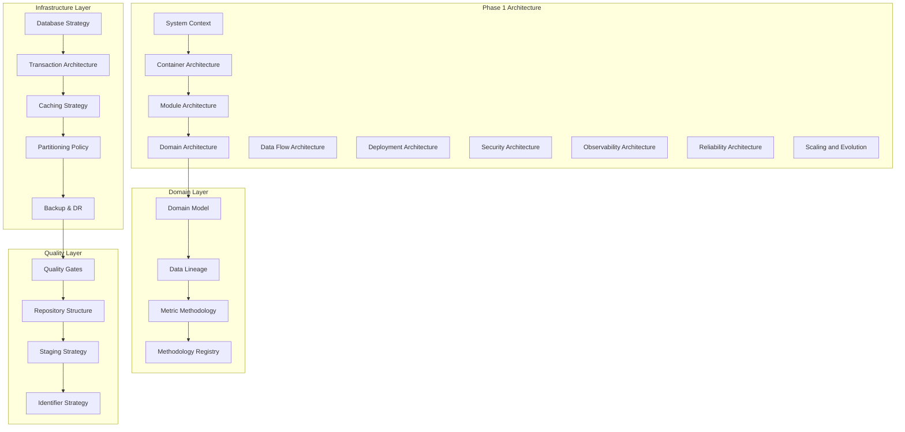

**Section sources**
- [01-system-context.md](file://docs/architecture/01-system-context.md)
- [02-container-architecture.md](file://docs/architecture/02-container-architecture.md)
- [03-module-architecture.md](file://docs/architecture/03-module-architecture.md)
- [04-domain-architecture.md](file://docs/architecture/04-domain-architecture.md)
- [05-data-flow-architecture.md](file://docs/architecture/05-data-flow-architecture.md)
- [06-deployment-architecture.md](file://docs/architecture/06-deployment-architecture.md)
- [07-security-architecture.md](file://docs/architecture/07-security-architecture.md)
- [08-observability-architecture.md](file://docs/architecture/08-observability-architecture.md)
- [09-reliability-architecture.md](file://docs/architecture/09-reliability-architecture.md)
- [10-scaling-and-evolution.md](file://docs/architecture/10-scaling-and-evolution.md)

## Core Components
ForecastIQ's core components have been significantly enhanced through Phase 1 architecture development, establishing comprehensive service boundaries and operational capabilities:

### Service-Oriented Components
- **Modular Monolith Architecture**: Single deployment unit with logical service separation and clear module boundaries
- **Data Ingestion Pipeline**: Multi-source data collection with validation, transformation, and quality scoring
- **Feature Engineering Engine**: Automated feature creation, versioning, and registry management
- **Model Training Framework**: Experiment tracking, hyperparameter optimization, and model registry with evaluation metrics
- **Forecast Generation Service**: Real-time inference with confidence intervals, scenario analysis, and ranking persistence
- **Observability Platform**: Centralized logging, metrics, tracing, alerting, and performance monitoring
- **Access Control System**: Role-based permissions with workspace isolation and fine-grained authorization
- **Methodology Registry**: Pluggable forecasting methodologies with versioning and evaluation hooks

### Integration Points
- **Provider Connectors**: Pluggable data source adapters with standardized interfaces
- **Event Bus**: Asynchronous communication between services with internal event strategy
- **API Gateway**: Unified interface for clients and external systems with composition patterns
- **Storage Abstraction**: Multi-backend support for time-series, relational, and object storage
- **Cache Layer**: Redis-backed caching with LRU eviction and stale serving strategies
- **Queue System**: Deferred processing with staging and retry mechanisms

**Updated** Components now incorporate comprehensive Phase 1 architecture patterns including transaction boundaries, caching strategies, and advanced observability capabilities.

**Section sources**
- [ADR-013-deployment-unit-boundaries.md](file://docs/adr/ADR-013-deployment-unit-boundaries.md)
- [ADR-018-api-composition.md](file://docs/adr/ADR-018-api-composition.md)
- [ADR-020-redis-deferral-lru.md](file://docs/adr/ADR-020-redis-deferral-lru.md)
- [ADR-021-internal-event-strategy.md](file://docs/adr/ADR-021-internal-event-strategy.md)
- [ADR-030-methodology-registry.md](file://docs/adr/ADR-030-methodology-registry.md)

## Architecture Overview
The system follows an enhanced modular monolith architecture with comprehensive Phase 1 operational patterns, balancing development agility with enterprise-grade reliability:

### Architectural Principles
- **Single Deployment Unit**: All components deployed together with clear module boundaries
- **Logical Service Separation**: Explicit contracts between modules with well-defined APIs
- **Event-Driven Communication**: Internal events for loose coupling within the monolith
- **Database per Module**: Logical separation of data concerns with shared database initially
- **Centralized Observability**: Unified logging, metrics, tracing, and alerting across all modules
- **Transaction Boundaries**: Clear transaction demarcation for data consistency
- **Multi-Layer Caching**: Strategic caching with stale serving and invalidation patterns
- **Advanced Partitioning**: Time-based partitioning for high-volume time-series data

### Technology Stack Decisions
- **PostgreSQL over TimescaleDB**: Relational database with time-series extensions and partitioning
- **Neon Database**: Serverless PostgreSQL with Point-in-Time Recovery (PITR) capabilities
- **Redis Cache**: High-performance caching with LRU eviction and deferred processing
- **Object Storage**: S3-compatible storage for raw payloads and artifacts
- **Kubernetes Ready**: Container orchestration prepared but deferred for MVP simplicity
- **JWT Authentication**: Stateless authentication with RBAC and workspace isolation

```mermaid
graph TB
subgraph "Phase 1 Modular Monolith"
subgraph "Ingestion Module"
ING_API["Ingestion API"]
ING_VALIDATOR["Validation Engine"]
ING_TRANSFORMER["Transformation Pipeline"]
ING_QUALITY["Quality Scoring"]
end
subgraph "Processing Module"
PROC_FEATURES["Feature Engineering"]
PROC_REGISTRY["Methodology Registry"]
PROC_LINEAGE["Lineage Tracking"]
PROC_EVALUATION["Evaluation Engine"]
end
subgraph "Modeling Module"
MODEL_TRAINING["Training Engine"]
MODEL_REGISTRY["Model Registry"]
MODEL_VERSIONING["Version Control"]
MODEL_RANKING["Ranking Persistence"]
end
subgraph "Forecasting Module"
FORE_ENGINE["Inference Engine"]
FORE_SCENARIOS["Scenario Builder"]
FORE_CONFIDENCE["Confidence Intervals"]
FORE_CACHING["Cache Layer"]
end
subgraph "Platform Module"
PLAT_AUTH["Authentication"]
PLAT_RBAC["Authorization"]
PLAT_OBS["Observability"]
PLAT_WORKSPACE["Workspace Management"]
PLAT_EVENTS["Internal Events"]
PLAT_TRANSACTIONS["Transaction Manager"]
end
subgraph "Infrastructure Layer"
INF_DB["PostgreSQL + Neon"]
INF_CACHE["Redis Cache"]
INF_STORAGE["Object Storage"]
INF_QUEUE["Deferred Processing"]
INF_MONITORING["Monitoring Stack"]
end
end
subgraph "External Systems"
EXT_PROVIDERS["Data Providers"]
EXT_CLIENTS["Client Applications"]
EXT_MONITORING["External Monitoring"]
EXT_BACKUP["Backup Systems"]
end
ING_API --> EXT_PROVIDERS
FORE_ENGINE --> EXT_CLIENTS
PLAT_OBS --> EXT_MONITORING
INF_DB --> EXT_BACKUP
```

**Diagram sources**
- [ADR-013-deployment-unit-boundaries.md](file://docs/adr/ADR-013-deployment-unit-boundaries.md)
- [ADR-024-backup-and-dr.md](file://docs/adr/ADR-024-backup-and-dr.md)
- [ADR-027-transaction-architecture.md](file://docs/adr/ADR-027-transaction-architecture.md)
- [ADR-028-caching-and-stale-serving.md](file://docs/adr/ADR-028-caching-and-stale-serving.md)

**Section sources**
- [ADR-013-deployment-unit-boundaries.md](file://docs/adr/ADR-013-deployment-unit-boundaries.md)
- [ADR-024-backup-and-dr.md](file://docs/adr/ADR-024-backup-and-dr.md)
- [ADR-027-transaction-architecture.md](file://docs/adr/ADR-027-transaction-architecture.md)
- [ADR-028-caching-and-stale-serving.md](file://docs/adr/ADR-028-caching-and-stale-serving.md)
- [00-phase-0-architecture-constraints.md](file://docs/architecture/00-phase-0-architecture-constraints.md)

## System Context and Boundaries
The system context defines clear boundaries between ForecastIQ and external systems, establishing integration points and data exchange patterns:

### External System Interactions
- **Data Providers**: Multiple forecasting providers with standardized interfaces and fallback mechanisms
- **Client Applications**: Web, mobile, and API clients with role-based access controls
- **Monitoring Systems**: External observability platforms for centralized logging and alerting
- **Backup Services**: Cloud-native backup solutions with point-in-time recovery capabilities
- **Storage Providers**: Object storage services for raw data and model artifacts

### System Boundaries
- **Authentication Boundary**: JWT token validation at API gateway level
- **Authorization Boundary**: Workspace-scoped permission enforcement
- **Data Boundary**: Tenant isolation with strict data segregation
- **Processing Boundary**: Transactional boundaries for data consistency
- **Caching Boundary**: Multi-layer cache with invalidation strategies

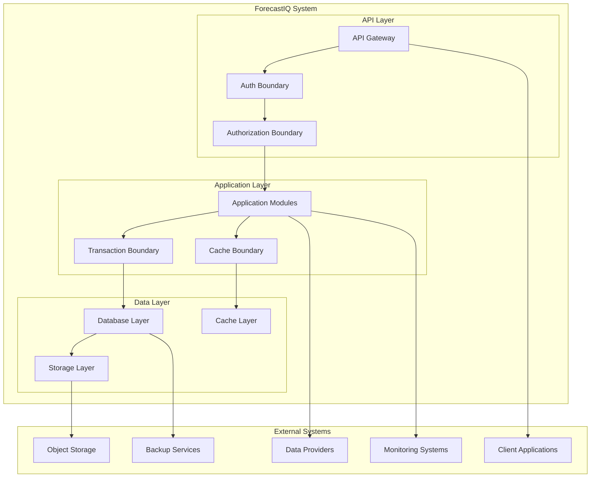

**Diagram sources**
- [01-system-context.md](file://docs/architecture/01-system-context.md)
- [ADR-017-authorization-model.md](file://docs/adr/ADR-017-authorization-model.md)
- [ADR-027-transaction-architecture.md](file://docs/adr/ADR-027-transaction-architecture.md)

**Section sources**
- [01-system-context.md](file://docs/architecture/01-system-context.md)
- [ADR-017-authorization-model.md](file://docs/adr/ADR-017-authorization-model.md)
- [ADR-027-transaction-architecture.md](file://docs/adr/ADR-027-transaction-architecture.md)

## Container and Module Architecture
The container and module architecture defines clear boundaries and responsibilities for each component within the modular monolith:

### Container Strategy
- **Single Container Deployment**: All modules run in a single container process for MVP simplicity
- **Module Isolation**: Logical separation with explicit inter-module contracts
- **Resource Sharing**: Shared memory space for low-latency inter-module communication
- **Configuration Management**: Centralized configuration with environment-specific overrides

### Module Responsibilities
- **Ingestion Module**: Data collection, validation, transformation, and quality assessment
- **Processing Module**: Feature engineering, methodology application, and result aggregation
- **Modeling Module**: Model training, experimentation, registry management, and ranking
- **Forecasting Module**: Real-time inference, scenario generation, and cache management
- **Platform Module**: Cross-cutting concerns including auth, observability, and workspace management

### Inter-Module Communication
- **Direct Function Calls**: Low-latency calls within the same process
- **Internal Events**: Asynchronous messaging for decoupled operations
- **Shared State**: Carefully managed shared state with clear ownership
- **Transaction Boundaries**: Distributed transactions across module boundaries

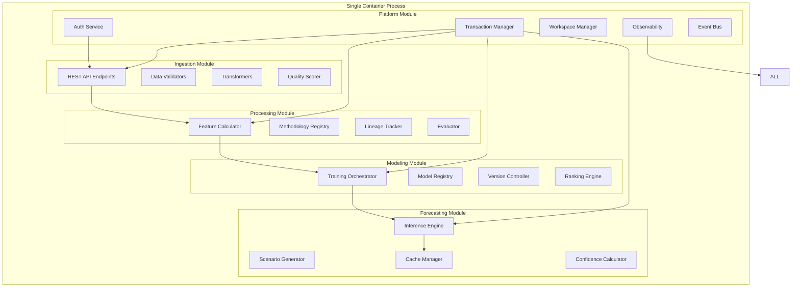

**Diagram sources**
- [02-container-architecture.md](file://docs/architecture/02-container-architecture.md)
- [03-module-architecture.md](file://docs/architecture/03-module-architecture.md)
- [ADR-021-internal-event-strategy.md](file://docs/adr/ADR-021-internal-event-strategy.md)

**Section sources**
- [02-container-architecture.md](file://docs/architecture/02-container-architecture.md)
- [03-module-architecture.md](file://docs/architecture/03-module-architecture.md)
- [ADR-021-internal-event-strategy.md](file://docs/adr/ADR-021-internal-event-strategy.md)

## Domain Model
The domain model has been extensively refined through Phase 1 architecture development, establishing comprehensive entities, relationships, and business rules with enhanced registry and evaluation capabilities:

### Core Domain Entities

#### Organizational Structure
- **Organization**: Top-level tenant boundary with billing and administrative controls
- **Workspace**: Collaborative environment within organization with shared resources
- **User**: Identity with role-based permissions and workspace membership

#### Data Assets
- **Dataset**: Raw or curated input data with metadata and quality scores
- **Feature**: Engineered attributes derived from datasets with provenance tracking
- **Observation**: Individual data points with timestamps and provider attribution
- **Methodology**: Pluggable forecasting algorithms with versioning and evaluation metrics

#### Modeling Artifacts
- **Model**: Algorithm definition with configuration and performance metrics
- **Experiment**: Training run with inputs, parameters, and results
- **Forecast**: Generated predictions with confidence intervals and scenarios
- **Ranking**: Persistent model rankings with evaluation criteria and timestamps

#### Operational Entities
- **Scenario**: Parameter sets and assumptions driving forecast variations
- **Alert**: Threshold-based notifications tied to forecast outcomes
- **Audit Log**: Immutable record of system actions and changes
- **Quality Gate**: Automated validation rules and pass/fail criteria

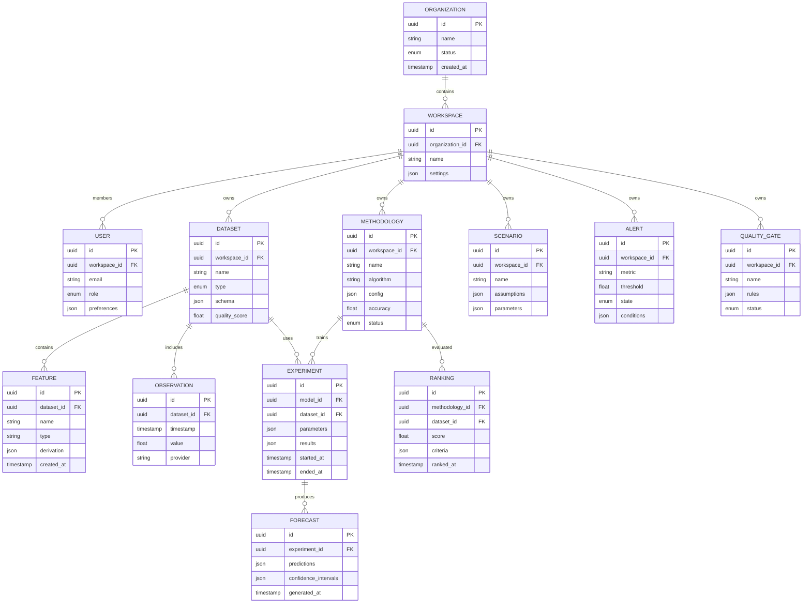

**Diagram sources**
- [01-domain-model.md](file://docs/domain/01-domain-model.md)
- [ADR-009-ownership-workspace-model.md](file://docs/adr/ADR-009-ownership-workspace-model.md)
- [ADR-030-methodology-registry.md](file://docs/adr/ADR-030-methodology-registry.md)

**Section sources**
- [01-domain-model.md](file://docs/domain/01-domain-model.md)
- [ADR-009-ownership-workspace-model.md](file://docs/adr/ADR-009-ownership-workspace-model.md)
- [ADR-030-methodology-registry.md](file://docs/adr/ADR-030-methodology-registry.md)

## Architectural Decision Records
The system's architecture is guided by 32 formal architectural decision records (ADRs) that document comprehensive design choices, trade-offs, and implementation patterns:

### Phase 1 Infrastructure and Deployment Decisions

#### Deployment Unit Boundaries (ADR-013)
**Decision**: Define clear deployment unit boundaries within the modular monolith
**Rationale**: Enables independent scaling and deployment of logical units
**Implications**: Module-level configuration, resource allocation, and health monitoring

#### Matching and Rematching Strategy (ADR-014)
**Decision**: Implement intelligent matching algorithms with automatic rematching capabilities
**Rationale**: Ensures optimal model selection and continuous improvement
**Implications**: Performance comparison, drift detection, and automated retraining triggers

#### Evaluation and Aggregation (ADR-015)
**Decision**: Centralized evaluation engine with multi-metric aggregation
**Rationale**: Provides consistent model assessment across different use cases
**Implications**: Standardized metrics, weighted scoring, and explainable rankings

#### Ranking Persistence (ADR-016)
**Decision**: Persistent ranking system with historical tracking
**Rationale**: Enables trend analysis and model performance monitoring
**Implications**: Time-series ranking data, comparison tools, and audit trails

### Advanced Authorization and API Design

#### Authorization Model (ADR-017)
**Decision**: Hierarchical authorization with workspace-scoped permissions
**Rationale**: Supports complex organizational structures with fine-grained access control
**Implications**: Permission inheritance, resource isolation, and audit logging

#### API Composition (ADR-018)
**Decision**: Composable API design with reusable building blocks
**Rationale**: Enables flexible client integrations and reduces code duplication
**Implications**: API versioning, backward compatibility, and developer experience

### Storage and Caching Strategies

#### Object Storage Use (ADR-019)
**Decision**: Leverage object storage for unstructured data and artifacts
**Rationale**: Scalable, cost-effective storage for large files and backups
**Implications**: Versioning, lifecycle policies, and access controls

#### Redis Deferral with LRU (ADR-020)
**Decision**: Implement Redis-backed deferred processing with LRU eviction
**Rationale**: Handles bursty workloads and provides reliable job processing
**Implications**: Job queues, retry mechanisms, and monitoring

### Event and Identifier Strategies

#### Internal Event Strategy (ADR-021)
**Decision**: Centralized internal event bus for inter-module communication
**Rationale**: Enables loose coupling and asynchronous processing
**Implications**: Event schemas, delivery guarantees, and error handling

#### Identifier Strategy (ADR-022)
**Decision**: UUID-based identifiers with semantic meaning where appropriate
**Rationale**: Ensures uniqueness and supports distributed systems
**Implications**: ID generation, collision avoidance, and debugging

### Development and Quality Assurance

#### Repository Structure (ADR-023)
**Decision**: Monorepo structure with clear module separation
**Rationale**: Simplifies development and enables cross-module refactoring
**Implications**: Build pipelines, dependency management, and testing strategies

#### Backup and Disaster Recovery (ADR-024)
**Decision**: Comprehensive backup strategy using Neon PITR
**Rationale**: Ensures data durability and rapid recovery capabilities
**Implications**: Backup schedules, retention policies, and recovery procedures

### Data Collection and Hosting

#### Observation Collection Model (ADR-025)
**Decision**: Standardized observation collection with quality scoring
**Rationale**: Ensures data consistency and reliability across sources
**Implications**: Validation rules, quality metrics, and anomaly detection

#### Hosting Platform (ADR-026)
**Decision**: Cloud-native hosting with Kubernetes readiness
**Rationale**: Provides scalability and operational flexibility
**Implications**: Containerization, orchestration, and monitoring

### Transaction and Performance Architecture

#### Transaction Architecture (ADR-027)
**Decision**: Distributed transaction patterns with eventual consistency
**Rationale**: Balances data consistency with system availability
**Implications**: Saga patterns, compensation logic, and monitoring

#### Caching and Stale Serving (ADR-028)
**Decision**: Multi-layer caching with stale serving for resilience
**Rationale**: Improves performance and system resilience during failures
**Implications**: Cache invalidation, TTL policies, and freshness indicators

#### Partitioning and Retention (ADR-029)
**Decision**: Time-based partitioning with automated retention policies
**Rationale**: Optimizes query performance and manages storage costs
**Implications**: Partition keys, archival strategies, and compliance

### Methodology and Quality Management

#### Methodology Registry (ADR-030)
**Decision**: Centralized registry for forecasting methodologies
**Rationale**: Enables pluggable algorithms and version management
**Implications**: Registration APIs, evaluation hooks, and deprecation policies

#### Staging Deferral (ADR-031)
**Decision**: Deferred staging environment strategy
**Rationale**: Simplifies initial deployment while planning for future needs
**Implications**: Environment parity, testing strategies, and migration path

#### Quality Gate Policy (ADR-032)
**Decision**: Automated quality gates throughout the pipeline
**Rationale**: Ensures data and model quality standards are maintained
**Implications**: Validation rules, blocking criteria, and reporting

**Section sources**
- [ADR-013-deployment-unit-boundaries.md](file://docs/adr/ADR-013-deployment-unit-boundaries.md)
- [ADR-014-matching-and-rematching.md](file://docs/adr/ADR-014-matching-and-rematching.md)
- [ADR-015-evaluation-and-aggregation.md](file://docs/adr/ADR-015-evaluation-and-aggregation.md)
- [ADR-016-ranking-persistence.md](file://docs/adr/ADR-016-ranking-persistence.md)
- [ADR-017-authorization-model.md](file://docs/adr/ADR-017-authorization-model.md)
- [ADR-018-api-composition.md](file://docs/adr/ADR-018-api-composition.md)
- [ADR-019-object-storage-use.md](file://docs/adr/ADR-019-object-storage-use.md)
- [ADR-020-redis-deferral-lru.md](file://docs/adr/ADR-020-redis-deferral-lru.md)
- [ADR-021-internal-event-strategy.md](file://docs/adr/ADR-021-internal-event-strategy.md)
- [ADR-022-identifier-strategy.md](file://docs/adr/ADR-022-identifier-strategy.md)
- [ADR-023-repository-structure.md](file://docs/adr/ADR-023-repository-structure.md)
- [ADR-024-backup-and-dr.md](file://docs/adr/ADR-024-backup-and-dr.md)
- [ADR-025-observation-collection-model.md](file://docs/adr/ADR-025-observation-collection-model.md)
- [ADR-026-hosting-platform.md](file://docs/adr/ADR-026-hosting-platform.md)
- [ADR-027-transaction-architecture.md](file://docs/adr/ADR-027-transaction-architecture.md)
- [ADR-028-caching-and-stale-serving.md](file://docs/adr/ADR-028-caching-and-stale-serving.md)
- [ADR-029-partitioning-and-retention.md](file://docs/adr/ADR-029-partitioning-and-retention.md)
- [ADR-030-methodology-registry.md](file://docs/adr/ADR-030-methodology-registry.md)
- [ADR-031-staging-deferral.md](file://docs/adr/ADR-031-staging-deferral.md)
- [ADR-032-quality-gate-policy.md](file://docs/adr/ADR-032-quality-gate-policy.md)

## Data Flow Patterns
The system implements sophisticated data flow patterns that ensure reliability, performance, and traceability across all processing stages:

### End-to-End Data Flow
Complete traceability from raw observations through final forecasts with comprehensive lineage tracking:

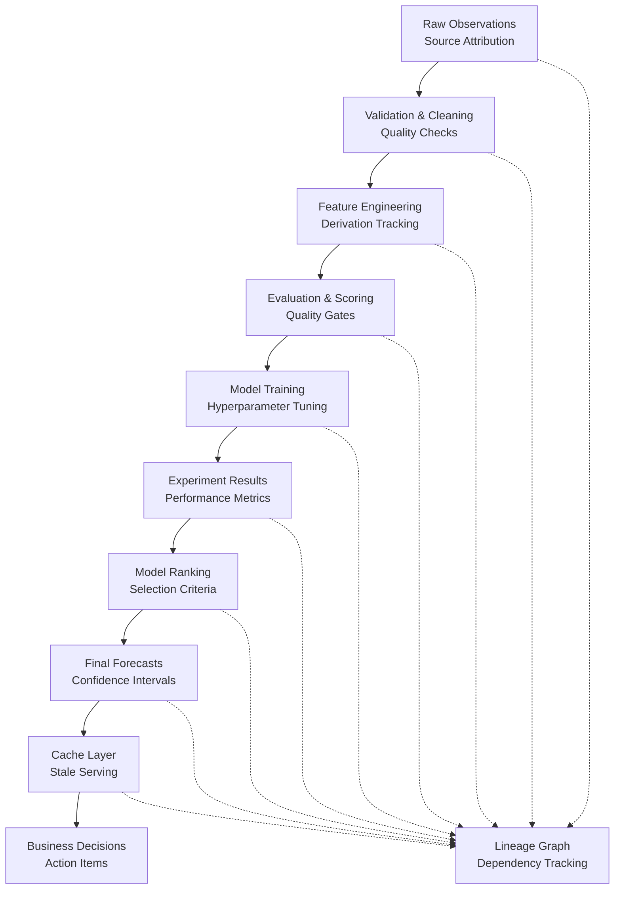

### Processing Pipeline Architecture
Multi-stage processing with quality gates and retry mechanisms:

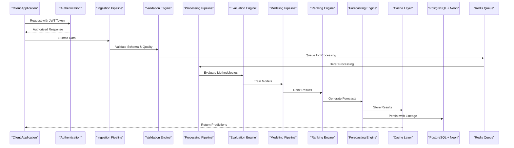

**Diagram sources**
- [05-data-flow-architecture.md](file://docs/architecture/05-data-flow-architecture.md)
- [ADR-020-redis-deferral-lru.md](file://docs/adr/ADR-020-redis-deferral-lru.md)
- [ADR-028-caching-and-stale-serving.md](file://docs/adr/ADR-028-caching-and-stale-serving.md)

**Section sources**
- [05-data-flow-architecture.md](file://docs/architecture/05-data-flow-architecture.md)
- [ADR-020-redis-deferral-lru.md](file://docs/adr/ADR-020-redis-deferral-lru.md)
- [ADR-028-caching-and-stale-serving.md](file://docs/adr/ADR-028-caching-and-stale-serving.md)

## Deployment and Infrastructure
The deployment architecture provides comprehensive infrastructure patterns for production-ready forecasting operations:

### Deployment Strategy
- **Single Container Deployment**: All modules deployed in unified container for MVP simplicity
- **Environment Parity**: Consistent environments across development, staging, and production
- **Blue-Green Deployments**: Zero-downtime deployments with instant rollback capabilities
- **Health Checks**: Comprehensive health monitoring with readiness and liveness probes

### Infrastructure Components
- **Database Layer**: PostgreSQL with Neon serverless capabilities and Point-in-Time Recovery
- **Cache Layer**: Redis cluster with LRU eviction and persistence options
- **Object Storage**: S3-compatible storage for raw data, models, and artifacts
- **Queue System**: Redis-backed job queue with retry and dead letter handling
- **Monitoring Stack**: Centralized logging, metrics, tracing, and alerting

### Scaling Considerations
- **Horizontal Scaling**: Planned migration path from monolith to microservices
- **Database Scaling**: Read replicas, connection pooling, and query optimization
- **Cache Scaling**: Redis clustering and distributed cache invalidation
- **Compute Scaling**: Auto-scaling groups and resource-based scaling policies

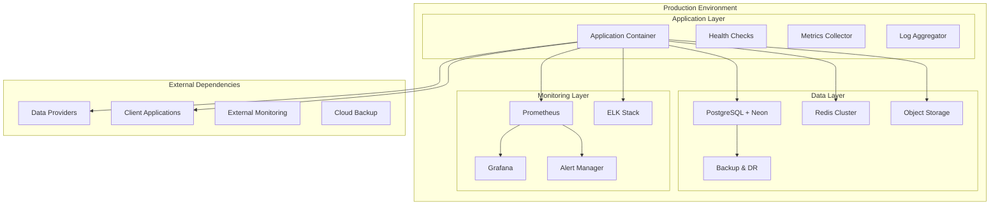

**Diagram sources**
- [06-deployment-architecture.md](file://docs/architecture/06-deployment-architecture.md)
- [ADR-024-backup-and-dr.md](file://docs/adr/ADR-024-backup-and-dr.md)
- [ADR-026-hosting-platform.md](file://docs/adr/ADR-026-hosting-platform.md)

**Section sources**
- [06-deployment-architecture.md](file://docs/architecture/06-deployment-architecture.md)
- [ADR-024-backup-and-dr.md](file://docs/adr/ADR-024-backup-and-dr.md)
- [ADR-026-hosting-platform.md](file://docs/adr/ADR-026-hosting-platform.md)

## Security Framework
The security framework provides comprehensive protection across all system layers with defense-in-depth strategies:

### Authentication and Authorization
- **JWT-Based Authentication**: Stateless authentication with refresh token rotation
- **Role-Based Access Control**: Fine-grained permissions with workspace scoping
- **API Security**: Rate limiting, input validation, and request signing
- **Session Management**: Secure session handling with timeout and revocation

### Data Protection
- **Encryption at Rest**: AES-256 encryption for sensitive data and backups
- **Encryption in Transit**: TLS 1.3 for all network communications
- **Key Management**: Hardware security modules and key rotation policies
- **Data Classification**: Automated classification and handling policies

### Network Security
- **Network Segmentation**: Microsegmentation with zero-trust principles
- **Firewall Rules**: Strict ingress and egress filtering
- **Vulnerability Scanning**: Automated security scanning in CI/CD pipeline
- **Penetration Testing**: Regular security assessments and remediation

### Compliance and Audit
- **Audit Logging**: Immutable logs of all security-relevant events
- **Compliance Reporting**: Automated compliance checks and reporting
- **Data Governance**: Automated policy enforcement and violation detection
- **Incident Response**: Automated threat detection and response workflows

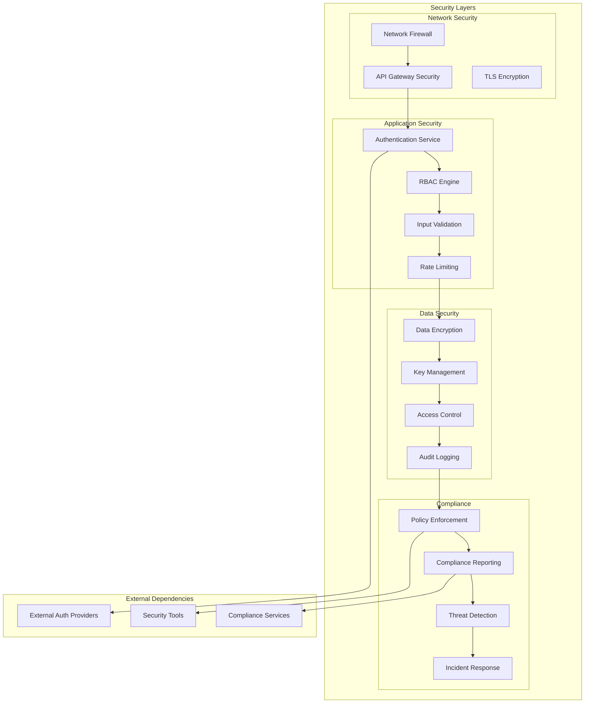

**Diagram sources**
- [07-security-architecture.md](file://docs/architecture/07-security-architecture.md)
- [ADR-008-authentication-approach.md](file://docs/adr/ADR-008-authentication-approach.md)
- [ADR-017-authorization-model.md](file://docs/adr/ADR-017-authorization-model.md)

**Section sources**
- [07-security-architecture.md](file://docs/architecture/07-security-architecture.md)
- [ADR-008-authentication-approach.md](file://docs/adr/ADR-008-authentication-approach.md)
- [ADR-017-authorization-model.md](file://docs/adr/ADR-017-authorization-model.md)

## Observability and Monitoring
The observability architecture provides comprehensive visibility into system health, performance, and business metrics:

### Monitoring Strategy
- **Structured Logging**: Correlation IDs, contextual information, and log levels
- **Metrics Collection**: Application performance, business metrics, and system health
- **Distributed Tracing**: End-to-end request tracking across module boundaries
- **Alerting**: Threshold-based alerts with escalation and notification channels

### Key Performance Indicators
- **System Health**: CPU, memory, disk, and network utilization
- **Application Performance**: Response times, throughput, and error rates
- **Business Metrics**: Forecast accuracy, user engagement, and revenue impact
- **Data Quality**: Completeness, accuracy, and timeliness of data

### Alerting and Incident Response
- **Proactive Alerting**: Early warning systems for potential issues
- **Automated Escalation**: Intelligent routing of alerts to appropriate teams
- **Runbook Integration**: Automated troubleshooting procedures
- **Post-Incident Analysis**: Root cause analysis and preventive measures

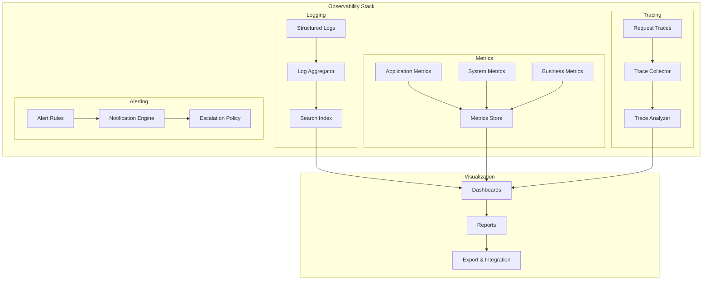

**Diagram sources**
- [08-observability-architecture.md](file://docs/architecture/08-observability-architecture.md)
- [ADR-021-internal-event-strategy.md](file://docs/adr/ADR-021-internal-event-strategy.md)

**Section sources**
- [08-observability-architecture.md](file://docs/architecture/08-observability-architecture.md)
- [ADR-021-internal-event-strategy.md](file://docs/adr/ADR-021-internal-event-strategy.md)

## Reliability Engineering
The reliability engineering framework ensures system resilience, fault tolerance, and operational excellence:

### Fault Tolerance Patterns
- **Circuit Breakers**: Automatic failure detection and graceful degradation
- **Retry Mechanisms**: Exponential backoff with jitter for transient failures
- **Bulkheads**: Resource isolation to prevent cascading failures
- **Timeouts**: Configurable timeouts for all external dependencies

### Disaster Recovery
- **Point-in-Time Recovery**: Neon PITR for precise data restoration
- **Multi-Region Replication**: Geographic redundancy for critical data
- **Automated Failover**: Seamless failover between regions and availability zones
- **Backup Verification**: Automated backup integrity testing and restoration drills

### Capacity Planning
- **Load Testing**: Continuous load testing with realistic traffic patterns
- **Capacity Monitoring**: Proactive capacity planning with growth projections
- **Auto-Scaling**: Dynamic resource allocation based on demand
- **Cost Optimization**: Right-sizing resources and identifying waste

### Operational Excellence
- **Chaos Engineering**: Proactive failure injection to test resilience
- **Canary Deployments**: Gradual rollout with automatic rollback
- **Health Monitoring**: Comprehensive health checks and proactive alerting
- **Runbooks**: Automated troubleshooting and recovery procedures

```mermaid
graph TB
subgraph "Reliability Patterns"
subgraph "Fault Tolerance"
CIRCUIT_BREAKER["Circuit Breakers"]
RETRY_MECH["Retry Mechanisms"]
BULKHEADS["Bulkhead Isolation"]
TIMEOUTS["Timeout Management"]
end
subgraph "Disaster Recovery"
PITR["Point-in-Time Recovery"]
MULTI_REGION["Multi-Region Replication"]
AUTO_FAILOVER["Automated Failover"]
BACKUP_VERIFY["Backup Verification"]
end
subgraph "Capacity Management"
LOAD_TEST["Load Testing"]
CAPACITY_MON["Capacity Monitoring"]
AUTO_SCALE["Auto-Scaling"]
COST_OPT["Cost Optimization"]
end
subgraph "Operational Excellence"
CHAOS_ENG["Chaos Engineering"]
CANARY_DEPLOY["Canary Deployments"]
HEALTH_MON["Health Monitoring"]
RUNBOOKS["Automated Runbooks"]
end
end
subgraph "Monitoring & Alerting"
RESILIENCE_METRICS["Resilience Metrics"]
FAILURE_TRACKING["Failure Tracking"]
RECOVERY_TIME["Recovery Time Monitoring"]
COST_ALERTS["Cost Alerts"]
end
CIRCUIT_BREAKER --> RESILIENCE_METRICS
RETRY_MECH --> FAILURE_TRACKING
BULKHEADS --> RECOVERY_TIME
TIMEOUTS --> COST_ALERTS
PITR --> RECOVERY_TIME
MULTI_REGION --> RESILIENCE_METRICS
AUTO_FAILOVER --> RECOVERY_TIME
BACKUP_VERIFY --> RESILIENCE_METRICS
LOAD_TEST --> CAPACITY_MON
CAPACITY_MON --> AUTO_SCALE
AUTO_SCALE --> COST_OPT
CHAOS_ENG --> RESILIENCE_METRICS
CANARY_DEPLOY --> FAILURE_TRACKING
HEALTH_MON --> RECOVERY_TIME
RUNBOOKS --> COST_ALERTS
```

**Diagram sources**
- [09-reliability-architecture.md](file://docs/architecture/09-reliability-architecture.md)
- [ADR-024-backup-and-dr.md](file://docs/adr/ADR-024-backup-and-dr.md)

**Section sources**
- [09-reliability-architecture.md](file://docs/architecture/09-reliability-architecture.md)
- [ADR-024-backup-and-dr.md](file://docs/adr/ADR-024-backup-and-dr.md)

## Scaling and Evolution
The scaling and evolution strategy provides clear pathways from MVP to enterprise-scale operations:

### Current Scaling Approach
- **Vertical Scaling**: Resource-based scaling within single container
- **Database Scaling**: Connection pooling and query optimization
- **Cache Scaling**: Redis clustering and distributed caching
- **Storage Scaling**: Object storage with automatic tiering

### Future Evolution Path
- **Microservices Migration**: Decompose monolith into independent services
- **Event-Driven Architecture**: Migrate to event streaming for loose coupling
- **Multi-Cloud Deployment**: Cloud-agnostic architecture with failover
- **Advanced AI/ML**: Integration of LLMs and automated insights

### Growth Considerations
- **Data Volume**: Handle exponential growth in time-series data
- **User Base**: Support millions of concurrent users globally
- **Model Complexity**: Manage increasingly sophisticated forecasting models
- **Regulatory Requirements**: Meet evolving compliance and governance needs

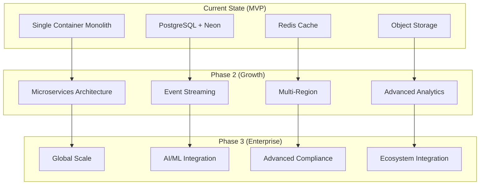

**Diagram sources**
- [10-scaling-and-evolution.md](file://docs/architecture/10-scaling-and-evolution.md)
- [ADR-031-staging-deferral.md](file://docs/adr/ADR-031-staging-deferral.md)

**Section sources**
- [10-scaling-and-evolution.md](file://docs/architecture/10-scaling-and-evolution.md)
- [ADR-031-staging-deferral.md](file://docs/adr/ADR-031-staging-deferral.md)

## Data Lineage and Metric Methodology
The system implements comprehensive data lineage tracking and sophisticated metric methodologies with enhanced registry capabilities:

### Enhanced Data Lineage Framework
Complete traceability from raw observations through feature engineering to final forecasts with methodology registry integration:

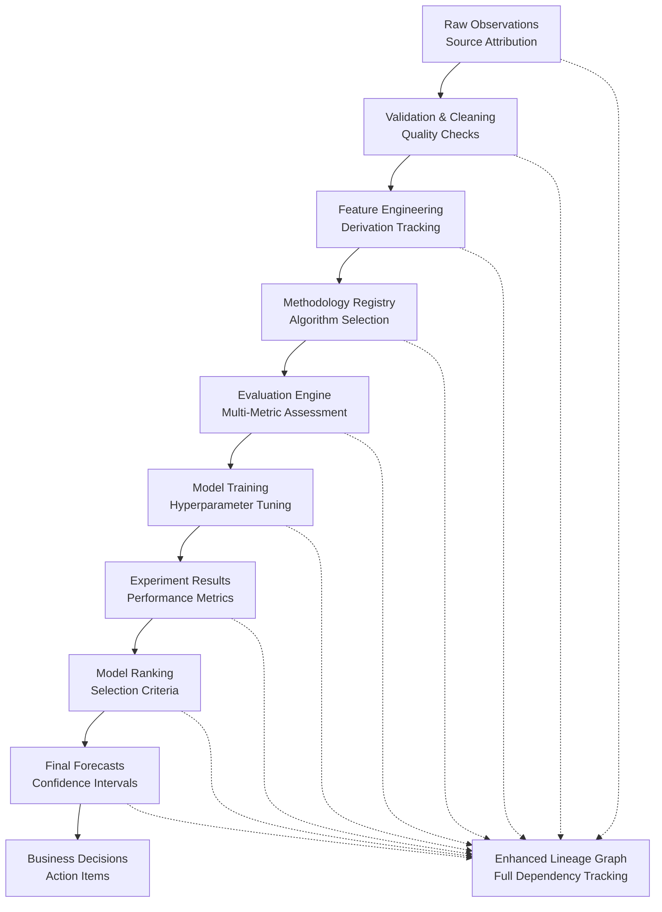

### Advanced Metric Methodology
Composite scoring approach with methodology registry and quality gates:

#### Enhanced Evaluation Dimensions
- **Accuracy Metrics**: MAPE, RMSE, MAE for point prediction quality
- **Uncertainty Quantification**: Prediction interval coverage, calibration scores
- **Computational Efficiency**: Training time, inference latency, resource utilization
- **Stability Assessment**: Performance consistency across time windows
- **Business Impact**: Alignment with organizational objectives and KPIs
- **Methodology Suitability**: Fit for purpose and domain applicability

#### Registry-Driven Scoring
Weighted composite score calculation with configurable weights per methodology:

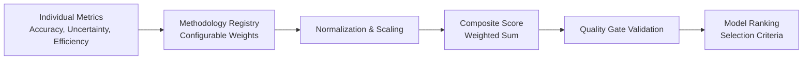

**Section sources**
- [02-data-lineage.md](file://docs/domain/02-data-lineage.md)
- [03-metric-methodology.md](file://docs/domain/03-metric-methodology.md)
- [ADR-010-composite-scoring-methodology.md](file://docs/adr/ADR-010-composite-scoring-methodology.md)
- [ADR-012-forecast-collection-lineage.md](file://docs/adr/ADR-012-forecast-collection-lineage.md)
- [ADR-030-methodology-registry.md](file://docs/adr/ADR-030-methodology-registry.md)
- [ADR-032-quality-gate-policy.md](file://docs/adr/ADR-032-quality-gate-policy.md)

## Transaction and Caching Architecture
The transaction and caching architecture provides robust data consistency and performance optimization:

### Transaction Architecture
Distributed transaction patterns with eventual consistency and comprehensive error handling:

#### Transaction Boundaries
- **Service Boundaries**: Clear transaction demarcation between modules
- **Database Transactions**: ACID properties for critical data operations
- **Saga Pattern**: Long-running transactions with compensation logic
- **Compensation Handlers**: Rollback mechanisms for failed operations

#### Consistency Models
- **Strong Consistency**: For critical financial and regulatory data
- **Eventual Consistency**: For analytics and reporting data
- **Read Your Writes**: For user-facing operations
- **Monotonic Reads**: For timeline-based queries

### Multi-Layer Caching Strategy
Sophisticated caching with stale serving and intelligent invalidation:

#### Cache Layers
- **L1 Cache**: In-memory cache for frequently accessed data
- **L2 Cache**: Redis-backed distributed cache with persistence
- **CDN Cache**: Edge caching for static assets and responses
- **Database Cache**: Query result caching with automatic invalidation

#### Stale Serving Strategy
- **Freshness Indicators**: Metadata indicating data staleness
- **Graceful Degradation**: Serving cached data when primary fails
- **Background Refresh**: Updating cache without blocking requests
- **Cache Warming**: Pre-populating cache for anticipated requests

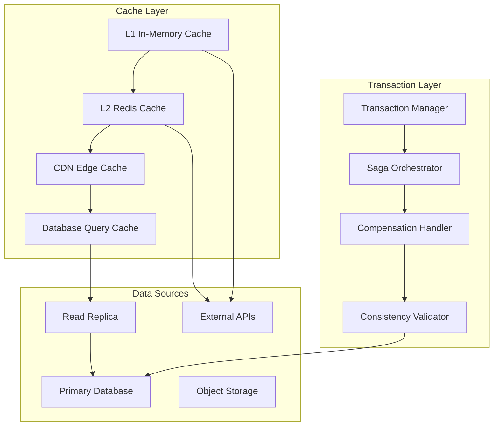

**Diagram sources**
- [ADR-027-transaction-architecture.md](file://docs/adr/ADR-027-transaction-architecture.md)
- [ADR-028-caching-and-stale-serving.md](file://docs/adr/ADR-028-caching-and-stale-serving.md)

**Section sources**
- [ADR-027-transaction-architecture.md](file://docs/adr/ADR-027-transaction-architecture.md)
- [ADR-028-caching-and-stale-serving.md](file://docs/adr/ADR-028-caching-and-stale-serving.md)

## Repository Structure and Development
The repository structure and development practices ensure maintainable codebase and efficient collaboration:

### Repository Organization
- **Monorepo Structure**: Single repository with clear module separation
- **Module Boundaries**: Well-defined interfaces between components
- **Shared Libraries**: Common utilities and shared dependencies
- **Configuration Management**: Environment-specific configurations

### Development Workflow
- **Branching Strategy**: GitFlow with feature branches and release candidates
- **Code Review**: Mandatory peer review with automated checks
- **Testing Strategy**: Unit, integration, and end-to-end testing
- **Documentation**: Living documentation with examples and guides

### Quality Assurance
- **Automated Testing**: Comprehensive test suites with coverage requirements
- **Static Analysis**: Code quality checks and security scanning
- **Performance Testing**: Load testing and benchmarking
- **Security Scanning**: Vulnerability detection and remediation

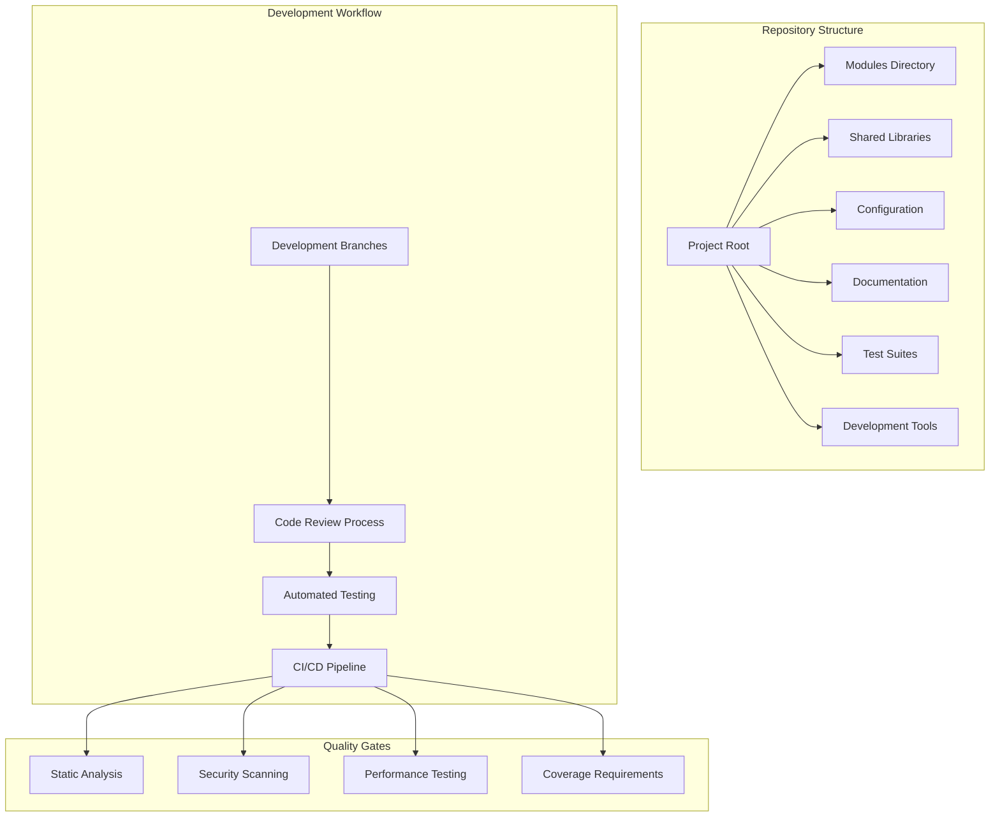

**Diagram sources**
- [ADR-023-repository-structure.md](file://docs/adr/ADR-023-repository-structure.md)
- [ADR-032-quality-gate-policy.md](file://docs/adr/ADR-032-quality-gate-policy.md)

**Section sources**
- [ADR-023-repository-structure.md](file://docs/adr/ADR-023-repository-structure.md)
- [ADR-032-quality-gate-policy.md](file://docs/adr/ADR-032-quality-gate-policy.md)

## Performance Considerations
Performance targets and scalability considerations informed by comprehensive Phase 1 architecture and domain requirements:

### Enhanced Performance Benchmarks
- **Ingestion Throughput**: Support for high-volume data streams with backpressure handling and quality scoring
- **Feature Computation**: Optimized calculations with multi-layer caching and incremental updates
- **Model Training**: Parallelizable training processes with resource allocation and GPU acceleration
- **Forecast Generation**: Sub-second response times for real-time inference with cache warming
- **Query Performance**: Optimized time-series queries with advanced indexing and partitioning

### Advanced Scalability Limits and Growth Paths
- **Horizontal Scaling**: Planned migration from monolith to microservices with event-driven architecture
- **Database Scaling**: PostgreSQL partitioning, read replicas, and connection pooling
- **Storage Expansion**: Tiered storage strategy with automated archival and compression
- **Compute Resources**: Containerization readiness for future orchestration and auto-scaling

### Enhanced Reliability and Availability
- **Data Durability**: Transactional integrity with Neon PITR and multi-region replication
- **Service Continuity**: Graceful degradation, circuit breakers, and bulkhead patterns
- **Monitoring Coverage**: Comprehensive health checks, distributed tracing, and alerting
- **Disaster Recovery**: Point-in-time recovery, automated failover, and backup verification

### Performance Optimization Strategies
- **Query Optimization**: Advanced indexing, query plan analysis, and performance tuning
- **Memory Management**: Efficient data structures, garbage collection tuning, and memory profiling
- **I/O Optimization**: Asynchronous I/O, connection pooling, and batch processing
- **Network Optimization**: Connection reuse, compression, and protocol optimization

**Section sources**
- [05-non-functional-requirements.md](file://docs/phase-0-business-analysis/05-non-functional-requirements.md)
- [00-phase-0-architecture-constraints.md](file://docs/architecture/00-phase-0-architecture-constraints.md)
- [ADR-028-caching-and-stale-serving.md](file://docs/adr/ADR-028-caching-and-stale-serving.md)
- [ADR-029-partitioning-and-retention.md](file://docs/adr/ADR-029-partitioning-and-retention.md)

## Troubleshooting Guide
Enhanced troubleshooting procedures leveraging improved observability, lineage tracking, and comprehensive monitoring:

### Advanced Diagnostic Capabilities
- **End-to-End Tracing**: Request correlation across all modules and data transformations with distributed tracing
- **Lineage Investigation**: Trace any forecast back to source observations and processing steps with full dependency graphs
- **Performance Profiling**: Identify bottlenecks in feature computation, model inference, and cache performance
- **Quality Monitoring**: Detect data drift, concept drift, model degradation, and quality gate violations

### Enhanced Common Issues and Resolution
- **Data Quality Problems**: Validate source schemas, check for missing values, verify timestamps, and monitor quality scores
- **Feature Engineering Failures**: Review derivation logic, check upstream data availability, and validate methodology registry entries
- **Model Performance Degradation**: Analyze training data freshness, monitor input distributions, and track methodology effectiveness
- **Forecast Accuracy Decline**: Investigate concept drift, update models with recent data, and evaluate methodology suitability
- **Performance Bottlenecks**: Profile query patterns, optimize indexes, scale compute resources, and tune cache strategies

### Advanced Operational Procedures
- **Health Check Monitoring**: Automated service health verification, readiness probes, and dependency health
- **Log Aggregation**: Centralized logging with structured format, correlation IDs, and log level management
- **Metrics Collection**: Key performance indicators, business metrics, system health, and anomaly detection
- **Incident Response**: Escalation procedures, automated rollback, and post-incident analysis

### Proactive Monitoring and Prevention
- **Capacity Planning**: Proactive capacity monitoring with growth projections and resource optimization
- **Anomaly Detection**: Machine learning-based anomaly detection for early issue identification
- **Trend Analysis**: Historical trend analysis for performance regression and capacity planning
- **Automated Remediation**: Self-healing systems with automated issue resolution and recovery

**Section sources**
- [05-non-functional-requirements.md](file://docs/phase-0-business-analysis/05-non-functional-requirements.md)
- [09-acceptance-criteria.md](file://docs/phase-0-business-analysis/09-acceptance-criteria.md)
- [08-observability-architecture.md](file://docs/architecture/08-observability-architecture.md)

## Conclusion
ForecastIQ's Phase 1 architecture represents a comprehensive approach to forecasting platform design, balancing immediate operational needs with future scalability requirements. The extensive domain modeling, 32 architectural decision records, and complete system context ensure clear business alignment, transparent decision-making, and robust governance for evolution paths.

The modular monolith approach enables rapid development and deployment while maintaining clear boundaries for future decomposition into microservices. Key strengths include:

- **Comprehensive Domain Understanding**: Detailed entity relationships, methodology registry, and business rules
- **Transparent Decision-Making**: Formal ADR process for architectural evolution with 32 documented decisions
- **Robust Data Governance**: Complete lineage tracking, quality assurance, and methodology evaluation
- **Scalable Foundation**: Clear migration paths from monolith to distributed architecture with defined phases
- **Operational Excellence**: Built-in observability, reliability engineering, and comprehensive monitoring
- **Advanced Security**: Defense-in-depth security with authentication, authorization, and compliance
- **Performance Optimization**: Multi-layer caching, transaction management, and query optimization
- **Disaster Recovery**: Neon PITR, multi-region replication, and automated backup verification

The system is positioned for successful MVP delivery while establishing strong foundations for enterprise-scale forecasting operations with clear evolution paths to microservices, event-driven architecture, and advanced AI/ML capabilities.

## Appendices

### Cross-Cutting Concerns
Enhanced cross-cutting concerns implementation reflecting comprehensive Phase 1 architecture decisions:

#### Advanced Security and Access Control
- **Authentication**: JWT-based stateless authentication with refresh token rotation and multi-factor authentication
- **Authorization**: Fine-grained RBAC with workspace-scoped permissions and hierarchical access control
- **Data Protection**: Encryption at rest and in transit with hardware security modules and key management
- **Audit Trail**: Immutable logs of all user actions, data modifications, and security events

#### Comprehensive Observability and Monitoring
- **Structured Logging**: Correlation IDs, contextual information, log levels, and log rotation
- **Metrics Collection**: Application performance, business metrics, system health, and anomaly detection
- **Distributed Tracing**: End-to-end request tracking across module boundaries with sampling strategies
- **Alerting**: Threshold-based alerts with escalation, notification channels, and automated remediation

#### Advanced Data Governance and Compliance
- **Lineage Tracking**: Complete data provenance from source to forecast with methodology registry integration
- **Quality Gates**: Automated validation, quality scoring, and blocking criteria
- **Retention Policies**: Configurable data lifecycle management with automated archival and deletion
- **Compliance Reporting**: Regulatory audit support, data subject requests, and automated compliance checks

### Extensibility and Plugin Architecture
Future extensibility paths defined by comprehensive architectural decisions and registry patterns:

#### Advanced Plugin Interfaces
- **Provider Plugins**: Standardized interfaces for external data source integration with fallback mechanisms
- **Algorithm Plugins**: Pluggable forecasting algorithms with evaluation hooks and performance metrics
- **Connector Plugins**: Adapters for downstream systems, output formats, and visualization tools
- **Workflow Extensions**: Custom preprocessing, postprocessing, and quality gate implementations

#### Comprehensive Migration Path to Microservices
- **Module Decomposition**: Clear boundaries enabling service extraction with well-defined APIs
- **API Contracts**: Well-defined interfaces for inter-service communication with versioning strategies
- **Data Partitioning**: Logical separation supporting physical database splitting and sharding
- **Event Streaming**: Planned migration to event-driven architecture with message brokers

### Future Enhancement Paths
Strategic roadmap informed by comprehensive architectural decisions and domain evolution:

#### Phase 1 Completion Enhancements
- **Advanced Analytics**: Causal inference, what-if analysis, prescriptive recommendations, and automated insights
- **Automated ML**: AutoML capabilities for model selection, hyperparameter tuning, and continuous learning
- **Real-time Processing**: Stream processing for live data feeds, instant forecasts, and adaptive models
- **Mobile Applications**: Native mobile apps for field data collection, offline forecasting, and push notifications

#### Phase 2 Evolution
- **Microservices Migration**: Decompose monolith into independent, scalable services with event-driven communication
- **Multi-cloud Deployment**: Cloud-agnostic architecture with failover, data residency, and cost optimization
- **Advanced Security**: Zero-trust architecture, advanced threat detection, compliance automation, and privacy controls
- **AI/ML Integration**: LLM-powered insights, natural language querying, automated report generation, and conversational interfaces

#### Phase 3 Enterprise Scale
- **Global Distribution**: Multi-region deployment with data sovereignty and low-latency access
- **Advanced Analytics**: Predictive maintenance, anomaly detection, and automated decision support
- **Ecosystem Integration**: Third-party integrations, marketplace for forecasting models, and API economy
- **Quantum Computing**: Quantum-resistant cryptography and quantum-enhanced optimization algorithms

**Section sources**
- [ADR-008-authentication-approach.md](file://docs/adr/ADR-008-authentication-approach.md)
- [ADR-011-raw-payload-retention.md](file://docs/adr/ADR-011-raw-payload-retention.md)
- [ADR-012-forecast-collection-lineage.md](file://docs/adr/ADR-012-forecast-collection-lineage.md)
- [ADR-017-authorization-model.md](file://docs/adr/ADR-017-authorization-model.md)
- [ADR-030-methodology-registry.md](file://docs/adr/ADR-030-methodology-registry.md)
- [ADR-031-staging-deferral.md](file://docs/adr/ADR-031-staging-deferral.md)
- [ADR-032-quality-gate-policy.md](file://docs/adr/ADR-032-quality-gate-policy.md)