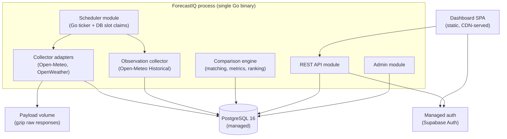

# ForecastIQ — Phase 0 Architecture Constraints

**Version**: 1.0 (Phase 0 Amendment)
**Status**: Authoritative — binding for Phase 1 Architecture
**Resolves**: ARB Blocker 4 (MVP scope & infrastructure simplification), Risks R-09/R-12, Architecture Smells 1–3
**Supersedes**: operating environment in `docs/phase-0-business-analysis/03-software-requirements-spec.md` §2.3 and §5.2

---

## 1. Approved MVP Architecture Style

**Modular monolith** (Go), single deployable, single PostgreSQL database.

**Module boundaries** (Go packages with explicit interfaces; no cross-module DB access
except via the owning module's repository):

| Module | Owns tables |
|--------|-------------|
| identity | users, api_keys, audit_events |
| catalog | workspaces, providers, provider_configurations, locations |
| collection | forecast_collections, forecast_snapshots, observations |
| analysis | matched_evaluations, accuracy_metrics, provider_rankings |
| api | (none — read models via other modules) |
| scheduler | collection_schedules, schedule_runs |

This preserves the Phase 0 bounded contexts while removing the distributed-system
overhead. Modules communicate via in-process calls; event names/payloads keep the
Phase 0 shapes for a future transport swap (ADR-006).

## 2. Approved Technology Set (MVP)

| Concern | Technology | Notes |
|---------|-----------|-------|
| Language | Go (latest stable) | Per Phase 0 decision; retained. |
| Database | PostgreSQL 16 (managed: e.g., Neon, Supabase, or provider-managed) | Standard partitioning; **no TimescaleDB** (ADR-004). |
| Raw payloads | gzip files on a block-storage volume | Object storage is a promotion (ADR-011). |
| Scheduling | In-process Go scheduler + DB-backed slot claims (`FOR UPDATE SKIP LOCKED`) | No Temporal, no pg_cron dependency (ADR-005). |
| Caching | In-process LRU with TTL for hot ranking/accuracy reads | No Redis (promotion criteria §4). |
| AuthN | Supabase Auth (managed) | ADR-008. Go verifies JWTs (JWKS). |
| API | REST/JSON, OpenAPI 3.1 spec generated from code | gRPC removed from all documents (phantom architecture, Conflict #2). |
| Dashboard | Next.js (React) static export or server components, deployed to CDN/edge | Framework decision closes Phase 0 Q5 (R-14). |
| Local dev | Docker Compose (app + postgres + payload volume) | |
| Production | Single VPS (Hetzner Cloud / DigitalOcean) + managed Postgres + CDN | §5. |
| CI/CD | GitHub Actions: lint, test, build, migrate, deploy (SSH/rsync or container) | Rollback = redeploy previous artifact (< 5 min). |
| Observability | Structured JSON logs → hosted log service (e.g., Better Stack/Grafana Cloud free tier); Prometheus-format `/metrics` endpoint; uptime checks | No Jaeger/tempo in MVP; request IDs provide correlation. |
| Migrations | Numbered SQL files, applied by deploy pipeline | |

## 3. Explicitly Excluded from MVP

Kubernetes, Temporal, NATS JetStream, Redis, TimescaleDB, S3-compatible object storage,
gRPC, service mesh, distributed tracing infrastructure (Jaeger/Tempo), read replicas,
separate worker processes, CQRS/read models, Pact contract testing, feature-flag
service.

**Rationale (accepting the DevOps dissent in full):** operating any of these for a
1–2 engineer MVP trades product progress for incident surface. Each has a documented
promotion path (§4) — none is a dead end.

## 4. Promotion Criteria (deferred technologies)

A technology is introduced only when its **measurable trigger** is observed in
production, not in anticipation. Each promotion is a small ADR-supervised migration.

| Technology | Problem it solves | Measurable trigger | Migration path | Risks of premature adoption |
|------------|-------------------|--------------------|----------------|----------------------------|
| **Redis** | Cross-restart caching, rate-limit state across instances, session sharing | p95 API latency > 150ms dominated by repeated ranking/metric queries, OR second app instance deployed needing shared rate limits | Swap the cache interface (already abstracted) to Redis; rate limiter moves to Redis INCR | Extra service to operate; cache invalidation complexity; another failure mode |
| **NATS JetStream** | Decoupled collection→analysis pipeline, replayable events, multiple consumers | Comparison engine lag > 15 min behind collection at sustained volume, OR a second consumer of collection events exists (e.g., webhooks) | In-process event bus already uses event names/payloads; publish to JetStream at the same seams; consumers become JetStream consumers with ack policy `explicit`, streams `FORECASTS`/`OBSERVATIONS` (limits, 7d retention) | Schema governance burden; message-ordering subtlety; ops overhead |
| **Temporal** | Durable multi-step workflows, retries with state, visibility into long runs | Collection jobs need coordinated multi-step recovery beyond simple retries (e.g., compensating actions), OR scheduler miss rate > 1% due to process crashes mid-job | Scheduler module boundary is isolated; replace ticker+claims with Temporal workflows per job type | Large dependency (server + UI + DB); conceptual overhead for a team of 1–2 |
| **Kubernetes** | Multi-service orchestration, rolling deploys at scale, resource isolation | ≥ 3 independently scaled services AND ≥ 4 engineers, OR availability requirement > 99.9% needing multi-AZ orchestration | Containerize modules as separate services along existing module boundaries; Helm charts; ingress + cert-manager | Highest ops burden of any item; a 1–2 person team cannot operate it safely (review smell #1) |
| **Read replicas** | Read/write isolation for heavy analytics | Analytics queries degrade write path (p95 insert latency > 50ms correlated with dashboard load) | Point analysis module reads at replica via second DSN; eventual-consistency acceptable for metrics reads | Replication lag semantics; cost; query-routing complexity |
| **Separate analytics workers** | Isolate batch CPU from API | Comparison batch exceeds 10 min or starves API CPU on the single host | Extract analysis module to second process consuming the in-process event seam (or JetStream if promoted first) | Deployment/pipeline duplication |
| **Dedicated event services / webhooks** | External consumers of changes | First paying customer requests webhooks (Level 3) | Event seam already defined; add delivery worker with outbox pattern | Delivery guarantees, retry/DLQ ops |
| **Object storage (S3)** | Cheap, durable payload retention beyond 90 days; larger payloads | Payload volume > 50 GB or retention requirement > 90 days or backup-size concerns | `raw_payload_object_key` already scheme-prefixed; add `s3://` writer behind the same interface; lifecycle policies | Another credential + dependency; egress costs |
| **TimescaleDB** | See ADR-004 | Sustained queries > 200ms at p95 on partitioned tables, or retention/compression ops become manual burden | Extension install + hypertable migration on snapshot/observation tables; continuous aggregates only with measured aggregation cost | Extension lock-in; operational knowledge; not needed at MVP scale |

## 5. Production Hosting Model

**Target: USD 50–150/month** (constraint C-03 upper bound remains $500; this target is
meaningfully below it).

| Component | Choice | Est. cost/mo |
|-----------|--------|--------------|
| App VPS | Hetzner CX32-class (4 vCPU, 8 GB RAM) or equivalent | ~$10–15 |
| Managed PostgreSQL | Neon/Supabase paid tier (3 GB+ storage, PITR, daily backups) | ~$20–25 |
| Payload volume | 50 GB block storage on the VPS | ~$5 |
| Dashboard hosting | Static on CDN (Cloudflare Pages / Vercel free tier) | $0 |
| Auth | Supabase Auth (included in DB tier / free tier) | $0 |
| Domain + TLS | Registrar + Let's Encrypt (automated renewal via Caddy) | ~$1.5 |
| Monitoring/logs | Grafana Cloud or Better Stack free tier + uptime checks | $0 |
| Backups | Managed DB PITR + nightly `pg_dump` to the volume + weekly offsite (rsync to second VPS or B2) | ~$5 |
| **Total** | | **~$45–55** |

Headroom: this model comfortably serves the Level 2 portfolio MVP (tens of concurrent
users, ~30K snapshots/day). Single-VPS failure is mitigated by: managed DB (separate
failure domain), nightly dumps offsite, and < 1 h redeploy-to-new-VPS runbook
(RTO target 4 h per NFR). Multi-AZ/region DR is a Level 3 concern.

**Caddy** terminates TLS (automatic certs) and reverse-proxies the Go binary —
satisfying TLS 1.3 without cert-manager/K8s.

## 6. Operational Boundaries for Phase 1

Phase 1 Architecture MUST stay within these boundaries:

1. One deployable Go binary (+ dashboard static build). No additional long-running services.
2. One database. No additional data stores.
3. All scheduling inside the process with DB-based leader/slot safety (a second
   instance must not double-collect; `SKIP LOCKED` claims guarantee this).
4. Graceful shutdown: stop scheduler intake, drain in-flight work (30 s), close pool.
5. Health endpoints `/healthz`, `/readyz` (DB ping + payload volume writable).
6. Every module exposes Prometheus metrics at `/metrics` (collection success/failure,
   engine lag, API RED metrics) — strong engineering without distributed infra.
7. Day-2 runbooks required at Level 2: backup restore, disk full, provider key
   rotation, deploy rollback, payload-volume corruption. (Closes review suggestion #15.)
8. Feature flags: provider enable/disable is a **database status field** (already in the
   domain model) — no deploy needed, no flag service needed. (Closes suggestion #18.)

## 7. What Still Demonstrates Senior Engineering

Per the amendment mandate, complexity is not the proof of skill. The MVP demonstrates
engineering quality through:

- Clear domain modeling with full collection→snapshot lineage
- Idempotent, deduplicated, checksummed collection
- Statistically correct, versioned, reproducible metrics with confidence intervals
- Reliable DB-backed scheduling with skip-locked slot claims
- Property-based testing of all statistical formulas
- OpenAPI-first contract with standardized errors, request IDs, and freshness states
- Deployment automation with < 5 min rollback
- Operational runbooks and SLO tracking

## 8. Cross-Reference

- ADRs: ADR-001 (modular monolith), ADR-004 (PostgreSQL vs TimescaleDB), ADR-005
  (scheduler), ADR-006 (event bus deferral), ADR-007 (Kubernetes deferral), ADR-011
  (raw payload retention)
- Scope levels: `docs/planning/01-scope-levels.md`
- Estimate: `docs/planning/02-revised-mvp-estimate.md`
- NFR (revised to match this architecture): `docs/requirements/02-non-functional-requirements.md`
