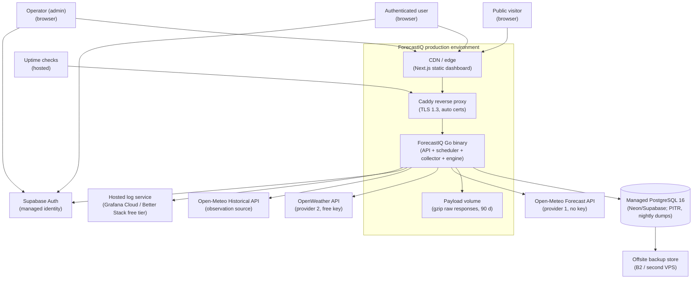
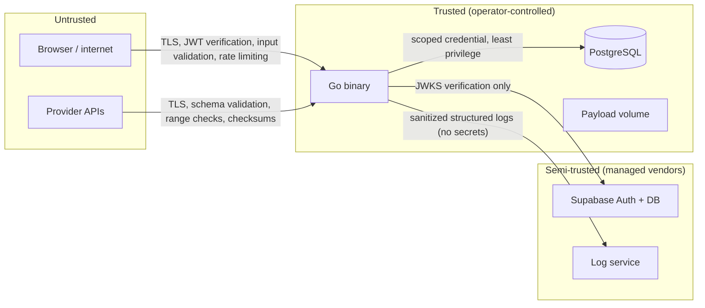

# ForecastIQ — System Context (Phase 1)

**Version**: 1.0
**Status**: Approved — Phase 1 Architecture
**Authority**: Implements `docs/architecture/00-phase-0-architecture-constraints.md` §1–§5

---

## 1. Context Diagram

## 2. Actors

| Actor | Description | Interface |
|-------|-------------|-----------|
| Public visitor | Unauthenticated; views rankings, accuracy, comparisons (AUTH-08) | Dashboard via CDN; public API endpoints |
| Authenticated user | Registered via Supabase Auth; raw data API, settings, API keys | Dashboard + Bearer JWT |
| Operator (admin) | Single-operator MVP; all admin functions | Dashboard admin section + Bearer JWT (role=admin) |
| Scheduled collection | Internal actor: in-process scheduler | Provider APIs, observation API |
| External providers | Open-Meteo (forecast), OpenWeather (forecast), Open-Meteo Historical (observations) | HTTPS REST, JSON |
| Supabase Auth | Managed identity: registration, verification, login, reset, sessions, brute-force defense | OAuth/password flows (browser); JWKS (backend); Admin API (backend, service-role key) |

## 3. Trust Boundaries

| Boundary | Crossing | Controls |
|----------|----------|----------|
| Internet → API | HTTPS (TLS 1.3, Caddy) | JWT verification (JWKS), API-key verification (hashed lookup), input validation middleware, per-key/per-IP rate limiting, request-size limits, CORS allowlist |
| Provider → collector | Outbound HTTPS only (no inbound webhooks in MVP) | Response schema validation, physical range validation, checksum before parse, adapter versioning, circuit breaker |
| App → database | TLS (managed DB enforces), single scoped credential | Parameterized queries only (no string SQL), no superuser, immutability triggers |
| App → Supabase Auth | JWKS fetch (cached); Admin API with service-role key | Service-role key is backend-only (never shipped to browser); JWKS pinning with rotation tolerance |
| App → log service | Structured JSON over TLS | No tokens, credentials, or raw payloads in logs (NFR-OBS01) |

## 4. External Dependencies

| Dependency | Role | Failure behaviour |
|------------|------|-------------------|
| Open-Meteo Forecast | Provider 1 | Circuit breaker (5 consecutive failures → open, 60 s half-open); other provider unaffected; freshness degrades per BR-FRESH |
| OpenWeather | Provider 2 (ToS-gated, D-05) | Same isolation; rate-budget enforcement (24 calls/day/location) |
| Open-Meteo Historical | Sole observation source | Observations stop; matching/metrics continue on existing data; freshness state → delayed/stale; rankings not corrupted (BR-FRESH, NFR-A07) |
| Supabase Auth | All authentication | Public data remains readable (cached); authenticated actions unavailable; degraded mode documented (R-14) |
| Managed PostgreSQL | System of record | API serves stale cache with explicit staleness (NFR-A07) until recovery; collections pause; RPO < 1 h (PITR) |
| Payload volume | Raw payloads, GDPR exports | Collections continue (payload write failure = degraded lineage, alerted); normalized data unaffected |
| CDN | Dashboard static assets | Cached assets at edge continue serving; origin loss degrades to stale SPA |
| Log service | Observability | Local ring buffer (bounded); loss acceptable, alerted on gap |

## 5. Primary Data Flows

| # | Flow | Path | Frequency |
|---|------|------|-----------|
| F1 | Forecast collection | Scheduler → provider API → validate → gzip payload to volume → collection + snapshot rows to DB | Hourly per provider-location (≤ 240 collections/day at 10 locations) |
| F2 | Observation collection | Scheduler (at :05) → Open-Meteo Historical → validate + provenance-tag → observation rows | Hourly per location |
| F3 | Matching + evaluation | Batch (every 30 min): unmatched snapshots × observations → MatchedEvaluation → AccuracyMetric → ProviderRanking rows | ≤ 100K pairs/batch at design headroom |
| F4 | Dashboard read | Browser → CDN (static) → API → pre-computed rows + LRU/ETag | Tens of concurrent users; p95 < 200 ms |
| F5 | Admin operations | Browser → API (role=admin) → config mutations + audit | Sporadic |
| F6 | Auth flows | Browser ↔ Supabase Auth; API verifies JWT via JWKS | Per session |

## 6. Sensitive-Data Paths

| Data | Storage | Protection |
|------|---------|-----------|
| User credentials | **Not stored by ForecastIQ** (Supabase Auth owns) | Managed service; refresh rotation with theft detection |
| Supabase JWTs | Browser only (memory/localStorage per Supabase SDK) | Short-lived (≤ 1 h); JWKS verification server-side |
| Provider API keys (OpenWeather) | `provider_configurations.credential_ref` → encrypted reference; actual secret in env/vault at runtime | Never logged, never returned by API (BR-08); serializer-level exclusion |
| App-issued API keys | SHA-256/argon2 hash only; plaintext shown once at creation | Prefix for lookup; revocation immediate |
| Supabase service-role key | Environment variable on VPS only | Backend-only; enables user disable/delete propagation |
| GDPR export files | Payload volume, 24 h expiry | Download link unguessable (UUID); deleted after expiry |
| Raw provider payloads | Volume, gzip, 90 d | Not publicly served; admin sees key + checksum prefix only; no file-serving route exists |
| IP addresses | Audit events (1 y retention) | Minimal; operational necessity documented |

## 7. Failure Boundaries

One provider's failure never blocks another (per-provider circuit breaker + independent schedule slots). Observation delays never corrupt rankings (matching waits; batch recomputes as new rows). A VPS failure isolates from the database (managed DB is a separate failure domain; RTO < 4 h runbook). The architecture has **no queue, no broker, no inter-service calls** — the only distributed boundaries are: browser↔API, API↔DB, collector↔providers, API↔JWKS.

## 8. Cross-Reference

- Container detail: `docs/architecture/02-container-architecture.md`
- Deployment: `docs/architecture/06-deployment-architecture.md`
- Security: `docs/architecture/07-security-architecture.md`, `docs/security/02-threat-model.md`
- ADRs: ADR-001 (monolith), ADR-007 (VPS + Caddy), ADR-008 (Supabase Auth)
