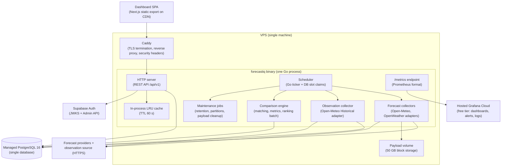

# ForecastIQ — Container Architecture (Phase 1)

**Version**: 1.0
**Status**: Approved — Phase 1 Architecture
**Authority**: ADR-001, ADR-007; `docs/architecture/00-phase-0-architecture-constraints.md` §1–§3

---

## 1. Container Diagram



## 2. Deployment Units (MVP: four)

| Unit | Technology | Responsibilities | Count |
|------|-----------|------------------|-------|
| **forecastiq** | Go 1.23+ single binary | REST API, scheduler, collection, normalization, matching, evaluation, ranking, maintenance, health, metrics | 1 process |
| **dashboard** | Next.js static export | All 15 screens; client-side composition (≤ 2 requests per screen); CSV export generation; Supabase Auth SDK | CDN-served assets (no server) |
| **postgres** | Managed PostgreSQL 16 | System of record for all state; PITR; immutability triggers; partitioned time tables | 1 managed instance |
| **caddy** | Caddy 2 | TLS 1.3 (automatic Let's Encrypt), reverse proxy, security headers, gzip | 1 process on VPS |

The API and worker share **one codebase and one process**. The scheduler is a goroutine subsystem, not a separate deployment. This is the binding decision of ADR-001; the "separate worker process" is a promotion (constraints §4).

## 3. Runtime Boundaries Inside the Binary

| Boundary | Mechanism | Rationale |
|----------|-----------|-----------|
| HTTP server ↔ domain modules | Gin router → application use cases → module interfaces | Contract-first; handlers contain no business logic |
| Scheduler ↔ collectors | Job dispatch via the same use-case interfaces the API uses for manual trigger | One code path for scheduled and manual collection |
| Modules ↔ persistence | Each module owns its repository; **no cross-module table access** (lint-enforced) | Preserves bounded contexts for future extraction |
| Engine ↔ other modules | In-process event seam (versioned Go interfaces; event names/payloads per ADR-006) | Future NATS swap is transport-only |
| All ↔ DB | Single pgxpool (max 20 connections) | One process, one pool; PgBouncer is a promotion |

## 4. What Is Explicitly NOT in the MVP

Per constraints §3 (binding): Kubernetes, Temporal, NATS JetStream, Redis, TimescaleDB, S3-compatible object storage, gRPC, service mesh, distributed tracing infrastructure (Jaeger/Tempo), read replicas, separate worker processes, CQRS/read models, Pact contract testing, feature-flag service, PgBouncer, message queues of any kind.

Each has a documented, measurable promotion trigger (constraints §4; `docs/architecture/10-scaling-and-evolution.md`).

## 5. Communication Methods

| From → To | Method | Notes |
|-----------|--------|-------|
| Browser → dashboard | HTTPS to CDN | Static assets, immutable hashing |
| Browser → API | HTTPS REST/JSON via Caddy | CORS allowlist; ETag/304; rate-limit headers |
| Browser → Supabase Auth | Supabase SDK (managed endpoints) | Registration, login, refresh, reset |
| Binary → PostgreSQL | TLS, pgxpool, parameterized SQL | Max 20 conns; statement timeout 30 s (API) / 5 min (batch) |
| Binary → providers | Outbound HTTPS, per-provider timeout (10 s), retries with backoff | Token bucket per provider; circuit breaker per provider |
| Binary → Supabase | JWKS fetch (cache 15 min); Admin API (service-role) | Auth verification is read-only; admin propagation is write |
| Binary → volume | Local filesystem (gzip files) | Path scheme `payloads/{provider}/{yyyy}/{mm}/{dd}/{id}.json.gz` |
| Grafana → binary | Scrape `/metrics` (pull over TLS or via log-shipper) | Prometheus exposition format |

## 6. Scaling Model (MVP)

- **Vertical only.** One VPS (4 vCPU / 8 GB) serves API + scheduler + engine. Headroom: NFR-P05 (100 req/s) is ~10× expected load; collection is dozens of jobs/day.
- **Reads scale via caching**: in-process LRU (60 s TTL) + ETag/304 + CDN for the dashboard. Rankings/accuracy reads hit pre-computed rows (≤ 10⁴–10⁵ rows total).
- **Writes are trivial**: ~30K snapshots/day ≈ 0.35 rows/s average; burst at collection time ≈ 400 rows/s for seconds.
- **First scale-out step** (promotion, not plan): second app instance with SKIP LOCKED already safe → then Redis for shared rate limits/cache (constraints §4).

## 7. Failure Behaviour

| Failure | Behaviour |
|---------|-----------|
| Provider timeout/5xx | Retry (1, 2, 4, 8, 16 s; max 5) → circuit open after 5 consecutive → half-open probe at 60 s; collection row records status + error_code; other providers/locations proceed |
| DB transient failure | API: stale-cache serving with explicit staleness (NFR-A07); scheduler: slots unclaimed, reclaimed next cycle (lease expiry); engine: batch fails, retries next cycle (idempotent) |
| Volume unavailable | Payload write fails → collection proceeds with `error_code = payload_write_failed` (alerted); snapshots still stored; replay unavailable for affected window |
| Process crash | systemd restart (< 5 s); scheduler re-claims expired slots; in-flight collections idempotent by snapshot uniqueness; graceful shutdown drains 30 s on SIGTERM |
| OOM/panic | systemd restart; panic recovery middleware logs request_id; watchdog metric `process_restarts_total` alerts |
| Supabase outage | Public reads unaffected; authenticated flows fail with 503 `service_unavailable` + retry guidance |

## 8. Process Lifecycle

```text
start → load config (env) → connect pool → run pending migrations (deploy flag) →
seed system workspace + providers (idempotent) → start HTTP server (/readyz green) →
start scheduler loop → serve
shutdown (SIGTERM) → stop scheduler intake → drain in-flight (30 s deadline) →
close pool → exit 0
```

Health endpoints: `/healthz` (process alive), `/readyz` (DB ping + payload volume writable + JWKS reachable).

## 9. Cross-Reference

- Module internals: `docs/architecture/03-module-architecture.md`
- Deployment: `docs/architecture/06-deployment-architecture.md`
- Scheduling detail: `docs/workflows/05-scheduling-and-retries.md`
- ADRs: ADR-001, ADR-005, ADR-007
