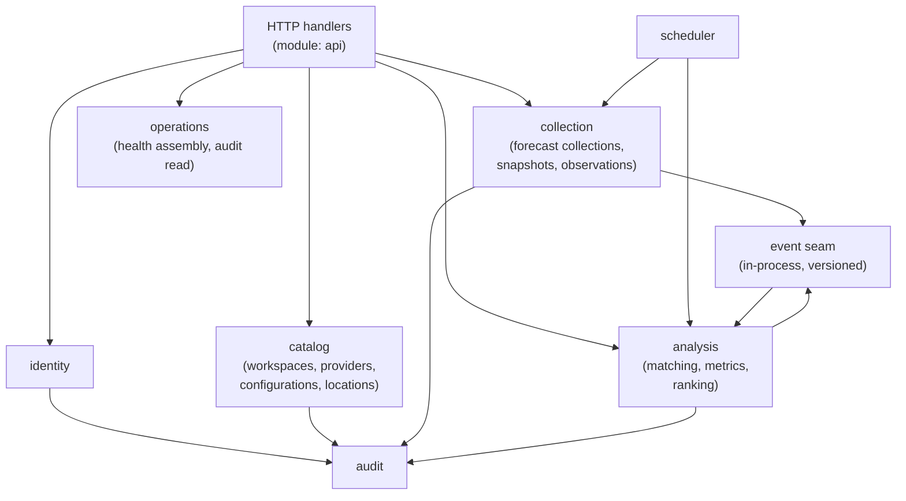

# ForecastIQ — Module Architecture (Phase 1)

**Version**: 1.0
**Status**: Approved — Phase 1 Architecture
**Authority**: ADR-001; constraints §1 module boundaries; `docs/domain/01-domain-model.md` §2, §10

---

## 1. Dependency Rule

```text
HTTP handlers (Gin)  /  Scheduler jobs  /  CLI commands
            ↓
Application use cases (orchestration, transactions, authorization calls)
            ↓
Domain model (entities, invariants, formulas, matching rules)
            ↓
Ports (Go interfaces: repositories, adapters, event bus, clock, payload store)
            ↓
Infrastructure adapters (pgx repositories, HTTP clients, filesystem, JWKS, LRU)
```

**Binding rules:**
1. Dependencies point inward only. Domain has zero infrastructure imports.
2. Each module owns its tables; **no cross-module repository or table access** (enforced by a lint rule on package imports; CI gate).
3. Cross-module collaboration happens via module **service interfaces** (consumed ports) or the in-process event seam — never by reading another module's tables.
4. No circular package dependencies (verified by `go vet` + CI check).

## 2. Module Map



## 3. Module Specifications

### 3.1 identity

| Attribute | Specification |
|-----------|---------------|
| Responsibility | JWT verification (JWKS), user provisioning/mapping, API keys, roles, sessions (verification only), GDPR export/delete orchestration |
| Owned entities | `users`, `api_keys`, `export_jobs` |
| Exposed interfaces | `Authenticator` (verify Bearer/API key → principal), `UserManager` (get/patch/disable/delete, provision-on-first-login), `APIKeyManager` (create/list/revoke) |
| Consumed interfaces | `audit.Recorder`, Supabase Admin client (infra), payload store (export files) |
| Commands | ProvisionUser, UpdatePreferences, CreateAPIKey, RevokeAPIKey, RequestExport, CompleteExport, DisableUser, DeleteUser |
| Queries | PrincipalByToken, PrincipalByKey, UserByID, KeysByUser, ExportJobStatus |
| Transaction boundary | One tx per command (user + audit in same tx) |
| Failure behaviour | JWKS unavailable → 401 with `retryable: true` (cached JWKS tolerates 15 min); Supabase Admin failure on disable/delete → 502 `provider_unavailable` + alert, local state unchanged (no split-brain) |

### 3.2 catalog

| Attribute | Specification |
|-----------|---------------|
| Responsibility | Workspaces, providers (metadata/attribution/status), provider configurations (credentials ref, schedules, adapter version), locations (CRUD, dedup, timezone, eligibility) |
| Owned entities | `workspaces`, `providers`, `provider_configurations`, `locations`, `provider_circuits` |
| Exposed interfaces | `LocationManager` (create with BR-LOC-01 dedup, update, disable, list), `ProviderCatalog` (list/get, status changes), `ConfigurationManager` (schedule/credential updates), `CircuitState` (read/update breaker state) |
| Consumed interfaces | `audit.Recorder` |
| Commands | CreateLocation, UpdateLocation, SetLocationStatus, SetProviderStatus, UpdateConfiguration, RecordCircuitTransition |
| Queries | ActiveLocations, LocationByID, Providers (with attribution), ConfigurationFor(provider, location), CircuitFor(provider), NextScheduleDue |
| Transaction boundary | One tx per command; location create includes dedup check + audit atomically |
| Failure behaviour | Duplicate location → 409 `duplicate` with existing reference; circuit state upsert failure → fail collection attempt (conservative: treat as open) |

### 3.3 collection

| Attribute | Specification |
|-----------|---------------|
| Responsibility | Forecast collection (provider call → validate → decompose → store), raw payload persistence, observation collection (validate → provenance-tag → store), condition mapping, dedup/idempotency enforcement |
| Owned entities | `forecast_collections`, `forecast_snapshots`, `observations` |
| Exposed interfaces | `ForecastCollector` (CollectNow(provider, location) → collection result), `ObservationCollector` (CollectObservations(location)), `ForecastReader` (filtered queries), `ObservationReader`, `PayloadReplayer` (replay stored payload → new collection) |
| Consumed interfaces | Provider adapters (ports: `ForecastProviderAdapter`, `ObservationSourceAdapter`), `catalog.ConfigurationManager`, `catalog.CircuitState`, payload store (port), `audit.Recorder`, event seam (publishes `forecast.collected`, `observation.collected`) |
| Commands | RunForecastCollection, ReplayPayload, RunObservationCollection |
| Queries | CollectionsByFilter (admin), SnapshotsByFilter (user+), LatestObservation(location), ObservationsByFilter, CollectionWindow(provider, location) |
| Transaction boundary | One tx per collection: collection row + snapshot batch + circuit update + event emission (in-process, participates in tx commit). Snapshot batch ≤ ~400 rows (168 target hours + margin) |
| Failure behaviour | Per FC-08..FC-13: retry/backoff, circuit breaker, partial status, schema-drift alerting; payload write failure degrades gracefully (collection still stored) |

### 3.4 analysis

| Attribute | Specification |
|-----------|---------------|
| Responsibility | Forecast–observation matching, pair-level evaluation, metric aggregation (with CIs, weighting), provider ranking (normalization, penalties, statuses, ties), recomputation/invalidation |
| Owned entities | `matched_evaluations`, `accuracy_metrics`, `provider_rankings` |
| Exposed interfaces | `MatchingEngine` (MatchPending), `MetricAggregator` (AggregatePeriod), `RankingService` (ComputeRankings, Recompute), `AccuracyReader`, `RankingReader` |
| Consumed interfaces | `collection.ForecastReader`/`ObservationReader` (via read ports, not tables), `catalog.ProviderCatalog` (active providers), event seam (consumes `forecast.collected`, `observation.collected`; publishes `accuracy.calculated`, `provider.health_changed`) |
| Commands | RunMatchingBatch, RunAggregationBatch, RunRankingBatch, RecomputeScope (admin), HandleObservationCorrection (rematch + recompute affected) |
| Queries | MetricsByFilter (trend), RankingCells(location, horizon), RankingGrid(provider), LatestBatchTimestamp |
| Transaction boundary | Batch writes in chunked txs (1,000 pairs/tx; 500 metric rows/tx; rankings one tx per batch — ≤ 700 rows); supersede links set in same tx as new rows |
| Failure behaviour | Batch failure → no partial publication (rankings atomically replaced per scope); next cycle retries; per-variable missing data skipped (CE-11) |

### 3.5 api (HTTP layer)

| Attribute | Specification |
|-----------|---------------|
| Responsibility | Routing, middleware (auth, rate limit, request ID, CORS, validation, recovery), request/response mapping, envelope assembly (freshness, provenance, attribution, warnings), ETag/LRU, OpenAPI generation |
| Owned entities | None (read models via other modules) |
| Exposed interfaces | HTTP endpoints per `docs/api/05-endpoint-catalog.md` |
| Consumed interfaces | All module service interfaces |
| Transaction boundary | Read endpoints: none (single query per handler); mutations: delegated to module commands |
| Failure behaviour | Panic recovery → 500 `internal` (sanitized) + request_id; validation → 422 with field errors; all errors per RFC 7807 taxonomy |

### 3.6 scheduler

| Attribute | Specification |
|-----------|---------------|
| Responsibility | Slot generation from configurations, due-slot claiming (FOR UPDATE SKIP LOCKED), lease management, dispatch to collection/analysis/maintenance, run history, missed-schedule detection, manual trigger support |
| Owned entities | `collection_schedules`, `schedule_runs` |
| Exposed interfaces | `SchedulerControl` (TriggerNow, PauseProvider, RunHistory), health data for operations module |
| Consumed interfaces | `collection.*Collector`, `analysis.*Batch`, `catalog.ConfigurationManager`/`CircuitState`, maintenance jobs |
| Commands | ClaimDueSlots (internal loop), TriggerManualCollection, MarkRunComplete/Failed |
| Queries | DueSlots, RunHistory (filters), NextScheduledAt(provider, location) |
| Transaction boundary | Claim = one short tx (SELECT FOR UPDATE SKIP LOCKED + UPDATE lease); job execution is outside the claim tx; completion recorded in its own tx |
| Failure behaviour | Crash mid-job → lease expires (5 min) → next cycle reclaims; idempotent jobs make this safe; watchdog metric `scheduler_missed_slots_total` |

### 3.7 operations

| Attribute | Specification |
|-----------|---------------|
| Responsibility | Health assembly (per provider-location status, circuits, freshness, volume, engine lag, backup status), operational metrics emission, alert-rule data |
| Owned entities | None (reads via module interfaces + `statfs` + backup status file) |
| Exposed interfaces | `HealthAssembler` (full admin health payload), `/healthz`, `/readyz`, `/metrics` |
| Consumed interfaces | `collection.*Reader`, `analysis.RankingReader` (batch timestamp), `catalog.CircuitState`, `scheduler.RunHistory` |
| Failure behaviour | Assembly timeout → partial health with per-section error flags (never 500 on health) |

### 3.8 audit

| Attribute | Specification |
|-----------|---------------|
| Responsibility | Append-only audit event recording, admin audit query |
| Owned entities | `audit_events` |
| Exposed interfaces | `Recorder` (Record(action, actor, resource, details, ip)), `AuditReader` (paginated admin query) |
| Consumed interfaces | None |
| Transaction boundary | Participates in the caller's tx (same DB, same process — no outbox needed) |
| Failure behaviour | Audit write failure fails the entire command (audit is mandatory, not best-effort, for admin mutations) |

## 4. Module ↔ Table Ownership (binding)

| Module | Tables |
|--------|--------|
| identity | `users`, `api_keys`, `export_jobs` |
| catalog | `workspaces`, `providers`, `provider_configurations`, `locations`, `provider_circuits` |
| collection | `forecast_collections`, `forecast_snapshots`, `observations` |
| analysis | `matched_evaluations`, `accuracy_metrics`, `provider_rankings` |
| scheduler | `collection_schedules`, `schedule_runs` |
| audit | `audit_events` |
| api / operations | (none) |

## 5. Event Seam (ADR-006 implementation)

| Event | Producer | Consumer | Payload (versioned) |
|-------|----------|----------|---------------------|
| `forecast.collected` | collection | analysis (queue matching eligibility), operations (metrics) | `{schema_version: 1, collection_id, provider_id, location_id, snapshot_count, status}` |
| `observation.collected` | collection | analysis (matching), operations | `{schema_version: 1, location_id, source, count, observation_type_mix}` |
| `observation.corrected` | collection | analysis (rematch + recompute affected scope) | `{schema_version: 1, location_id, observed_at, superseded_observation_id, new_observation_id}` |
| `accuracy.calculated` | analysis | operations (engine-lag metric, health_changed evaluation) | `{schema_version: 1, batch_id, scope, metrics_written, rankings_written}` |
| `provider.health_changed` | collection (circuit transitions) | operations (alert data) | `{schema_version: 1, provider_id, old_state, new_state, consecutive_failures}` |

Delivery: synchronous in-process calls through a versioned Go interface (`EventBus.Publish(ctx, event)`); emission participates in the producing transaction. Payload shapes are frozen for future NATS transport swap.

## 6. Cross-Reference

- Repository layout: `docs/delivery/01-repository-structure.md`
- Workflows through modules: `docs/workflows/01..06`
- Lint rule: no import of another module's `internal/persistence` package (CI `depguard` config)
