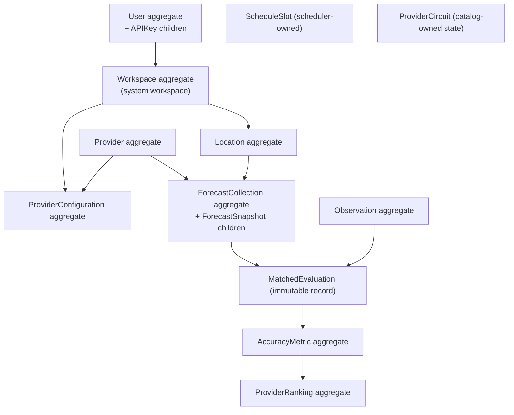

# ForecastIQ — Domain Architecture (Phase 1)

**Version**: 1.0
**Status**: Approved — Phase 1 Architecture
**Authority**: `docs/domain/01-domain-model.md` (v2.0, authoritative ERD); `docs/domain/04-ui-domain-model-reconciliation.md` (amendments); ADR-009, ADR-012

This document refines the approved domain model into implementable aggregates with lifecycle rules, identity, invariants, and deletion policies. The Phase 0 ERD remains the normative entity specification; this document adds the implementation-level decisions.

---

## 1. Aggregate Map

## 2. Aggregate Specifications

### 2.1 Workspace (root)

| Attribute | Specification |
|-----------|---------------|
| Identity | UUIDv7; single `system` workspace seeded at bootstrap (slug `system`) |
| Ownership | Root of ownership for locations, provider_configurations, api_keys, export_jobs |
| Lifecycle | Created once at bootstrap; status `active` (disable = Level 3 concern) |
| Invariants | Slug unique; at least one workspace always exists |
| Mutable fields | name, status, updated_at |
| Immutable fields | id, slug, created_at |
| Deletion policy | Never deleted |
| Audit | Status changes (Level 3) |

### 2.2 User (root) — children: APIKey

| Attribute | Specification |
|-----------|---------------|
| Identity | UUIDv7; external identity via unique `auth_subject` (Supabase user id) |
| Ownership | Owns api_keys; belongs to system workspace (via workspace_id) |
| Lifecycle | `provisioned` (on first authenticated request) → `active` → `disabled` → `deleted`. Email verification is Supabase-side; local status reflects admin actions. First account seeded `admin` at bootstrap. |
| Invariants | auth_subject unique; email unique; role ∈ {admin, user}; at least one active admin must exist (self-disable/delete guard → 409); revoked keys never reactivated |
| Mutable fields | email (sync from auth), role (operation-level only), status, default_location_id, preferences, last_login_at, updated_at |
| Immutable fields | id, auth_subject, created_at |
| Deletion policy | AUTH-09: delete user row + keys + export jobs; weather data untouched (not personal); Supabase account deleted via Admin API; audit rows retained (anonymized actor reference acceptable after deletion — audit.user_id FK is ON DELETE SET NULL) |
| Audit | All status changes, preference changes, key lifecycle, deletion |

**APIKey (child entity):** id, key_hash (argon2id), key_prefix (unique, indexed), scopes (JSONB: endpoint groups), rate_limit_per_min, expires_at, revoked_at. Plaintext shown exactly once at creation. Revocation is immediate (revoked_at set; verification checks it).

### 2.3 Location (root)

| Attribute | Specification |
|-----------|---------------|
| Identity | UUIDv7 |
| Ownership | workspace_id (system) |
| Lifecycle | `active` → `disabled` (→ `archived` reserved). Creation validates: coordinates (lat −90..90, lon −180..180), IANA timezone, BR-LOC-01 dedup (0.05° proximity → 409 unless override). Disable stops future collection; historical data remains (BR-LOC-03). |
| Invariants | (workspace_id, name) unique among active; coordinates immutable after creation (a moved location is a new location — preserves historical data integrity); timezone validated against IANA registry at write time |
| Mutable fields | name, status, updated_at |
| Immutable fields | id, workspace_id, latitude, longitude, country_code, timezone, created_at |
| Deletion policy | Never deleted (soft-delete via status); FKs from pipeline tables remain valid forever |
| Audit | create, update, status change (with dedup override flag) |
| Provider eligibility | All active providers collect for all active locations in MVP (no per-location provider restriction; Level 3 consideration) |

### 2.4 Provider (root)

| Attribute | Specification |
|-----------|---------------|
| Identity | UUIDv7; seeded rows: `open-meteo`, `openweather` |
| Lifecycle | `active` → `disabled`. Disable → scheduler skips all slots for provider; stored data untouched (BR-LOC-03 pattern). |
| Invariants | slug unique; attribution_text + attribution_url NOT NULL (BR-ATTR-01); status transitions audited |
| Mutable fields | name, api_base_url, status, attribution_text, attribution_url, updated_at |
| Immutable fields | id, slug, created_at |
| Capabilities (config, not table) | Supported variables, horizon span, array shape, rate-limit budget — declared in adapter registration code (versioned with adapter) |
| Adapter version | Recorded per collection (`adapter_version`); latest successful collection exposes it publicly (amendment §4.1) |
| Rate-limit metadata | Per-provider token bucket config in provider_configuration (calls/day budget); circuit state in `provider_circuits` |
| Deletion policy | Never deleted |
| Audit | Status changes, attribution changes |

### 2.5 ProviderConfiguration (root)

| Attribute | Specification |
|-----------|---------------|
| Identity | UUIDv7; one per (workspace, provider) in MVP |
| Ownership | workspace_id |
| Lifecycle | `active` / `disabled`; `validation_state` ∈ {unvalidated, validated, failed} (set by a test collection) |
| Invariants | (workspace_id, provider_id) unique; credential_ref is an opaque reference (secret in env; reference names the env key — BR-08); collection_schedule is a JSONB cron-like spec validated at write time |
| Mutable fields | status, credential_ref, collection_schedule, adapter_version (on deploy), validation_state, updated_at |
| Immutable fields | id, workspace_id, provider_id, created_at |
| Deletion policy | Never deleted (disable only) |
| Audit | Every change (schedule diff in details; credential_ref changes logged as "rotated", never the value) |

### 2.6 ForecastCollection (root) — children: ForecastSnapshot

| Attribute | Specification |
|-----------|---------------|
| Identity | UUIDv7 |
| Ownership | Derived via location → workspace (no workspace_id column; ADR-009) |
| Lifecycle | `pending` → one terminal state: `success` \| `partial` \| `failed` \| `deduplicated` \| `rate_limited` \| `timeout`. Terminal states are final; immutable after completion. |
| Invariants | completed_at ≥ requested_at (success/partial); stored + deduplicated + invalid = records_received (success/partial); every snapshot has exactly one parent (FK NOT NULL); provider + location active at collection time |
| Mutable fields | None after terminal state; during execution: status, counts, error fields, completed_at (single final UPDATE) |
| Immutable fields | Everything after completion; id, provider_id, location_id, requested_at always |
| Deletion policy | Never deleted, never updated after completion (immutability trigger) |
| Idempotency key | `(provider_id, location_id, provider_model_run_time)` or `(provider_id, location_id, issued_at)` when model run unavailable → duplicate response = `deduplicated` collection (domain §4.3) |
| Audit | Manual trigger and replay only (scheduled collections recorded in schedule_runs + collection row itself) |

**ForecastSnapshot (child, immutable entity):**
- Not an aggregate root: written in batches under the collection's transaction; never modified.
- Identity: UUIDv7; uniqueness `UNIQUE (provider_id, location_id, issued_at, target_time)` (dedup boundary).
- `forecast_horizon_minutes` derived at insert (target_time − issued_at).
- All weather fields nullable per provider capability; probability stored [0,1].
- Condition codes: provider raw + canonical mapping + taxonomy version at ingest.
- Deletion: never (trigger-enforced). Partition drop at 2 y is the only removal path (DDL, not DML — trigger exempted for partition maintenance role only).

### 2.7 Observation (root)

| Attribute | Specification |
|-----------|---------------|
| Identity | UUIDv7; uniqueness `UNIQUE (source, location_id, observed_at)` |
| Lifecycle | Created `valid` or `suspect` (range failure); correction = **new** record `corrected` with `superseded_observation_id` pointing to the old row (old row untouched). |
| Invariants | observed_at ≤ now() at ingest; observation_type ∈ enum; quality_flag ∈ {valid, suspect, corrected}; superseded_observation_id set only on records that have been replaced (set on the **old** record via a single narrow UPDATE — the only permitted mutation, and it does not change weather values) |
| Mutable fields | superseded_observation_id only (when superseded by a correction) |
| Immutable fields | All weather values, provenance, timestamps |
| Deletion policy | Never deleted; partition drop at 5 y |
| No parent collection entity | Reconciliation verdict (doc 04 §1): observations collect directly; collector health derives from observation aggregates. One row per (source, location, hour). |
| Audit | Corrections logged as operational events (not per-row audit — volume) |

### 2.8 MatchedEvaluation (immutable record, no aggregate root)

| Attribute | Specification |
|-----------|---------------|
| Identity | UUIDv7; uniqueness `UNIQUE (forecast_snapshot_id, observation_id)` prevents duplicate pairs |
| Matching status | Implicit: row exists = matched. Unmatched snapshots simply have no row (queryable via LEFT JOIN for coverage). |
| Method | `match_rule` ∈ {`exact_hour`, `sub_hourly_15min`} (methodology §3.1) |
| Time delta | `time_delta_minutes` = |target_time − observed_at| (0 for exact-hour; ≤ 15 for sub-hourly) |
| Quality flags | Inherited at query time from observation (not copied — observation is immutable except supersession) |
| Selected observation | `observation_id` records the chosen one per BR-MATCH-03 provenance-rank selection |
| Rematching behaviour | Correction arrival: affected pairs (referencing superseded observation) get **new** MatchedEvaluation rows pointing to the corrected observation; old pair rows retained (lineage); affected metrics recomputed (BR-INV-01). Uniqueness constraint allows both (different observation_id). |
| Deletion policy | Never deleted; partition-aligned retention 2 y via batch delete of aged rows (immutable = no updates, but aged rows may be purged per BR-09 — executed as bounded DELETE batches by maintenance job) |

### 2.9 AccuracyMetric (root)

| Attribute | Specification |
|-----------|---------------|
| Identity | UUIDv7; logical key: (provider_id, location_id, horizon_minutes, variable, metric_type, period_start, period_end, methodology_version) |
| Lifecycle | Immutable rows; recomputation writes **new** rows and sets `superseded_by` on old (single narrow UPDATE to the link field only) |
| Invariants | sample_count > 0 for non-null value; null value ⇔ sample_count = 0; period_start < period_end; metric_type ∈ methodology registry; methodology_version always set; ci_lower ≤ value ≤ ci_upper when non-null |
| Aggregation dimensions | provider × location × horizon × variable × metric_type × period (daily/weekly/monthly via period_start/end) |
| Time window | Evaluation period per BR-RANK-03 (30 d default; 90 d for +3d/+7d horizons) |
| Eligibility | Per methodology §3 (non-null both sides, quality ≠ suspect, horizon match) |
| Versioning | methodology_version on every row |
| Invalidation | `superseded_by` link (correction/late observation); old rows remain queryable (BR-INV-03) |
| Deletion policy | Never deleted (indefinite retention, NFR-D02) |

### 2.10 ProviderRanking (root)

| Attribute | Specification |
|-----------|---------------|
| Identity | UUIDv7; logical key: (provider_id, location_id, horizon_minutes, period_start, period_end, methodology_version, weights_version) |
| Storage strategy | **Persisted projection** (not dynamic computation): batch writes rows every 30 min; screen endpoints read latest rows per cell. Decision: ADR (Phase 1 ranking persistence). |
| Lifecycle | Immutable per version; recompute = new rows + supersede links |
| Invariants | ranking_status ∈ {ranked, provisionally_ranked, unranked}; composite_score NULL ⇔ unranked; component_scores JSONB always present for ranked/provisional; weights_version + methodology_version always set; coverage ∈ [0,1]; BR-RANK-09 minimum 7 calendar days of data before first publish |
| Recalculation | Every 30-min batch (rolling periods); on-demand via admin recompute; correction-triggered via event |
| Deletion policy | Never deleted; superseded rows retained for reproducibility |

## 3. Scheduler-Owned Entities

### 3.1 CollectionScheduleSlot

`collection_schedules`: one row per (provider_configuration, slot_time). Generated hourly by the scheduler from active configurations.

| Field | Purpose |
|-------|---------|
| id (UUIDv7) | Identity |
| provider_configuration_id | Which config |
| slot_time | The scheduled hour (UTC) |
| status | `due` → `claimed` → `completed` \| `failed` \| `expired` |
| claimed_by | Worker instance id (supports future multi-instance) |
| claimed_at / lease_expires_at | SKIP LOCKED lease (5 min) |
| attempts | Retry count (max 5 per FC-08) |
| next_retry_at | Backoff schedule (1, 2, 4, 8, 16 s) |
| schedule_run_id | Links to run history |

Uniqueness: `(provider_configuration_id, slot_time)` — prevents double-generation.

### 3.2 ScheduleRun

`schedule_runs`: history row per job execution (job type, started_at, completed_at, status, error, duration_ms, records affected). Powers S-13 admin screen. Retention: 90 days.

## 4. Cross-Aggregate Rules

1. **No cascade deletes anywhere** (domain §11). All relationships are restrict/no-action; status-based deactivation only.
2. **Immutability enforcement**: `BEFORE UPDATE OR DELETE` triggers on forecast_collections (post-completion), forecast_snapshots, observations (weather fields), matched_evaluations, accuracy_metrics (value fields), provider_rankings (score fields), audit_events. Partition maintenance uses a dedicated role exempt from triggers.
3. **Supersession is the only link mutation**: `observations.superseded_observation_id`, `accuracy_metrics.superseded_by`, `provider_rankings.superseded_by`.
4. **Derived ownership**: child pipeline rows derive workspace via join to parent (documented tradeoff, ADR-009).

## 5. Cross-Reference

- Full ERD: `docs/domain/01-domain-model.md` §3
- Table DDL: `docs/data/03-table-design.md`
- Lifecycles in workflows: `docs/workflows/01..04`
- ADRs: ADR-009 (workspace), ADR-012 (collection lineage)
