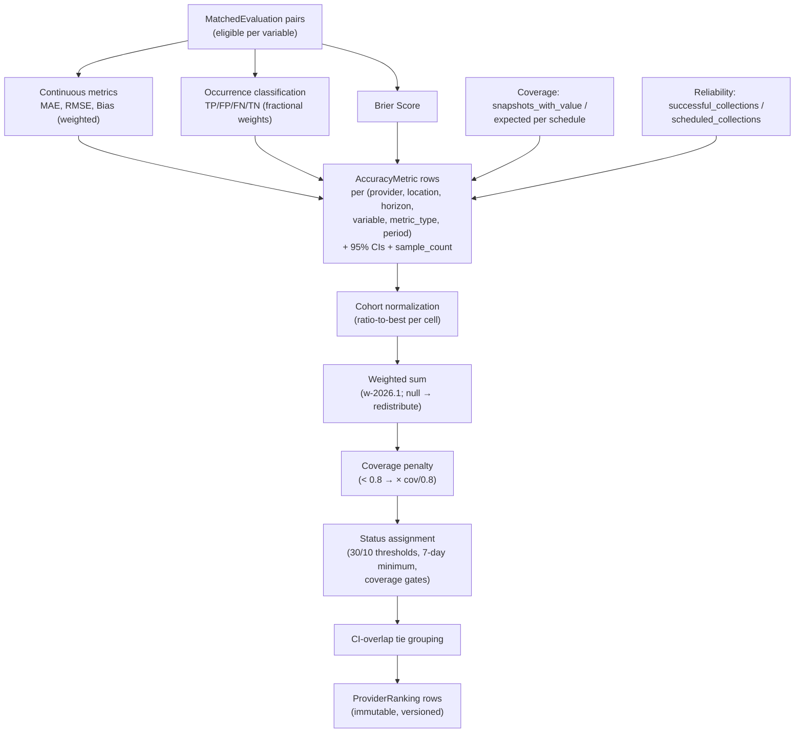

# ForecastIQ — Data Flow Architecture (Phase 1)

**Version**: 1.0
**Status**: Approved — Phase 1 Architecture
**Authority**: `docs/domain/02-data-lineage.md`; `docs/domain/03-metric-methodology.md`; `docs/domain/05-metric-ui-contract.md`

---

## 1. End-to-End Data Flow

```mermaid
graph LR
    subgraph "Ingestion (hourly)"
        S1["Scheduler slot due"] --> S2["Provider API call<br/>(adapter, timeout 10s)"]
        S2 --> S3["Checksum + gzip<br/>payload → volume"]
        S3 --> S4["Schema validate +<br/>decompose array"]
        S4 --> S5["ForecastCollection +<br/>ForecastSnapshots (tx)"]
    end

    subgraph "Observations (hourly at :05)"
        O1["Open-Meteo Historical call"] --> O2["Range validate +<br/>provenance tag"]
        O2 --> O3["Observations (tx, dedup)"]
    end

    subgraph "Analysis batch (every 30 min)"
        S5 --> M1["Match pending snapshots<br/>↔ observations (exact-hour)"]
        O3 --> M1
        M1 --> M2["MatchedEvaluation rows"]
        M2 --> E1["Pair-level evaluation<br/>(per-variable errors, classification)"]
        E1 --> A1["Aggregate per cell<br/>(MAE, RMSE, F1... + CIs)"]
        A1 --> R1["Normalize cohort-relative<br/>+ weights + penalty"]
        R1 --> R2["ProviderRanking rows<br/>(statuses, ties, versions)"]
    end

    subgraph "Serving (on demand)"
        R2 --> Q1["Screen endpoints read<br/>pre-computed rows + LRU/ETag"]
        A1 --> Q1
    end
```



## 2. Forecast Ingestion Flow (detail)

Full sequence: `docs/workflows/01-forecast-collection.md`. Summary of the transformation chain:

| Stage | Input | Output | Failure handling |
|-------|-------|--------|------------------|
| 1. Slot due | `collection_schedules` row (status=due) | Claimed slot (lease 5 min) | SKIP LOCKED: contention-free; lease expiry re-queues |
| 2. Provider call | Config (URL, key ref, location coords) | Raw JSON response | Timeout 10 s; retry 1/2/4/8/16 s; circuit check before call |
| 3. Payload persist | Response bytes | `payloads/{provider}/{yyyy}/{mm}/{dd}/{id}.json.gz` + SHA-256 | Write failure → degrade (alert), continue |
| 4. Validate | Parsed JSON vs. adapter schema_version | Valid rows[], invalid rows[] (with reasons) | > 50% invalid → `failed` + schema_drift alert |
| 5. Normalize | Valid provider rows | Canonical snapshot structs (UTC, [0,1] probability, condition mapping, unit normalization) | Per-row; unmapped condition → `unknown` + metric |
| 6. Store | Collection + snapshots | 1 collection row + N snapshot rows (ON CONFLICT DO NOTHING) | Single tx; dedup makes re-execution safe |
| 7. Emit | Event `forecast.collected` | In-process notification → analysis, operations | Participates in tx commit |

**One response → many rows:** Open-Meteo hourly array (168 periods) → 168 snapshots. OpenWeather OneCall hourly (48 periods) → 48 snapshots. Each carries the same `issued_at` (response issuance) and its own `target_time`; horizon derived.

## 3. Observation Flow (detail)

Full sequence: `docs/workflows/02-observation-collection.md`.

| Stage | Specification |
|-------|---------------|
| Trigger | Scheduler slot at :05 past each hour (allows source publication delay), per active location |
| Source call | Open-Meteo Historical: last 2 hours (covers late publication + overlap dedup) |
| Provenance | `source = openmeteo_historical`; `observation_type` per API-exposed provenance (default `reanalysis` where not exposed per-variable — documented) |
| Validation | Physical ranges (OC-04): temp −90..60 °C, humidity 0..100 %, wind 0..120 m/s, pressure 870..1084 hPa, precip 0..500 mm/h → violations stored as `suspect` |
| Dedup | `ON CONFLICT (source, location_id, observed_at) DO NOTHING` |
| Corrections | Source republishes corrected value → new row `corrected`, old row gets `superseded_observation_id`; event `observation.corrected` fires rematch |
| Late arrival | Backfill window (2 h per call) naturally captures late data; matching picks it up in next batch |

## 4. Matching Flow

Full specification: `docs/workflows/03-matching.md`. Deterministic algorithm (pseudocode):

```text
FOR each snapshot S where NOT EXISTS(match for S)
  AND S.target_time ≤ now() − 2h (observation publication margin)
  AND S.target_time ≥ now() − 30d (bounded batch window):
    candidates = observations WHERE location = S.location
      AND observed_at IN hour-window(S.target_time)   -- exact hour; ±15min sub-hourly
      AND quality_flag != 'suspect'
    IF candidates empty → skip (remains unmatched; coverage metric counts it)
    chosen = prefer corrected > valid;
             then provenance rank (station > interpolated > reanalysis > provider_estimated);
             then MIN(|observed_at − top_of_hour|)
    INSERT MatchedEvaluation(S.id, chosen.id, rule, delta)
      ON CONFLICT (forecast_snapshot_id, observation_id) DO NOTHING
```

Idempotency: uniqueness constraint + conflict-safe insert. Determinism: total order over candidates (no ambiguity); same inputs → same matches (property-tested).

## 5. Evaluation and Aggregation Flow



| Decision | Specification |
|----------|---------------|
| Calculation ownership | analysis module, batch job (scheduler-dispatched) |
| Execution model | **Asynchronous batch every 30 min** + on-demand admin recompute. No synchronous computation in API handlers except S-05 day metrics (≤ 48 pairs, in-memory). |
| Recalculation triggers | (1) Scheduled 30-min batch; (2) `observation.corrected` event → affected scope; (3) admin `POST /admin/rankings/recompute`; (4) methodology version change (new rows) |
| Aggregation windows | Daily/weekly/monthly periods stored as period_start/end; trailing 30 d (90 d for +3d/+7d) for rankings |
| Storage strategy | Persisted immutable rows (not views, not materialized views, not continuous aggregates — ADR-004) |
| Query-time vs. persisted | Rankings + metrics: **persisted**. Day metrics (S-05): computed at query time over ≤ 48 pairs. Freshness: server-computed from row timestamps. |
| Cache strategy | In-process LRU (60 s TTL, ≤ 256 entries, keyed by endpoint+params hash) + ETag/304. Invalidation: TTL expiry (batch writes naturally refresh within 60 s of computation). |
| Invalidation | Supersede links (new rows); LRU TTL handles read cache; no explicit cache-busting needed |
| Backfill | Replay + recompute procedure (`docs/workflows/06-backfill-and-reprocessing.md`) |
| Methodology upgrades | New methodology_version → recompute produces new rows; old rows never rewritten; UI shows version |
| Reproducibility | Immutable inputs + versioned formulas → byte-identical recompute (property 11, methodology §11) |

## 6. Serving Flow

| Screen | Read path | Queries |
|--------|-----------|---------|
| S-01 Overview | `GET /rankings` → LRU → `provider_rankings` latest per cell + latest observation | 2 indexed queries |
| S-02 Location Detail | `GET /accuracy/summary?location_id=` → all providers' metrics + ranking cells | 2 indexed queries |
| S-03 Provider Detail | `GET /accuracy/summary?provider_id=` → grid cells across locations×horizons | 1 indexed query (N+1 eliminated) |
| S-04 Trends | `GET /accuracy` → metric series with bucketing | 1 indexed scan ≤ 365 rows |
| S-05 FvA | `GET /forecast-comparison` → snapshots + observations + in-memory day metrics | 2 indexed queries + compute |
| S-10 Health | `GET /admin/health` → collections window + circuits + statfs + batch timestamp | Bounded assembly |

## 7. Lineage Preservation in Flow

Every hop preserves the chain (doc 02-data-lineage §2): payload key+checksum → collection → snapshot → match (both FKs) → metric (reproducible set) → ranking (component metric references). No stage may break the chain; CI integration test verifies end-to-end lineage queryability from any ranking row back to its collection.

## 8. Cross-Reference

- Workflow sequences: `docs/workflows/01-06`
- Methodology (formulas): `docs/domain/03-metric-methodology.md`
- Metric ↔ UI contract: `docs/domain/05-metric-ui-contract.md`
- Query plans: `docs/data/04-index-and-query-plan.md`
