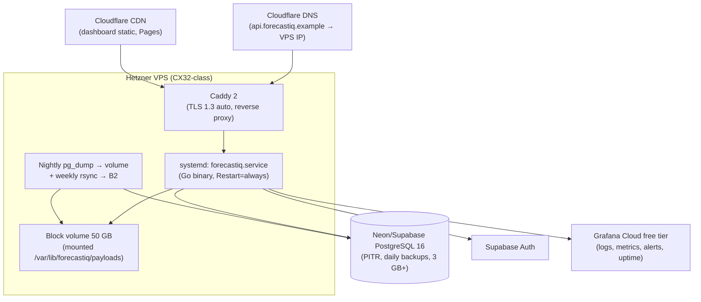

# ForecastIQ — Deployment Architecture (Phase 1)

**Version**: 1.0
**Status**: Approved — Phase 1 Architecture
**Authority**: ADR-007 (single VPS + Caddy); constraints §5 (hosting model, $50–150/mo target); NFR-M05..M07

> **Amendment (2026-07-26, ADR-033)**: production now runs on an AWS EC2
> t3.small with Docker Compose (app + PostgreSQL containers), TLS terminated
> at Cloudflare (proxied DNS, no origin Caddy), releases shipped as
> cosign-signed GHCR images referenced by digest. §3–§4 and §8 below describe
> the superseded Hetzner/native model; see
> `docs/adr/ADR-033-personal-use-ec2-docker-deployment.md` for the current
> topology. Full doc rewrite is deferred to the WP-27 docs pass.

---

## 1. Platform Decision

**Primary: Hetzner Cloud VPS + managed PostgreSQL (Neon or Supabase) + Cloudflare (CDN/DNS).**

| Criterion | Hetzner VPS (selected) | Fly.io | Render | AWS App Runner |
|-----------|------------------------|--------|--------|----------------|
| Go binary support | Native (systemd) | Containers | Containers | Containers |
| Next.js static | CDN (Cloudflare Pages) | Static hosting | Static | + S3/CloudFront |
| Managed PostgreSQL | Neon/Supabase (external) | Postgres (paid) | Postgres (paid) | RDS (paid) |
| Scheduled jobs | In-process (ADR-005) | Machines cron | Cron jobs (paid) | EventBridge |
| Secrets | Env via systemd + encrypted file | Native | Native | SSM |
| Rollback | Redeploy previous artifact (< 5 min) | Releases | Deploys | Versions |
| Monthly cost (expected) | **~$45–55** | ~$60–90 | ~$70–100 | ~$80–150 |
| Operational burden | Low (one machine, documented) | Low–Med | Low | Medium (IAM, VPC) |
| Portfolio visibility | Full control, demonstrable | Good | Good | Enterprise-flavored |

Decision rationale: constraints §5 already fixes the model (VPS + managed DB + CDN at $50–150); Hetzner CX32-class gives 4 vCPU/8 GB at ~$12, maximizing headroom per dollar. No Kubernetes (ADR-007 binding).

**Alternative (documented, not selected):** Fly.io — acceptable if Hetzner availability/region is an issue; cost +25%, slightly more opaque debugging.

## 2. Environment Topology

| Environment | Purpose | Infrastructure |
|-------------|---------|----------------|
| **local** | Development | Docker Compose: app (Go, hot-reload via air) + PostgreSQL 16 + payload volume mount. `.env.local` for secrets. |
| **ci** | Test execution | GitHub Actions: ephemeral PostgreSQL 16 service container; no persistent state. |
| **production** | Public deployment | VPS + managed DB + volume + Caddy + Cloudflare. |
| staging | **Not justified for MVP** | Single operator; production-like validation via preview deploys of the dashboard (Cloudflare Pages PR previews) + migration dry-run in CI against a DB copy. Staging promotion trigger: second engineer or customer-facing SLAs. |

## 3. Production Topology



## 4. Deployment Flow

```text
merge to main
  → GitHub Actions:
      1. lint + test + build (Go binary, linux/amd64)
      2. OpenAPI generation + breaking-change diff
      3. container image build (distroless) + Trivy scan
      4. migration dry-run against DB snapshot copy
      5. dashboard build (next export) → Cloudflare Pages deploy
      6. artifact upload (binary + migrations + checksums)
  → deploy job (manual approval on main; auto on tag):
      7. rsync artifact to VPS
      8. run migrations (flag-gated: `forecastiq migrate --confirm`)
      9. systemd restart (rolling: stop intake → drain 30s → swap binary → start)
     10. smoke tests (healthz, readyz, one public endpoint, one admin login)
     11. notify (log + Slack/email webhook)
```

**Zero-downtime expectation:** MVP accepts < 30 s unavailability during binary swap (single process; Caddy returns 502 during drain). Honest target documented; true zero-downtime requires a second instance (promotion).

## 5. Database Migrations

- Tool: **golang-migrate** (numbered SQL: `NNNN_description.up.sql` / `.down.sql`).
- Ownership: `migrations/` directory in monorepo; applied by deploy pipeline only (never by the app at runtime in production; local dev may auto-migrate).
- Rules: every migration reversible OR documented irreversible; expand-contract pattern for column changes; no long locks (CREATE INDEX CONCURRENTLY where applicable); migration dry-run in CI against a production snapshot copy.
- Rollback: binary rollback does NOT auto-rollback migrations (forward-only in production; contract pattern makes old binary compatible with new schema during transition).

## 6. Rollback Procedure (NFR-M07: < 5 min)

1. `deploy rollback` → rsync previous artifact (retained: last 5 versions on VPS + GitHub artifacts 90 d).
2. systemd restart with previous binary.
3. Smoke test. Total: < 5 min (measured in CI deploy drills monthly).

Schema rollback: only via a new forward migration (contract pattern); PITR for data corruption (separate runbook).

## 7. Secrets Management (summary; detail in `docs/security/04-secrets-management.md`)

| Secret | Storage | Rotation |
|--------|---------|----------|
| DATABASE_URL | systemd EnvironmentFile (0600, root-only) | 90 d (managed DB credential rotation) |
| OpenWeather API key | Same file; referenced by `credential_ref` name | On suspicion; runbook |
| SUPABASE_SERVICE_ROLE_KEY | Same file; backend-only | Vendor dashboard |
| JWT signing | Not stored (JWKS fetch) | Vendor-managed rotation tolerated |
| Deploy SSH key | GitHub Actions secret; deploy-key on VPS (command-restricted) | 180 d |

No secrets in repository, images, or CI logs (secret scanning in CI; `.env*` gitignored).

## 8. Domain and TLS

- `api.forecastiq.example` → VPS IP (Cloudflare DNS, proxied off for API to preserve client IPs for rate limiting; dashboard on Pages gets edge TLS).
- Caddy: automatic Let's Encrypt certificates, TLS 1.3 minimum, HSTS, security headers (NFR-SEC09).
- Dashboard: `app.forecastiq.example` on Cloudflare Pages (edge TLS included).

## 9. Infrastructure as Code Scope

Detail: `docs/delivery/04-infrastructure-as-code.md`. Summary: Terraform for Cloudflare DNS records + Neon project (if Neon provider fits); VPS provisioning via scripted bootstrap (cloud-init) committed to repo; Caddyfile + systemd units in repo. Platform-managed: Pages, Grafana Cloud, Supabase project (manual bootstrap, documented).

## 10. Cost Summary (constraints §5, verified)

| Component | Est. $/mo |
|-----------|-----------|
| Hetzner CX32 (4 vCPU, 8 GB) | 12 |
| 50 GB volume | 5 |
| Neon/Supabase paid tier | 20–25 |
| Cloudflare (Pages free + DNS free) | 0 |
| Supabase Auth (included) | 0 |
| Grafana Cloud free tier | 0 |
| Domain | 1.5 |
| Backup storage (B2 ~50 GB) | 3 |
| **Total** | **~$42–47** |

Within the $50–150 target with > 50% headroom. Growth estimate: +$20/mo at 10× traffic (DB tier + volume). Cost alerts: Grafana Cloud billing + Hetzner budget notification at 80%.

## 11. Cross-Reference

- CI/CD detail: `docs/delivery/02-ci-cd.md`
- Environments: `docs/delivery/03-environments.md`
- IaC: `docs/delivery/04-infrastructure-as-code.md`
- Rollback runbook: `docs/operations/05-deployment-and-rollback.md`
- ADR: ADR-007
