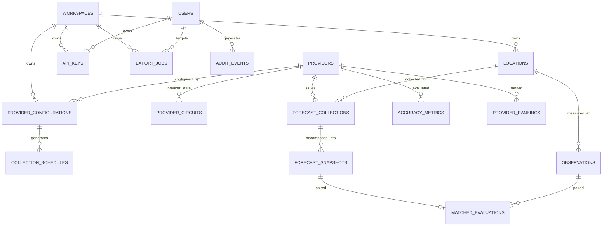

# ForecastIQ — Logical Data Model (Phase 1)

**Version**: 1.0
**Status**: Approved — Phase 1 Architecture
**Authority**: `docs/domain/01-domain-model.md` §3 ERD (normative); `docs/domain/04-ui-domain-model-reconciliation.md` §2 (amendments); ADR-009

---

## 1. Entity Groups

## 2. Table Inventory (18 tables)

| Table | Module | Mutability | Partitioned | Retention |
|-------|--------|-----------|-------------|-----------|
| `workspaces` | catalog | Mutable | No | Forever |
| `users` | identity | Mutable | No | Until deletion (AUTH-09) |
| `api_keys` | identity | Mutable (revocation) | No | Until account deletion |
| `export_jobs` | identity | Mutable (status) | No | Deleted after expiry |
| `providers` | catalog | Mutable | No | Forever |
| `provider_configurations` | catalog | Mutable | No | Forever |
| `provider_circuits` | catalog | Mutable (state) | No | Forever (1 row/provider) |
| `locations` | catalog | Mutable | No | Forever |
| `collection_schedules` | scheduler | Mutable (claims) | No | 90 d (maintenance purge) |
| `schedule_runs` | scheduler | Append-only | No | 90 d |
| `forecast_collections` | collection | Immutable post-completion | No | Indefinite (metadata, small) |
| `forecast_snapshots` | collection | Immutable | **Monthly (target_time)** | 2 y (partition drop) |
| `observations` | collection | Immutable (weather fields) | **Monthly (observed_at)** | 5 y (partition drop) |
| `matched_evaluations` | analysis | Immutable | No (aged batch purge) | 2 y |
| `accuracy_metrics` | analysis | Immutable (values) | No | Indefinite |
| `provider_rankings` | analysis | Immutable (scores) | No | Indefinite |
| `audit_events` | audit | Immutable | No | 1 y (aged purge) |

## 3. Identifier Strategy

**Decision: UUIDv7 for all primary keys** (domain model §11, binding).

| Option | Tradeoff | Verdict |
|--------|----------|---------|
| **UUIDv7** | Time-ordered (B-tree friendly, low index fragmentation vs v4), globally unique (client-generated, no round trip), 128-bit cost | **Selected** |
| ULID | Equivalent properties; non-standard PG type (stored as UUID anyway) | Rejected (no advantage) |
| bigint identity | Compact, fastest joins; but: leaks cardinality/creation order publicly, requires DB round trip, complicates future multi-DB/multi-instance | Rejected (public API exposure + monotonic enumeration risk) |
| UUIDv4 | Random → index fragmentation at insert-heavy tables | Rejected |

Implementation: generated in Go (`github.com/google/uuid` v7); stored as `uuid` type; exposed in API as canonical hyphenated strings.

## 4. Ownership Model in the Schema (ADR-009)

- `workspace_id UUID NOT NULL DEFAULT <system-workspace-id>` on: `locations`, `provider_configurations`, `api_keys`, `export_jobs`.
- **Not on** pipeline tables (collections, snapshots, observations, matches, metrics, rankings, audit) — ownership derived via parent join; documented denormalization tradeoff.
- FK to workspaces is RESTRICT (workspace never deleted).

## 5. Immutability Enforcement

`BEFORE UPDATE OR DELETE` trigger function `enforce_immutable()` raising `EXCEPTION` on:
- `forecast_snapshots` (all columns)
- `observations` (all columns except `superseded_observation_id`)
- `forecast_collections` (after status leaves pending — enforced via trigger checking OLD.status)
- `matched_evaluations` (all)
- `accuracy_metrics` (all except `superseded_by`)
- `provider_rankings` (all except `superseded_by`)
- `audit_events` (all)

Partition maintenance (DROP PARTITION) is DDL executed by the migrations role — unaffected by DML triggers. Aged-row purges (matched_evaluations > 2 y, audit > 1 y, schedules > 90 d) run as bounded DELETE batches via a maintenance job using a dedicated connection; the trigger on these tables exempts rows older than retention via a session GUC (`SET LOCAL forecastiq.maintenance = on`) checked by the trigger — the GUC is settable only by the app role in maintenance mode (documented, tested).

## 6. Enum Strategy

PostgreSQL native enums for stable, small value sets:
- `collection_status`: success, partial, failed, deduplicated, rate_limited, timeout
- `observation_type`: station_observation, interpolated, reanalysis, provider_estimated
- `quality_flag`: valid, suspect, corrected
- `ranking_status`: ranked, provisionally_ranked, unranked
- `circuit_state`: closed, open, half_open
- `user_role`: admin, user
- `entity_status`: active, disabled, archived

New enum values require a migration (acceptable; enums are additive-safe with `ALTER TYPE ADD VALUE`).

## 7. Timestamp and Timezone Convention

- All timestamps: `timestamptz`, stored UTC, ISO 8601 `Z` in API (BR-TZ-01).
- `created_at` default `now()` on all tables; `updated_at` on mutable tables (trigger-maintained).
- Display timezone is presentation-layer only (BR-TZ-02..05).

## 8. JSONB Usage (bounded, documented)

| Table.Column | Content | Why JSONB |
|--------------|---------|-----------|
| `provider_configurations.collection_schedule` | `{interval: "hourly", minute_offset: 0}` | Schedule shape may evolve; validated at write |
| `provider_rankings.component_scores` | Component breakdown (values, normalized, weights, CIs, sample counts) | Shape follows methodology version; always present for ranked/provisional |
| `api_keys.scopes` | Endpoint group list | Small, variable |
| `users.preferences` | `{tz_display: "location"|"browser"}` | Evolving preference set |
| `audit_events.details` | Action-specific context | Heterogeneous by action |

No JSONB in query-critical filter positions (all filters use scalar columns; JSONB is payload only).

## 9. Relationship Rules

- All FKs: `ON DELETE RESTRICT` except: `audit_events.user_id ON DELETE SET NULL` (account deletion retains audit), `export_jobs` target FKs SET NULL on deletion.
- No cascade deletes anywhere (binding, domain §11).
- Logical (non-FK) references: `accuracy_metrics.superseded_by`, `provider_rankings.superseded_by`, `observations.superseded_observation_id` — FKs with ON DELETE RESTRICT (referenced rows are never deleted).

## 10. Cross-Reference

- Physical DDL: `docs/data/03-table-design.md`
- Indexes/queries: `docs/data/04-index-and-query-plan.md`
- Retention: `docs/data/05-retention-and-archival.md`
- Growth: `docs/data/06-data-growth-and-cost-model.md`
