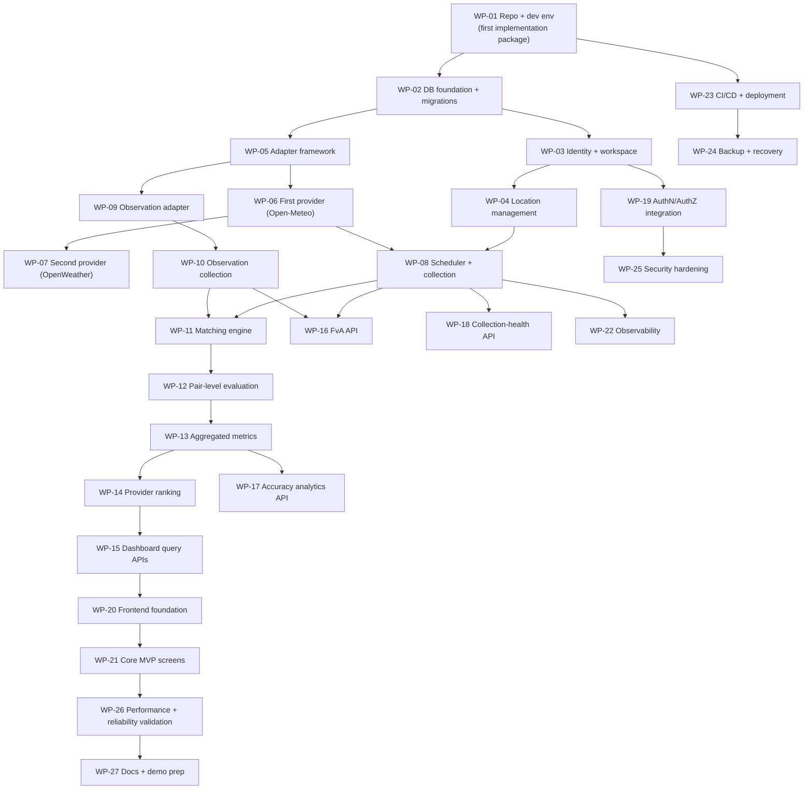

# ForecastIQ — Implementation Sequence (Phase 1)

**Version**: 1.0
**Status**: Approved — Phase 1 Architecture
**Authority**: `docs/planning/02-revised-mvp-estimate.md` (epic sequence); `docs/planning/05-implementation-work-packages.md` (package definitions)

---

## 1. Sequencing Principles

1. **Riskiest assumptions first**: provider integration, data model, idempotency, DB design, developer experience — validated by WP-01 before anything else scales.
2. **Vertical slices over horizontal layers**: each package delivers a testable end-to-end increment (not "all repositories, then all use cases, then all handlers").
3. **Contracts freeze early**: OpenAPI stubs + schema frozen by end of week 2 (estimate §3) to decouple any parallel work.
4. **Quality gates travel with the work**: every package exits with its test gate (testing strategy §5) — no deferred test debt.
5. **Ops early, not last**: deploy pipeline + observability land before the product surface grows (WP-23 interleaved, not terminal).

## 2. Dependency Graph

## 3. Ordered Timeline (single engineer; two-engineer split per estimate §3)

| Phase | Weeks | Packages | Exit milestone |
|-------|-------|----------|----------------|
| Foundation | 1–2 | WP-01, WP-02, WP-23 (pipeline skeleton) | Repo boots; migrations run; CI green; deploy to scratch VPS works |
| Collection core | 3–7 | WP-03, WP-04, WP-05, WP-06, WP-08 | **M1: pipeline live locally** — hourly Open-Meteo collections storing snapshots with lineage + payloads |
| Provider 2 + observations | 7–9 | WP-07, WP-09, WP-10 | Both providers + observations collecting; ToS gate (D-05) evidence gathered |
| Analysis engine | 9–14 | WP-11, WP-12, WP-13, WP-14 | Metrics + rankings computing; worked-example test green |
| API surface | 12–16 | WP-15, WP-16, WP-17, WP-18, WP-19 | **M2: API complete** — all catalog endpoints green + auth |
| Dashboard | 15–21 | WP-20, WP-21 | **M3: dashboard complete** — 15 screens, all states |
| Hardening | 21–25 | WP-22, WP-24, WP-25, WP-26 | SLOs tracked; restore tested; security pass; perf gates met |
| Launch prep | 25–26 | WP-27, quality spike (D-06), ToS gate (D-05) | **M4: launch-ready** |

Parallelization (two engineers): Eng-A = WP-02→08→11..14→18 (pipeline + analysis); Eng-B = WP-03→19→15..17→20..21→22 (identity + API + frontend), WP-01/23 joint week 1. Interface freeze end of week 2 decouples.

## 4. Level 1 Demo Checkpoint (natural, ~week 7)

Per estimate: after collection core — one location, one provider, snapshots queryable via internal inspection endpoint/CLI, structured logs flowing. Decision point: validate developer experience + data model feel before analysis investment.

## 5. Gates Between Phases

| Gate | Criteria |
|------|----------|
| Foundation exit | WP-01 acceptance (see work packages doc); pipeline deploys; golden-path skeleton green |
| M1 | Collection idempotency proven (double-fire test); payload checksums verified; contract tests for provider 1 |
| Analysis exit | Worked example reproduces methodology §8 exactly; all 11 properties in CI |
| M2 | Every endpoint contract-tested; auth matrix tests green |
| M3 | All 19 states fixture-tested; axe-core zero critical |
| M4 (launch) | Release gate (testing strategy §5) + D-05 + D-06 closed |

## 6. Sequencing Risks and Mitigations

| Risk | Mitigation in sequence |
|------|------------------------|
| OpenWeather ToS (D-05) blocks provider 2 | WP-07 after provider 1 proves the pattern; swap path bounded (adapter interface) |
| Observation quality (D-06) | Spike scheduled in launch-prep; pipeline unaffected by outcome |
| Frontend state discipline | State contracts exist before WP-21 (binding acceptance criteria) |
| Estimate drift | Weekly actuals vs. epic estimates (> 20% → re-forecast + scope review, estimate §5) |

## 7. Cross-Reference

- Work package definitions: `docs/planning/05-implementation-work-packages.md`
- Phase 1 estimate: `docs/planning/04-phase-1-estimate.md`
- First package (full definition): work packages doc §WP-01 + architecture report §14
