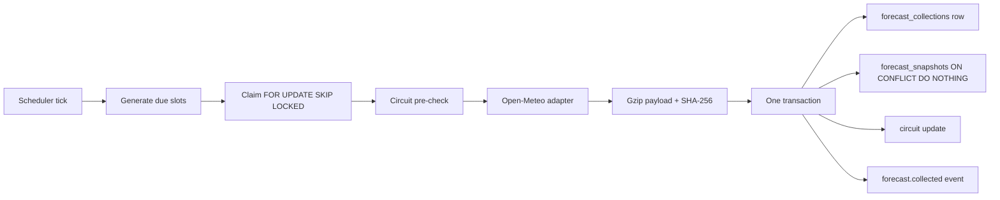

# Architecture Overview

The full Phase 1 architecture is documented authoritatively in
`docs/architecture/` (10 documents) and `docs/adr/` (ADR-001..032). This page
summarizes the shape of the system and how the first slice realizes it.

## System shape (approved)

One Go binary (API + in-process scheduler + collection + future comparison
engine) + one static Next.js dashboard on a CDN + one managed PostgreSQL 16 +
Caddy for TLS. Target cost ~$42–47/month. No broker, no cache tier, no
Kubernetes — every deferral has a measured promotion trigger
(`docs/architecture/10-scaling-and-evolution.md`).

## Dependency rule (binding)

```text
HTTP handlers / scheduler jobs / CLI commands
        ↓
Application use cases (orchestration, transactions, authorization)
        ↓
Domain model (entities, invariants, formulas)
        ↓
Ports (Go interfaces: repositories, adapters, event bus, clock, payload store)
        ↓
Infrastructure adapters (pgx repositories, HTTP clients, filesystem)
```

- Dependencies point inward only; domain has zero infrastructure imports.
- Each module owns its tables; no cross-module table access (depguard-enforced).
- Cross-module collaboration is via service interfaces or the in-process event seam.
- `cmd/` is the only composition root (wires adapters to ports).

## Modules

| Module | Responsibility (slice status) |
|--------|-------------------------------|
| `platform` | config, logging, db pool, dbtx, events, metrics, health, ratelimit, clock, ids |
| `catalog` | workspaces, providers, configurations, locations, circuits — **implemented** |
| `collection` | forecast collection + snapshots, provider adapter port, payload store port — **implemented** |
| `scheduler` | slot generation, SKIP LOCKED claims, leases, dispatch, run history — **implemented** |
| `audit` | append-only audit recording — **implemented** |
| `api` | HTTP layer (router, middleware, handlers, envelope, errors) — **slice endpoints** |
| `identity`, `analysis`, `operations` | deferred to later work packages |

## The first vertical slice



A collection is idempotent at two levels:
- **Collection-level**: a second collection with the same
  `(provider, location, COALESCE(model_run_time, requested_at))` while a
  success/partial exists is recorded as `deduplicated` (zero snapshots).
- **Snapshot-level**: `INSERT ... ON CONFLICT (provider, location, issued_at,
  target_time) DO NOTHING` — replaying never duplicates or mutates rows.

## Data lineage

`raw payload (key + SHA-256) → forecast_collections → forecast_snapshots →
(future) matched_evaluations → accuracy_metrics → provider_rankings`. Every hop
references its inputs by ID; pipeline tables are immutable (trigger-enforced).

## Observability

Structured JSON logs (`slog`) with `request_id` / `collection_id` / `provider`
correlation; Prometheus `/metrics` (RED + collection + circuit + scheduler);
`/healthz` (liveness) and `/readyz` (DB + payload volume). See
`docs/architecture/08-observability-architecture.md`.

## Transactions

Short bounded transactions, no outbox (ADR-027). A collection completes in one
transaction (collection row + snapshot batch + circuit update); the
`forecast.collected` event is published after commit.
