# ForecastIQ — Domain Model (Revised)

**Version**: 2.0 (Phase 0 Amendment)
**Status**: Authoritative
**Resolves**: ARB Blocker 2 (forecast acquisition/storage model), ARB Blocker 5 (ownership model)
**Supersedes**: `docs/phase-0-business-analysis/06-domain-model.md`

---

## 1. Terminology Decision (Blocker 2)

> **"Snapshot" means one prediction for one target time.**
> A provider API response is a **ForecastCollection**. One ForecastCollection produces
> zero or more ForecastSnapshot records.

This terminology is binding across all ForecastIQ documents, API responses, and code.

| Term | Meaning |
|------|---------|
| **ForecastCollection** | One provider API collection attempt for one location (one HTTP exchange). Parent record. |
| **ForecastSnapshot** | One predicted target period extracted from a collection (one row per target_time). Child record. Immutable. |
| **Observation** | One measured/derived weather record for one location and time. Immutable (corrections are new records). |
| **MatchedEvaluation** | One forecast–observation pair eligible for comparison. Derived, immutable. |
| **AccuracyMetric** | One aggregated statistical result over a set of matched pairs. Immutable rows; recomputation writes new rows. |
| **ProviderRanking** | One composite ranking result for a provider at a location/horizon/period. Immutable rows per methodology version. |

---

## 2. Bounded Contexts

| Context | Responsibility | MVP? |
|---------|---------------|------|
| Forecast Collection | Schedule, collect, validate, decompose, store provider forecasts with lineage | ✓ |
| Observation Collection | Collect, validate, provenance-tag observations | ✓ |
| Accuracy Analysis | Match pairs, compute metrics, rank providers | ✓ |
| Identity & Access | Users (managed auth), workspaces, API keys | ✓ (minimal) |
| Administration | Provider config, locations, schedules, health | ✓ |
| Notification | Alerts, webhooks | ✗ (Level 3) |

---

## 3. Entity Relationship Diagram

```mermaid
erDiagram
    WORKSPACE ||--o{ LOCATION : owns
    WORKSPACE ||--o{ PROVIDER_CONFIGURATION : owns
    WORKSPACE ||--o{ API_KEY : owns
    PROVIDER ||--o{ FORECAST_COLLECTION : issues
    LOCATION ||--o{ FORECAST_COLLECTION : collected_for
    FORECAST_COLLECTION ||--o{ FORECAST_SNAPSHOT : decomposes_into
    LOCATION ||--o{ OBSERVATION : measured_at
    FORECAST_SNAPSHOT ||--o| MATCHED_EVALUATION : paired
    OBSERVATION ||--o{ MATCHED_EVALUATION : paired
    MATCHED_EVALUATION }o--o{ ACCURACY_METRIC : aggregated_into
    PROVIDER ||--o{ ACCURACY_METRIC : evaluated
    PROVIDER ||--o{ PROVIDER_RANKING : ranked
    LOCATION ||--o{ PROVIDER_RANKING : ranked_at
    USER ||--o{ API_KEY : owns
    USER ||--o{ AUDIT_EVENT : generates

    WORKSPACE {
        uuid id PK
        string name
        string slug
        string status
        timestamp created_at
        timestamp updated_at
    }
    PROVIDER {
        uuid id PK
        string name
        string slug
        string api_base_url
        string status
        string attribution_text
        string attribution_url
        timestamp created_at
        timestamp updated_at
    }
    PROVIDER_CONFIGURATION {
        uuid id PK
        uuid workspace_id FK
        uuid provider_id FK
        string status
        string credential_ref
        jsonb collection_schedule
        string adapter_version
        timestamp created_at
        timestamp updated_at
    }
    LOCATION {
        uuid id PK
        uuid workspace_id FK
        string name
        decimal latitude
        decimal longitude
        string country_code
        string timezone
        string status
        timestamp created_at
        timestamp updated_at
    }
    FORECAST_COLLECTION {
        uuid id PK
        uuid provider_id FK
        uuid location_id FK
        uuid provider_configuration_id FK
        timestamp requested_at
        timestamp completed_at
        string collection_status
        string provider_request_id
        timestamp provider_model_run_time
        string raw_payload_object_key
        string raw_payload_checksum
        integer response_status_code
        integer response_latency_ms
        integer records_received
        integer snapshots_stored
        integer snapshots_deduplicated
        integer snapshots_invalid
        string schema_version
        string adapter_version
        string error_code
        string error_message
        timestamp created_at
    }
    FORECAST_SNAPSHOT {
        uuid id PK
        uuid forecast_collection_id FK
        uuid provider_id FK
        uuid location_id FK
        timestamp issued_at
        timestamp target_time
        integer forecast_horizon_minutes
        decimal temperature_c
        decimal feels_like_temperature_c
        decimal precipitation_probability
        decimal precipitation_amount_mm
        decimal humidity_pct
        decimal wind_speed_ms
        decimal wind_direction_deg
        decimal pressure_hpa
        decimal cloud_cover_pct
        string provider_condition_code
        string canonical_condition_code
        string condition_taxonomy_version
        timestamp created_at
    }
    OBSERVATION {
        uuid id PK
        uuid location_id FK
        string source
        string observation_type
        timestamp observed_at
        decimal temperature_c
        decimal humidity_pct
        decimal wind_speed_ms
        decimal wind_direction_deg
        decimal pressure_hpa
        decimal precipitation_mm
        string provider_condition_code
        string canonical_condition_code
        string quality_flag
        uuid superseded_observation_id
        timestamp created_at
    }
    MATCHED_EVALUATION {
        uuid id PK
        uuid forecast_snapshot_id FK
        uuid observation_id FK
        uuid provider_id FK
        uuid location_id FK
        integer forecast_horizon_minutes
        timestamp target_time
        string match_rule
        string computed_at
    }
    ACCURACY_METRIC {
        uuid id PK
        uuid provider_id FK
        uuid location_id FK
        integer horizon_minutes
        string variable
        string metric_type
        decimal value
        decimal ci_lower
        decimal ci_upper
        integer sample_count
        string methodology_version
        timestamp period_start
        timestamp period_end
        timestamp calculated_at
        uuid superseded_by
    }
    PROVIDER_RANKING {
        uuid id PK
        uuid provider_id FK
        uuid location_id FK
        integer horizon_minutes
        decimal composite_score
        decimal ci_lower
        decimal ci_upper
        string ranking_status
        integer sample_count
        decimal coverage
        decimal reliability
        jsonb component_scores
        string methodology_version
        string weights_version
        string horizon_profile
        timestamp period_start
        timestamp period_end
        timestamp calculated_at
    }
    USER {
        uuid id PK
        string auth_subject
        string email
        string role
        string status
        timestamp created_at
        timestamp last_login_at
    }
    API_KEY {
        uuid id PK
        uuid user_id FK
        uuid workspace_id FK
        string name
        string key_hash
        string key_prefix
        jsonb scopes
        integer rate_limit_per_min
        timestamp expires_at
        timestamp created_at
        timestamp revoked_at
    }
    AUDIT_EVENT {
        uuid id PK
        uuid user_id FK
        string action
        string resource_type
        uuid resource_id
        jsonb details
        string ip_address
        timestamp created_at
    }
```

**Relationship corrections vs. Phase 0 draft:**

- `FORECAST_SNAPSHOT ||--o{ ACCURACY_METRIC` (1:many, wrong direction) is replaced by
  `MATCHED_EVALUATION }o--o{ ACCURACY_METRIC`: metrics aggregate **many** matched pairs;
  a pair may contribute to several metric aggregations (different periods/variables).
- `ForecastCollection` inserted between Provider/Location and ForecastSnapshot.
- `ALERT_RULE` removed from the MVP model (Level 3).
- `USER` no longer stores `password_hash` (managed authentication, Blocker 6 — see
  `docs/product/02-business-requirements.md` §Auth and ADR-008).

---

## 4. ForecastCollection — Full Specification (Blocker 2)

### 4.1 Attributes

See ERD above. Notes on specific attributes:

| Attribute | Specification |
|-----------|---------------|
| `collection_status` | enum: `success`, `partial`, `failed`, `deduplicated`, `rate_limited`, `timeout`. `partial` = response received but some rows invalid. |
| `provider_request_id` | Provider-supplied request/run identifier when available (e.g., model run time); null otherwise. Used for idempotency (§4.3). |
| `provider_model_run_time` | When the provider's underlying model ran, if exposed. Enables distinguishing "same model run re-served" from "new model run". |
| `raw_payload_object_key` | MVP: key into the local payload store (filesystem path under a configured volume, addressed `payloads/{provider}/{yyyy}/{mm}/{dd}/{collection_id}.json.gz`). Post-promotion: S3 object key — same attribute, different scheme prefix (`s3://…`). |
| `raw_payload_checksum` | SHA-256 of the raw response body (hex). Integrity verification for lineage. |
| `records_received` / `snapshots_stored` / `snapshots_deduplicated` / `snapshots_invalid` | Accounting per collection; enables partial-collection observability. |
| `schema_version` | Version of the provider response schema the adapter validated against. |
| `adapter_version` | Semver of our adapter code. |

### 4.2 Cardinality and invariants

- One ForecastCollection produces **0..n** ForecastSnapshots (0 for failed/deduplicated
  collections; the collection row still exists for lineage and health tracking).
- Invariants:
  - `completed_at ≥ requested_at` when status ∈ {success, partial}.
  - `snapshots_stored + snapshots_deduplicated + snapshots_invalid = records_received`
    for status ∈ {success, partial}.
  - ForecastCollection is **immutable after completion** (status transitions:
    `pending → success|partial|failed|rate_limited|timeout`, terminal states final).
  - Every ForecastSnapshot has exactly one parent ForecastCollection
    (`forecast_collection_id` NOT NULL).

### 4.3 Deduplication and idempotency rules

| Rule | Specification |
|------|---------------|
| **Snapshot uniqueness** | `UNIQUE (provider_id, location_id, issued_at, target_time)`. This is the dedup boundary: the same prediction (same provider, same issuance, same target) is stored once. |
| **Collection-level dedup** | If an incoming response has the same `(provider_id, location_id, provider_model_run_time)` — or same `issued_at` when model run time is unavailable — as an existing successful collection, the collection is recorded with status `deduplicated`, zero new snapshots, and no raw payload re-write. |
| **Idempotent storage** | Snapshot inserts use `INSERT … ON CONFLICT DO NOTHING` against the uniqueness constraint. Replaying a raw payload never creates duplicates and never mutates existing rows. |
| **Idempotent collection trigger** | A scheduled collection that fires twice for the same slot (scheduler double-fire) is collapsed by the dedup rule above; additionally, the scheduler claims slots via `SELECT … FOR UPDATE SKIP LOCKED` on the schedule table. |

### 4.4 Partial collection handling

- HTTP success but some rows fail validation → status `partial`; valid rows stored;
  invalid row count recorded; `error_code = partial_validation`; error_message lists
  first N rejected rows with reasons.
- HTTP failure → status `failed`/`timeout`/`rate_limited`; raw payload still stored when
  a body exists (for debugging); retry per backoff policy
  (`docs/requirements/01-functional-requirements.md` FC section).
- A `partial` collection is **not retried automatically** (the provider already served
  the data); instead, the next scheduled collection naturally fills gaps. Manual replay
  is available via admin (see §4.8).

### 4.5 Raw payload retention

- MVP: gzip-compressed JSON on the payload volume; retention **90 days**, then deleted
  by a retention job. Normalized snapshots (the queryable truth) are retained per
  `docs/requirements/02-non-functional-requirements.md` (2 years).
- Rationale: payloads are debugging/audit aids; normalized rows + checksums preserve
  verifiability. Promotion to S3 + longer retention is defined in
  `docs/architecture/00-phase-0-architecture-constraints.md` §promotion criteria.
- Checksums are retained indefinitely on the collection row (cheap) so historical
  integrity claims remain checkable while payloads exist.

### 4.6 Provider schema-change handling

- Adapters validate responses against a declared `schema_version` (per provider,
  versioned in code).
- Unknown/missing required fields → row rejected as invalid (not silently nulled) and
  counted; if > 50% of rows invalid, collection marked `failed` with
  `error_code = schema_drift` and an operational alert fires.
- Adding support for a new provider schema = new `schema_version` + adapter bump;
  historical rows keep their original `schema_version` (never rewritten).

### 4.7 Adapter versioning

- `adapter_version` (semver) recorded on every collection.
- Adapter changes that alter normalization semantics require a minor/major bump;
  the change log is part of the code review checklist.
- Normalized snapshots are **not** retroactively rewritten when adapters change;
  `adapter_version` on the parent collection provides lineage for any discrepancy.

### 4.8 Replay and reprocessing

- Admin can replay a stored raw payload through the **current** adapter, producing a
  **new** ForecastCollection (status `success`, `provider_request_id` copied,
  `error_code = replay` marker in details) and new snapshots where they don't collide
  with the uniqueness constraint.
- Replay never mutates or deletes original rows. Used after adapter bug fixes.
- Bulk historical reprocessing is a documented manual procedure (runbook), not an
  automated MVP feature.

### 4.9 Invalid row handling

- Row-level validation: physical ranges (same ranges as observations), temporal sanity
  (`target_time > issued_at`, `target_time` within provider's advertised horizon span),
  required fields per variable set.
- Invalid rows: counted, reasons recorded in collection `error_message` (truncated),
  raw payload retains the original data. No snapshot row is created for invalid data.

### 4.10 Lineage

Full chain: `raw payload (key+checksum) → ForecastCollection → ForecastSnapshot →
MatchedEvaluation → AccuracyMetric → ProviderRanking`. Every derived record references
its inputs by ID. See `docs/domain/02-data-lineage.md` for the complete specification.

---

## 5. ForecastSnapshot — Specification

Attributes in ERD. Key rules:

- **Immutable**: no UPDATE/DELETE ever (enforced by DB triggers + append-only policy).
- `forecast_horizon_minutes = target_time − issued_at` (stored, indexed; derived at insert).
- `issued_at` normalized to UTC from provider response (providers returning local time
  are converted by the adapter using the location timezone; conversion recorded in
  adapter contract tests).
- Weather fields nullable per provider capability; `precipitation_probability` stored as
  [0,1] decimal (providers reporting percentages are divided by 100 in the adapter).
- `provider_condition_code` = provider's raw code (string, as received);
  `canonical_condition_code` = mapped taxonomy value (§6);
  `condition_taxonomy_version` = taxonomy version used at ingest.

---

## 6. Canonical Weather Condition Taxonomy

**taxonomy_version `1`** (MVP, compact):

| Canonical code | Meaning |
|----------------|---------|
| `clear` | Clear / mostly clear sky |
| `partly_cloudy` | Scattered/broken clouds |
| `cloudy` | Overcast |
| `fog` | Fog, mist, haze |
| `drizzle` | Light intermittent precipitation |
| `rain` | Moderate rain |
| `heavy_rain` | Heavy/torrential rain |
| `thunderstorm` | Thunderstorm (with or without rain) |
| `snow` | Snowfall |
| `sleet` | Sleet / freezing rain / ice pellets |
| `unknown` | Unmapped or unrecognized code |

**Mapping rules:**

- Each adapter ships a mapping table: `provider_condition_code → canonical_code`
  (versioned with the adapter).
- **Unmapped code behavior**: store canonical `unknown`, log at WARN, increment
  `condition_unmapped_total{provider,code}` metric. If an unmapped code exceeds 1% of a
  day's rows for a provider, an operational alert fires (taxonomy gap).
- **Taxonomy versioning**: adding codes = new taxonomy version. Snapshots keep the
  `condition_taxonomy_version` applied at ingest; no retroactive rewrite.
- **Mapping updates**: corrected mappings apply to new ingestions only. Historical
  re-mapping is available via replay (§4.8) if ever justified.
- Tropical note: Malaysian providers/sources rarely report snow/sleet; codes remain in
  the taxonomy for global expansion but map to `unknown` regionally where unsupported.

---

## 7. Observation — Specification

| Attribute | Specification |
|-----------|---------------|
| `observation_type` | enum: `station_observation`, `interpolated`, `reanalysis`, `provider_estimated`. Provenance is always exposed in API/UI and drives quality weighting (`docs/domain/03-metric-methodology.md` §6.4). |
| `source` | e.g. `openmeteo_historical`, `noaa_nws`, `met_malaysia` (future). |
| `quality_flag` | enum: `valid`, `suspect`, `corrected`. `suspect` = failed range validation (stored, excluded from metrics). `corrected` = replacement record. |
| `superseded_observation_id` | Set on the **old** record when a correction arrives (the old row remains immutable; the pointer marks it as replaced). Matching prefers `corrected`. |
| Uniqueness | `UNIQUE (source, location_id, observed_at)` — observation deduplication. Re-ingestion of the same source/time is `ON CONFLICT DO NOTHING`. |

**MVP observation sources** (decision + rationale in ADR-003):

| Source | Type | Coverage | MVP role |
|--------|------|----------|----------|
| Open-Meteo Historical Weather API | Blend of station + reanalysis (ERA5-based); flagged per-variable where the API exposes provenance | Global incl. Johor Bahru | Primary MVP source |
| NOAA/NWS | Direct station observations | US only | Not in MVP (Johor Bahru focus); integration path documented for US expansion |
| METMalaysia | Station network | Malaysia | No public API confirmed — recorded as open question; not relied upon |

---

## 8. Workspace / Ownership Model (Blocker 5)

### 8.1 Options considered

| Option | Description | Verdict |
|--------|-------------|---------|
| A — Single-user MVP | One operator account, globally managed locations | **Selected for MVP behavior** |
| B — Personal workspaces | Every user owns a private workspace | **Selected as schema target** (columns exist; single system workspace in MVP) |
| C — Organization workspaces | Orgs, roles, RBAC | Deferred to Level 3 (commercial beta) |

### 8.2 Decision

MVP behaves as Option A (single operator + globally managed locations) but the schema
implements Option B's ownership columns so migration is additive, not invasive:

- A single `workspace` row (`system`) is seeded at bootstrap.
- `workspace_id` (NOT NULL, default → system workspace) exists on **ownership-bearing,
  mutable** entities: `locations`, `provider_configurations`, `api_keys`, and (schema
  reserved) future `alert_rules`, `reports`.
- `workspace_id` does **NOT** exist on immutable child rows:
  `forecast_collections`, `forecast_snapshots`, `observations`, `matched_evaluations`,
  `accuracy_metrics`, `provider_rankings`, `audit_events`.

**Denormalization tradeoff (documented decision):** ownership of child rows is derived
by joining to their parent (snapshot → collection → location → workspace, or
observation → location → workspace). Cost: authorization queries need one join;
benefit: no write amplification on the highest-volume tables (millions of rows/day),
no risk of parent/child workspace drift, simpler immutability guarantees. At MVP scale
(one workspace) the join is free; at Level 3 scale the join is indexed and still cheap.
If a future workload requires workspace-scoped partition pruning on child tables, a
backfill migration can add the column without downtime (add nullable → backfill →
set NOT NULL).

### 8.3 Ownership rules

| Resource | Owner | MVP access |
|----------|-------|-----------|
| Locations | Workspace (system) | Operator manages via admin |
| Provider configurations (credentials, schedules) | Workspace | Operator |
| API keys | User within workspace | Key owner + operator |
| Reports/exports (Level 3) | Workspace | — |
| Alerts (Level 3) | Workspace | — |
| Forecast/observation data | System-wide (derived from locations) | Read per API key scopes |

Row-level authorization (Level 3): PostgreSQL RLS policies keyed on
`workspace_id = current_setting('app.workspace_id')` — the NOT NULL column on parent
tables makes this additive.

---

## 9. Aggregates and Invariants

### 9.1 ForecastCollection Aggregate (root) — children: ForecastSnapshots
- Invariants per §4.2, plus: provider and location must be active at collection time;
  schedule must be configured.

### 9.2 Observation Aggregate (root)
- `observed_at ≤ now()` at ingest; range validation or `suspect`; location must exist.

### 9.3 AccuracyMetric Aggregate (root)
- `sample_count > 0` for non-null values; null value ⇔ sample_count = 0;
  `period_start < period_end`; metric_type ∈ methodology registry;
  methodology_version always set.

### 9.4 ProviderRanking Aggregate (root)
- ranking_status ∈ {ranked, provisionally_ranked, unranked};
  composite_score null when unranked; component_scores JSONB always present for
  ranked/provisional; weights_version + methodology_version always set.

### 9.5 User Aggregate (root) — children: APIKeys
- `auth_subject` unique (managed-auth subject); email unique;
  revoked keys cannot be reactivated; key_prefix unique.

---

## 10. Domain Services (MVP, in-process modules of the modular monolith)

| Service | Responsibility |
|---------|---------------|
| CollectionScheduler | Database-backed schedule, slot claiming, dispatch |
| ProviderAdapter (per provider) | Fetch + validate + decompose response → collection + snapshots |
| ObservationCollector | Fetch + validate + provenance-tag observations |
| MatchingEngine | Create MatchedEvaluation pairs per §3.1 of methodology |
| MetricAggregator | Compute AccuracyMetric rows (weighted, with CIs) |
| RankingService | Compute ProviderRanking rows per methodology |
| ConditionMapper | Provider code → canonical taxonomy |

Domain events exist as in-process function calls in MVP; the event **names and payload
shapes** are kept identical to the Phase 0 draft (`forecast.collected`,
`observation.collected`, `accuracy.calculated`, `provider.health_changed`) so a future
NATS introduction is a transport change, not a redesign (see ADR-006).

---

## 11. Database Design Decisions

| Decision | Specification |
|----------|---------------|
| Primary keys | UUIDv7 (time-ordered) for all entities. |
| Mutable vs immutable | Mutable: workspaces, providers, provider_configurations, locations, users, api_keys. Immutable: everything in the data pipeline (collections, snapshots, observations, matched_evaluations, metrics, rankings, audit_events). Immutability enforced by `BEFORE UPDATE OR DELETE` trigger raising an error on immutable tables. |
| Soft delete | Locations and provider_configurations use `status` (`active`/`disabled`/`archived`), never row deletion. Disabling a location stops future collection; historical data remains queryable (forecasts reference locations forever). |
| Provider deactivation | `providers.status = disabled` → scheduler skips; stored data untouched. |
| `updated_at` | Present on all mutable tables. |
| Key composite indexes | `forecast_snapshots (provider_id, location_id, target_time)`; `forecast_snapshots (location_id, target_time, forecast_horizon_minutes)`; `observations (location_id, observed_at)`; `observations (source, location_id, observed_at)` (also uniqueness); `forecast_collections (provider_id, location_id, requested_at DESC)`; `matched_evaluations (provider_id, location_id, forecast_horizon_minutes, target_time)`; `accuracy_metrics (provider_id, location_id, horizon_minutes, variable, period_end DESC)`. |
| Partitioning | Standard PostgreSQL declarative monthly partitioning on `forecast_snapshots.target_time` and `observations.observed_at` (no extension required). Partitions older than retention are dropped. |
| Metric aggregation strategy | Batch-computed AccuracyMetric rows (table, not views); rankings materialized as ProviderRanking rows. No continuous aggregates in MVP. |
| Retention | snapshots 2 years, observations 5 years, matched_evaluations 2 years, metrics indefinite, raw payloads 90 days, audit 1 year. Enforced by partition drop + payload retention job. |
| Migration conventions | Sequential numbered SQL migrations (`NNNN_description.up.sql`/`.down.sql`), applied by the app at deploy behind a flag; every migration reversible or documented as irreversible. |
| Connection pooling | MVP: single Go process → pgxpool (max 20 conns). PgBouncer introduced only per promotion criteria (architecture constraints doc). |
| TimescaleDB | **Not required for MVP.** Standard PostgreSQL 16 with declarative partitioning covers the workload (see ADR-004 for the analysis and promotion triggers). |

---

## 12. Cross-Reference

- Lineage: `docs/domain/02-data-lineage.md`
- Methodology: `docs/domain/03-metric-methodology.md`
- Functional requirements: `docs/requirements/01-functional-requirements.md`
- ADRs: ADR-002 (collection lineage), ADR-004 (PostgreSQL vs TimescaleDB), ADR-009 (workspace model), ADR-011 (raw payload retention)
