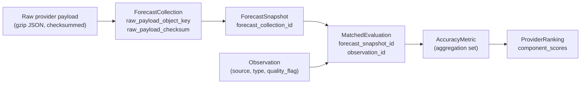

# ForecastIQ — Data Lineage Specification

**Version**: 1.0 (Phase 0 Amendment)
**Status**: Authoritative
**Related**: ARB Blocker 2 (collection lineage), Missing Req #3 (API response → snapshot decomposition)

---

## 1. Purpose

Every number ForecastIQ publishes must be traceable back to the raw bytes a provider
served. This document specifies the unbroken lineage chain, the identifiers that
implement it, and the rules that keep it intact.

## 2. The Lineage Chain

| Hop | Link mechanism | Guarantees |
|-----|----------------|-----------|
| Payload → Collection | `raw_payload_object_key` + `raw_payload_checksum` (SHA-256 of response body) | Payload integrity verifiable at any time while retained. |
| Collection → Snapshot | `forecast_snapshots.forecast_collection_id` (NOT NULL FK) | Every snapshot has exactly one origin collection. |
| Snapshot → Match | `matched_evaluations.forecast_snapshot_id` (FK) | Every compared snapshot references the exact observation it was compared against. |
| Observation → Match | `matched_evaluations.observation_id` (FK) | Observation provenance (type, source, quality) is one join away from any metric. |
| Match → Metric | Metric rows record `(provider, location, horizon, variable, period)`; the contributing set is **reproducible** by re-running the matching query with the same methodology_version. MVP does not store per-pair join tables for metrics (space tradeoff); reproducibility is the lineage mechanism. | Any metric can be recomputed byte-identically from immutable inputs (methodology §11, property 11). |
| Metric → Ranking | `provider_rankings.component_scores` JSONB lists component metric IDs + values; `methodology_version`, `weights_version` recorded. | Composite scores are decomposable to components and re-derivable. |

## 3. Provenance Attributes Exposed

Every API response for derived data includes provenance fields:

| Entity | Provenance fields in API |
|--------|--------------------------|
| ForecastSnapshot | `provider_id`, `forecast_collection_id`, `issued_at`, `adapter_version` (via collection), `schema_version` |
| Observation | `source`, `observation_type`, `quality_flag`, `observed_at` |
| AccuracyMetric | `sample_count`, `methodology_version`, `period_start/end`, `ci_lower/upper` |
| ProviderRanking | `methodology_version`, `weights_version`, `sample_count`, `coverage`, `reliability`, `component_scores`, `ranking_status` |

The UI displays: observation provenance badge (station/interpolated/reanalysis),
sample size, methodology version link, and freshness state — a design agent can rely on
these without inventing rules (`docs/ui/01-ui-data-requirements.md`).

## 4. Lineage-Preserving Rules

1. **No in-place mutation** of any pipeline entity. Corrections and recomputations
   create new rows; superseded rows are referenced, never rewritten.
2. **No cascade deletes** on pipeline tables. Deleting/disabling a location or provider
   changes status only; historical rows keep their FKs valid forever.
3. **Replay creates new collections** (domain model §4.8); the original collection and
   its snapshots remain the historical record.
4. **Adapter/schema versions are recorded at ingest**, enabling any discrepancy to be
   attributed to a specific code path.
5. **Checksums are computed before any parsing**; a payload that fails checksum
   verification on read is treated as corrupted and surfaced operationally, never
   silently re-fetched.

## 5. Lineage Failure Modes and Handling

| Failure | Detection | Handling |
|---------|-----------|----------|
| Raw payload missing at replay time | Object key read failure | Replay blocked with explicit error; normalized snapshots remain authoritative. |
| Checksum mismatch | SHA-256 verification on read | Operational alert; payload quarantined (renamed `.corrupt`); collection flagged. |
| Orphan snapshot (collection deleted) | Impossible by design (no deletes, FK NOT NULL) | DB constraint prevents. |
| Metric not reproducible after methodology change | Version mismatch on recompute | Expected: recompute uses the **old** methodology_version for verification, new version for publication. |

## 6. Audit Lineage (administrative actions)

`audit_events` records every administrative mutation (who, what, when, from where):
location/provider/schedule changes, key issuance/revocation, logins, replays.
Audit rows are immutable, retained 1 year, and reference `resource_id` of the affected
entity — completing lineage for *configuration* changes that affect future collection.
