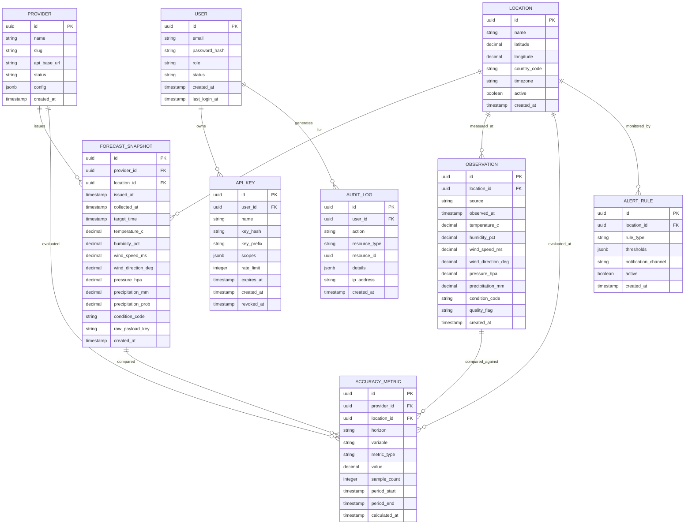
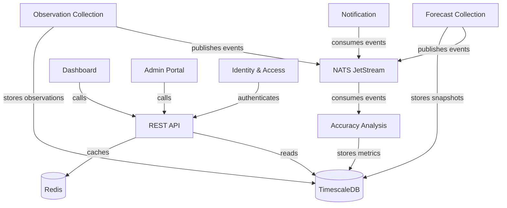

# ForecastIQ — Domain Model

> **⚠️ SUPERSEDED (2026-07-22, Phase 0 Amendment).** Retained for the historical record
> only. Authoritative: `docs/domain/01-domain-model.md`,
> `docs/domain/02-data-lineage.md`, `docs/domain/03-metric-methodology.md`. See
> `docs/reviews/02-phase-0-amendment-summary.md`.

**Version**: 1.0  
**Status**: Draft  

---

## 1. Domain Overview

ForecastIQ's domain is organized around the core concept of **measuring forecast accuracy**. The domain is divided into the following bounded contexts:

| Bounded Context | Responsibility |
|----------------|---------------|
| **Forecast Collection** | Ingest and store immutable forecast snapshots from providers |
| **Observation Collection** | Ingest and store actual weather observations |
| **Accuracy Analysis** | Compare forecasts vs observations, compute metrics |
| **Identity & Access** | Users, authentication, authorization, API keys |
| **Administration** | Provider config, location management, scheduling |
| **Notification** | Alerts, webhooks, email (post-MVP) |

---

## 2. Core Domain Entities

### 2.1 Entity Relationship Diagram (Mermaid)



---

## 3. Value Objects

| Value Object | Fields | Description |
|-------------|--------|-------------|
| GeoCoordinate | latitude, longitude | Geographic point |
| WeatherMeasurement | temperature_c, humidity_pct, wind_speed_ms, wind_direction_deg, pressure_hpa, precipitation_mm | Set of weather variables |
| Horizon | enum(+1h, +3h, +6h, +12h, +24h, +3d, +7d) | Forecast lead time |
| MetricType | enum(MAE, RMSE, BIAS, HIT_RATE, FAR, PRECISION, RECALL, F1) | Accuracy metric kind |
| WeatherVariable | enum(TEMPERATURE, HUMIDITY, WIND_SPEED, PRESSURE, PRECIPITATION) | Measured variable |
| DateRange | start, end | Time period |
| Pagination | cursor, limit, has_more, total_count | Cursor-based paging |

---

## 4. Domain Events

| Event | Trigger | Payload | Consumers |
|-------|---------|---------|-----------|
| `forecast.collected` | New snapshot stored | snapshot_id, provider_id, location_id | Comparison Engine |
| `observation.collected` | New observation stored | observation_id, location_id | Comparison Engine |
| `accuracy.calculated` | Metrics computed | metric_ids, provider_id, location_id | Dashboard cache, Alerts |
| `provider.health_changed` | Provider status change | provider_id, old_status, new_status | Admin notifications |
| `alert.triggered` | Threshold exceeded | alert_id, rule, current_value | Notification service |
| `user.created` | New user registered | user_id | Audit, Welcome email |
| `api_key.created` | New key generated | key_id, user_id | Audit |
| `api_key.revoked` | Key revoked | key_id, user_id | Audit |

---

## 5. Aggregates

### 5.1 ForecastSnapshot Aggregate
- **Root**: ForecastSnapshot
- **Invariants**:
  - Once created, no field can be modified (immutable)
  - `target_time` must be after `issued_at`
  - `collected_at` must be ≥ `issued_at`
  - Provider and Location must exist and be active

### 5.2 Observation Aggregate
- **Root**: Observation
- **Invariants**:
  - `observed_at` must be in the past (≤ now)
  - Values must pass range validation (or be flagged `suspect`)
  - Location must exist

### 5.3 AccuracyMetric Aggregate
- **Root**: AccuracyMetric
- **Invariants**:
  - `sample_count` must be > 0
  - `period_start` < `period_end`
  - Metric value must be non-negative (except Bias)
  - Requires valid provider + location + horizon combination

### 5.4 User Aggregate
- **Root**: User
- **Children**: APIKey
- **Invariants**:
  - Email must be unique
  - Password hash must use bcrypt/argon2
  - API key prefix must be unique
  - Revoked keys cannot be reactivated

---

## 6. Domain Services

| Service | Responsibility |
|---------|---------------|
| ForecastComparisonService | Match forecasts to observations, compute per-pair errors |
| MetricAggregationService | Aggregate per-pair errors into statistical metrics |
| ProviderRankingService | Rank providers by composite accuracy score |
| CollectionSchedulerService | Determine when/what to collect next |
| TokenService | Issue/validate JWTs, manage refresh tokens |

---

## 7. Repository Interfaces

```
ForecastRepository:
  - Save(snapshot) → error
  - FindByID(id) → ForecastSnapshot
  - FindByProviderAndLocation(providerID, locationID, filters) → []ForecastSnapshot
  - ExistsByProviderIssuedAt(providerID, locationID, issuedAt) → bool

ObservationRepository:
  - Save(observation) → error
  - FindByID(id) → Observation
  - FindByLocationAndTimeRange(locationID, start, end) → []Observation

AccuracyMetricRepository:
  - SaveBatch(metrics) → error
  - Find(filters) → []AccuracyMetric
  - FindSummary(providerID, locationID, horizon) → AccuracySummary

ProviderRepository:
  - FindAll() → []Provider
  - FindByID(id) → Provider
  - Update(provider) → error

LocationRepository:
  - Save(location) → error
  - FindAll(filters) → []Location
  - FindByID(id) → Location
  - Update(location) → error
  - Delete(id) → error

UserRepository:
  - Save(user) → error
  - FindByEmail(email) → User
  - FindByID(id) → User

APIKeyRepository:
  - Save(key) → error
  - FindByPrefix(prefix) → APIKey
  - FindByUser(userID) → []APIKey
  - Revoke(id) → error
```

---

## 8. Context Map


