# ForecastIQ — Use Case Diagram & Specifications

> **⚠️ SUPERSEDED (2026-07-22, Phase 0 Amendment).** Retained for the historical record
> only. Authoritative: `docs/product/04-personas-and-user-journeys.md`. See
> `docs/reviews/02-phase-0-amendment-summary.md`.

**Version**: 1.0  
**Status**: Draft  

---

## 1. Use Case Diagram

```mermaid
graph TB
    subgraph Actors
        AU[Anonymous User]
        RU[Registered User]
        BU[Business User]
        AD[Admin]
        SYS[System/Scheduler]
        EXT[External Provider API]
    end

    subgraph ForecastIQ Platform
        UC1[View Provider Rankings]
        UC2[View Accuracy Trends]
        UC3[Compare Forecast vs Actual]
        UC4[Query Forecasts via API]
        UC5[Query Observations via API]
        UC6[Query Accuracy Metrics via API]
        UC7[Manage Locations]
        UC8[Manage API Keys]
        UC9[Configure Alerts]
        UC10[Manage Providers]
        UC11[Manage Users]
        UC12[View System Health]
        UC13[View Audit Logs]
        UC14[Collect Forecasts]
        UC15[Collect Observations]
        UC16[Calculate Accuracy]
        UC17[Authenticate]
        UC18[Export Data]
    end

    AU --> UC1
    AU --> UC2
    RU --> UC3
    RU --> UC7
    RU --> UC8
    RU --> UC17
    BU --> UC4
    BU --> UC5
    BU --> UC6
    BU --> UC9
    BU --> UC18
    AD --> UC10
    AD --> UC11
    AD --> UC12
    AD --> UC13
    SYS --> UC14
    SYS --> UC15
    SYS --> UC16
    UC14 --> EXT
    UC15 --> EXT
```

---

## 2. Use Case Specifications

### UC-01: View Provider Rankings

| Field | Value |
|-------|-------|
| **Actor** | Anonymous User, Registered User, Business User |
| **Precondition** | At least one accuracy metric exists |
| **Main Flow** | 1. User navigates to rankings view 2. System displays providers ranked by composite accuracy score 3. User selects location filter 4. System re-ranks for selected location 5. User selects horizon filter 6. System re-ranks for selected horizon |
| **Alternative Flow** | No data available → System displays "Insufficient data" message |
| **Postcondition** | User sees ranked list of providers |
| **Priority** | Critical |

---

### UC-02: View Accuracy Trends

| Field | Value |
|-------|-------|
| **Actor** | Anonymous User, Registered User, Business User |
| **Precondition** | ≥ 7 days of accuracy data exists |
| **Main Flow** | 1. User navigates to accuracy trends view 2. System displays line chart of MAE/RMSE over time 3. User selects date range 4. System updates chart 5. User selects provider(s) 6. System filters chart to selected providers |
| **Postcondition** | User sees accuracy trend visualization |
| **Priority** | Critical |

---

### UC-03: Compare Forecast vs Actual

| Field | Value |
|-------|-------|
| **Actor** | Registered User, Business User |
| **Precondition** | Forecast and observation exist for same location/time |
| **Main Flow** | 1. User selects location and date 2. System retrieves forecasts and observations 3. System displays overlay chart (forecast line + observation line) 4. User selects variable (temp, wind, etc.) 5. System updates chart for selected variable |
| **Postcondition** | User sees visual comparison |
| **Priority** | High |

---

### UC-04: Query Forecasts via API

| Field | Value |
|-------|-------|
| **Actor** | Business User (API key) |
| **Precondition** | Valid API key with `forecasts:read` scope |
| **Main Flow** | 1. Client sends GET `/api/v1/forecasts?provider_id=X&location_id=Y&limit=50` 2. System validates API key and scopes 3. System queries forecasts with filters 4. System returns paginated JSON response |
| **Alternative Flow** | Invalid key → 401; Missing scope → 403; No results → empty array |
| **Postcondition** | Client receives forecast data |
| **Priority** | Critical |

---

### UC-05: Query Accuracy Metrics via API

| Field | Value |
|-------|-------|
| **Actor** | Business User (API key) |
| **Precondition** | Valid API key with `accuracy:read` scope |
| **Main Flow** | 1. Client sends GET `/api/v1/accuracy?provider_id=X&horizon=6h&variable=temperature` 2. System validates request 3. System queries aggregated metrics 4. System returns metrics with metadata |
| **Postcondition** | Client receives accuracy metrics |
| **Priority** | Critical |

---

### UC-06: Manage Locations

| Field | Value |
|-------|-------|
| **Actor** | Registered User, Admin |
| **Precondition** | User authenticated |
| **Main Flow** | 1. User navigates to locations management 2. System displays user's locations 3. User clicks "Add Location" 4. User enters name, latitude, longitude 5. System validates coordinates 6. System creates location 7. System begins collecting for new location (next cycle) |
| **Alternative Flow** | Invalid coordinates → validation error; Duplicate → warning |
| **Postcondition** | Location is active and being monitored |
| **Priority** | Critical |

---

### UC-07: Manage API Keys

| Field | Value |
|-------|-------|
| **Actor** | Registered User, Business User |
| **Precondition** | User authenticated |
| **Main Flow** | 1. User navigates to API keys section 2. User clicks "Create Key" 3. User provides name and selects scopes 4. System generates key, displays ONCE 5. System stores hashed key 6. User copies key for use |
| **Alternative Flow** | Revoke key → immediate invalidation |
| **Postcondition** | API key is active or revoked |
| **Priority** | High |

---

### UC-08: Manage Providers (Admin)

| Field | Value |
|-------|-------|
| **Actor** | Admin |
| **Precondition** | Admin authenticated |
| **Main Flow** | 1. Admin navigates to provider management 2. System displays all providers with status 3. Admin selects provider 4. Admin updates configuration (API key, schedule, enabled/disabled) 5. System encrypts and stores credentials 6. System applies changes on next collection cycle |
| **Postcondition** | Provider configuration updated |
| **Priority** | Critical |

---

### UC-09: Collect Forecasts (System)

| Field | Value |
|-------|-------|
| **Actor** | System/Scheduler |
| **Precondition** | Provider is enabled, location is active |
| **Main Flow** | 1. Scheduler triggers collection job 2. System iterates over active provider×location combinations 3. For each: call provider API with location coordinates 4. Parse and validate response 5. Store immutable forecast snapshot 6. Store raw response in S3 7. Publish `forecast.collected` event |
| **Alternative Flow** | API error → retry with backoff; Rate limit → wait and retry; Invalid data → log and skip |
| **Postcondition** | Forecast snapshots stored |
| **Priority** | Critical |

---

### UC-10: Calculate Accuracy (System)

| Field | Value |
|-------|-------|
| **Actor** | System/Scheduler |
| **Precondition** | Forecasts and observations exist for matching location/time |
| **Main Flow** | 1. Scheduler triggers comparison job 2. System finds new observations since last run 3. For each observation: find matching forecasts (by location, target_time ±30min) 4. Calculate per-pair errors for each variable 5. Aggregate into metrics (MAE, RMSE, etc.) by provider/location/horizon/period 6. Store/update aggregated metrics 7. Publish `accuracy.calculated` event |
| **Alternative Flow** | No matching forecast → skip; Insufficient samples → mark as preliminary |
| **Postcondition** | Accuracy metrics updated |
| **Priority** | Critical |

---

### UC-11: Authenticate

| Field | Value |
|-------|-------|
| **Actor** | Registered User |
| **Precondition** | User has valid credentials |
| **Main Flow** | 1. User submits email + password 2. System validates credentials 3. System generates JWT access token (15min) + refresh token (7d) 4. System returns tokens 5. User stores tokens 6. User includes access token in subsequent requests |
| **Alternative Flow** | Invalid credentials → 401; Expired access → use refresh; Expired refresh → re-login |
| **Postcondition** | User has valid session |
| **Priority** | Critical |

---

## 3. Use Case Priority Matrix

| Priority | Use Cases |
|----------|-----------|
| Critical | UC-01, UC-04, UC-05, UC-06, UC-08, UC-09, UC-10, UC-11 |
| High | UC-02, UC-03, UC-07 |
| Medium | Configure Alerts, Export Data, View Audit Logs |
| Low | AI Summaries, Public API |
