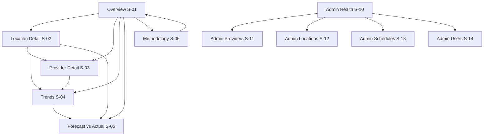

# ForecastIQ — Production UI Specification

**Version**: 1.0
**Status**: Design Complete — Awaiting Architecture Reconciliation
**Inputs**: All Phase 0 Amendment authoritative documents
**Constraint**: No frontend code. Specifications only.

---

## 1. Design System

### 1.1 Design Principles

| Principle | Application |
|-----------|-------------|
| Statistical honesty | Insufficient data is displayed as such; never papered over. Sample sizes always visible. CIs always accessible. |
| Operational usability | Admin screens optimize for fast anomaly detection and one-click recovery. |
| Information hierarchy | Ranking → metric breakdown → raw data. Progressive disclosure, never hidden. |
| Decision support | Every screen answers one primary question; the answer plus its evidence are co-located. |
| Data clarity | Numbers over decoration. Charts serve comparison, not aesthetics. |
| Accessibility | WCAG 2.1 AA: contrast ≥ 4.5:1, keyboard navigation, ARIA labels, data-table fallbacks for charts, reduced-motion respect. |
| Transparency | Methodology version, weights, provenance, and freshness are always one interaction away. |

### 1.2 Typography

| Role | Font | Size | Weight | Usage |
|------|------|------|--------|-------|
| Display | Inter | 28px / 1.75rem | 700 | Page titles |
| Heading 1 | Inter | 22px / 1.375rem | 600 | Section headers |
| Heading 2 | Inter | 18px / 1.125rem | 600 | Card titles, subsections |
| Body | Inter | 14px / 0.875rem | 400 | Default text |
| Body Small | Inter | 13px / 0.8125rem | 400 | Secondary text, captions |
| Mono / Data | JetBrains Mono | 14px / 0.875rem | 500 | Numeric values, scores, timestamps |
| Label | Inter | 12px / 0.75rem | 500 | Badges, tags, axis labels |

### 1.3 Color Palette

#### Semantic Colors

| Token | Light Value | Purpose |
|-------|-------------|---------|
| `--color-primary` | #1A56DB (blue-700) | Primary actions, links, active nav |
| `--color-primary-hover` | #1444B0 | Hover state |
| `--color-surface` | #FFFFFF | Card backgrounds |
| `--color-surface-secondary` | #F9FAFB (gray-50) | Page background, alternating rows |
| `--color-border` | #E5E7EB (gray-200) | Card borders, dividers |
| `--color-text-primary` | #111827 (gray-900) | Primary text |
| `--color-text-secondary` | #6B7280 (gray-500) | Secondary text, captions |
| `--color-text-muted` | #9CA3AF (gray-400) | Disabled, placeholder |

#### Status Colors (Freshness & Ranking)

| Token | Value | Usage |
|-------|-------|-------|
| `--color-fresh` | #059669 (emerald-600) | Fresh data indicator |
| `--color-delayed` | #D97706 (amber-600) | Delayed data badge |
| `--color-stale` | #EA580C (orange-600) | Stale data banner |
| `--color-unavailable` | #DC2626 (red-600) | Unavailable / error |
| `--color-ranked` | #059669 (emerald-600) | Ranked status badge |
| `--color-provisional` | #D97706 (amber-600) | Provisional badge |
| `--color-unranked` | #6B7280 (gray-500) | Unranked / insufficient data |

#### Provider Colors (consistent across all charts)

| Provider | Color | Rationale |
|----------|-------|-----------|
| Open-Meteo | #2563EB (blue-600) | Distinct, accessible |
| OpenWeather | #7C3AED (violet-600) | Distinct from blue |
| Future Provider 3 | #0891B2 (cyan-600) | Reserved |
| Future Provider 4 | #DB2777 (pink-600) | Reserved |
| Observation (actual) | #111827 (gray-900) dashed | Ground truth is distinct from forecasts |

### 1.4 Spacing Scale

Base unit: 4px. Scale: 4, 8, 12, 16, 20, 24, 32, 40, 48, 64.

| Token | Value | Usage |
|-------|-------|-------|
| `--space-xs` | 4px | Icon-to-text gap |
| `--space-sm` | 8px | Intra-component padding |
| `--space-md` | 16px | Card padding, between elements |
| `--space-lg` | 24px | Between cards, section gaps |
| `--space-xl` | 32px | Section separators |
| `--space-2xl` | 48px | Page-level vertical rhythm |

### 1.5 Component Library

#### Badges

| Badge | Style | Content |
|-------|-------|---------|
| Status: Ranked | Solid emerald bg, white text | "Ranked" |
| Status: Provisional | Solid amber bg, white text | "Provisional" |
| Status: Unranked | Outline gray, gray text | "Insufficient data" |
| Freshness: Fresh | Dot indicator emerald | (dot only, no text needed) |
| Freshness: Delayed | Solid amber pill | "Delayed" |
| Freshness: Stale | Solid orange pill | "Stale" |
| Freshness: Unavailable | Solid red pill | "Unavailable" |
| Provenance: Station | Outline blue | "Station" |
| Provenance: Reanalysis | Outline purple | "Reanalysis" |
| Provenance: Interpolated | Outline teal | "Interpolated" |
| Provenance: Provider Est. | Outline gray | "Provider est." |

#### Cards

- Border: 1px `--color-border`, radius 8px
- Padding: 20px (`--space-md` + 4px)
- Shadow: `0 1px 3px rgba(0,0,0,0.1)` (subtle elevation)
- Hover (interactive cards): shadow increases to `0 4px 6px rgba(0,0,0,0.1)`

#### Data Tables

- Header row: `--color-surface-secondary` bg, 12px uppercase label text
- Row height: 44px
- Zebra striping: alternating `--color-surface` / `--color-surface-secondary`
- Sortable columns: header click with arrow indicator
- Null values: "—" (em dash) with tooltip explaining reason

#### Buttons

| Variant | Usage |
|---------|-------|
| Primary (filled blue) | Main actions: Export CSV, Retry, Save |
| Secondary (outline) | Cancel, Back, secondary actions |
| Danger (filled red) | Delete account, Revoke key |
| Ghost (text only) | Tertiary actions, links within tables |
| Disabled | 50% opacity, cursor not-allowed, tooltip explains why |

#### Selectors (Global Controls)

- Location selector: Dropdown with search, country flag, sorted by name
- Horizon selector: Segmented control (pill group): +1h, +3h, +6h, +12h, +24h, +3d, +7d
- Date range: Preset buttons (7d, 30d, 90d) + custom date picker
- Variable selector: Dropdown: Temperature, Precipitation, Wind Speed, Humidity, Pressure

#### Charts

- Library-agnostic specification; implementation choice deferred
- Line charts: 2px stroke, provider-colored, with CI band (10% opacity fill)
- Hover: tooltip with exact values, sample count, CI
- Missing data: line breaks (no interpolation across gaps)
- Hollow points: sample count below threshold (provisional)
- Keyboard: legend items focusable, arrow keys navigate data points
- Data-table fallback: hidden accessible table for screen readers

### 1.6 Iconography

- System: Lucide (open-source, consistent stroke width)
- Size: 16px (inline), 20px (buttons), 24px (nav)
- Stroke: 1.5px
- Key icons: Activity (health), TrendingUp (trends), MapPin (locations), Server (providers), Shield (admin), Clock (freshness), AlertTriangle (warnings), Download (export)

### 1.7 Motion

- Transitions: 150ms ease-out for hover/focus states
- Skeleton loading: subtle pulse animation (opacity 0.4 → 1.0, 1.5s loop)
- Respects `prefers-reduced-motion`: disables all animations
- No entrance animations on data (prevents perceived latency)

### 1.8 Number Formatting (Binding)

| Kind | Format | Example |
|------|--------|---------|
| Composite score | 3 decimal places | 0.940 |
| Error metrics (°C, mm, m/s) | 2 dp + unit | 1.38 °C |
| Ratios (Recall, Precision, F1, FAR) | Percentage, 1 dp | 88.9% |
| Coverage / Reliability | Percentage, 0 dp | 98% |
| Sample counts | Integer; highlighted amber when < threshold | 720 / **15** |
| Timestamps | "Jul 22, 18:00 MYT" + relative "2 h ago" | — |
| Confidence interval | "±0.09" or shaded band | — |
| Bias | Signed, 2 dp + unit | +0.88 °C |

---

## 2. Information Architecture

### 2.1 Content Hierarchy

```
ForecastIQ
├── Overview (S-01) — Rankings for selected location + horizon
├── Trends (S-04) — Metric trends over time
├── Forecast vs. Actual (S-05) — Overlay chart comparison
├── Location Detail (S-02) — All providers for one location
├── Provider Detail (S-03) — One provider across locations
├── Methodology (S-06) — Formulas, weights, worked example
├── Settings (S-09) — Profile, API keys, preferences
├── Admin (role-gated)
│   ├── Health (S-10) — Collector status grid
│   ├── Providers (S-11) — Enable/disable, configurations
│   ├── Locations (S-12) — Add/edit/disable
│   ├── Schedules & Runs (S-13) — History, replay, recompute
│   └── Users & Audit (S-14) — Account management, event log
├── Auth (S-08) — Sign in / Sign up / Verify / Reset
└── Error Pages (S-15) — 404, 500, 403, offline
```

### 2.2 Information Scent Principles

1. **Rankings are the front door.** The Overview answers the product's core question immediately: "Which provider is best for my location and horizon?"
2. **Evidence is one click away.** Every composite score links to its per-metric breakdown. Every metric links to methodology.
3. **Freshness is ambient.** Every data-bearing view shows last-updated without requiring interaction.
4. **Admin is separate but accessible.** Role-gated section; never mixed into public data views.

### 2.3 URL Architecture (Shareable State)

| Screen | URL Pattern | Query Params |
|--------|-------------|--------------|
| Overview | `/` | `?location_id=&horizon_minutes=` |
| Trends | `/trends` | `?location_id=&horizon_minutes=&variable=&period=&aggregation=` |
| Forecast vs. Actual | `/forecast-vs-actual` | `?location_id=&date=&variable=&providers=` |
| Location Detail | `/locations/:id` | `?horizon_minutes=&period=` |
| Provider Detail | `/providers/:id` | `?location_id=&horizon_minutes=` |
| Methodology | `/methodology` | `#section-anchors` |
| Settings | `/settings` | `?tab=profile|keys|preferences|danger` |
| Admin Health | `/admin/health` | `?provider_id=&status=` |
| Admin Providers | `/admin/providers` | — |
| Admin Locations | `/admin/locations` | — |
| Admin Schedules | `/admin/schedules` | `?provider_id=&status=` |
| Admin Users | `/admin/users` | `?status=` |
| Auth | `/auth/signin`, `/auth/signup`, `/auth/verify`, `/auth/reset` | — |

### 2.4 Data Freshness Model (UI Mapping)

Per BR-FRESH-01/02, every time-sensitive view displays:

| Freshness State | Visual Treatment |
|-----------------|-----------------|
| `fresh` | Green dot indicator; "Updated {relative} ago" in secondary text |
| `delayed` | Amber badge "Data delayed"; last-updated shown |
| `stale` | Orange banner at top of data area: "Data may be out of date — last updated {relative} ({absolute local time})"; stale badge on affected rankings |
| `unavailable` | Red empty-state panel: "No data available — {reason if known}" |

### 2.5 Permission Model (UI)

| Role | Access |
|------|--------|
| Public (unauthenticated) | Overview, Trends, FvA, Location Detail, Provider Detail, Methodology — read-only |
| User (authenticated) | Public + Settings (profile, API keys, export, delete) + raw forecast/observation queries |
| Admin (operator) | All above + Admin section (Health, Providers, Locations, Schedules, Users & Audit) |

---

## 3. Navigation Map

### 3.1 Global Header (Single Row)

```
┌─────────────────────────────────────────────────────────────────────────────┐
│ [Logo: ForecastIQ]  Overview · Trends · Methodology · Admin* · Settings*   │
│                                                                              │
│ [Location Selector ▾]  [Horizon: +1h|+3h|+6h|+12h|+24h|+3d|+7d]  [Avatar] │
└─────────────────────────────────────────────────────────────────────────────┘
```

- `*` = role-gated (hidden when not authorized)
- Location selector and horizon selector are **global controls** persisted in URL
- Avatar: dropdown with Profile, Settings, Sign out (or "Sign in" link when public)
- Mobile: hamburger menu collapses nav items; global selectors move to a filter bar below header

### 3.2 Navigation Flow



### 3.3 Cross-Linking Rules

| From | To | Trigger |
|------|----|---------|
| Ranking row (S-01) | Location Detail (S-02) | Click location name |
| Ranking row (S-01) | Provider Detail (S-03) | Click provider name |
| Composite score (S-01) | Breakdown panel (inline expand) | Click score or "Breakdown" |
| Any metric label | Methodology (S-06) with anchor | Click metric name or ⓘ icon |
| Methodology version badge | Methodology (S-06) | Click version string |
| Trends data point (S-04) | Forecast vs. Actual (S-05) | Click point → "View forecasts for this date" |
| Admin Health row (S-10) | Admin Schedules (S-13) | Click collection ID |
| Admin Health stale cell | Runbook link (external) | Click "Runbook" per failure class |

### 3.4 Attribution Footer (Every Data-Bearing Page)

Per BR-ATTR-01:

```
┌─────────────────────────────────────────────────────────────────────────────┐
│ Data sources: Open-Meteo (attribution text + link) · OpenWeather (text+link)│
│ Observations: Open-Meteo Historical (reanalysis blend) · Methodology v2026.1│
│ All times UTC unless labeled. ForecastIQ measures forecasts; we don't       │
│ deliver weather.                                                             │
└─────────────────────────────────────────────────────────────────────────────┘
```

- Attribution text is **configured per provider** (from `providers.attribution_text/url`), never hardcoded.
- Observation provenance mix shown when relevant.
- Non-promise disclaimer per Product Contract NP-01.

### 3.5 Admin Sub-Navigation

When Admin section is active, a secondary tab bar appears:

```
[ Health | Providers | Locations | Schedules & Runs | Users & Audit ]
```

- Tabs are horizontal, scrollable on mobile
- Active tab: primary color underline + bold text
- Breadcrumb: "Admin / Health" for context


---

## 4. Dashboard Layout — Overview (S-01)

### 4.1 Screen Specification

| Attribute | Value |
|-----------|-------|
| **Purpose** | Answer "Which forecast provider is most accurate for my location and horizon?" with evidence |
| **Primary user** | Daniel (weather-curious individual); also Aisyah (quick health check) |
| **Primary decision** | Which provider to trust for the selected location and time horizon |
| **Primary action** | Select location/horizon → read ranking → drill into breakdown |
| **Data required** | Rankings (composite, components, status, sample, coverage, CI, freshness), locations list, observation provenance mix |
| **API dependency** | `GET /rankings?location_id=&horizon_minutes=`, `GET /locations?active=true` |
| **Permission** | Public (no auth required) |

### 4.2 Layout Structure

```
┌─────────────────────────────────────────────────────────────────────────┐
│ [Global Header + Location Selector + Horizon Selector]                   │
├─────────────────────────────────────────────────────────────────────────┤
│                                                                          │
│  LOCATION CONTEXT BAR                                                    │
│  "Johor Bahru, MY (MYT) · Based on 30 days of data · Updated 25m ago"  │
│  [Freshness dot: green]  [Observation provenance badge: Reanalysis]     │
│                                                                          │
├─────────────────────────────────────────────────────────────────────────┤
│                                                                          │
│  QUICK STATS ROW (3 cards)                                              │
│  ┌──────────────┐ ┌──────────────┐ ┌──────────────────┐                │
│  │ 2 Ranked     │ │ 0 Provisional│ │ 0 Unranked       │                │
│  │ providers    │ │ providers    │ │ (insufficient)   │                │
│  └──────────────┘ └──────────────┘ └──────────────────┘                │
│                                                                          │
├─────────────────────────────────────────────────────────────────────────┤
│                                                                          │
│  RANKING TABLE (primary content)                                         │
│  ┌─────────────────────────────────────────────────────────────────┐    │
│  │ Rank │ Provider    │ Score │ Status    │ Samples │ Coverage │ ↕ │    │
│  │  1   │ Open-Meteo  │ 0.940 │ [Ranked]  │ 720     │ 98%      │   │    │
│  │  2   │ OpenWeather │ 0.780 │ [Ranked]  │ 700     │ 92%      │   │    │
│  └─────────────────────────────────────────────────────────────────┘    │
│                                                                          │
│  [Expand: Per-metric breakdown panel per row]                            │
│  "Not significantly different" tie annotation between rows when CIs      │
│  overlap                                                                 │
│                                                                          │
├─────────────────────────────────────────────────────────────────────────┤
│                                                                          │
│  METHODOLOGY FOOTER                                                      │
│  "Methodology v2026.1 · Weights w-2026.1 · [View methodology →]"        │
│                                                                          │
├─────────────────────────────────────────────────────────────────────────┤
│ [Attribution Footer]                                                     │
└─────────────────────────────────────────────────────────────────────────┘
```

### 4.3 Ranking Row Detail

Each ranking row shows:

| Field | Source | Format |
|-------|--------|--------|
| Rank number | `rankings[].rank` | Integer; null for unranked (shows "—") |
| Provider name | `rankings[].provider.name` | Text + attribution link icon |
| Composite score | `rankings[].composite_score` | 0.000 (3 dp, mono font) |
| Status badge | `rankings[].ranking_status` | Colored badge (ranked/provisional/unranked) |
| Sample count | `rankings[].sample_count` | Integer; amber highlight if < 30 |
| Coverage | `rankings[].coverage` | Percentage, 0 dp |
| CI | `rankings[].ci_lower/upper` | Shown on hover: "95% CI: [0.91, 0.96]" |
| Freshness | `freshness.state` | Dot indicator color |

**Expanded breakdown** (click row or "Breakdown" button):

| Component | Value | Normalized | Weight | Sample n | CI |
|-----------|-------|-----------|--------|----------|-----|
| Temp MAE | 1.20 °C | 0.917 | 30% | 720 | ±0.09 |
| Precip F1 | 76.9% | 1.000 | 25% | 720 | — |
| Rain MAE | 0.90 mm | 0.944 | 15% | 720 | ±0.12 |
| Wind MAE | 1.10 m/s | 1.000 | 15% | 720 | ±0.08 |
| |Bias| | 0.30 °C | 0.833 | 5% | 720 | — |
| Coverage | 98% | — | 5% | — | — |
| Reliability | 99% | — | 5% | — | — |

- Coverage penalty applied: shown as struck-through raw score → penalized score when active
- "Why this ranking?" link → Methodology page anchor

### 4.4 Interaction Patterns

| Interaction | Behavior |
|-------------|----------|
| Change location | URL updates; rankings refetch; skeleton shown during load |
| Change horizon | URL updates; rankings refetch; previous data dimmed |
| Click ranking row | Expand/collapse breakdown panel (accordion) |
| Click provider name | Navigate to Provider Detail (S-03) |
| Click metric label | Navigate to Methodology (S-06) with anchor |
| Hover CI | Tooltip with interval + "providers with overlapping CIs are tied" |
| Export CSV | Button in toolbar; exports current view with metadata headers |

### 4.5 States (S-01 Specific)

| State | Trigger | UI Treatment |
|-------|---------|--------------|
| Loading | Initial fetch / refetch | Skeleton: 3 stat cards + 2 table rows (pulse animation) |
| Empty: no locations | `GET /locations` returns [] | "No locations monitored yet." + (admin only) "Add location" CTA |
| Empty: no data for location | Location exists, zero rankings | "Collecting since {date} — first rankings appear after ≥7 days of data" |
| Insufficient data | All cells `unranked` | Each row: "Insufficient data ({n}/30 samples) — keeps collecting" |
| Partial failure | `warnings[]` in response | Affected provider row: amber badge "Temporarily unavailable"; others render normally |
| Stale | `freshness.state = stale` | Orange banner above table: "Data may be out of date — last updated 4h ago (Jul 22, 14:00 MYT)" |
| Error | 5xx / network failure | Error panel: "Unable to load rankings." + [Retry] button; cached data shown dimmed with "Cached {time}" label |
| Permission denied | N/A (public screen) | — |

### 4.6 Accessibility Notes

- Ranking table: semantic `<table>` with `<th scope="col">` headers
- Status badges: text content (not color-only); `aria-label` includes status
- Breakdown expansion: `aria-expanded` on trigger; `role="region"` on panel
- Freshness dot: `aria-label="Data freshness: fresh"` (not color-only)
- Chart alternatives: N/A (table-based screen)
- Keyboard: Tab through rows; Enter/Space to expand breakdown

### 4.7 Future Enhancements (Level 3, not designed)

- Multi-location comparison table
- Sparkline trends inline in ranking rows
- Personalized "my location" shortcut
- Alert subscriptions per ranking change

---

## 5. Forecast Evolution — Forecast vs. Actual (S-05)

### 5.1 Screen Specification

| Attribute | Value |
|-----------|-------|
| **Purpose** | Visually compare what providers predicted against what actually happened for a specific date and variable |
| **Primary user** | Daniel (verifying "was yesterday's rain forecast right?"); Mei (exploring data) |
| **Primary decision** | Which provider's forecast track most closely matched reality for the selected day |
| **Primary action** | Select date + variable → compare forecast lines against observation line |
| **Data required** | Forecasts per provider (issued_at fixed, target_time axis), observations with provenance, MAE error band |
| **API dependency** | `GET /forecasts?location_id=&issued_after=&issued_before=&horizon_minutes=`, `GET /observations?location_id=&observed_after=&observed_before=` |
| **Permission** | Public |

### 5.2 Layout Structure

```
┌─────────────────────────────────────────────────────────────────────────┐
│ [Global Header]                                                          │
├─────────────────────────────────────────────────────────────────────────┤
│                                                                          │
│  CONTROL BAR                                                             │
│  [Date: Jul 21, 2026 ▾]  [Variable: Temperature ▾]  [Providers: All ▾] │
│  [Location: Johor Bahru ▾]                                              │
│                                                                          │
├─────────────────────────────────────────────────────────────────────────┤
│                                                                          │
│  MAIN CHART AREA                                                         │
│  ┌─────────────────────────────────────────────────────────────────┐    │
│  │  Y-axis: Temperature (°C)                                        │    │
│  │                                                                   │    │
│  │  ─── Open-Meteo forecast (blue)                                  │    │
│  │  ─── OpenWeather forecast (violet)                                │    │
│  │  - - - Observation / actual (gray dashed)                         │    │
│  │  ░░░ Error band (±MAE of selected period, 10% opacity)           │    │
│  │                                                                   │    │
│  │  X-axis: Target time (00:00 → 23:00, location timezone)         │    │
│  │                                                                   │    │
│  │  [Gaps in observation = line breaks, NOT interpolated]            │    │
│  └─────────────────────────────────────────────────────────────────┘    │
│                                                                          │
│  LEGEND (keyboard-accessible)                                            │
│  [●] Open-Meteo  [●] OpenWeather  [--] Observed (Reanalysis) [░] ±MAE  │
│                                                                          │
├─────────────────────────────────────────────────────────────────────────┤
│                                                                          │
│  SUMMARY PANEL (below chart)                                             │
│  ┌─────────────────────────────────────────────────────────────────┐    │
│  │ Provider     │ MAE (day) │ Bias (day) │ RMSE (day) │ Samples    │    │
│  │ Open-Meteo   │ 1.24 °C   │ +0.31 °C   │ 1.62 °C    │ 24         │    │
│  │ OpenWeather  │ 1.87 °C   │ −0.45 °C   │ 2.31 °C    │ 24         │    │
│  └─────────────────────────────────────────────────────────────────┘    │
│  Observation provenance: [Reanalysis badge] · Source: Open-Meteo Hist.  │
│                                                                          │
│  [Export CSV]                                                            │
│                                                                          │
├─────────────────────────────────────────────────────────────────────────┤
│ [Attribution Footer]                                                     │
└─────────────────────────────────────────────────────────────────────────┘
```

### 5.3 Chart Behavior

| Behavior | Specification |
|----------|---------------|
| Forecast lines | One per selected provider; colored per design system; 2px solid |
| Observation line | Gray-900 dashed; provenance badge in legend |
| Error band | ±MAE from the 30-day accuracy summary for the selected variable/horizon; 10% opacity fill around observation |
| Missing observations | Line break (gap); never interpolated; tooltip on gap: "No observation for this hour" |
| Hover tooltip | Shows: time, forecast value per provider, observed value, error per provider |
| X-axis | Hours of the selected day in location timezone (BR-TZ-02); explicit zone label |
| Y-axis | Variable unit (°C, mm, m/s, %, hPa) with unit label |
| Issued-at context | Subtitle: "Forecasts issued {issued_at} · Horizon +1h to +24h" |

### 5.4 States

| State | Treatment |
|-------|-----------|
| Loading | Skeleton chart area (gray rectangle with pulse) + skeleton summary table |
| Empty: no forecasts for date | "No forecasts collected for {date}. Collection started {date}." |
| Empty: no observations for date | Chart shows forecast lines only; banner: "Ground truth unavailable for this period — metrics not computed" + provenance note |
| Partial provider failure | Missing provider's line absent; note in legend: "{Provider} — temporarily unavailable" |
| Stale | Freshness banner per §2.4 |
| Error | Error panel with retry; chart area shows "Unable to load chart data" |

### 5.5 Accessibility Notes

- Chart: `role="img"` with `aria-label` summarizing the comparison
- Hidden data table: full values available to screen readers
- Legend items: focusable buttons that toggle series visibility
- Keyboard: arrow keys move a focus indicator along the x-axis; tooltip content announced via `aria-live`
- Reduced motion: no animated line drawing

### 5.6 Future Enhancements (Level 3)

- Zoom/pan/brush on time axis
- Multi-day range view
- Animate forecast issuance timeline
- Precipitation probability as area chart

---

## 6. Accuracy Analytics — Trends (S-04)

### 6.1 Screen Specification

| Attribute | Value |
|-----------|-------|
| **Purpose** | Show how provider accuracy metrics change over time; detect improving/degrading providers |
| **Primary user** | Daniel (long-term trust), Mei (analysis), Aisyah (quality monitoring) |
| **Primary decision** | Is a provider's accuracy stable, improving, or degrading over the selected period? |
| **Primary action** | Select variable + aggregation + period → compare trend lines across providers |
| **Data required** | Accuracy metrics time series per provider (value, CI, sample_count per bucket) |
| **API dependency** | `GET /accuracy?location_id=&horizon_minutes=&variable=&metric_type=&period_start=&period_end=&aggregation=` |
| **Permission** | Public |

### 6.2 Layout Structure

```
┌─────────────────────────────────────────────────────────────────────────┐
│ [Global Header]                                                          │
├─────────────────────────────────────────────────────────────────────────┤
│                                                                          │
│  CONTROL BAR                                                             │
│  [Location ▾] [Horizon ▾] [Variable: Temperature ▾]                    │
│  [Metric: MAE ▾]  [Period: 7d | 30d | 90d | Custom]                   │
│  [Aggregation: Daily | Weekly | Monthly]                                 │
│                                                                          │
├─────────────────────────────────────────────────────────────────────────┤
│                                                                          │
│  TREND CHART                                                             │
│  ┌─────────────────────────────────────────────────────────────────┐    │
│  │  Y-axis: MAE (°C) — lower is better                             │    │
│  │                                                                   │    │
│  │  ─── Open-Meteo (blue line + CI band)                            │    │
│  │  ─── OpenWeather (violet line + CI band)                         │    │
│  │                                                                   │    │
│  │  ○ Hollow points = sample count below threshold (provisional)    │    │
│  │                                                                   │    │
│  │  X-axis: Date buckets (location timezone per BR-TZ-05)           │    │
│  └─────────────────────────────────────────────────────────────────┘    │
│                                                                          │
│  LEGEND: [●] Open-Meteo  [●] OpenWeather  [○] Provisional (< n)        │
│                                                                          │
├─────────────────────────────────────────────────────────────────────────┤
│                                                                          │
│  METRIC SUMMARY TABLE (below chart)                                      │
│  ┌─────────────────────────────────────────────────────────────────┐    │
│  │ Provider    │ Period Avg │ Latest │ Trend (Δ) │ Samples │ CI    │    │
│  │ Open-Meteo  │ 1.22 °C    │ 1.18   │ −0.04 ↓   │ 720     │ ±0.09│    │
│  │ OpenWeather │ 1.53 °C    │ 1.61   │ +0.08 ↑   │ 700     │ ±0.11│    │
│  └─────────────────────────────────────────────────────────────────┘    │
│                                                                          │
│  [Export CSV]  "Methodology v2026.1"                                    │
│                                                                          │
├─────────────────────────────────────────────────────────────────────────┤
│ [Attribution Footer]                                                     │
└─────────────────────────────────────────────────────────────────────────┘
```

### 6.3 Chart Behavior

| Behavior | Specification |
|----------|---------------|
| Lines | One per provider; provider-colored; 2px solid |
| CI band | Shaded area (10% opacity) around each line representing 95% CI |
| Hollow points | When a bucket's sample_count < active threshold (30 for daily, varies for weekly/monthly); drawn as hollow circle; legend explains |
| Hover tooltip | Date bucket, metric value ± CI, sample count per provider |
| X-axis bucketing | Per BR-TZ-05: daily/weekly/monthly buckets in location timezone |
| Y-axis direction | For error metrics (MAE, RMSE): lower is better (axis not inverted; label notes "lower is better") |
| Y-axis direction | For ratios (F1, Recall): higher is better (label notes "higher is better") |
| Click data point | Navigate to Forecast vs. Actual (S-05) for that date |

### 6.4 Metric Selector Options

| Variable | Available Metrics |
|----------|-------------------|
| Temperature | MAE, RMSE, Bias |
| Precipitation (occurrence) | Recall, Precision, F1, FAR, Threat Score |
| Precipitation (amount) | Rain MAE (all), Rain MAE (wet-only) |
| Wind Speed | MAE, RMSE, Bias |
| Humidity | MAE, RMSE, Bias |
| Pressure | MAE, RMSE, Bias |

### 6.5 States

| State | Treatment |
|-------|-----------|
| Loading | Skeleton chart + skeleton table |
| Empty: no data in period | "No accuracy data for this period. Collection started {date}." |
| Insufficient data | All points hollow; banner: "All data points below sample threshold — trends are provisional" |
| Partial failure | Missing provider line absent; note in legend |
| Stale | Freshness banner |
| Error | Error panel + retry |

### 6.6 Accessibility Notes

- Same chart accessibility pattern as S-05
- Trend direction indicated with text (↑/↓) not just color
- Aggregation selector: `role="radiogroup"` with `aria-label`
- Data table fallback includes all bucket values

### 6.7 Future Enhancements (Level 3)

- Multi-metric overlay (dual y-axis)
- Annotated events (provider outage, methodology change)
- Statistical trend detection (significant change alert)
- Brush/zoom on time range


---

## 7. Provider Comparison — Provider Detail (S-03)

### 7.1 Screen Specification

| Attribute | Value |
|-----------|-------|
| **Purpose** | Show one provider's accuracy performance across all locations and horizons; distinguish collection reliability from data coverage |
| **Primary user** | Daniel (comparing providers), Aisyah (provider health overview) |
| **Primary decision** | Is this provider reliable and accurate across my locations of interest? |
| **Primary action** | Select provider → scan cross-location grid → drill into specific location/horizon |
| **Data required** | Accuracy metrics per location/horizon, collection reliability, coverage, composite scores |
| **API dependency** | `GET /accuracy?provider_id=`, `GET /forecast-collections?provider_id=` (public health subset), `GET /rankings?location_id=` |
| **Permission** | Public |

### 7.2 Layout Structure

```
┌─────────────────────────────────────────────────────────────────────────┐
│ [Global Header]                                                          │
├─────────────────────────────────────────────────────────────────────────┤
│                                                                          │
│  PROVIDER HEADER                                                         │
│  [Provider icon] OpenWeather                                             │
│  Attribution: "Weather data by OpenWeather (link)"                       │
│  Status: [Active]  ·  Adapter v1.2.0  ·  Collecting since Jun 1, 2026  │
│                                                                          │
├─────────────────────────────────────────────────────────────────────────┤
│                                                                          │
│  CROSS-LOCATION COMPOSITE GRID                                          │
│  ┌─────────────────────────────────────────────────────────────────┐    │
│  │ Location       │ +1h  │ +3h  │ +6h  │ +12h │ +24h │ +3d  │ +7d │    │
│  │ Johor Bahru    │ 0.82 │ 0.80 │ 0.78 │ 0.79 │ 0.78 │ 0.74 │ 0.71│    │
│  │ Singapore      │ 0.85 │ 0.83 │ 0.81 │ 0.80 │ 0.79 │  —   │  —  │    │
│  │ London         │  —   │  —   │  —   │  —   │  —   │  —   │  —  │    │
│  └─────────────────────────────────────────────────────────────────┘    │
│  Cell: composite score (3dp) or "—" for unranked/insufficient           │
│  Cell color: green (>0.85) → amber (0.6–0.85) → gray (insufficient)    │
│  Click cell → Location Detail for that location/horizon                  │
│                                                                          │
├─────────────────────────────────────────────────────────────────────────┤
│                                                                          │
│  COLLECTION HEALTH SUMMARY (inline, not admin)                           │
│  ┌─────────────────────────────────────────────────────────────────┐    │
│  │  Collection Reliability: 97%    │  Data Coverage: 92%            │    │
│  │  "Our collector successfully retrieved 97% of scheduled calls."  │    │
│  │  "The provider delivered non-null data for 92% of expected       │    │
│  │   snapshots."                                                    │    │
│  │  [ⓘ What's the difference?] → inline explanation                 │    │
│  └─────────────────────────────────────────────────────────────────┘    │
│                                                                          │
├─────────────────────────────────────────────────────────────────────────┤
│                                                                          │
│  PER-HORIZON METRIC DETAIL (selected location)                           │
│  [Location: Johor Bahru ▾]                                              │
│  ┌─────────────────────────────────────────────────────────────────┐    │
│  │ Horizon │ Temp MAE │ Rain F1 │ Wind MAE │ Samples │ Status      │    │
│  │ +1h     │ 1.10 °C  │ 82.1%   │ 0.9 m/s  │ 720     │ Ranked      │    │
│  │ +6h     │ 1.35 °C  │ 76.9%   │ 1.1 m/s  │ 720     │ Ranked      │    │
│  │ +24h    │ 1.50 °C  │ 71.0%   │ 1.3 m/s  │ 700     │ Ranked      │    │
│  │ +7d     │ 2.10 °C  │  —      │ 1.8 m/s  │ 180     │ Provisional │    │
│  └─────────────────────────────────────────────────────────────────┘    │
│                                                                          │
│  [Export CSV]  ·  Methodology v2026.1                                    │
│                                                                          │
├─────────────────────────────────────────────────────────────────────────┤
│ [Attribution Footer]                                                     │
└─────────────────────────────────────────────────────────────────────────┘
```

### 7.3 Key Distinction: Reliability vs. Coverage

Per PC-06 and the methodology, the UI explicitly distinguishes:

- **Collection reliability** = our collector's success rate (our-side failures vs. provider outages classified via `error_code`)
- **Data coverage** = the provider's data completeness (non-null values for variables)

An inline explainer (ⓘ tooltip or expandable) states: "Reliability measures whether we successfully retrieved data. Coverage measures whether the provider's response contained usable values. A provider can have high reliability but low coverage (we always get a response, but it has gaps), or low reliability but high coverage (when we do get data, it's complete)."

### 7.4 States

| State | Treatment |
|-------|-----------|
| Loading | Skeleton grid + skeleton table |
| Empty: provider has no data | "No collections recorded for this provider yet." |
| Empty: location has no data for provider | Grid cell: "—" with tooltip "No data for this location/horizon" |
| Insufficient data | Cell: "—" with tooltip "Insufficient: {n}/30 samples"; status column shows "Unranked" |
| Partial failure | Banner if provider circuit is open: "Provider temporarily unavailable — showing last known data ({time})" |
| Stale | Freshness banner per §2.4 |
| Error | Error panel + retry |

### 7.5 Accessibility Notes

- Grid: semantic table with row/column headers
- Cell color: supplemented with text value (never color-only)
- Tooltips: accessible via keyboard focus (not hover-only)
- Reliability/coverage explainer: `aria-expanded` toggle

### 7.6 Future Enhancements (Level 3)

- Provider comparison overlay (two providers side-by-side)
- Historical reliability timeline chart
- Provider API latency percentiles (operational view)

---

## 8. Location Detail (S-02)

### 8.1 Screen Specification

| Attribute | Value |
|-----------|-------|
| **Purpose** | Deep-dive into one location: all providers compared across all variables with full metric tables |
| **Primary user** | Daniel (deep comparison for JB), Mei (data exploration) |
| **Primary decision** | Which provider is best for which variable at this location? |
| **Primary action** | Select horizon → read per-variable metric tables → compare providers |
| **Data required** | Accuracy summary per provider (all metrics, all variables), observation provenance, collection window |
| **API dependency** | `GET /accuracy/summary?location_id=&horizon_minutes=`, `GET /rankings?location_id=`, `GET /observations?location_id=` (provenance) |
| **Permission** | Public |

### 8.2 Layout Structure

```
┌─────────────────────────────────────────────────────────────────────────┐
│ [Global Header]                                                          │
├─────────────────────────────────────────────────────────────────────────┤
│                                                                          │
│  LOCATION HEADER                                                         │
│  Johor Bahru, Malaysia (1.4927°N, 103.7414°E)                          │
│  Timezone: MYT (UTC+8)  ·  Collecting since: Jun 1, 2026               │
│  Observation source: Open-Meteo Historical [Reanalysis badge]           │
│  [Horizon selector: +1h|+3h|+6h|+12h|+24h|+3d|+7d]                    │
│                                                                          │
├─────────────────────────────────────────────────────────────────────────┤
│                                                                          │
│  RANKING SUMMARY (compact)                                               │
│  #1 Open-Meteo (0.940) · #2 OpenWeather (0.780)                        │
│  "Based on 30 days · Methodology v2026.1 · [Full ranking →]"           │
│                                                                          │
├─────────────────────────────────────────────────────────────────────────┤
│                                                                          │
│  PER-VARIABLE METRIC TABLES                                              │
│                                                                          │
│  ── Temperature ──────────────────────────────────────────────────────   │
│  ┌─────────────────────────────────────────────────────────────────┐    │
│  │ Provider    │ MAE (°C)  │ RMSE (°C) │ Bias (°C)  │ Samples │ CI │    │
│  │ Open-Meteo  │ 1.20      │ 1.75      │ +0.30      │ 720     │±.09│    │
│  │ OpenWeather │ 1.50      │ 2.10      │ −0.90      │ 700     │±.11│    │
│  └─────────────────────────────────────────────────────────────────┘    │
│                                                                          │
│  ── Precipitation Occurrence ────────────────────────────────────────   │
│  ┌─────────────────────────────────────────────────────────────────┐    │
│  │ Provider    │ Recall │ Precision │ F1    │ FAR   │ TS    │ n    │    │
│  │ Open-Meteo  │ 88.9%  │ 72.7%     │ 79.9% │ 18.2% │ 0.727 │ 720  │    │
│  │ OpenWeather │ 91.7%  │ 57.9%     │ 71.0% │ 36.4% │ 0.550 │ 700  │    │
│  └─────────────────────────────────────────────────────────────────┘    │
│  ⚠ Occurrence agreement (Open-Meteo: 85.0%, OpenWeather: 82.0%)        │
│    "Simple agreement is misleading when rain is rare — see methodology" │
│                                                                          │
│  ── Precipitation Amount ────────────────────────────────────────────   │
│  ┌─────────────────────────────────────────────────────────────────┐    │
│  │ Provider    │ Rain MAE (all) │ Rain MAE (wet) │ Samples          │    │
│  │ Open-Meteo  │ 0.90 mm        │ 2.10 mm        │ 720              │    │
│  │ OpenWeather │ 1.40 mm        │ 3.20 mm        │ 700              │    │
│  └─────────────────────────────────────────────────────────────────┘    │
│                                                                          │
│  ── Wind Speed ── / ── Humidity ── / ── Pressure ──                    │
│  (same table pattern per variable)                                       │
│                                                                          │
├─────────────────────────────────────────────────────────────────────────┤
│                                                                          │
│  COLLECTION WINDOW                                                       │
│  ┌─────────────────────────────────────────────────────────────────┐    │
│  │ Provider    │ First Snapshot   │ Last Snapshot    │ Coverage      │    │
│  │ Open-Meteo  │ Jun 1, 00:00 MYT │ Jul 22, 17:00   │ 98%           │    │
│  │ OpenWeather │ Jun 1, 00:00 MYT │ Jul 22, 17:00   │ 92%           │    │
│  └─────────────────────────────────────────────────────────────────┘    │
│                                                                          │
│  [Export CSV]  ·  Methodology v2026.1  ·  Weights w-2026.1             │
│                                                                          │
├─────────────────────────────────────────────────────────────────────────┤
│ [Attribution Footer]                                                     │
└─────────────────────────────────────────────────────────────────────────┘
```

### 8.3 Metric Table Rules

| Rule | Implementation |
|------|----------------|
| Null metrics | Display "—" (em dash); tooltip: "No events in period (zero denominator → null per methodology §5)" — never show 0 |
| Occurrence agreement | Always accompanied by imbalance warning text (per methodology §4.2) |
| Sample count highlight | Amber text when below active threshold (30) |
| CI display | Shown inline as "±X.XX" for continuous; Wilson interval for ratios |
| Best value | Bold the best (lowest error / highest ratio) per row group; subtle green underline |
| Metric label links | Each metric name (MAE, F1, etc.) links to Methodology page anchor |

### 8.4 States

| State | Treatment |
|-------|-----------|
| Loading | Skeleton: header + compact ranking + 3 table skeletons |
| Empty: location just added | "Collecting since {date} — first metrics appear after ≥7 days of matched data" |
| Insufficient data | Tables show "—" for all; banner: "Insufficient data for ranking ({n}/30 samples per variable)" |
| Observation unavailable | "Ground truth unavailable for this period — metrics not computed" + provenance note |
| Partial failure | Per-provider badge on affected table rows |
| Stale | Freshness banner |
| Error | Error panel + retry |

### 8.5 Accessibility Notes

- Each variable section: `<section>` with `aria-labelledby` heading
- Tables: full semantic markup; `scope="row"` on provider column
- Warning text (imbalance): `role="note"` with `aria-label`
- Best-value highlighting: not color-only; bold weight provides secondary cue

### 8.6 Future Enhancements (Level 3)

- Radar/spider chart for multi-variable provider comparison
- Per-hour accuracy heatmap (24h × 7d grid)
- Location comparison mode (select 2+ locations)

---

## 9. Alert Centre (Level 3 — Reserved Pattern)

### 9.1 Status

**The Alert Centre is NOT in MVP scope.** Per `docs/product/03-mvp-scope.md` §5, the alert engine is explicitly deferred to Level 3. Product Contract NP-03 states: "Alerts/notifications — Deferred (Level 3)."

### 9.2 Reserved UI Pattern (Documentation Only)

This section documents the reserved pattern so that MVP screens do not paint themselves into a corner. **No design is produced; no API is assumed.**

| Aspect | Reserved Pattern |
|--------|-----------------|
| Navigation slot | A "Notifications" icon in the header (bell icon) is reserved but NOT rendered in MVP. The icon slot exists in the layout grid. |
| Empty state | Screen inventory §3 defines "Empty alerts state" as: "N/A in MVP (alerts deferred) — reserved pattern documented for Level 3" |
| Data model | Domain model has no `ALERT_RULE` entity in MVP. The `workspace_id` column on future `alert_rules` is schema-reserved (domain model §8.2). |
| Event seam | In-process events (`forecast.collected`, `provider.health_changed`) preserve names/payloads for future notification consumers (ADR-006). |
| Navigation impact | No nav item, no route, no screen in MVP. The header layout accommodates a future bell icon without reflow. |

### 9.3 What MVP Shows Instead

When a user might expect alerts (e.g., stale data, provider outage):

- **Stale data**: Orange banner on affected screens (per BR-FRESH)
- **Provider outage**: "Temporarily unavailable" badge on affected rows (per screen inventory §3)
- **Admin awareness**: Health screen (S-10) shows circuit state, error counts, freshness grid — the operator's "alert centre" in MVP is the Admin Health screen

### 9.4 Future Enhancements (Level 3, not designed)

- Alert rule CRUD (threshold, channel, quiet hours)
- Notification centre (in-app + email + webhook)
- Alert history and acknowledgment
- Per-location, per-provider subscription granularity


---

## 10. Collection Health — Admin Health (S-10)

### 10.1 Screen Specification

| Attribute | Value |
|-----------|-------|
| **Purpose** | Operator's primary operational view: detect collection failures, circuit states, stale data, and take recovery actions |
| **Primary user** | Aisyah (operator, daily health loop per Journey J4) |
| **Primary decision** | Is the collection pipeline healthy? If not, which provider-location is failing and what's the cause? |
| **Primary action** | Scan health grid → identify anomaly → retry failed slot or investigate via runbook |
| **Data required** | Per provider-location: last success time, circuit state, consecutive failures, last error code/message, freshness state, payload volume usage |
| **API dependency** | `GET /admin/health` |
| **Permission** | Admin only (role-gated) |

### 10.2 Layout Structure

```
┌─────────────────────────────────────────────────────────────────────────┐
│ [Global Header]                                                          │
│ [Admin sub-nav: Health | Providers | Locations | Schedules | Users]      │
├─────────────────────────────────────────────────────────────────────────┤
│                                                                          │
│  HEALTH SUMMARY BAR (at-a-glance)                                        │
│  ┌────────────┐ ┌────────────┐ ┌────────────┐ ┌────────────────────┐   │
│  │ ● 8 Fresh  │ │ ● 1 Delayed│ │ ● 1 Stale  │ │ Payload Vol: 34%  │   │
│  └────────────┘ └────────────┘ └────────────┘ └────────────────────┘   │
│                                                                          │
├─────────────────────────────────────────────────────────────────────────┤
│                                                                          │
│  HEALTH GRID (primary content)                                           │
│  ┌─────────────────────────────────────────────────────────────────────┐│
│  │ Provider    │ Location    │ Last Success │ Freshness│ Circuit │ Err ││
│  │             │             │              │          │ State   │ Count││
│  ├─────────────┼─────────────┼──────────────┼──────────┼─────────┼─────┤│
│  │ Open-Meteo  │ Johor Bahru │ 12m ago      │ ● Fresh  │ Closed  │ 0   ││
│  │ Open-Meteo  │ Singapore   │ 12m ago      │ ● Fresh  │ Closed  │ 0   ││
│  │ OpenWeather │ Johor Bahru │ 2h ago       │ ● Stale  │ OPEN    │ 5   ││
│  │             │             │              │          │         │     ││
│  │ [Expanded row when clicked]                                          ││
│  │ Last error: HTTP 429 (rate_limited)                                  ││
│  │ Consecutive failures: 5 · Circuit opened at: Jul 22, 16:02 MYT      ││
│  │ Half-open probe in: 42s                                              ││
│  │ [Retry failed slot] [View runbook: rate limits] [View collections →] ││
│  └─────────────────────────────────────────────────────────────────────┘│
│                                                                          │
│  FILTER: [Provider: All ▾] [Status: All | Fresh | Delayed | Stale |    │
│          Unavailable] [Location: All ▾]                                  │
│                                                                          │
├─────────────────────────────────────────────────────────────────────────┤
│                                                                          │
│  OBSERVATION COLLECTOR STATUS                                            │
│  ┌─────────────────────────────────────────────────────────────────┐    │
│  │ Source: Open-Meteo Historical                                    │    │
│  │ Last success: 7m ago (Jul 22, 18:05 MYT) · Status: ● Fresh     │    │
│  │ Locations covered: 5/5 · Suspect observations (24h): 2          │    │
│  └─────────────────────────────────────────────────────────────────┘    │
│                                                                          │
├─────────────────────────────────────────────────────────────────────────┤
│                                                                          │
│  SYSTEM HEALTH                                                           │
│  ┌─────────────────────────────────────────────────────────────────┐    │
│  │ Payload volume: 17.2 GB / 50 GB (34%)  [■■■■□□□□□□]            │    │
│  │ Last backup: Jul 22, 03:00 MYT (success)                        │    │
│  │ Last restore test: Jul 15, 03:00 MYT (success)                  │    │
│  │ Engine lag: 4m (comparison batch completed 4m ago)              │    │
│  └─────────────────────────────────────────────────────────────────┘    │
│                                                                          │
└─────────────────────────────────────────────────────────────────────────┘
```

### 10.3 Health Grid Row Detail

Each row in the health grid represents one **provider × location** pair:

| Column | Source | Format |
|--------|--------|--------|
| Provider | `provider.name` | Text |
| Location | `location.name` | Text |
| Last Success | `last_success_at` | Relative ("12m ago") + absolute on hover |
| Freshness | Computed per BR-FRESH thresholds | Colored dot + label |
| Circuit State | `circuit_state` | "Closed" (normal) / "Open" (red, bold) / "Half-open" (amber) |
| Consecutive Failures | `consecutive_failures` | Integer; red when ≥ 3 |
| Last Error | `error_code` + `error_message` | Shown in expanded row |

**Expanded row actions:**

| Action | Condition | Behavior |
|--------|-----------|----------|
| Retry failed slot | Circuit closed or half-open | `POST /admin/collections/{id}/replay` (idempotent); button disabled while circuit open with tooltip "Circuit open — retry available after half-open probe" |
| View runbook | Always | External link to relevant runbook per error class (rate limits, schema drift, timeout, provider outage) |
| View collections | Always | Navigate to Schedules & Runs (S-13) filtered by provider+location |

### 10.4 Freshness Color Mapping (per BR-FRESH)

| Data Type | Fresh (green) | Delayed (amber) | Stale (orange) | Unavailable (red) |
|-----------|---------------|-----------------|----------------|-------------------|
| Forecast collection | < 75 min | 75–180 min | > 180 min | No success in 24h or circuit open |
| Observations | < 90 min | 90–240 min | > 240 min | None in 24h |
| Rankings | < 2 h since recompute | 2–6 h | > 6 h | Inputs unavailable |

### 10.5 States

| State | Treatment |
|-------|-----------|
| Loading | Skeleton grid rows (5 rows) + skeleton summary cards |
| Empty: no providers configured | "No providers configured. Add a provider configuration to begin collection." + link to Admin Providers |
| All healthy | Green summary; no banners; grid shows all green dots |
| Partial failure | Affected rows highlighted with red/amber left border; summary bar shows counts |
| Error loading health | "Unable to load health data." + [Retry]; if `/healthz` unreachable: "System may be down — check server" |
| Permission denied | "You need administrator access to view this page." + "Sign in with an admin account" hint |

### 10.6 Accessibility Notes

- Health grid: semantic table; freshness conveyed via text label + dot (not color-only)
- Circuit state: bold text "OPEN" for screen readers
- Retry button: `aria-label="Retry failed collection for OpenWeather at Johor Bahru"`
- Payload volume: progress bar with `role="progressbar"` and `aria-valuenow`
- Auto-refresh: health data refreshes every 60s; `aria-live="polite"` region announces state changes

### 10.7 Future Enhancements (Level 3)

- Real-time WebSocket health updates
- Historical uptime chart per provider-location
- Alert rule integration (threshold → notification)
- Multi-region health aggregation

---

## 11. Admin — Providers, Locations, Schedules, Users (S-11 to S-14)

### 11.1 Admin Providers (S-11)

#### Screen Specification

| Attribute | Value |
|-----------|-------|
| **Purpose** | Enable/disable forecast providers; edit collection configurations (schedule, credential status) |
| **Primary user** | Aisyah (operator) |
| **Primary decision** | Should this provider be actively collecting? Is its configuration correct? |
| **Primary action** | Toggle provider status; edit schedule interval; verify credential status |
| **Data required** | Provider list (name, status, attribution, adapter version), configurations (schedule, credential_ref status) |
| **API dependency** | `GET /providers`, `PATCH /admin/providers/{id}/status`, `PUT /admin/provider-configurations/{id}` |
| **Permission** | Admin only |

#### Layout

```
┌─────────────────────────────────────────────────────────────────────────┐
│ [Admin sub-nav: Health | Providers | Locations | Schedules | Users]      │
├─────────────────────────────────────────────────────────────────────────┤
│                                                                          │
│  PROVIDER LIST                                                           │
│  ┌─────────────────────────────────────────────────────────────────┐    │
│  │ Provider    │ Status   │ Adapter │ Schedule │ Credential │ Actions│    │
│  │ Open-Meteo  │ [Active] │ v1.0.0  │ Hourly   │ No key     │ [Edit]│    │
│  │ OpenWeather │ [Active] │ v1.2.0  │ Hourly   │ ● Set      │ [Edit]│    │
│  └─────────────────────────────────────────────────────────────────┘    │
│                                                                          │
│  EDIT DIALOG (modal or slide-over)                                       │
│  ┌─────────────────────────────────────────────────────────────────┐    │
│  │ Edit: OpenWeather                                                │    │
│  │                                                                  │    │
│  │ Status: (●) Active  ( ) Disabled                                │    │
│  │ Collection interval: [60] minutes (min: 15, max: 1440)          │    │
│  │ Credential: ● Configured (never shown; encrypted at rest)       │    │
│  │ Attribution text: [Weather data by OpenWeather        ]         │    │
│  │ Attribution URL:  [https://openweathermap.org          ]         │    │
│  │                                                                  │    │
│  │ ⚠ Disabling stops future collection. Historical data remains.   │    │
│  │                                                                  │    │
│  │ [Save]  [Cancel]                                                 │    │
│  └─────────────────────────────────────────────────────────────────┘    │
│                                                                          │
└─────────────────────────────────────────────────────────────────────────┘
```

#### Key Rules

- Credentials: **never displayed** (BR-08); only status indicator ("Configured" / "Not set")
- Disable confirmation: inline warning "Disabling stops future collection. Historical data remains queryable." (BR-LOC-03 pattern)
- Schedule validation: integer minutes, 15–1440; changes apply next cycle (FC-07)
- All changes audit-logged (AUTH-07)

---

### 11.2 Admin Locations (S-12)

#### Screen Specification

| Attribute | Value |
|-----------|-------|
| **Purpose** | Add, edit, and disable monitored locations with dedup protection |
| **Primary user** | Aisyah (operator, Journey J6) |
| **Primary decision** | Should a new location be added? Is it a duplicate? |
| **Primary action** | Add location form → validation → dedup check → activate |
| **Data required** | Location list (name, lat, lon, timezone, status, collection window), dedup check result |
| **API dependency** | `GET /locations`, `POST /locations` (Idempotency-Key), `PUT /locations/{id}`, `PATCH /locations/{id}/status` |
| **Permission** | Admin only |

#### Layout

```
┌─────────────────────────────────────────────────────────────────────────┐
│ [Admin sub-nav]                                                          │
├─────────────────────────────────────────────────────────────────────────┤
│                                                                          │
│  [+ Add Location] (primary button)                                       │
│                                                                          │
│  LOCATION LIST                                                           │
│  ┌─────────────────────────────────────────────────────────────────┐    │
│  │ Name        │ Coords          │ Timezone │ Status  │ Since      │    │
│  │ Johor Bahru │ 1.4927, 103.74  │ MYT      │ Active  │ Jun 1      │    │
│  │ Singapore   │ 1.3521, 103.82  │ SGT      │ Active  │ Jun 15     │    │
│  │ London      │ 51.5074, -0.13  │ GMT      │Disabled │ —          │    │
│  └─────────────────────────────────────────────────────────────────┘    │
│  Actions per row: [Edit] [Disable/Enable]                                │
│                                                                          │
│  ADD/EDIT FORM                                                           │
│  ┌─────────────────────────────────────────────────────────────────┐    │
│  │ Name:       [Johor Bahru                          ]              │    │
│  │ Latitude:   [1.4927    ] (−90 to 90)                            │    │
│  │ Longitude:  [103.7414  ] (−180 to 180)                          │    │
│  │ Timezone:   [Asia/Kuala_Lumpur ▾] (IANA picker)                 │    │
│  │ Country:    [MY ▾]                                              │    │
│  │                                                                  │    │
│  │ ⚠ DEDUP WARNING (shown before submit if triggered):             │    │
│  │ "Possible duplicate of 'Singapore' (0.04° away).                │    │
│  │  [View existing location]  [Add anyway (override)]"             │    │
│  │                                                                  │    │
│  │ [Save]  [Cancel]                                                 │    │
│  └─────────────────────────────────────────────────────────────────┘    │
│                                                                          │
└─────────────────────────────────────────────────────────────────────────┘
```

#### Key Rules

- Dedup check (BR-LOC-01): new location within 0.05° (~5 km) of existing active location → warning with link to near-duplicate; operator can override with explicit `allow_near_duplicate`
- Coordinate validation: lat [−90, 90], lon [−180, 180]; inline error on invalid
- Timezone: IANA timezone picker (e.g., "Asia/Kuala_Lumpur"); validated against coordinates (soft warning if mismatch)
- Disable: soft-delete (status change); confirmation: "Disabling stops collection. Historical data remains."
- Idempotency: `Idempotency-Key` header on POST prevents duplicate creation on retry

---

### 11.3 Admin Schedules & Runs (S-13)

#### Screen Specification

| Attribute | Value |
|-----------|-------|
| **Purpose** | View collection run history; replay stored payloads; trigger ranking recomputation |
| **Primary user** | Aisyah (operator, recovery actions) |
| **Primary decision** | Did the last collection succeed? Should I replay a payload or recompute rankings? |
| **Primary action** | Filter runs → inspect failures → replay or recompute |
| **Data required** | Collection run history (id, provider, location, status, counts, latency, error), replay/recompute actions |
| **API dependency** | `GET /forecast-collections?provider_id=&location_id=&status=`, `POST /admin/collections/{id}/replay`, `POST /admin/rankings/recompute` |
| **Permission** | Admin only |

#### Layout

```
┌─────────────────────────────────────────────────────────────────────────┐
│ [Admin sub-nav]                                                          │
├─────────────────────────────────────────────────────────────────────────┤
│                                                                          │
│  ACTIONS BAR                                                             │
│  [Trigger Recompute] (secondary button)                                  │
│                                                                          │
│  FILTERS                                                                 │
│  [Provider: All ▾] [Location: All ▾] [Status: All | Success | Partial  │
│   | Failed | Deduplicated | Rate Limited | Timeout ▾]                   │
│  [Time range: Last 24h ▾]                                               │
│                                                                          │
├─────────────────────────────────────────────────────────────────────────┤
│                                                                          │
│  RUN HISTORY TABLE                                                       │
│  ┌─────────────────────────────────────────────────────────────────────┐│
│  │ Time (MYT)   │ Provider   │ Location   │ Status     │ Stored│Dup│Inv││
│  │ Jul 22, 18:00│ Open-Meteo │ Johor Bahru│ Success    │ 168   │ 0 │ 0 ││
│  │ Jul 22, 18:00│ OpenWeather│ Johor Bahru│ Failed     │ 0     │ 0 │ 0 ││
│  │ Jul 22, 17:00│ Open-Meteo │ Johor Bahru│ Dedup      │ 0     │168│ 0 ││
│  │ Jul 22, 17:00│ OpenWeather│ Singapore  │ Partial    │ 45    │ 0 │ 3 ││
│  └─────────────────────────────────────────────────────────────────────┘│
│  Columns: Latency (ms) │ Error Code │ Actions                           │
│                                                                          │
│  ROW EXPANSION (click failed/partial row):                               │
│  ┌─────────────────────────────────────────────────────────────────┐    │
│  │ Collection ID: fc-2026-07-22-18-ow-jb                           │    │
│  │ Error: HTTP 429 · rate_limited · "Token bucket exhausted"       │    │
│  │ Latency: 2340 ms · Schema v2.1 · Adapter v1.2.0                │    │
│  │ Raw payload: ● Stored (checksum: sha256:a3f2…)                 │    │
│  │                                                                  │    │
│  │ [Replay payload] (creates new collection; idempotent snapshots) │    │
│  └─────────────────────────────────────────────────────────────────┘    │
│                                                                          │
│  RECOMPUTE DIALOG (from "Trigger Recompute" button):                     │
│  ┌─────────────────────────────────────────────────────────────────┐    │
│  │ Recompute Rankings                                              │    │
│  │ Scope: [Location: All ▾] [Horizon: All ▾] [Provider: All ▾]   │    │
│  │ ⚠ This creates new ranking rows. Historical rows are preserved. │    │
│  │ [Confirm Recompute]  [Cancel]                                   │    │
│  └─────────────────────────────────────────────────────────────────┘    │
│                                                                          │
│  [Cursor pagination: ← Previous | Next →]  (has_more based)            │
│                                                                          │
└─────────────────────────────────────────────────────────────────────────┘
```

#### Key Rules

- Status badges: Success (green), Partial (amber), Failed (red), Deduplicated (gray), Rate Limited (amber), Timeout (orange)
- Replay: only available when raw payload exists (within 90-day retention); disabled with tooltip "Payload expired (retention: 90 days)" when absent
- Recompute: confirmation dialog explains immutability (new rows, old preserved)
- Pagination: cursor-based with `has_more` (no total_count per API spec)
- All actions audit-logged

---

### 11.4 Admin Users & Audit (S-14)

#### Screen Specification

| Attribute | Value |
|-----------|-------|
| **Purpose** | Manage user accounts (disable/delete); view audit event log for security and compliance |
| **Primary user** | Aisyah (operator, ADMIN-05) |
| **Primary decision** | Should a user account be disabled? What happened in the system? |
| **Primary action** | Search users → disable/delete; filter audit events → investigate |
| **Data required** | User list (email, role, status, created, last login), audit events (action, resource, user, IP, timestamp) |
| **API dependency** | Admin user management endpoints, `GET /admin/audit-events` |
| **Permission** | Admin only |

#### Layout

```
┌─────────────────────────────────────────────────────────────────────────┐
│ [Admin sub-nav]                                                          │
├─────────────────────────────────────────────────────────────────────────┤
│                                                                          │
│  TAB: [Users] [Audit Log]                                               │
│                                                                          │
│  ── Users Tab ────────────────────────────────────────────────────────   │
│  ┌─────────────────────────────────────────────────────────────────┐    │
│  │ Email          │ Role  │ Status  │ Created    │ Last Login │ Act │    │
│  │ daniel@ex.com  │ user  │ Active  │ Jun 15     │ 2h ago     │[⋯]│    │
│  │ mei@ex.com     │ user  │ Active  │ Jun 20     │ 1d ago     │[⋯]│    │
│  │ aisyah@ex.com  │ admin │ Active  │ May 1      │ 5m ago     │[⋯]│    │
│  └─────────────────────────────────────────────────────────────────┘    │
│  Actions (⋯ menu): [Disable] [Delete] [Export data (GDPR)]             │
│                                                                          │
│  DELETE CONFIRMATION:                                                    │
│  "Type the user's email to confirm deletion.                            │
│   Personal data (user row, API keys) will be deleted.                   │
│   Weather data (non-personal) is retained per retention policy."        │
│  [Email: ___________] [Delete permanently] [Cancel]                      │
│                                                                          │
│  ── Audit Log Tab ───────────────────────────────────────────────────   │
│  FILTERS: [Action: All ▾] [User: All ▾] [Resource: All ▾]             │
│  ┌─────────────────────────────────────────────────────────────────┐    │
│  │ Timestamp (MYT)  │ User     │ Action          │ Resource │ IP    │    │
│  │ Jul 22, 18:02    │ aisyah@  │ provider.disable│ OW       │ 1.2.3 │    │
│  │ Jul 22, 17:45    │ system   │ collection.fail │ fc-…     │ —     │    │
│  │ Jul 22, 16:30    │ daniel@  │ auth.login      │ —        │ 4.5.6 │    │
│  └─────────────────────────────────────────────────────────────────┘    │
│  [Cursor pagination]                                                     │
│                                                                          │
└─────────────────────────────────────────────────────────────────────────┘
```

#### Key Rules

- Disable: revokes refresh tokens; login refused with generic message (AC-5.3)
- Delete: type-to-confirm; states what is deleted vs. retained (AUTH-09)
- GDPR export: `POST /me/export` → async job → download link (also available in user Settings)
- Audit log: immutable; retained 1 year; filterable by action/user/resource type
- Admin cannot disable/delete their own account (guard against lockout)


---

## 12. Responsive Views

### 12.1 Breakpoints

| Token | Width | Target | Layout Strategy |
|-------|-------|--------|-----------------|
| `mobile` | < 640px | Phones | Single column; stacked cards; collapsible filters |
| `tablet` | 640–1024px | Tablets, small laptops | 2-column where beneficial; condensed tables |
| `desktop` | > 1024px | Laptops, desktops | Full layout as specified in §4–11 |

Per NFR-C03: last 2 versions of Chrome, Firefox, Safari, Edge. Mobile-native is Level 3 (responsive web suffices for MVP).

### 12.2 Global Header — Responsive Behavior

| Breakpoint | Behavior |
|------------|----------|
| Desktop | Full nav row: Logo + nav links + global selectors + avatar |
| Tablet | Logo + nav links (condensed) + avatar; selectors move to a filter bar below header |
| Mobile | Logo + hamburger menu; nav links in slide-out drawer; selectors in a collapsible filter panel below header; avatar in drawer |

### 12.3 Screen-by-Screen Responsive Rules

#### S-01 Overview (Rankings)

| Breakpoint | Adaptation |
|------------|------------|
| Desktop | Full ranking table with all columns; breakdown expands inline |
| Tablet | Table columns: Rank, Provider, Score, Status (samples/coverage move to row expansion) |
| Mobile | Card layout: one card per provider (rank badge, name, score, status badge); tap to expand breakdown; quick stats stack vertically |

#### S-04 Trends

| Breakpoint | Adaptation |
|------------|------------|
| Desktop | Full chart + summary table side-by-side or stacked |
| Tablet | Chart full-width; summary table below; control bar wraps to 2 rows |
| Mobile | Chart full-width (reduced height 240px); controls in collapsible panel; summary as stacked cards; horizontal scroll on legend |

#### S-05 Forecast vs. Actual

| Breakpoint | Adaptation |
|------------|------------|
| Desktop | Full chart (400px height) + summary table |
| Tablet | Chart full-width (320px height); summary below |
| Mobile | Chart full-width (260px height); simplified legend (toggle providers via chips above chart); summary as cards; date picker full-width |

#### S-02 Location Detail

| Breakpoint | Adaptation |
|------------|------------|
| Desktop | All variable tables visible; side-by-side where space allows |
| Tablet | Variable tables stacked; horizon selector as horizontal scroll |
| Mobile | Variable sections as accordion (tap to expand); metric tables scroll horizontally; ranking summary as inline chips |

#### S-03 Provider Detail

| Breakpoint | Adaptation |
|------------|------------|
| Desktop | Cross-location grid + per-horizon table |
| Tablet | Grid scrolls horizontally; per-horizon table below |
| Mobile | Grid becomes a list (location → score per selected horizon); horizon selector as dropdown; per-horizon detail as cards |

#### S-10 Admin Health

| Breakpoint | Adaptation |
|------------|------------|
| Desktop | Full grid with all columns |
| Tablet | Columns: Provider, Location, Freshness, Circuit (last success in expansion) |
| Mobile | Card per provider-location: freshness dot + name + circuit state; tap for full detail + actions; summary bar becomes horizontal scroll chips |

#### S-11–S-14 Admin

| Breakpoint | Adaptation |
|------------|------------|
| Desktop | Full tables + side dialogs |
| Tablet | Tables with horizontal scroll; dialogs become full-width slide-overs |
| Mobile | Admin sub-nav becomes horizontal scroll tabs; tables become card lists; forms full-width; dialogs become full-screen sheets |

### 12.4 Touch Targets

- Minimum touch target: 44×44px (WCAG 2.5.5)
- Table rows on mobile: minimum 48px height
- Buttons: minimum 44px height on mobile
- Selector chips: 36px height with 8px gap

### 12.5 Chart Responsiveness

| Rule | Implementation |
|------|----------------|
| Resize | Charts re-render on container resize (ResizeObserver) |
| Axis labels | Reduce tick density on narrow screens; rotate x-labels 45° if overlapping |
| Tooltips | On touch: tap-and-hold or tap to pin tooltip; tap elsewhere to dismiss |
| Legend | Wraps below chart on mobile; horizontal scroll if > 3 items |
| Minimum chart height | 240px (mobile), 320px (tablet), 400px (desktop) |

### 12.6 Performance (Responsive Context)

- Per NFR-P04: initial meaningful paint < 2s
- Skeleton layouts match final layout at every breakpoint (no layout shift, CLS < 0.1)
- Images/icons: SVG (resolution-independent)
- Font loading: `font-display: swap`; system font fallback stack

---

## 13. States — Empty, Loading, Error, Partial, Stale, Offline

### 13.1 State Matrix (All Data-Bearing Screens)

Per screen inventory §3 and AC-6.1, every data-bearing screen (S-01 through S-05, S-10 through S-13) implements ALL of the following states:

### 13.2 Loading State

| Aspect | Specification |
|--------|---------------|
| Trigger | Any data fetch in flight (initial load, filter change, refetch) |
| Visual | Skeleton layout matching the final layout exactly (same grid, same card positions) |
| Animation | Subtle pulse (opacity 0.4 → 1.0, 1.5s ease-in-out loop); disabled under `prefers-reduced-motion` |
| Refetch behavior | Previous data shown dimmed (50% opacity) with skeleton overlay; prevents layout shift |
| Duration expectation | Most fetches < 200ms (API p95); skeleton visible only if > 100ms (debounced) |
| Accessibility | `aria-busy="true"` on the loading region; `aria-label="Loading data"` |

**Skeleton patterns per screen:**

| Screen | Skeleton Shape |
|--------|----------------|
| S-01 Overview | 3 stat cards (rectangles) + 2 table rows (horizontal bars) |
| S-02 Location Detail | Header bar + ranking chips + 3 table blocks (4 rows each) |
| S-03 Provider Detail | Header + grid (3×7 cells) + table (4 rows) |
| S-04 Trends | Control bar + chart rectangle + table (2 rows) |
| S-05 FvA | Control bar + chart rectangle + table (2 rows) |
| S-10 Health | Summary cards + grid (5 rows) |
| S-11–S-14 | Table (5 rows) |

### 13.3 Empty States

#### Empty: No Locations Exist

| Aspect | Specification |
|--------|---------------|
| Trigger | `GET /locations` returns empty array |
| Applies to | S-01 (default view), S-04, S-05 |
| Visual | Centered illustration (simple line icon: map pin with dashed circle) + heading "No locations monitored yet" + body "Locations are added by the platform operator." |
| Admin CTA | [Add Location] button (primary) — visible only to admin role |
| Non-admin | No CTA; informational text only |
| Never show | Broken charts, empty axes, "undefined" labels |

#### Empty: Location Has No Data Yet

| Aspect | Specification |
|--------|---------------|
| Trigger | Location exists but zero collections/rankings |
| Applies to | S-01, S-02, S-03, S-04, S-05 |
| Visual | Centered illustration (clock icon) + heading "Collecting data" + body "Collecting since {date} — first data appears within ~1 hour. Rankings require ≥7 days of matched data." |
| Progress hint | "Current status: awaiting first collection cycle" or "X hours collected / 168 hours needed for provisional ranking" |
| Never show | Zero-value charts, "0 samples" ranking rows |

#### Empty: Insufficient Data for Ranking

| Aspect | Specification |
|--------|---------------|
| Trigger | Cell status `unranked` or `provisionally_ranked` |
| Applies to | S-01, S-02, S-03 |
| Visual (unranked) | Row/cell shows: "Insufficient data ({n}/30 samples)" in gray text; no score; no rank number |
| Visual (provisional) | Row shows score + amber "Provisional" badge; listed after all `ranked` providers; note: "Based on {n} samples (minimum 30 for full ranking)" |
| Explanation link | "Why? →" links to Methodology page §7 (thresholds) |
| Never show | Fabricated ordering, score without status, "0" as a metric value for null |

### 13.4 Error States

#### Full API Failure

| Aspect | Specification |
|--------|---------------|
| Trigger | Network error, 5xx on all fetches, timeout |
| Visual | Error panel (centered): AlertTriangle icon + "Unable to load data" + detail "The server may be temporarily unavailable." + [Retry] button (primary) |
| Cached data | If previously loaded data exists: show it dimmed with label "Cached — last loaded {relative time} ({absolute})" above the error panel |
| Retry behavior | Clicking Retry re-issues the failed fetch(es); skeleton shown during retry |
| Persistent failure | After 3 consecutive retries fail: "Still unable to connect. Check your network or try again later." + remove retry button (prevent hammering) |
| Accessibility | `role="alert"` on error panel; focus moves to Retry button |

#### Partial Provider Failure

| Aspect | Specification |
|--------|---------------|
| Trigger | `warnings[]` array in API response (some providers unavailable/stale) |
| Visual | Affected provider rows/cards: amber left border + badge "Temporarily unavailable" |
| Unaffected providers | Render normally with full data |
| Banner | Subtle note above content: "OpenWeather data temporarily unavailable — showing Open-Meteo only" |
| Never show | Broken row, "null" provider name, empty chart with one missing line and no explanation |

#### Permission Denied (403)

| Aspect | Specification |
|--------|---------------|
| Trigger | 403 response on admin screens |
| Visual | Centered: Shield icon + "Administrator access required" + "This section is restricted to platform operators." + [Sign in with a different account] link |
| If unauthenticated | "Sign in to access this page" + [Sign in] button |
| Never show | Partial admin data, empty admin tables without explanation |

### 13.5 Stale Data State

| Aspect | Specification |
|--------|---------------|
| Trigger | `freshness.state = "stale"` or `"delayed"` in API response |
| Visual (delayed) | Amber badge "Data delayed" next to last-updated timestamp |
| Visual (stale) | Orange banner at top of data area: "⚠ Data may be out of date — last updated {relative} ({absolute local time})" |
| Ranking impact | Stale rankings show a small "stale" badge next to the freshness dot |
| Dismissal | Banner is persistent (not dismissible) while data remains stale; auto-clears on refetch if fresh |
| BR-FRESH-01 | Stale data is ALWAYS shown WITH its staleness — never silently served as current |
| Accessibility | `role="status"` on banner; `aria-live="polite"` |

### 13.6 Offline / Network Loss State

| Aspect | Specification |
|--------|---------------|
| Trigger | Browser `navigator.onLine = false` OR all fetches fail with network error |
| Visual | Full-width banner (top, below header): "You appear to be offline. Showing cached data from {time}." |
| Data display | Last successfully loaded data shown with "Cached" label |
| Actions disabled | Export CSV, Retry, any mutation buttons disabled with tooltip "Requires network connection" |
| Recovery | When connection restores: banner changes to "Connection restored." → auto-refetch → banner disappears |
| Accessibility | `role="alert"` on offline banner; `aria-live="assertive"` |

### 13.7 Observation Unavailable State

| Aspect | Specification |
|--------|---------------|
| Trigger | No observation source data for the selected location/period |
| Applies to | S-02, S-04, S-05 |
| Visual | Info panel: "Ground truth unavailable for this period — accuracy metrics not computed." + provenance note: "Observation source: Open-Meteo Historical (reanalysis). Availability varies by location and time." |
| S-05 specific | Forecast lines still shown; observation line absent; error band absent; note explains why |
| Never show | Metrics computed without observations, interpolated observation lines |

### 13.8 State Priority (When Multiple Apply)

When multiple states could apply simultaneously, render in this priority order:

1. **Offline** (overrides all — network-level)
2. **Permission denied** (access-level)
3. **Full error** (server-level)
4. **Stale** (data-level, shown with data)
5. **Partial failure** (provider-level, shown with partial data)
6. **Empty / Insufficient** (data-level)
7. **Loading** (transitional)

Example: If data is stale AND one provider has failed → show stale banner + partial failure badge on affected provider + normal data for others.

---

## 14. Developer Handoff

### 14.1 Screen → API Endpoint Mapping (Complete)

| Screen | Primary Endpoints | Auth | Key Response Fields |
|--------|-------------------|------|---------------------|
| S-01 Overview | `GET /rankings`, `GET /locations?active=true` | Public | `rankings[]`, `freshness`, `methodology_version`, `warnings[]` |
| S-02 Location Detail | `GET /accuracy/summary`, `GET /rankings`, `GET /observations` | Public | `metrics[]`, `observation_provenance_mix`, `coverage` |
| S-03 Provider Detail | `GET /accuracy`, `GET /forecast-collections` (public subset) | Public | `metrics[]`, `reliability`, `coverage` |
| S-04 Trends | `GET /accuracy?aggregation=` | Public | `metrics[]` time series, `sample_count` per bucket |
| S-05 FvA | `GET /forecasts`, `GET /observations` | Public | `snapshots[]`, `observations[]` with provenance |
| S-06 Methodology | `GET /rankings/methodology` + static | Public | formulas, weights, thresholds, version |
| S-09 Settings | `GET /me`, `GET /api-keys`, `POST /api-keys`, `DELETE /api-keys/{id}`, `POST /me/export`, `DELETE /me` | User | profile, keys (prefix only), export URL |
| S-10 Health | `GET /admin/health` | Admin | per provider-location: last_success, circuit, errors, freshness |
| S-11 Providers | `GET /providers`, `PATCH /admin/providers/{id}/status`, `PUT /admin/provider-configurations/{id}` | Admin | provider list, config (no credentials) |
| S-12 Locations | `GET /locations`, `POST /locations`, `PUT /locations/{id}`, `PATCH /locations/{id}/status` | Admin | location list, dedup response (409) |
| S-13 Schedules | `GET /forecast-collections`, `POST /admin/collections/{id}/replay`, `POST /admin/rankings/recompute` | Admin | run history, replay result |
| S-14 Users | Admin user endpoints, `GET /admin/audit-events` | Admin | user list, audit events (cursor paginated) |

### 14.2 URL State Parameters (Complete)

| Parameter | Type | Default | Screens | Notes |
|-----------|------|---------|---------|-------|
| `location_id` | UUID | First active location | S-01–S-05 | Persisted as user default when signed in |
| `horizon_minutes` | Integer | 1440 (+24h) | S-01–S-05 | Enum: 60, 180, 360, 720, 1440, 4320, 10080 |
| `variable` | String | "temperature" | S-04, S-05 | Enum: temperature, precipitation, wind_speed, humidity, pressure |
| `metric_type` | String | "mae" | S-04 | Depends on variable |
| `period` | String | "30d" | S-04 | Presets: 7d, 30d, 90d; custom: start/end ISO dates |
| `aggregation` | String | "daily" | S-04 | Enum: daily, weekly, monthly |
| `date` | ISO date | Today | S-05 | Single day for FvA |
| `providers` | CSV UUIDs | All | S-05 | Filter which providers to overlay |
| `tab` | String | "profile" | S-09 | Enum: profile, keys, preferences, danger |

### 14.3 Component Inventory (For Implementation)

| Component | Usage Screens | Props (key) |
|-----------|---------------|-------------|
| `RankingTable` | S-01, S-02 | `rankings[]`, `onExpand`, `onProviderClick` |
| `RankingRow` | S-01 | `rank`, `provider`, `score`, `status`, `samples`, `coverage`, `ci`, `freshness` |
| `MetricBreakdown` | S-01 (expanded) | `components{}`, `weights_version`, `penalty_applied` |
| `MetricTable` | S-02, S-03 | `metrics[]`, `variable`, `providers[]` |
| `TrendChart` | S-04 | `series[]`, `ci_bands`, `aggregation`, `threshold` |
| `OverlayChart` | S-05 | `forecasts[]`, `observations[]`, `error_band`, `gaps[]` |
| `HealthGrid` | S-10 | `cells[]`, `onRetry`, `onExpand` |
| `FreshnessBadge` | All data screens | `state`, `last_updated` |
| `StatusBadge` | S-01, S-02, S-03 | `status` (ranked/provisional/unranked) |
| `ProvenanceBadge` | S-02, S-05 | `observation_type` |
| `LocationSelector` | Global | `locations[]`, `selected`, `onChange` |
| `HorizonSelector` | Global | `selected`, `onChange` |
| `DateRangePicker` | S-04 | `presets`, `custom`, `onChange` |
| `VariableSelector` | S-04, S-05 | `variable`, `onChange` |
| `ExportButton` | S-02, S-04, S-05 | `disabled`, `metadata`, `onExport` |
| `SkeletonBlock` | All | `variant` (card/table/chart/text) |
| `ErrorPanel` | All | `message`, `onRetry`, `cached_time` |
| `EmptyState` | All | `variant` (no-location/no-data/insufficient/observation-unavailable) |
| `StaleBanner` | All data screens | `last_updated`, `state` |
| `OfflineBanner` | Global | `cached_time`, `onReconnect` |
| `AttributionFooter` | All data screens | `providers[]` (attribution text/url) |
| `MethodologyLink` | All metric displays | `anchor`, `version` |

### 14.4 Accessibility Checklist (Per Screen)

| Check | Standard | Applies To |
|-------|----------|------------|
| Color contrast ≥ 4.5:1 (text), ≥ 3:1 (large text/UI) | WCAG 1.4.3, 1.4.11 | All |
| Keyboard navigable (Tab, Enter, Escape, Arrow) | WCAG 2.1.1 | All |
| Focus visible (2px outline, primary color) | WCAG 2.4.7 | All |
| ARIA labels on interactive elements | WCAG 4.1.2 | All |
| Charts: `role="img"` + `aria-label` + hidden data table | WCAG 1.1.1 | S-04, S-05 |
| Tables: semantic `<table>`, `<th scope>` | WCAG 1.3.1 | S-01, S-02, S-03, S-10–S-14 |
| Error messages: `role="alert"` | WCAG 4.1.3 | All error states |
| Loading: `aria-busy` | WCAG 4.1.2 | All loading states |
| Status badges: text content (not color-only) | WCAG 1.4.1 | All badges |
| Reduced motion: respect `prefers-reduced-motion` | WCAG 2.3.3 | All animations |
| Form labels: visible `<label>` elements | WCAG 3.3.2 | S-09, S-11, S-12 |
| Touch targets ≥ 44×44px | WCAG 2.5.5 | Mobile |

### 14.5 Copy Guidelines (Binding for Implementation)

| Rule | Example |
|------|---------|
| Never say "accuracy" alone | "Temperature MAE" not "accuracy score" |
| Insufficient data includes count + threshold + next step | "Insufficient data (12/30 samples) — collecting continues" |
| Stale includes last-updated time | "Data may be out of date — last updated 4h ago (Jul 22, 14:00 MYT)" |
| Null shown as "—" with explanation | Tooltip: "No rain events in period — metric excluded per methodology" |
| Attribution matches provider ToS exactly | Configured per provider, never hardcoded |
| Non-promise disclaimer | "ForecastIQ measures forecast accuracy. We don't deliver weather forecasts." |
| Provisional always labeled | "Provisional — based on 15 samples (30 required for full ranking)" |
| Coverage penalty explained | "Score penalized for incomplete data coverage (55%)" |
| Tie annotation | "Not significantly different from #1 (overlapping 95% confidence intervals)" |

### 14.6 Performance Budgets

| Metric | Target | Measurement |
|--------|--------|-------------|
| Initial meaningful paint | < 2s | Lighthouse / RUM (NFR-P04) |
| Cumulative Layout Shift | < 0.1 | Lighthouse (AC-6.3) |
| Time to Interactive | < 3.5s | Lighthouse |
| API p95 (backend) | < 200ms | Server metrics (NFR-P02) |
| Bundle size (JS) | < 200KB gzipped (initial) | Build analysis |
| Chart render | < 100ms after data arrives | RUM |

### 14.7 Implementation Notes

| Note | Detail |
|------|--------|
| Framework | Next.js (React) — decided in architecture constraints §2 |
| Deployment | Static export or server components → CDN (Vercel/Cloudflare Pages) |
| Auth integration | Supabase Auth client SDK; JWT passed to Go backend via `Authorization: Bearer` |
| State management | URL-synced state (shareable); React state for ephemeral UI |
| Data fetching | SWR or React Query pattern; ETag/If-None-Match for conditional GET |
| CSV export | Client-side generation from current view data; metadata header rows per DB-06 |
| Charting | Library choice deferred (e.g., Recharts, Visx, or ECharts); must support: CI bands, line breaks for gaps, hollow points, keyboard nav, data-table fallback |
| Styling | Tailwind CSS or CSS Modules; design tokens from §1.2–1.7 mapped to CSS custom properties |
| Testing | Component tests (Vitest + Testing Library); visual regression (Chromatic or Playwright screenshots); axe-core for automated a11y |

### 14.8 Open Items Requiring Architecture Reconciliation

| # | Item | Question | Blocked By |
|---|------|----------|------------|
| 1 | Chart library selection | Which library best supports CI bands, gap rendering, keyboard nav, and data-table fallback within the 200KB budget? | Implementation phase |
| 2 | Supabase Auth UI | Use Supabase pre-built auth UI components or custom forms calling Supabase SDK? | S-08 design detail |
| 3 | Real-time health updates | Polling (60s) vs. SSE for admin health screen? MVP: polling is sufficient. | Implementation phase |
| 4 | CSV export format | Exact column order and metadata header row format for each exportable view | Implementation phase |
| 5 | Onboarding (S-07) | Detailed onboarding flow content and dismissal persistence mechanism | Content + implementation |

---

## UI Discovered Requirements

During the design process, the following gaps were identified where the documentation does not fully specify UI behavior. These are NOT inventions — they are discovered needs that require backend/API confirmation.

### DR-01: Location Comparison Quick-Stats on Overview

| Field | Value |
|-------|-------|
| **Description** | The Overview quick-stats row shows counts of ranked/provisional/unranked providers. The documentation specifies these counts but not whether they should be clickable filters. |
| **User need** | Operator wants to quickly see "how many cells are still unranked" to gauge data maturity. |
| **UI behaviour** | Stat cards are informational (not clickable) in MVP. Clicking navigates nowhere; tooltip explains the count. |
| **Backend capability required** | None beyond existing `GET /rankings` response (counts derivable client-side). |
| **Suggested API** | No new endpoint needed. |
| **Priority** | Low (informational only; no gap). |

### DR-02: Forecast vs. Actual — Issued-At Selection

| Field | Value |
|-------|-------|
| **Description** | S-05 shows forecasts for a target date. A provider may have issued multiple forecasts targeting the same hour (different `issued_at`). The UI data requirements specify "issued_at fixed" but don't define which issuance to display. |
| **User need** | User wants to see "the forecast made 24h before" vs. "the forecast made 1h before" for the same target hour. |
| **UI behaviour** | Default: show the forecast with the horizon matching the global horizon selector. If multiple issuances exist for the same target, show the one whose `forecast_horizon_minutes` matches the selected horizon. Subtitle states: "Forecasts issued {issued_at} · Horizon +{N}h". |
| **Backend capability required** | `GET /forecasts` already supports `horizon_minutes` filter — sufficient. |
| **Suggested API** | No new endpoint. Existing filters adequate. |
| **Priority** | Medium (affects correctness of the FvA display). |

### DR-03: Admin Health — Auto-Refresh Interval

| Field | Value |
|-------|-------|
| **Description** | The health screen (S-10) shows real-time operational data. The documentation doesn't specify a refresh interval. |
| **User need** | Operator monitoring an active incident needs current data without manual refresh. |
| **UI behaviour** | Auto-refresh every 60 seconds (polling). Manual refresh button available. Last-refresh timestamp shown. |
| **Backend capability required** | `GET /admin/health` must be cheap enough for 60s polling by 1–2 operators. |
| **Suggested API** | No new endpoint. Existing `GET /admin/health` with ETag for 304 optimization. |
| **Priority** | Medium (operational usability). |

### DR-04: Onboarding Dismissal Persistence

| Field | Value |
|-------|-------|
| **Description** | S-07 (onboarding) is "shown once per account; dismissible; re-openable from Settings" per screen inventory. No API endpoint exists to persist the "dismissed" flag. |
| **User need** | First-time user sees onboarding; returning users don't. |
| **UI behaviour** | Dismissal stored in `localStorage` (client-side) keyed by user ID. Re-openable via Settings → "Show onboarding" link. No server round-trip needed. |
| **Backend capability required** | None (client-side persistence acceptable for a cosmetic flag). |
| **Suggested API** | None. |
| **Priority** | Low (cosmetic; no data integrity impact). |

### DR-05: Export CSV — Metadata Header Format

| Field | Value |
|-------|-------|
| **Description** | DB-06 and AC-6.3 require CSV export with "metadata header rows (methodology, period, provenance)". The exact format is not specified. |
| **User need** | Data consumers (Mei) need to know the methodology version and provenance of exported numbers. |
| **UI behaviour** | CSV file begins with comment lines (prefixed `#`): `# ForecastIQ Export`, `# Generated: {ISO timestamp}`, `# Methodology: {version}`, `# Weights: {version}`, `# Period: {start} to {end}`, `# Location: {name} ({lat}, {lon})`, `# Observation provenance: {mix}`, `# Attribution: {provider texts}`, then blank line, then column headers, then data rows. |
| **Backend capability required** | All metadata available client-side from the API responses already fetched. |
| **Suggested API** | No new endpoint. Client assembles from existing response fields. |
| **Priority** | High (PC-09 contract promise). |

---

## STOP CONDITION

All 14 UI specification deliverables are complete:

1. ✓ Design System
2. ✓ Information Architecture
3. ✓ Navigation Map
4. ✓ Dashboard Layout (S-01 Overview)
5. ✓ Forecast Evolution (S-05 Forecast vs. Actual)
6. ✓ Accuracy Analytics (S-04 Trends)
7. ✓ Provider Comparison (S-03 Provider Detail)
8. ✓ Location Detail (S-02)
9. ✓ Alert Centre (Level 3 reserved pattern documented)
10. ✓ Collection Health (S-10 Admin Health)
11. ✓ Admin (S-11 Providers, S-12 Locations, S-13 Schedules, S-14 Users)
12. ✓ Responsive Views
13. ✓ States (Empty, Loading, Error, Partial, Stale, Offline)
14. ✓ Developer Handoff

**No frontend code has been generated. No React components. No HTML. No CSS.**

Awaiting architecture reconciliation.
