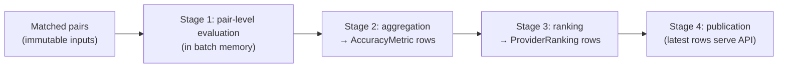

# ForecastIQ — Evaluation and Ranking Workflow (Phase 1)

**Version**: 1.0
**Status**: Approved — Phase 1 Architecture
**Authority**: `docs/domain/03-metric-methodology.md` (normative formulas); CE-02..CE-11; BR-RANK-01..09; ADR-010

---

## 1. Pipeline Stages



All stages run within the 30-min `analysis_batch` job (matching → evaluation → aggregation → ranking, sequential). Pair-level results are **computed in memory per aggregation cell** — only aggregated rows are stored (reconciliation verdict: no per-pair evaluation table beyond matched_evaluations; day metrics for S-05 computed at query time).

## 2. Stage 1 — Pair-Level Evaluation (in memory)

Per matched pair, per variable:

| Variable | Pair computation |
|----------|-----------------|
| temperature | e = f − o (signed error); \|e\|; e² |
| wind_speed | same |
| humidity, pressure | same |
| rain amount | e over all pairs; separate accumulator for wet-only (o ≥ 0.1 mm) |
| precip occurrence | classify: forecast_rain = (prob ≥ 0.5 OR amount > 0); observed_rain = (mm ≥ 0.1) → TP/FP/FN/TN increment (fractional: += w_i) |
| probability | Brier term (p − a)² |

Observation-quality weight w_i applied per methodology §6.4 (station 1.0, interpolated/reanalysis 0.8, provider_estimated 0.5; corrected inherits).

## 3. Stage 2 — Aggregation → AccuracyMetric Rows

Per cell (provider × location × horizon × variable × metric_type × period):

| Metric | Formula (weighted) | CI |
|--------|--------------------|-----|
| mae | Σ w\|e\| / Σ w | ±1.96·s/√n (s = weighted std of \|e\|) |
| rmse | √(Σ we² / Σ w) | ±1.96·s/√n |
| bias | Σ we / Σ w | ±1.96·s/√n |
| rain_mae_all / rain_mae_wet | MAE over respective pair sets | same |
| recall / precision / f1 / far / threat_score / occurrence_agreement | From fractional TP/FP/FN/TN (methodology §4.2) | Wilson score interval |
| brier | Σ w(p−a)² / Σ w | ±1.96·s/√n |
| coverage | snapshots_with_value / expected (schedule-derived) | — |
| reliability | ok_collections / scheduled (FC-13 classified) | — |

**Rules:** zero denominator → value NULL, sample_count 0 (never 0/NaN); periods: daily (rolling), weekly, monthly; trailing 30 d (90 d for +3d/+7d horizons, BR-RANK-03); rows immutable; recompute → new rows + superseded_by.

**Periods written per batch:** daily metrics for the trailing window (rolling recomputation is cheap at this volume and makes late-observation incorporation automatic).

## 4. Stage 3 — Ranking → ProviderRanking Rows

Per ranking cell (provider × location × horizon × profile × period):

```text
1. Gather latest metrics per component for all providers in cohort
2. Exclude null components for ALL providers (weight redistribution, §6.2)
3. Normalize: lower-better → best/value (ε=1e-9 guard); higher-better → value/best;
   coverage/reliability direct
4. Weighted sum (w-2026.1: .30/.25/.15/.15/.05/.05/.05)
5. Coverage penalty: cov < 0.8 → ×(cov/0.8); cov < 0.5 → cannot outrank cov ≥ 0.8 (BR-RANK-04)
6. Status: ranked (≥30 pairs all required vars, cov ≥ 0.5, ≥7 calendar days BR-RANK-09)
          provisionally_ranked (10–29 pairs OR cov ∈ [0.5,0.8))
          unranked (<10 pairs OR cov < 0.5) — composite NULL + reason
7. Composite CI: first-order propagation of component CIs (documented approximation)
8. Ties: CI overlap → same rank number, tied group (BR-RANK-05)
9. component_scores JSONB: per component {value, normalized, weight, sample_count, ci}
10. INSERT rows (methodology_version 2026.1, weights_version w-2026.1 or custom:<hash>)
    + supersede previous rows for same logical key
```

**Horizon profiles:** uniform (default), short_term, daily_planning (methodology §6.3 table); cross-horizon composite = Σ profile_weight × score_h.

## 5. Recomputation Triggers and Flow

| Trigger | Scope | Flow |
|---------|-------|------|
| Scheduled batch (30 min) | All active cells, rolling periods | Full pipeline (match → rank) |
| `observation.corrected` event | Affected location + periods containing the observation hour | Rematch pairs → recompute affected metrics → recompute affected rankings; new rows + supersede; ≤ 2 cycles (BR-INV-02); audit event |
| Late observation (detected in batch) | Same as correction | Same |
| Admin recompute (`POST /admin/rankings/recompute`) | Scope filters (provider/location/horizon/period) | On-demand pipeline over scope; audit `rankings.recompute_triggered` |
| Methodology/weights version change | Admin-triggered, chosen scope | New version rows; old retained (BR-RANK-07) |

**Atomicity:** ranking rows for one batch scope commit in one tx (≤ 700 rows) — readers never see half-updated rankings. Metric chunks commit per 500 rows (partial metric visibility acceptable; rankings are the publication surface).

## 6. Publication and Serving

- API reads **latest non-superseded rows per logical key**: `WHERE superseded_by IS NULL` + `DISTINCT ON (provider_id, location_id, horizon_minutes) ... ORDER BY period_end DESC` (or equivalent window) — indexed via `rankings_loc_horizon_period`.
- Freshness (BR-FRESH rankings): fresh < 2 h since recompute relative to latest input; server-computed.
- Partial provider outage: rankings unchanged (batch stability); warnings[] communicate provider lag.
- Custom weights via API: computed on demand over stored metrics (no write); response echoes weights + `weights_version: custom:<hash>`.

## 7. Backfill Behaviour

New location/provider activation: cells accumulate pairs from activation; rankings appear when thresholds met (provisional at 10 pairs after ≥ 7 days; ranked at 30). No synthetic backfill of pre-activation data (we only evaluate what we collected — integrity).

## 8. Observability

- `engine_lag_seconds` (now − last batch calculated_at) — alert > 2 h.
- `batch_duration_seconds{aggregation|ranking}`, rows-written counters.
- Log: `rankings.published` (cells, statuses, superseded count).

## 9. Cross-Reference

- Formulas (normative): methodology doc §4–7
- Test vectors + properties: methodology §10–11 → `docs/testing/02-testing-strategy.md`
- Evolution/versioning: `docs/data/07-methodology-evolution.md`
- Worked example as integration test: ADR-010
