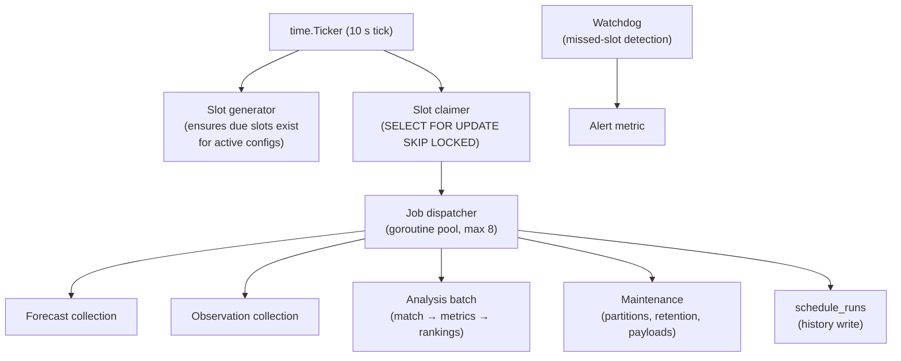

# ForecastIQ — Scheduling and Retries (Phase 1)

**Version**: 1.0
**Status**: Approved — Phase 1 Architecture
**Authority**: ADR-005 (binding decision); FC-07/FC-08; constraints §6 boundary 3–4

---

## 1. Scheduler Design (ADR-005 implementation)

**In-process Go scheduler with DB-backed slot claims.** No Temporal, no pg_cron, no external cron.



## 2. Job Types and Cadence

| Job type | Cadence | Slots generated | Notes |
|----------|---------|-----------------|-------|
| forecast_collection | Hourly per (config × location) | At HH:00 per provider config's schedule spec | FC-06/FC-07; staggered offsets per provider (OM :00, OW :02) to avoid simultaneous calls |
| observation_collection | Hourly per location | At HH:05 | OC-01 |
| analysis_batch | Every 30 min | At :10 and :40 | After collection settles |
| maintenance_daily | Daily 02:00–04:00 | Payload retention (02:00), partitions (03:00), aged purge (monthly, 04:00 first Sunday) | |

## 3. Slot Lifecycle State Machine

```text
due ──claim──→ claimed ──success──→ completed
  │               │
  │               ├──failure (attempts < 5)──→ due (next_retry_at = backoff)
  │               │
  │               ├──failure (attempts = 5)──→ failed (terminal)
  │               │
  │               └──lease expiry──→ due (attempts++, reclaimed by any instance)
  │
  └──generation dedup (UNIQUE config+type+location+slot_time)──→ never duplicated
```

| Field | Role |
|-------|------|
| claimed_by | Instance id (UUID per process start) — future multi-instance visibility |
| lease_expires_at | 5 min; crash recovery without coordination |
| attempts / next_retry_at | Backoff 1, 2, 4, 8, 16 s (±20% jitter) within execution; max 5 (FC-08) |
| schedule_run_id | Links to full run history row |

## 4. Slot Generation

- Generator runs each tick: for each active provider_configuration × active location, ensure slot rows exist for the current + next hour (INSERT ... ON CONFLICT DO NOTHING on the uniqueness constraint).
- Schedule changes (FC-07): config `collection_schedule` edit → next generation cycle reflects it (applies on next cycle, documented behavior).
- Disabled provider/location → no slots generated; existing due slots cancelled (status expired).

## 5. Missed Schedules

| Scenario | Handling |
|----------|----------|
| Process down across slot time | Slot remains `due`; claimed on restart (slot_time ≤ now). Gap = missed hours → reflected honestly in reliability/coverage. |
| Process up but scheduler stalled | Watchdog: no claims for 2× interval → `scheduler_missed_slots_total` alert; operator restart. |
| Slot failed all retries | Terminal `failed`; next hourly slot independent; admin trigger available for immediate recovery. |
| Backlog after outage | All overdue slots claimed in order (ORDER BY slot_time); provider calls rate-limited by token bucket (no post-outage thundering herd); analysis batch processes accumulated pairs in chunks. |

## 6. Manual Execution

`POST /admin/collections/trigger` (C-10):
- Bypasses slot machinery entirely → direct CollectNow use case.
- Guards: 409 circuit open (with next-probe time in detail); 429 budget exhausted (Retry-After + reset time); 422 inactive provider/location.
- Result: normal ForecastCollection row; schedule slot unaffected; audit `collection.triggered`.
- Idempotency-Key supported; snapshot dedup makes re-execution harmless regardless.

## 7. Concurrency Model

- Dispatcher: goroutine pool (max 8 concurrent jobs); per-job context timeout (collection 60 s incl. retries; analysis 10 min; maintenance 30 min).
- DB claims: SKIP LOCKED → zero contention between jobs; claim tx < 10 ms.
- Same-slot safety: uniqueness + claim tx prevents double execution; snapshot/observation dedup is the second line (idempotent even if a slot were somehow run twice).
- Graceful shutdown: stop claiming → wait in-flight (30 s deadline) → leases on unfinished expire naturally.

## 8. Deployment Restarts

- systemd Restart=always; restart takes < 5 s.
- On start: scheduler scans due slots immediately (no wait for first tick alignment) → fast post-deploy catch-up.
- Zero-downtime deploys not required (< 30 s gap acceptable; slots catch up).

## 9. Multi-Instance Safety (future-proofing)

SKIP LOCKED + lease + idempotent jobs = a second instance (worker-split promotion) works with zero scheduler changes. `claimed_by` records which instance ran each job for debugging.

## 10. Observability

| Signal | Source |
|--------|--------|
| `scheduler_slots_claimed_total{job_type}` | Claimer |
| `scheduler_missed_slots_total{job_type}` | Watchdog |
| `scheduler_lag_seconds{job_type}` | slot_time → claimed_at delta |
| `job_duration_seconds{job_type}` | Dispatcher |
| S-13 run history | `schedule_runs` query (Q-11) |
| S-10 next_scheduled_at | Derived: next due slot per cell |

## 11. Cross-Reference

- ADR-005 (decision + migration triggers)
- Collection job detail: `docs/workflows/01-forecast-collection.md`
- Backfill: `docs/workflows/06-backfill-and-reprocessing.md`
- Temporal promotion trigger: `docs/architecture/10-scaling-and-evolution.md` §1.5
