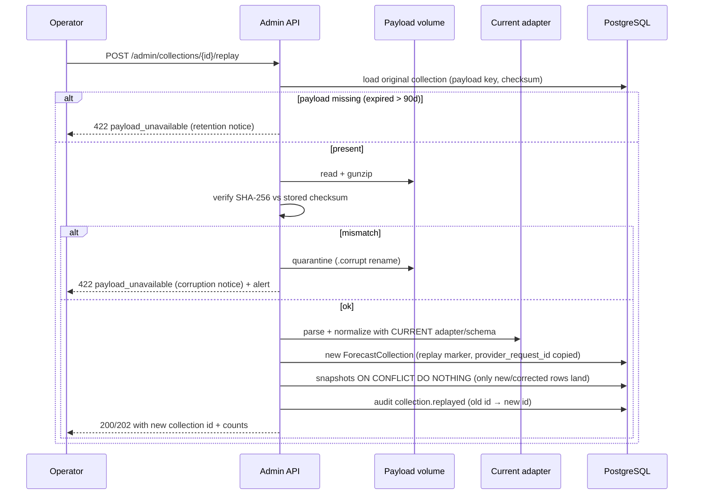

# ForecastIQ — Backfill and Reprocessing (Phase 1)

**Version**: 1.0
**Status**: Approved — Phase 1 Architecture
**Authority**: Domain model §4.8 (replay); methodology §9; FC-14; ADMIN-06

---

## 1. Reprocessing Scenarios

| Scenario | Mechanism | Scope | Automated? |
|----------|-----------|-------|-----------|
| Adapter bug fix (recent, ≤ 90 d) | Raw payload replay | One collection at a time (admin) | Manual (FC-14) |
| Adapter bug fix (bulk, ≤ 90 d) | Scripted replay loop over collection range | Bounded by operator | Manual procedure (runbook) |
| Corrected observation | Correction detection → rematch → recompute | Affected location/period | Automatic (BR-INV-01) |
| Late observation | Next batch matches + recomputes | Affected period | Automatic |
| Methodology version change | Admin recompute with new version | Chosen scope | Manual trigger |
| Provider schedule change | Prospective only | Future collections | Automatic (next cycle) |
| Historical backfill (pre-activation data) | **Not supported** (we only evaluate what we collected) | — | Never |

## 2. Raw Payload Replay (FC-14)



**Guarantees:** originals never mutated or deleted; replay is idempotent (re-run → deduplicated collection); only rows that differ from existing snapshots (by uniqueness key) are added — an adapter fix that changes normalization produces corrected rows under the new collection.

## 3. Bulk Reprocessing Procedure (runbook)

For an adapter fix affecting a date range:

```text
1. Identify affected collections:
   SELECT id FROM forecast_collections
   WHERE provider_id = $p AND adapter_version = $bad_version
     AND collection_status IN ('success','partial')
     AND requested_at BETWEEN $from AND $to;
2. Replay sequentially via admin endpoint (script, 1 req/s — respects provider-agnostic pacing;
   no provider calls occur during replay).
3. Trigger recompute for affected scope:
   POST /admin/rankings/recompute {provider_id, period_start, period_end}
4. Verify: new metrics rows exist with expected supersede links; spot-check values
   against known-correct fixture.
5. Record in ops log; close when rankings serve new rows (freshness < 2h).
```

Bounded: replay window = payload retention (90 d). Bugs discovered later are documented as known historical discrepancies (adapter_version lineage makes them attributable) — acceptable, documented tradeoff (ADR-011).

## 4. Observation-Driven Reprocessing (automatic)

```text
Correction detected (workflow 02 §4)
  → observation.corrected event
  → RematchScope(location, hour):
      pairs referencing superseded observation → new pairs to corrected observation
  → RecomputeScope(location, periods containing hour):
      metrics → new rows + supersede
      rankings → new rows + supersede
  → audit + event accuracy.calculated
  → completes within 2 batch cycles (BR-INV-02)
```

## 5. Methodology Upgrade Reprocessing

1. Ship new methodology version (code + registry + document bump).
2. **Verification recompute** (old version, reference scope) → byte-identical to stored values (CI-enforced on upgrade PR against test vectors; optional production spot-check).
3. **Publication recompute** (new version, admin-chosen scope or full) → new rows published.
4. Old rows retained with original versions (BR-INV-03); UI/API show new version going forward.
5. Changelog entry on `/rankings/methodology` change_history.

## 6. What Is Never Reprocessed

- Snapshots themselves (immutable; corrected data arrives only via new collections/replay).
- Published historical ranking rows (superseded, not rewritten).
- Data before collection activation (no synthetic history — product integrity).
- Raw payloads after 90 d (gone; checksums remain as integrity evidence).

## 7. Cross-Reference

- Replay API contract: `docs/api/05-endpoint-catalog.md` (admin)
- Provider failure recovery (distinct from replay): `docs/operations/06-provider-failure-runbook.md`
- Methodology evolution: `docs/data/07-methodology-evolution.md`
